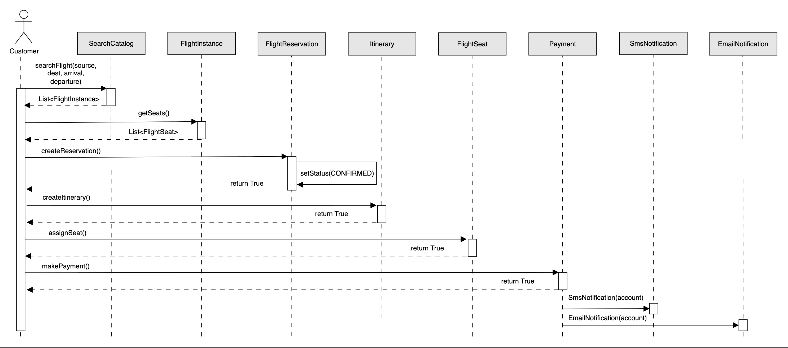
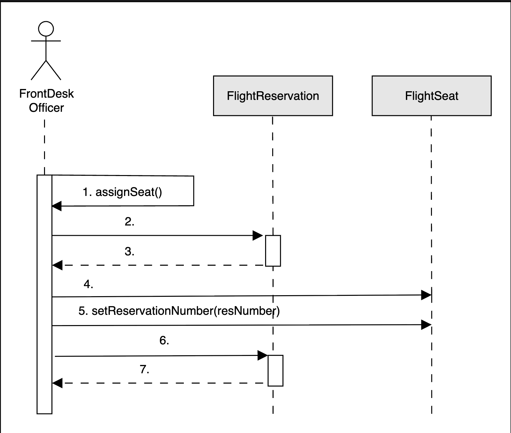
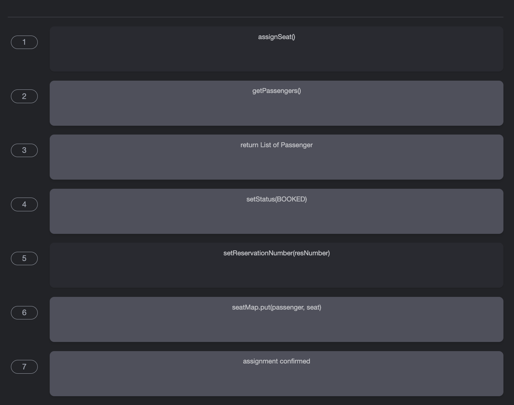

# Sequence Diagram for the Airline Management System

Create a sequence diagram for reserving a flight in the airline management system and solve a challenge.

Sequence diagrams are an effective way to visualize the interactions between different entities and objects within a system. We can create different sequence diagrams for our airline management system. In this lesson, we will create sequence diagrams for the following two interactions:

* Reserve a flight: The customer reserves a flight online.
* Sequence challenge: Assign a seat via `FrontDeskOfficer`.

## Reserve a flight

The sequence diagram for reserving a flight should have the following actors and objects that will interact with each other:

* Actor: `Customer`
* Objects: `SearchCatalog`, `FlightInstance`, `FlightSeat`, `FlightReservation`, `Itinerary`, `Payment`, `SmsNotification`, and `EmailNotification`.

Here are the steps in the reserve flight interaction:

1. The customer searches for flights flying from an airport on a particular date.
2. The catalog returns a list of flights that satisfy the search query.
3. The customer selects a flight.
4. Customer creates a reservation.
5. Customer creates an itinerary.
6. System requests payment.
7. Customer makes payment.
8. Customer notified.

Note: We assume that the customer performs a valid operation and successfully reserves the seat.

Based on the order above, the sequence diagram for reserving a flight in the airline management system is given below.

## Sequence challenge: Assign seat via FrontDeskOfficer
Let’s complete a sequence diagram for assigning a seat via FrontDeskOfficer. A skeleton of the sequence diagram is given below:

