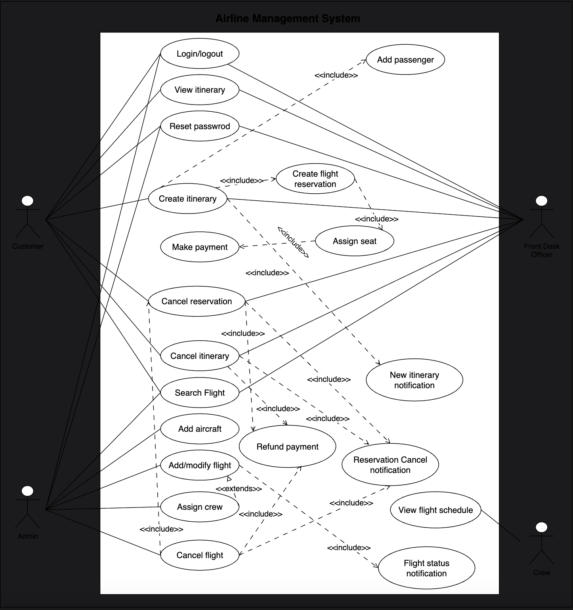

# Use Case Diagram for the Airline Management System

Learn how to define use cases and create the corresponding use case diagram for the airline management system.

Let's build the airline management system's use case diagram and understand its components. First, we'll define the different elements of our airline, followed by the complete use case diagram of the system.

## System

Our system is an airline.

## Actors

Now, we'll define the main actors of the airline management system.

### Primary actors

**Customer:** The customer is the primary actor for the airline. The customer can search for flights, create an itinerary, make a payment, and update or cancel the flight reservation.

**Front desk officer:** This actor can perform all the actions that the customer can. The front desk officer can create an itinerary, make payments, update or cancel flight reservations on behalf of customers, assign seats, and search for flights.

**Admin:** The admin is responsible for performing various operations, including adding aircraft to the system, creating or modifying flights, flight instances, and their schedules, canceling flights, and assigning crew to flights.

### Secondary actors

**System:** This actor sends notifications for flight status updates, itinerary changes, and reservation cancellations.

**Crew:** This actor can view the schedules of the assigned flights.

## Use cases

In this section, we'll define the use cases for an airline management system. We have listed the use cases according to their interactions with a particular actor.

Note: You may see some use cases repeated multiple times because they are shared among different actors in the system.

### Customer/front desk officer

**Update/cancel reservation:** To update or cancel a flight reservation of the customer.  
**Login/logout:** To log in or log out of the airline system.  
**Reset password:** To reset the password of the account.  
**Create itinerary:** To create an itinerary for the customer.  
**Assign seat:** To assign a seat to the passenger for the flight.  
**Search flights:** To search for flights in the airline management system.  
**Make payment:** To pay for the itinerary or flight reservation.  
**View itinerary:** To view the details of an itinerary.  
**Cancel itinerary:** To cancel the itinerary for the customer.

### Admin

**Add aircraft:** To add a new aircraft to the airline management system.  
**Add/modify flight:** To add a new flight or modify an existing one.  
**Assign crew:** To assign crew to the flight instance.  
**Cancel flight:** To cancel the instance of a flight.  
**Search flights:** To search for flights in the airline management system.

### System

**New itinerary notification:** To send a notification of a new itinerary to the customer.  
**Flight status notification:** To send the flight status update notification to the customer.  
**Reservation cancel notification:** To send a reservation cancellation notification to the customer.

### Crew

**View flight schedule:** To view the schedule of the assigned flights.

## Relationships

This section describes the relationships between and among actors and their use cases.

### Associations

The table below illustrates the association between actors and their corresponding use cases.

| Customer | Front Desk Officer | Admin | Crew |
|----------|-------------------|-------|------|
| Cancel reservation | Cancel reservation | Add aircraft | View flight schedule |
| Login/logout | Login/logout | Add/modify flight | |
| Reset password | Reset password | Search flights | |
| Create itinerary | Create itinerary | Assign crew | |
| Assign seat | Assign seat | Cancel flight | |
| Search flights | Search flights | | |
| Make payment | Make payment | | |
| View itinerary | View itinerary | | |
| Cancel itinerary | Cancel itinerary | | |

### Include

Users may add passengers, create a flight reservation, or trigger a new itinerary notification when they create an itinerary.

* The "Create itinerary" use case includes the "Add passenger," "Create flight reservation," and "New itinerary notification" use cases.

When a user creates a flight reservation, they may assign a seat.

* The "Create flight reservation" use case includes the "Assign seat" use case.

When a user assigns a seat, they may proceed to make a payment.

* The "Assign seat" use case includes the "Make payment" use case.

When a user cancels a reservation, the system may notify the user and process a refund.

* The "Cancel reservation" use case includes the "Reservation cancel notification" and "Refund payment" use cases.

When a user cancels an itinerary, the system may notify the user and process a refund.

* The "Cancel itinerary" use case includes the "Reservation cancel notification" and "Refund payment" use cases.

The system may send a flight status notification when an admin adds or modifies a flight.

* The "Add/Modify flight" use case includes the "Send flight status notification" use case.

When an admin cancels a flight, the system may cancel related reservations, process refunds, and send cancellation notifications.

* The "Cancel flight" use case includes the "Cancel reservation," "Refund payment," and "Send cancel notification" use cases.

### Extend

When modifying a flight instance, the admin can assign the crew to that instance. Therefore, the "Modify flight instance" use case has an extend relationship with the "Assign crew" use case.

## Use case diagram

Here's the use case diagram of the airline management system:

