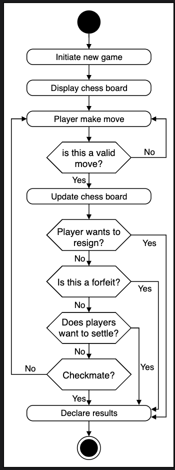

# Activity Diagram for the Chess Game

## Overview

An activity diagram visualizes the flow of messages and actions from one activity to another in the system. For the chess game, it helps illustrate how players interact with the game until it ends.

## States

- **Initial state:** The player makes the first move.
- **Final state:** Any of the game-over conditions is met.

## Actions Flow

1. The player initiates a new game.
2. The chessboard appears.
3. The player takes a turn.
4. The system validates the move.
5. The system checks for game-over conditions such as:
   - Checkmate
   - Resignation
   - Forfeit
   - Draw
6. If no game-over condition is met, play continues with the next turn.
7. The process repeats until the system detects a game-over condition.
8. The system automatically declares the result.

This cycle provides a clear workflow for how a chess game progresses from start to finish.

