# Class Diagram for the Chess Game

Learn to create a class diagram for the chess game using the bottom-up approach.

In this lesson, we'll create the class diagram for the online chess game. We'll follow a bottom-up approach: design the simplest components and build up to the core game classes, showing relationships and responsibilities throughout.

## Components of chess
As mentioned earlier, we'll follow the bottom-up approach to designing a class diagram for the chess game.

### Box
A `Box` represents a position on the 8x8 chessboard, defined by a row and column (0–7). It may either be empty or occupied by a chess piece.

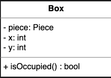

### Chessboard
The `Chessboard` models the 8x8 grid of boxes. It maintains the game’s current state, including all pieces and their positions. The board is responsible for resetting and updating itself according to the moves played.

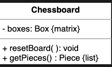

### Piece
A `Piece` represents any chess piece (king, queen, rook, bishop, knight, or pawn) with a color (black or white) and an “alive” or “captured” status.

   - `King`, `Queen`, `Rook`, `Bishop`, `Knight`, and Pawn are subclasses of `Piece`, each implementing its specific movement logic and special rules (e.g., castling for `King/Rook`, en passant, and promotion for `Pawn`).

   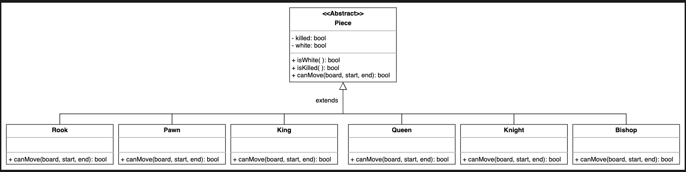

<strong>Click to view related requirements</strong>

**R4:** At the start of the game, each player will have eight pawns, two rooks, two bishops, two knights, one queen, and one king on the board.

### Move
A `Move` represents the transfer of a piece from one box to another, possibly capturing an opponent’s piece. The `Move` class tracks information such as the source and destination boxes, the moved piece, any captured piece, and whether the move resulted in special actions (e.g., castling, promotion).

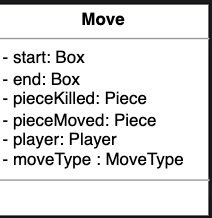

<strong>Click to view related requirements</strong>

**R5:** The player with the white pieces will make the first move.  
**R6:** Once a move has been made, a player cannot retract or undo it.

### Player
The `Player` represents one of the two participants in the game, associated with a color (white or black). The `Player` class is responsible for making moves and can resign or forfeit the game. Each player can review the game state and history.

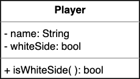

<strong>Click to view related requirements</strong>

**R1:** This system enables multiplayer in a game of chess via an online platform.

### Chess move controller
The `ChessMoveController` encapsulates the logic for validating moves according to chess rules. It checks if a move is legal, applies it if valid, and communicates with the game to update the state. It handles rule enforcement, including check, checkmate, stalemate, castling, en passant, and promotion.

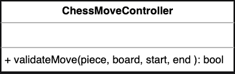

<strong>Click to view related requirements</strong>

**R2:** The game will be played according to the official rules of an international chess game.

### Chess game view
The `ChessGameView` is responsible for presenting the game's current state—board, moves, and status—to the players (e.g., through a UI or console output).

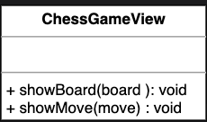

### Chess game
The `ChessGame` coordinates the gameplay, tracking both players, the current board, move history, and the game’s status (in progress, checkmate, draw, etc.). It processes player turns, applies moves, and determines game outcomes.

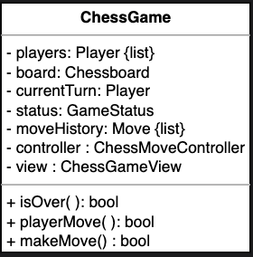

### Enumerations and custom data types
The enumerations and custom data types required in the chess game design problem are listed below:  
   - **GameStatus:** Tracks the current game state (in progress, white wins, black wins, draw, etc.).

   - **MoveType:** Enum for regular, castling, en passant, promotion, etc.

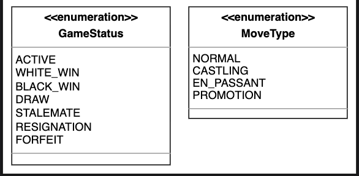

## Relationship between the classes

Now, we'll discuss the relationships between the classes we have defined above for our chess game design.

### Association

The class diagram has the following association relationships:

* The `Move` class has a one-way association with `Player`, `Piece`, and `Box` (each move is linked to the player making the move, the piece moved, the captured piece (if any), and the start/end boxes).
* The `ChessGame` class has a one-way association with `ChessMoveController` (for move validation).
* The `ChessGame` class has a one-way association with `ChessGameView` (for updating the view/display).
* The `ChessMoveController` class has a one-way association with `ChessGame` (to access the game state/board as needed).
* The `ChessGameView` class has a one-way association with `ChessGame` or `Chessboard` (to display the current game state).

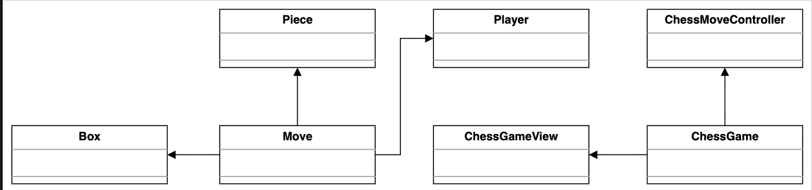

### Aggregation
The class diagram has the following aggregation relationships:
   - The `ChessGame` class aggregates two Player objects (white and black).
     - (Players are part of a game but exist independently and can participate in other games.)

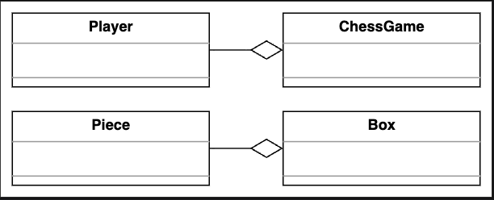

### Composition
The class diagram has the following composition relationships.
   - The `ChessGame` class is composed of a `Chessboard` and a collection of `Move` objects (the game controls their lifecycle).  
   - The `Chessboard` class is composed of 64 `Box` objects (boxes only exist as part of a board).  
   - Each `Box` may be composed of a `Piece` (a piece lives in a box; if removed from the board, it’s no longer in play).  

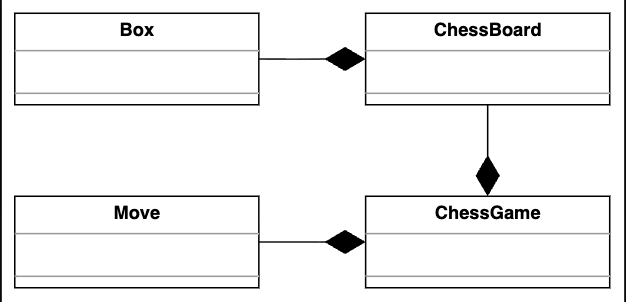

### Inheritance

The following classes demonstrate an inheritance relationship in the chess game design:  
- The `King`, `Queen`, `Rook`, `Bishop`, `Knight`, and `Pawn` classes extend the `Piece` class.
- Each subclass implements its specific movement logic and special rules (e.g., castling for `King` and `Rook`, en passant and promotion for `Pawn`).
- This inheritance hierarchy provides clean, reusable structure for the common attributes and behaviors in `Piece` while allowing specific pieces to define unique behavior.

> Note: The inheritance relationship details for each piece class have been discussed in the components section of the class diagram.

#### Class Diagram Multiplicity Relationships

| Source Class        | Target Class          | Multiplicity | Reason                                                                                   |
|---------------------|----------------------|--------------|------------------------------------------------------------------------------------------|
| ChessGame           | ChessBoard           | 1 -- 1       | Each game has exactly one chessboard.                                                   |
| ChessGame           | Player               | 1 -- 2       | Each game has two players (white and black).                                            |
| ChessGame           | Move                 | 1 -- 0..*    | Each game can have zero or more moves (move history).                                   |
| ChessGame           | ChessMoveController  | 1 -- 1       | Each game uses one move controller.                                                     |
| ChessGame           | ChessGameView        | 1 -- 1       | Each game uses one view to display the game state.                                      |
| ChessBoard          | Box                  | 1 -- 64      | Each board consists of exactly 64 boxes (8x8 grid).                                     |
| Box                 | Piece                | 0..1 -- 0..1 | Each box may contain at most one piece; a piece is in at most one box at a time.        |
| Move                | Player               | 1 -- 1       | Each move is made by exactly one player.                                                |
| Move                | Box                  | 1 -- 2       | Each move is associated with a start box and an end box.                                |
| Move                | Piece                | 1..2 -- 1    | Each move references one piece moved and possibly one piece captured/killed.            |

This structured inheritance and multiplicity setup is key to modeling the chess game's components and their interactions, supporting the core game workflows clearly and effectively.

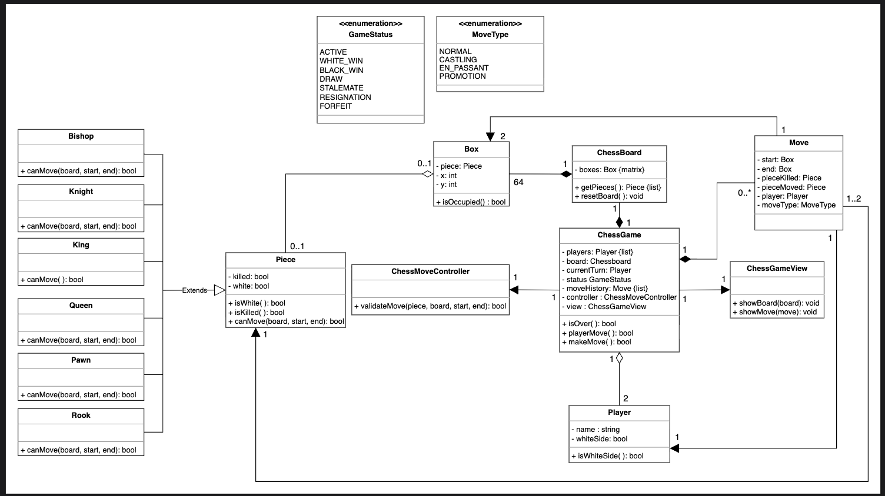

# Chess Game Design Patterns

## Design Patterns in Chess Game

- **Singleton Design Pattern**  
  Ensures only one instance of the chessboard exists at a time, preventing inconsistencies in the shared resource of the board state.

- **Command Design Pattern**  
  Encapsulates the move logic for each chess piece. Each piece implements its own move command that follows the rules specific to it. For example, the knight moves in an L-shape, and the rook moves horizontally or vertically.

- **Iterator Design Pattern**  
  (Optional) Allows the game to move sequentially by enabling pieces to behave uniformly, without the user needing to know the underlying move logic of each piece.

- **State Design Pattern**  
  Encapsulates each piece’s state logic, such as different behaviors depending on check or checkmate situations.

- **Observer Design Pattern**  
  Lets chess pieces act as observers with the board as the subject. Pieces get notified of state changes on the board and adapt accordingly, decoupling pieces from the board.

These design patterns collectively help in ensuring modularity, maintainability, and clear separation of concerns in the chess game design.
