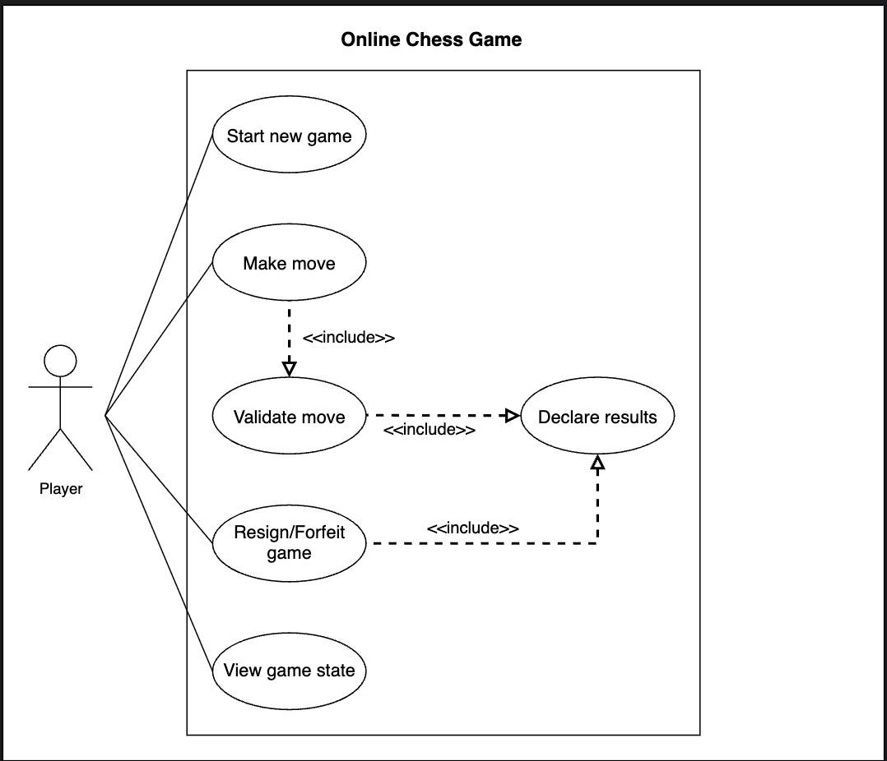

# Use Case Diagram for the Chess Game

Learn how to define use cases and create the corresponding use case diagram for the chess game.

In this lesson, we'll build the use case diagram for the online chess game system and understand the relationship between its main actor and core functions. First, let's define the different elements of our chess game, followed by the complete use case diagram of the system.

## System

Our online chess game system manages a standard chess match between two players over an online platform, strictly following official chess rules.

## Actors

Here's the main actor of our chess game.

### Primary actor

* **Player:** The primary and only actor in this system. A player participates in the chess game by making moves, viewing the game state, and may end the game by resigning or forfeiting.

## Use cases

In this section, we'll define the use cases for the chess game. We have listed the use cases according to their interactions with a particular actor.

### Player

* **Start new game:** To initiate a new chess match as either white or black.
* **Make move:** To select and move a chess piece according to the official rules, including special moves (castling, en passant, pawn promotion).
* **View game state:** To view the current board position, move history, and game status at any point during the match.
* **Resign/Forfeit game:** To voluntarily end the game before its conclusion, conceding victory to the opponent.

### System

* **Validate move:** To validate that the move is legal according to all chess rules, including detection of check, checkmate, castling, en passant, and pawn promotion (Whenever a player attempts to make a move).
* **Declare results:** To check for endgame conditions such as checkmate, stalemate, draw (by threefold repetition, 50-move rule, or insufficient material), resignation, or forfeiture, and declare the appropriate result (after every move).

## Relationships

This section describes the relationships between and among actors and their use cases.

### Include

* **"Make move" includes "Validate move:"**
   * Every time a player moves, the system must validate that move according to chess rules (including check, checkmate, stalemate, en passant, castling, and promotion).
* **"Validate move" includes "Declare results:"**
   * After each move is validated, the system checks if the game has reached an end condition (checkmate, stalemate, draw, etc.) and declares the result if appropriate.
* **"Resign/Forfeit game" includes "Declare results:"**
   * When a player resigns or forfeits, the game ends immediately, and the system must declare the result (the opponent wins by resignation or forfeiture).

### Associations

The table below shows the association relationship between actors and their use cases.

| Player | System |
|--------|--------|
| Start new game | Validate move |
| Make move | Declare results |
| View game state | |
| Resign/Forfeit game | |

## Use case diagram

Here is the use case diagram of the chess game:

