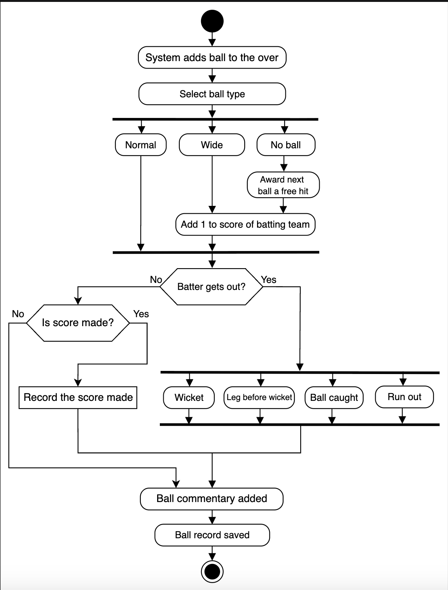

# Activity Diagram for ESPNcricinfo

Create some activity diagrams for ESPNcricinfo.

Activity diagrams are an effective way to visualize the flow of messages between activities within a system. We can create different activity diagrams for ESPNcricinfo. In this lesson, we will create an activity diagram to record the movement of a ball.

## Make a record of a ball

The states and actions involved in this activity diagram are provided below.

### States

**Initial state:** The system adds a ball to the over.

**Final state:** The ball record is saved.

### Actions

The system adds a ball to the over, choosing the ball type that was bowled. It determines if the batter got out. If they did not, it adds to the score that was made. Finally, the commentary is added to the ball, and the ball record is saved.

