# Class Diagram for ESPNcricinfo  
Understand how to create a class diagram for ESPNcricinfo using the bottom-up approach.

In this lesson, we'll identify and design classes, abstract classes, and interfaces based on the requirements gathered from the interviewer in our ESPNcricinfo system.

## Components of ESPNcricinfo  
As mentioned, we will design the ESPNcricinfo system using a bottom-up approach.

### Admin  
The `Admin` class manages the system, adding and modifying updates. The representation of the class is shown below:

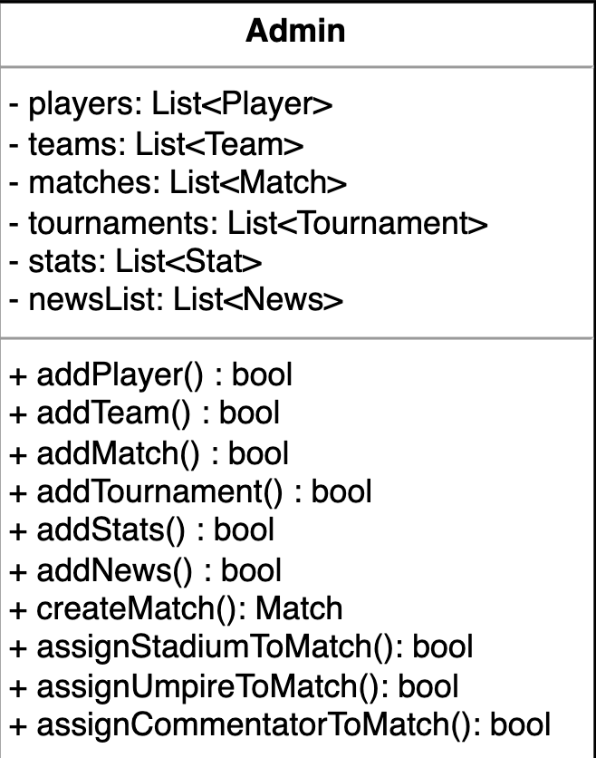

<strong>Click to view related requirements</strong>

**R1:** The system shall allow the admin to add or update players, teams, tournaments, and match statistics.

### Run, ball, and wicket
The `Run` class records the number and type of runs scored on a ball. The Ball class records every detail of a ball, such as the number of runs scored and whether it was a wicket-taking ball. The `Wicket` class records the details of the wicket, including its type, the bowler, and the batsman who was declared out.

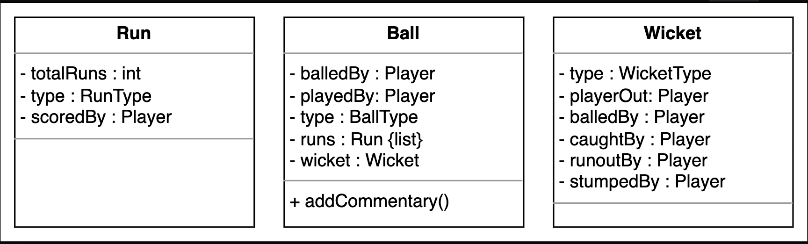

<strong>Click to view related requirements</strong>

**R2:** The system shall enable the commentator to add or modify ball-by-ball commentary, and allow tracking of every score or wicket per ball.

### Over and innings
The `Over` class represents all the details of an over of the innings. The `Innings` class represents the details of a match innings. The two classes are shown below:

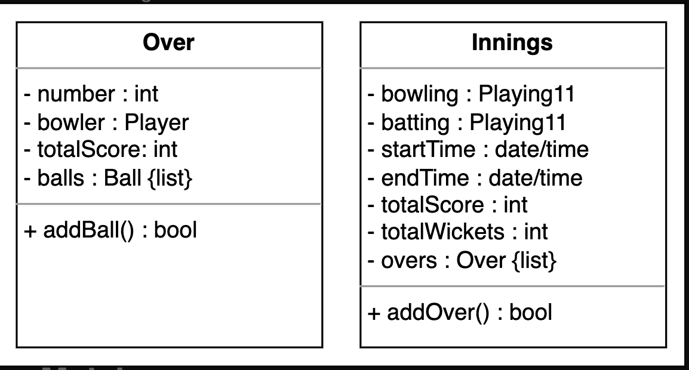

### Match
The `Match` class is an abstract class that has three child classes, representing the types of matches that can occur.

- The `Test` class  
- The `ODI` class  
- The `T20` class  

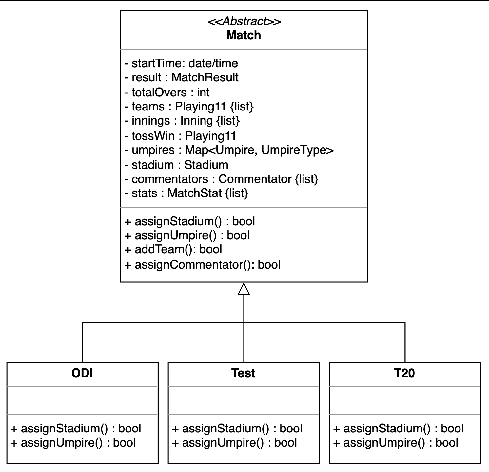

<strong>Click to view related requirements</strong>

**R3:** The system shall support tracking all matches, including Test, ODI, and T20, added or modified by the admin.

### Stadium
The `Stadium` class represents the information about a stadium, including its name, address, and capacity. The UML representation of this class is given below:

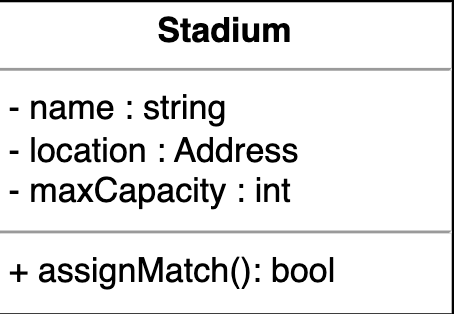

### Player, coach, and umpire
The `Player` class includes the information of a player and their statistics. The `Coach` class contains the information of a coach. The `Umpire` class contains the information of an umpire. The three classes are shown below:

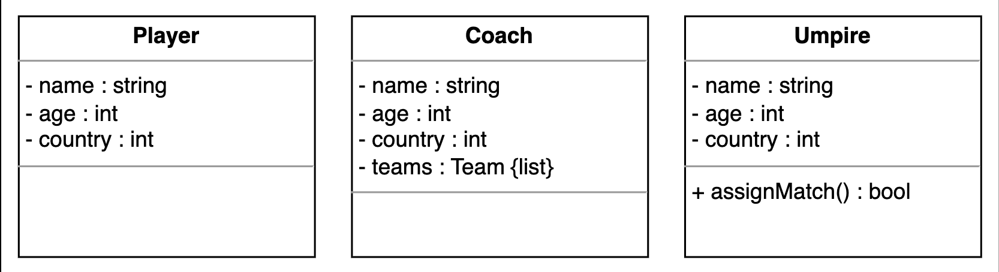

<strong>Click to view related requirements</strong>

**R6:** The system will allow the coach to submit a tournament squad—a group of selected players eligible to participate.  
**R8:** The admin shall be able to manage the entire system by adding or modifying tournaments, matches, teams, players, stadiums, umpires, commentators, and updating stats and news.

### Team, tournament squad, and playing eleven
The `Team` class represents the information about a cricket team, including the list of players, the team coach, and any news related to the team.

The `TournamentSquad` class represents the team members participating in a tournament. The `Playing11` class represents the squad members playing in a match.

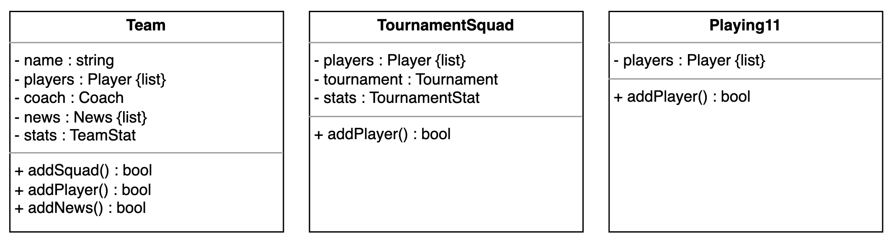

<strong>Click to view related requirements</strong>

**R7:** The system shall support playing eleven selections from the tournament squad for each match. Although not directly modeled as a use case, this process is implicit in match setup and should be facilitated by the admin or coach through data entry.  

### Tournament and points table
The `Tournament` class contains information about a cricket tournament. The `PointsTable` class displays the accumulated points and match results of the teams participating in the tournament. These classes are shown below:

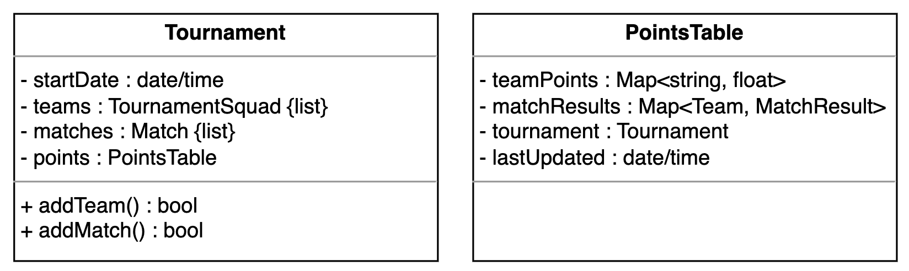

<strong>Click to view related requirements</strong>

**R4:** The system shall maintain a record of ongoing and historical tournaments and display points tables for all participating teams. The admin is responsible for adding or updating tournaments.

### Stats
The `Stat` class is an abstract class that extends to `PlayerStat`, `TeamStat`, and `MatchStat` classes. These classes contain important statistics. The UML representation is shown below:

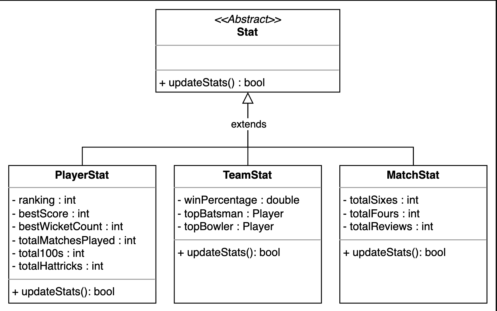

<strong>Click to view related requirements</strong>

**R8:** The admin shall be able to manage the entire system by adding or modifying tournaments, matches, teams, players, stadiums, umpires, commentators, and updating stats and news.

### Commentator and commentary
The `Commentator` class records the information about the `commentator`. The Commentary class contains information about the commentary for every ball of an over. The two classes are shown below:

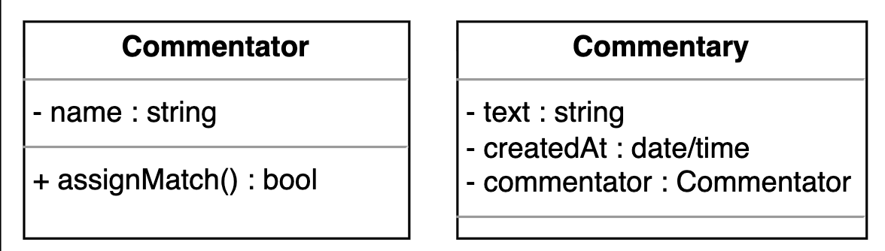

<strong>Click to view related requirements</strong>

**R2:** The system shall enable the commentator to add or modify ball-by-ball commentary, and allow tracking of every score or wicket per ball.

### News
The `News` class holds the news updates of a team. The definition of this class is given below:

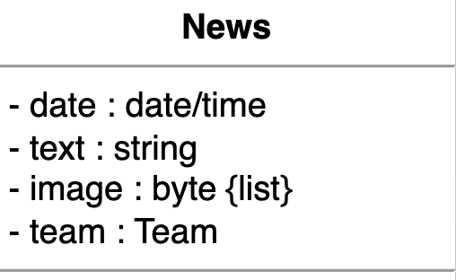

### Enumerations
The enumerations required in the ESPNcricinfo system are listed below:

* `MatchResult`: This records the result of a match—a win, loss, canceled, or draw.  
* `UmpireType`: This records the type of umpire—field umpire, third umpire, or reserved.  
* `WicketType`: This records the type of the wicket—stumped, bowled, caught, etc.  
* `BallType`: This records the type of ball played—a regular delivery, wide, no ball, or wicket.  
* `RunType`: This records the type of run scored—a regular run, four, six, wide, etc.  
* `PlayingPosition`: This records the playing position of a player—batsman, bowler, or all-rounder.  

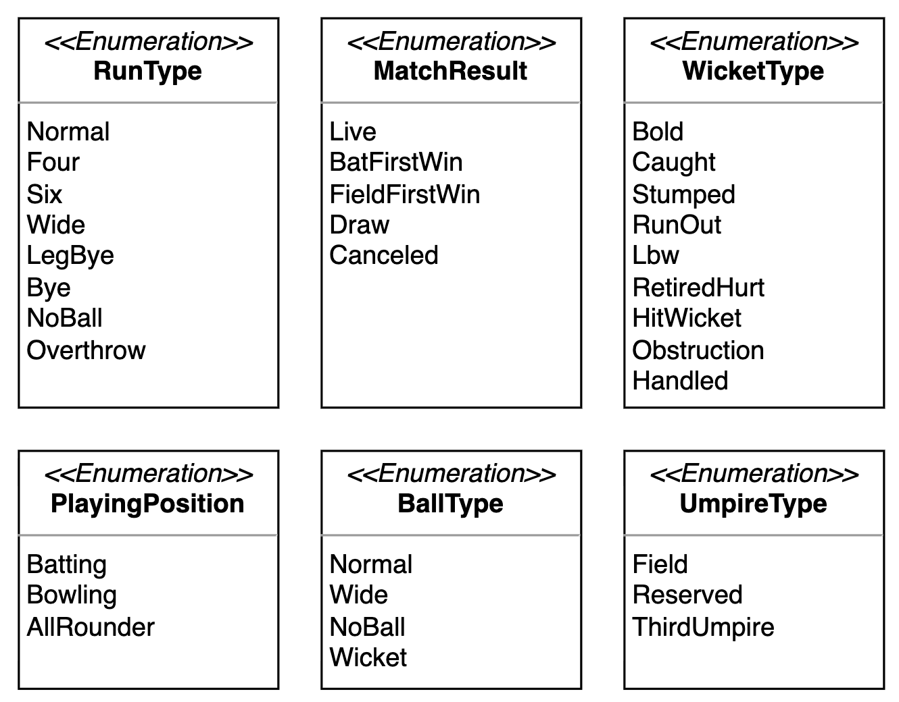

### Custom data type
We need to create a custom data type, `Address`, that will store the physical location of any place.

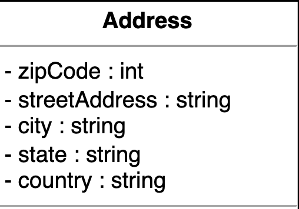

## Relationship between classes

Now, we will discuss the relationships between the classes we have defined above in our ESPNcricinfo system.

### Association

The class diagram has the following association relationships:

#### One-way association

* The `Admin` class has a one-way association with the `Player`, `Team`, `Match`, and `Tournament` classes.
* The `Player` class has a one-way association with the `Run`, `Ball`, `Wicket`, and `Over` classes.
* The `Team` class has a one-way association with the `TournamentSquad` and `Tournament` classes.
* The `TournamentSquad` class has a one-way association with the `Playing11` class.

#### Two-way association

* The `Ball` class is associated with the `Run`, `Wicket`, and `Commentary` classes.
* The `Team` class is associated with the `Coach` and `News` classes.
* The `Commentary` class is associated with the `Commentator` class.
* The `Match` class is associated with the `Umpire`, `Commentator`, `News`, and `Stadium` classes.
* The `Player` class is associated with the `News` classes.

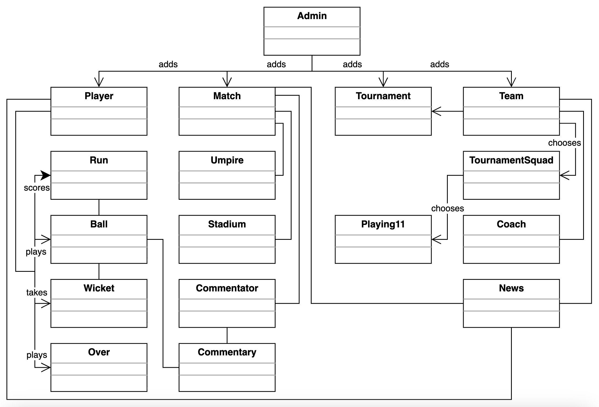

### Aggregation

The class diagram has the following aggregation relationships:

* The `Tournament` class contains the `TournamentSquad` class.

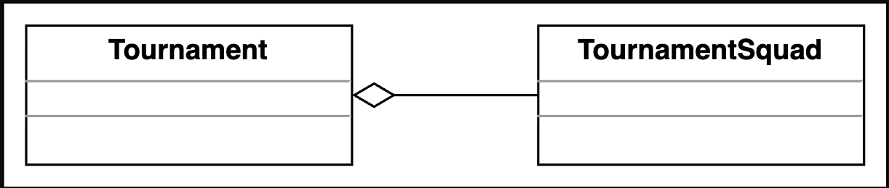

### Composition

The class diagram has the following composition relationships:

* The `Player` class is composed of the `PlayerStat` class.
* The `Team` class is composed of the `Player` and `TeamStat` classes.
* The `Tournament` class is composed of the `Match` and `PointsTable` classes.
* The `Match` class is composed of the `Playing11`, `Innings`, and `MatchStat` classes.
* The `Innings` class is composed of the `Over` class.
* The `Over` class is composed of the `Ball` class.

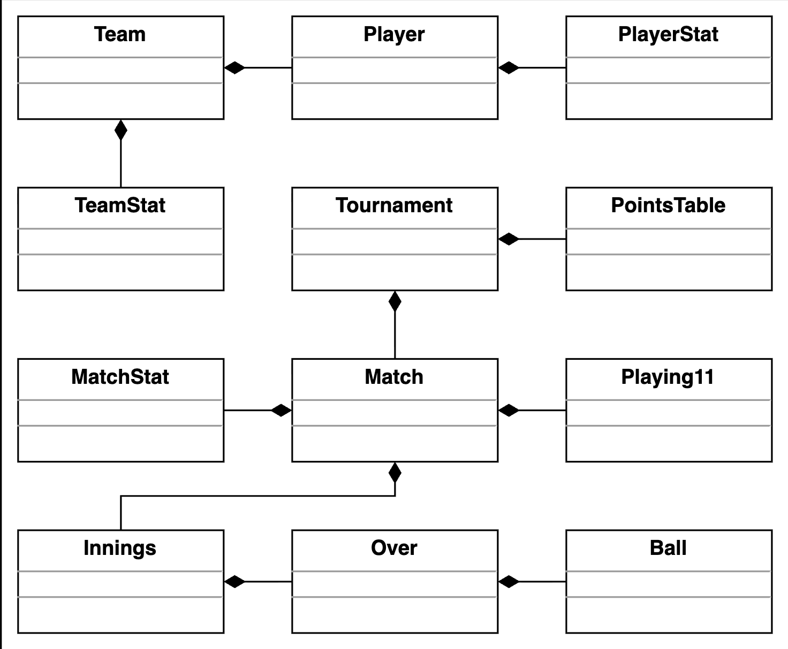

### Inheritance

The class diagram has the following inheritance relationships:

* The `ODI`, `Test`, and `T20` classes are derived from the `Match` class.
* The `TeamStat`, `MatchStat`, and `PlayerStat` classes are derived from the `Stat` class.

Note: We have already discussed the inheritance relationship between classes in the component section above one by one.

## Class diagram of ESPNcricinfo

In this section, we outline the multiplicity (cardinality) relationships between the main classes in our ESPNcricinfo system. For each relationship, we explain the allowed number of instances on each side and the real-world or design rationale behind the connection. Understanding these relationships is key to modeling how different entities interact and collaborate to support key workflows in the system.

| Source | Target | Multiplicity | Description |
|--------|--------|--------------|-------------|
| Player | Run | 1 – 0..* | A player can score multiple runs |
| Player | Wicket | 1 – 0..* | A player can be involved in multiple wickets |
| Ball | Run | 1 – 0..* | A ball can result in multiple runs |
| Ball | Wicket | 1 – 0..1 | A ball can result in zero or one wicket |
| Ball | Player | 1 – 2 | Each ball has a bowler and a batsman |
| Over | Ball | 1 – 0..* | An over can have multiple balls |
| Over | Player | 1 – 1 | One player bowls each over |
| Innings | Over | 1 – 0..* | Each innings can have multiple overs |
| Innings | Playing11 | 1 – 2 | Each innings has one batting and one bowling team |
| Match | Innings | 1 – 0..* | Each match can have multiple innings |
| Match | Team | 1 – 2 | Each match involves two teams |
| Match | Stadium | 1 – 1 | Each match is played in one stadium |
| Match | Umpire | 1 – 2..4 | Each match can have 2 to 4 umpires |
| Match | Commentator | 1 – 0..* | Each match can have multiple commentators |
| Match | MatchStat | 1 – 1 | Each match has one match statistics record |
| Team | Player | 1 – 0..* | A team can have multiple players |
| Team | Coach | 1 – 1 | Each team has one coach |
| Team | News | 1 – 0..* | A team can have multiple news entries |
| Team | TeamStat | 1 – 1 | Each team has one statistics record |
| Tournament | Match | 1 – 0..* | A tournament includes multiple matches |
| Tournament | TournamentSquad | 1 – 0..* | A tournament has multiple squads |
| TournamentSquad | Player | 1 – 0..* | Each tournament squad has multiple players |
| TournamentSquad | Tournament | 0..* – 1 | Each tournament squad belongs to one tournament |
| Playing11 | Player | 1 – 0..* | A playing eleven contains multiple players |
| Commentary | Commentator | 1 – 1 | One commentator gives each commentary |
| News | Team | 1 – 1 | Each news item is linked to one team |
| Admin | Player | 1 – 0..* | Admin manages multiple players |
| Admin | Team | 1 – 0..* | Admin manages multiple teams |
| Admin | Coach | 1 – 0..* | Admin manages multiple coaches |
| Admin | News | 1 – 0..* | Admin manages multiple news entries |
| Admin | Tournament | 1 – 0..* | Admin manages multiple tournaments |
| Admin | Match | 1 – 0..* | Admin manages multiple matches |
| Admin | Stadium | 1 – 0..* | Admin manages multiple stadiums |
| Admin | Umpire | 1 – 0..* | Admin manages multiple umpires |
| Admin | Commentator | 1 – 0..* | Admin manages multiple commentators |

Here's the complete class diagram for ESPNcricinfo:

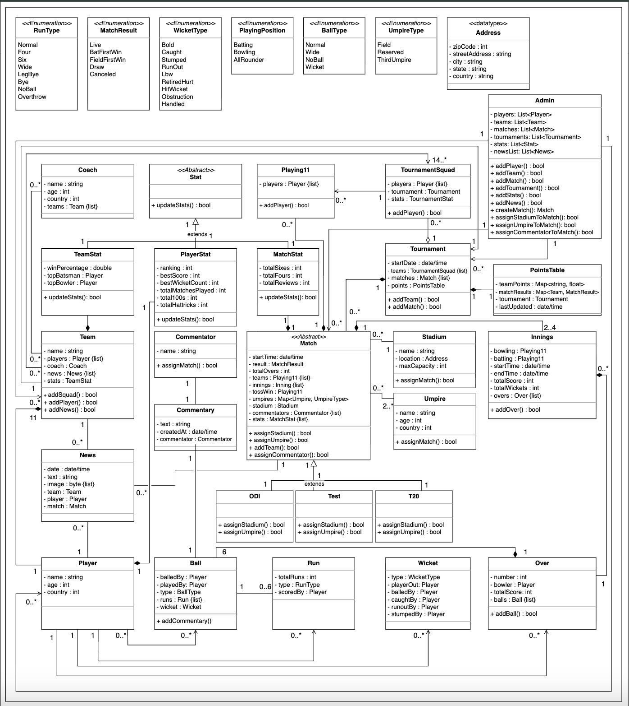

## Design pattern  
To implement ESPNcricinfo's core features in a flexible and scalable way, we apply the object-oriented design patterns based on system behavior.

* We know that updates, such as match scores, wickets, or player milestones, can trigger real-time commentary or notifications. To model this behavior, we can use the Observer design pattern.
* We recognize that players have different roles, such as batter, bowler, or all-rounder, and these roles can behave differently depending on the match conditions. To handle this flexible behavior, we can use the Strategy design pattern.
* We know that different match types, such as ODI, Test, and T20, need to be created dynamically based on the tournament type. To encapsulate the creation logic for these match objects, we can use the Factory design pattern.
* We know that a match consists of innings, overs, and balls in a hierarchical structure. To treat this composition uniformly, we can use the Composite design pattern.
* We know that ODI, Test, and T20 formats follow similar match structures but with variations in rules and flow. To define a common template with customizable steps, we can use the Template Method design pattern.
* We understand that the system should have a centralized administrator managing players, teams, tournaments, and matches. To enforce this single point of control, we can use the Singleton design pattern.
* We know that creating a match or tournament involves assembling several key components, including teams, stadiums, umpires, and statistics. To manage this step-by-step construction, we can use the Builder design pattern.
* We know that actions such as assigning umpires, adding news, or creating squads are user-triggered operations. To encapsulate these actions as separate command objects, we can use the Command design pattern.
* We recognize that commentary may need to be supplemented with live statistics, translations, or highlights to enhance the viewing experience. To add these features dynamically without altering the base class, we can use the Decorator design pattern.
