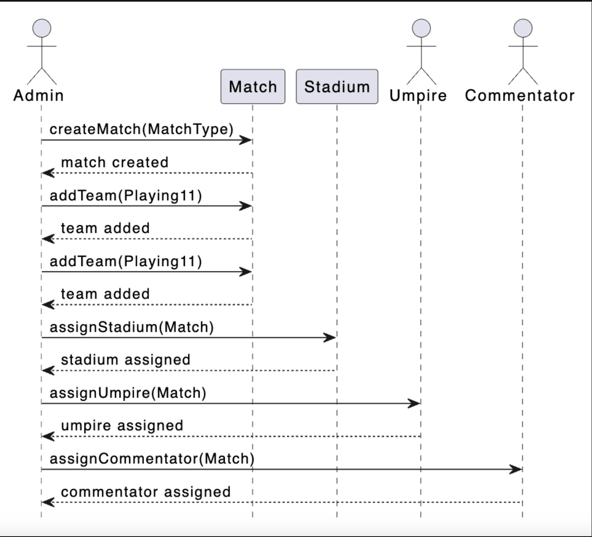

# Sequence Diagram for ESPNcricinfo

Create a sequence diagram for adding a match to the ESPNcricinfo system.

Sequence diagrams are an effective way to visualize the interactions between different entities and objects within a system. There can be different sequence diagrams that we can create for the ESPNcricinfo system. In this lesson, we will create a sequence diagram for the following interaction:

* Add a match: The admin adds a new match to the system.

## Add a match

The sequence diagram for adding a match should have the following actors and objects that will interact with each other:

* Actors: `Admin`, `Umpire`, and `Commentator`
* Objects: `Match` and `Stadium`

The steps involved in adding a match are listed below:

1. The admin creates a new match of a specific match type.
2. The admin adds the playing teams for the match.
3. The admin assigns a stadium to the match.
4. The admin assigns an umpire to the match.
5. The admin assigns a commentator to the match.

Based on the order above, the sequence diagram for adding a match in the ESPNcricinfo system is provided below:

