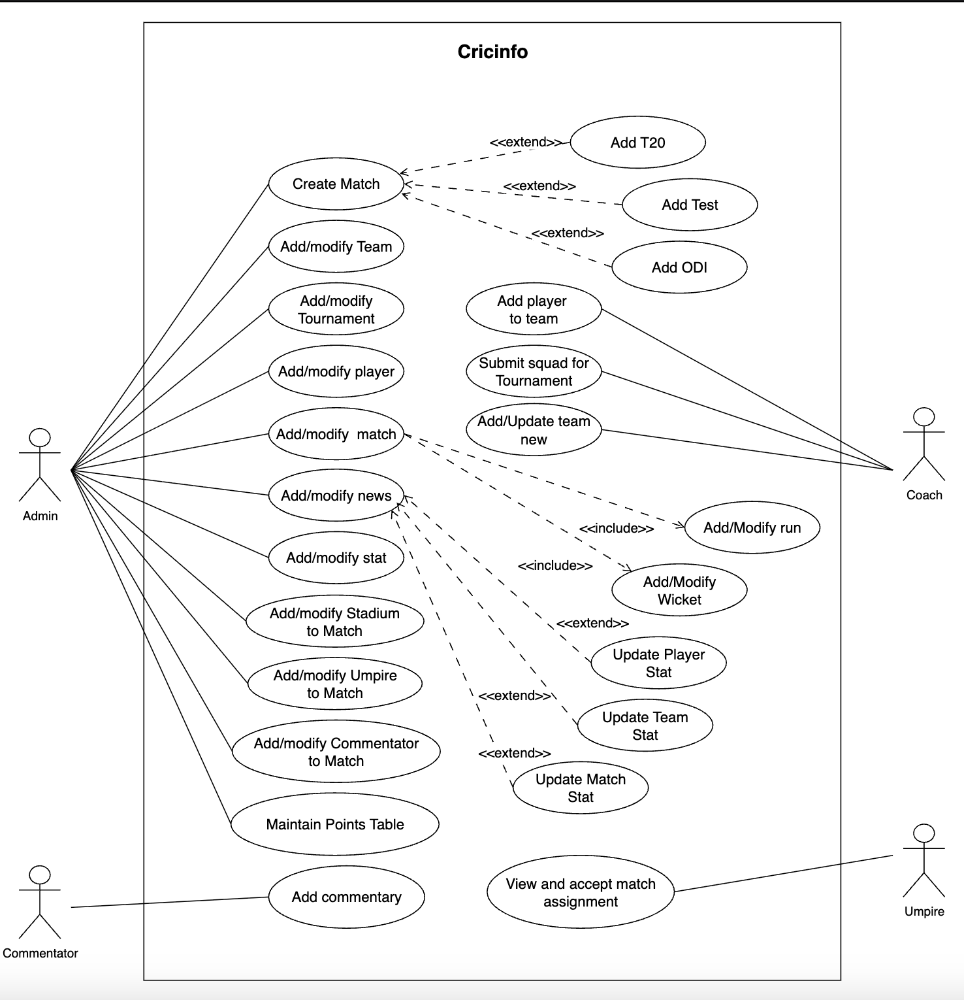

# Use Case Diagram for ESPNcricinfo

Learn how to define use cases and create the corresponding use case diagram for the ESPNcricinfo problem.

Let's build the use case diagram of ESPNcricinfo and understand the relationship between its different components.

First, we will define the different elements of our ESPNcricinfo system, followed by the complete use case diagram.

## System

Our system is ESPNcricinfo.

## Actors

Now, we'll define the main actors of ESPNcricinfo.

### Primary actors

* **Admin:** The admin is responsible for performing various operations, including adding or modifying tournaments, players, squads, matches, assigning stadiums and personnel, and updating statistics.
* **Coach:** The coach manages players, news, and squad submissions for the team in tournaments.
* **Umpire:** The umpire gets assigned to matches and oversees match-related decisions (assignment only modeled).
* **Commentator:** This actor can add commentary to the match or modify it.

### Secondary actors

There is no secondary actor in the system.

## Use cases

In this section, we'll define the use cases for ESPNcricinfo. We have listed the use cases according to their respective interactions with a particular actor.

Note: You may see some use cases repeated multiple times because they are shared among different actors in the system.

### Admin

* **Add/modify team:** To add or update a team and its attributes.
* **Add/modify player:** To add a player to the team or update a player's details.
* **Add/modify tournament:** To add a tournament or update its structure.
* **Add/modify match:** To add a new match to the system or update existing details.
* **Assign stadium:** To assign a stadium to a specific match.
* **Assign umpire:** To assign umpires to a match.
* **Assign commentator:** To assign a commentator to a match.
* **Add/update stats:** To update player, match, or team stats in the system.
* **Add/update news:** To publish team or match-related news.
* **Maintain points table:** To keep track of the scores and standings of the matches.

### Coach

* **Add player to team:** To add a player to the team's roster.
* **Submit squad for tournament:** To add a selected squad of players to a tournament.
* **Add/update team news:** To publish news articles or updates for a team.

### Umpire

* **View assigned match:** To let umpires see their upcoming assigned matches.

### Commentator

* **Add/modify commentary:** To add or edit commentary for a specific ball during the match.

## Relationships

We describe the relationships between and among actors and their use cases in this section.

### Generalization

* Add/update stats use case has a generalization relationship with:
   * Add/update player stats
   * Add/update match stats
   * Add/update team stats
* Add match use case has a generalization relationship with:
   * Add T20 match
   * Add an ODI match
   * Add Test match

### Associations

The table below illustrates the association between actors and their corresponding use cases.

| Admin | Commentator | Coach | Umpire |
|-------|-------------|-------|--------|
| Add/modify team | Add/modify commentary | Add player to team | View assigned match |
| Add/modify player | | Submit squad for tournament | |
| Add/modify tournament | | Add/update team news | |
| Add/modify match | | | |
| Assign stadium | | | |
| Assign umpire | | | |
| Assign commentator | | | |
| Add/update stats | | | |
| Add/update news | | | |
| Maintain points table | | | |

### Include

* Add/modify match use case has an include relationship with:
   * Add/modify run
   * Add/modify wicket

## Use case diagram

Here's the use case diagram of ESPNcricinfo:

