# Class Diagram for the Elevator System

Explore how to design the class diagram for an elevator system by identifying key components such as buttons, panels, floors, doors, and elevator cars. Understand their relationships including aggregation, composition, and inheritance, and apply relevant design patterns like strategy and state to optimize system behavior. This lesson helps you build a modular and extensible elevator system model for OOD interviews.

In this lesson, we'll identify and design the classes, abstract classes, and interfaces based on the requirements we previously gathered from the interviewer in our elevator system.

## Components of an elevator system

As mentioned, we will design the elevator system using a bottom-up approach. Therefore, we will first identify and design classes for the smaller components like Button, Door, and Floor. Then, we will create the larger components, ElevatorCar, Building, and the overall ElevatorSystem—composed of aggregating the smaller ones.

### Button

Button is an abstract class. There can be four types of buttons: the door button, the elevator button, the hall button, and the emergency stop button. The status of the button determines whether it is pressed or unpressed. We can press the button or check its status through the Button class.

The ElevatorButton subclass is inherited from the Button class and represents the buttons inside the elevator. When the elevator button is pressed, it specifies the destination floor of the elevator car or where the passenger wants to go.

Similar to ElevatorButton, HallButton is also a subclass of the Button class. This class represents the buttons outside the elevator. It uses the enumeration Direction to specify whether the button is for going up or down. The hall button has two important pieces of information: the floor from where the button is pressed and the direction the passenger wants to move.

Furthermore, there's an EmergencyButton class that also inherits the behavior of the abstract Button class. This class responds to the passengers' call when they press the emergency button. It alerts the support team to take prompt action and prevents other passengers from using the elevator car.

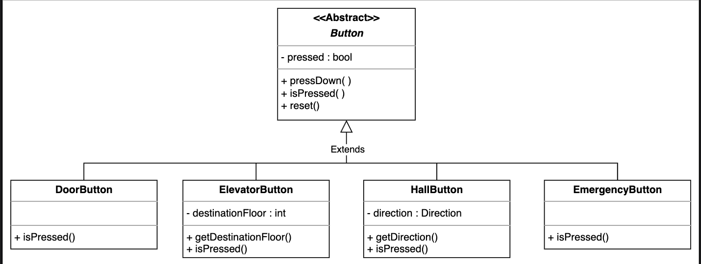

### Elevator panel and hall panel

ElevatorPanel is a class that represents the complete grid of buttons inside the elevator. In the elevator panel, we will have a list of buttons for selecting the destination floor, two buttons for closing and opening the elevator, and an emergency stop button.

The HallPanel class represents the buttons that are outside the elevators. The hall panel consists of only two buttons: up and down.

The elevator and hall panels are used to take input from the passenger.

Number of buttons in the elevator panel = Number of floors + 3

Number of buttons in the hall panel = 2
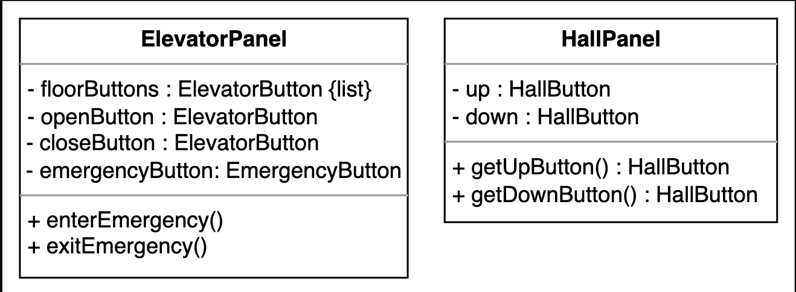

### Display

Every elevator has a display to represent the current floor number and direction (up or down) of the elevator. It also gives information about the capacity of the elevator. So we will use the Display class which represents this information. The Display class consists of the floor number, capacity, and direction. It has separate methods for both elevator display and hall display. The showElevatorDisplay() will display all of the class attributes. The Display class also has an update() method that changes the floor number, the capacity, and the direction of the elevator car.

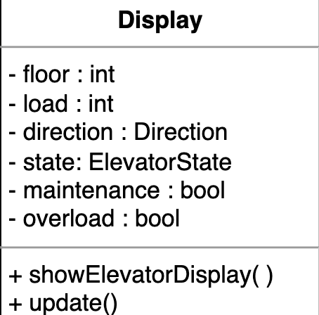

### Door

The Door class symbolizes the door of an elevator. This class references the enum DoorState, which depicts that the door's status can be open or closed.

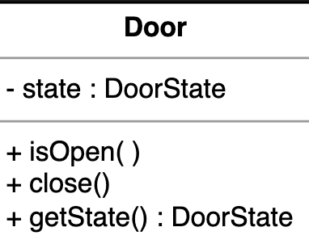

### Elevator car

ElevatorCar is the class that expresses the elevators of the building. Each elevator has a unique ID. This class consists of an enumeration named state that tells the present state of the elevator. Moreover, every elevator car has a door, an elevator panel, and a display. The elevator car can start moving or stop on any floor.

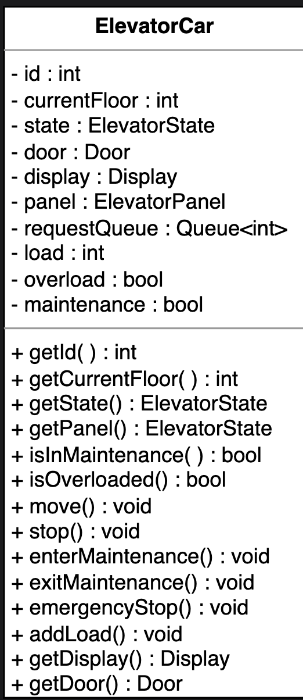

### Floor

The Floor class represents the floors of a building. Each floor consists of several hall panels to call the lift and has displays to indicate the current floor and direction of the lift, as there is a separate panel and display for each elevator. Moreover, we will have getFloorNumber(), getPanel(), and getDisplay() functions to check if the floor is at the bottom or top, and update the panels and displays respectively. The "Down" button will be disabled if the floor is at the lowest level of the building, and the "Up" button will be disabled if the floor is topmost.

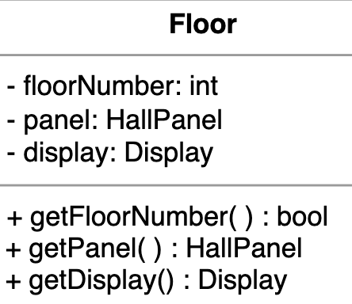

### Building

The Building class represents an actual building consisting of several floors and elevators.

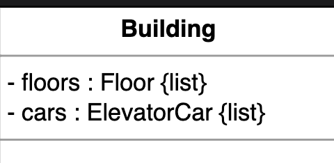

### Elevator system

ElevatorSystem is the main functional class of the whole elevator control system. The elevator system displays each elevator and monitors the elevator cars. The elevator system has a dispatcher to select the best elevator car. Moreover, the system takes control of the elevator doors.

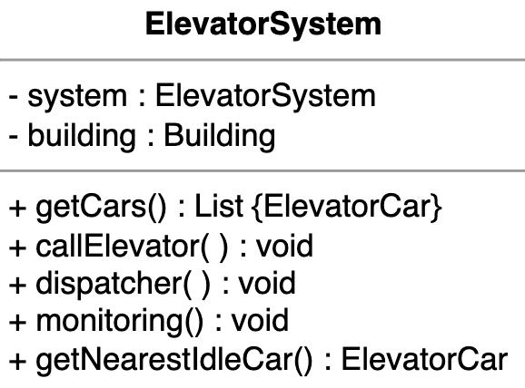

### Enumerations

Enumeration is generally a data type in which only a specific set of constants can be stored. The following is the list of enumerations required in the elevator system:

* **ElevatorState:** It describes the state of an elevator, which could be idle, up, down, or maintenance.
* **Direction:** When the elevator is not idle, it describes the direction of its motion, which could be up or down.
* **DoorState:** When the elevator is idle, it describes the status of an elevator door that could be open or closed.

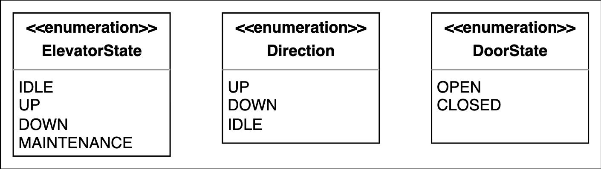

## Relationship between the classes

Now, we'll discuss the relationships between the classes we have defined above in our elevator system.

### Aggregation

Aggregation is a "has-a" relationship where the container (whole) can exist independently of the contained (part). The part can also exist independently, and is often shared or referenced. The class diagram has the following aggregation relationships:

* **ElevatorSystem** has an aggregation relationship with **Building**.
  * The ElevatorSystem is the high-level controller and contains a Building instance (which has floors and elevator cars). The Building object can be reused or replaced if the system is reset.
* **Building** aggregates **Floor** and **ElevatorCar**.
  * The Building has multiple floors and elevator cars. Even if the Building is destroyed, the floors and cars might still be conceptual entities (e.g., for reporting or migration).

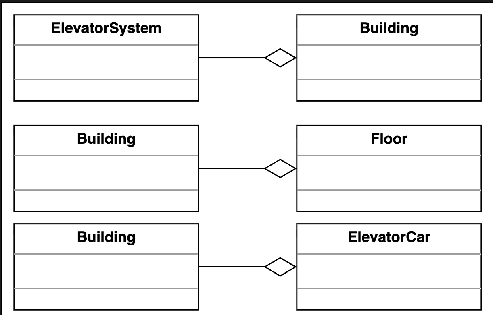

### Composition

Composition is a strong "part-of" relationship where the part cannot exist without the whole. If the whole is destroyed, its parts are destroyed too. The class diagram has the following composition relationships.

* **ElevatorCar** is composed of **Door**, **Display**, and **ElevatorPanel**.
  * Each ElevatorCar owns its Door, Display, and Panel—these have no meaningful existence outside the car. If the car is decommissioned, so are its door, display, and panel.
* **Floor** is composed of **HallPanel** and **Display**.
  * Each floor has a unique HallPanel and Display, which do not make sense independently of their floor.
* **HallPanel** contains **HallButtons**.
  * A HallPanel comprises up/down buttons specific to it; these buttons are not shared with other panels.
* **ElevatorPanel** contains **ElevatorButtons**, **DoorButtons**, and an **EmergencyButton**.
  * These buttons are part of the elevator's control panel and are not shared across panels or elevators.

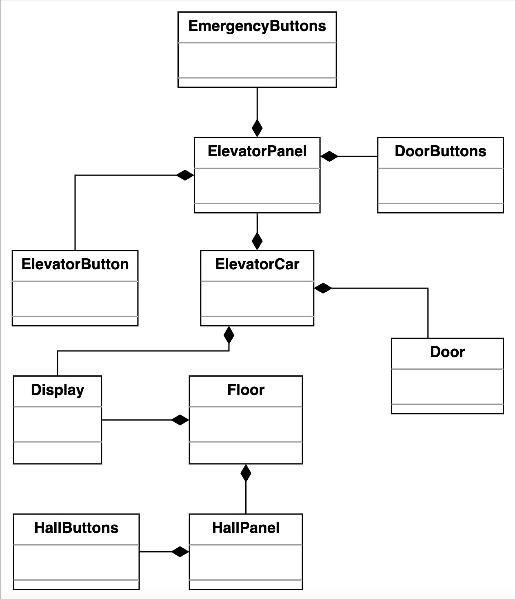
### Inheritance

Inheritance is an "is-a" relationship. Subclasses share a contract and behavior with the superclass, and can be used wherever the superclass is expected. The following classes show an inheritance relationship:

* **ElevatorButton**, **HallButton**, **DoorButton**, and **EmergencyButton** all extend the abstract **Button** class.
  * All buttons share common features (pressed state, press/reset actions), but each has specialized behavior and context. Inheriting from a base Button reduces duplication and supports polymorphism if needed.

Note: The component section has already discussed the inheritance relationship between classes.

## Class diagram of the elevator system

This section outlines the multiplicity (cardinality) relationships between the main classes in our elevator system. We explain the allowed number of instances on each side for each relationship and the real-world or design rationale behind the connection. Understanding these relationships is key to modeling how different entities interact and collaborate to support key workflows in the system.

| Source | Target | Multiplicity | Reason |
|--------|--------|--------------|--------|
| ElevatorSystem | Building | 1 → 1 | The ElevatorSystem manages exactly one Building; the Building is created and owned by the system. |
| Building | Floor | 1 → 1..15 | A Building consists of at least 1 and up to 15 Floor objects. |
| Building | ElevatorCar | 1 → 1..3 | A Building consists of at least 1 and up to 3 ElevatorCar objects. |
| Floor | HallPanel | 1 → 1..* | Each Floor contains at least one HallPanel (may be more in special configurations). |
| Floor | Display | 1 → 1..* | Each Floor contains at least one Display, and possibly more for redundancy or multiple elevator banks. |
| HallPanel | HallButton | 1 → 2 | Each HallPanel comprises exactly 2 HallButtons (up and down), except for top/bottom floors (some implementations may have one null). |
| ElevatorCar | ElevatorPanel | 1 → 1 | Each ElevatorCar contains exactly one ElevatorPanel for passenger controls. |
| ElevatorCar | Door | 1 → 1 | Each ElevatorCar has exactly one Door. |
| ElevatorCar | Display | 1 → 1 | Each ElevatorCar has exactly one Display for internal status. |
| ElevatorPanel | ElevatorButton | 1 → 1..18 | Each ElevatorPanel contains one ElevatorButton for each floor it can reach (typically 1 to 18). |
| ElevatorPanel | DoorButton | 1 → 2 | Each ElevatorPanel has exactly 2 DoorButtons (open and close). |
| ElevatorPanel | EmergencyButton | 1 → 1 | Each ElevatorPanel has exactly one EmergencyButton. |

Here's the complete class diagram for our elevator system:

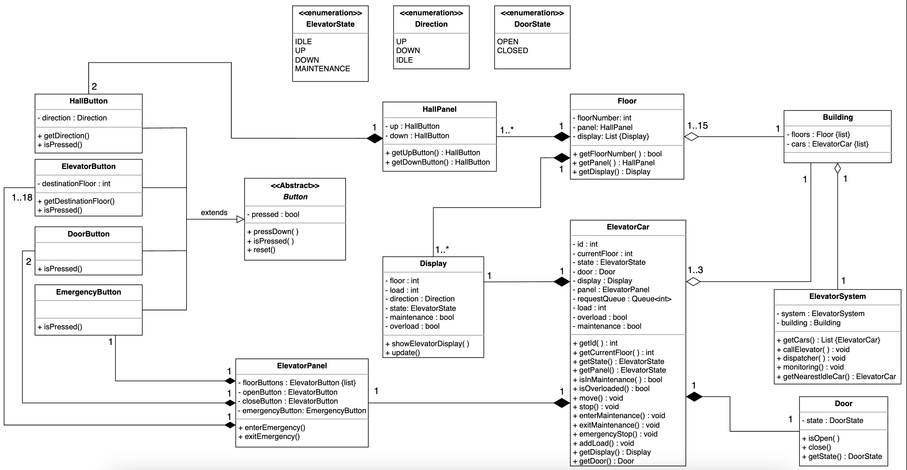
## Design pattern

Several design patterns are well-suited to the elevator control system:

* **Strategy pattern:** The dispatching logic—how the system assigns elevator cars to requests—can vary based on building size, traffic patterns, or custom policies. Using the Strategy pattern, you can define multiple dispatch algorithms (e.g., nearest-car, least-busy, or time-based scheduling) and swap them at runtime depending on building requirements.
* **State pattern:** Elevators naturally transition between states such as idle, moving up, moving down, maintenance, or emergency. The State pattern allows each elevator to delegate its behavior to an object representing its current state. This leads to cleaner, more maintainable code: state transitions are explicit, and each state handles only its relevant actions (such as door logic or input handling).
* **Delegation:** Instead of implementing all behaviors in a single class, delegation enables objects (like the elevator system or elevator cars) to delegate certain responsibilities—such as dispatching, state management, or display updates—to specialized helper classes or state objects. This promotes separation of concerns and greater flexibility in modifying or extending system behavior.

These patterns help make the elevator system modular and extensible, easily adapting to different building requirements or future enhancements.

## Additional requirements

The interviewer can introduce some additional requirements in the elevator control system, or they can ask some follow-up questions. The additional requirement is how the dispatcher works in the elevator system. The interviewer can ask to devise an algorithm to optimize any of these:

* To minimize the wait time of the system
* To minimize the wait time of the passenger
* To maximize throughput
* To minimize the power usage or cost

To optimize the elevator system, we have different dispatching algorithms.

### FCFS

First come, first serve (FCFS) is a scheduling algorithm by which the passenger who comes first gets the elevator car and reaches the destination. There are four states of an elevator car with respect to the passenger:

* The elevator car is in an idle state.
* The elevator car is moving toward the passenger in the same direction the passenger wants.
* An elevator car is moving toward the passenger, but in the opposite direction the passenger wants to go.
* The elevator car is moving away from the passenger.

In this algorithm, the dispatcher will try to find elevators in either of the first two states and ignore those elevators in the last two states.

The advantage of this algorithm is that it is simple and easy to implement. The drawback of this algorithm is that extra elevator movements occur by this algorithm which resulting in more power usage and cost. To implement FCFS, we can use a queue data structure to track which passenger comes first.

### SSTF

Shortest seek time first (SSTF) is an algorithm in which the passenger closest to the elevator car gets the elevator car. This algorithm is considered better than FCFS as less elevator movement is required compared to the FCFS algorithm. This algorithm also results in an increased throughput. However, this method has a loophole where it always chooses the minimum distant passengers and ignores the farther ones completely. We can use a priority queue, a min heap, or an array data structure to implement this algorithm.

### SCAN

SCAN is also known as the Elevator algorithm. The elevator car starts from one end of the building and moves toward the other end, servicing requests in between. This method has the advantage of serving multiple requests in parallel. However, it increases cost as the elevator car only changes direction at the top or lowest floors. The implementation of SCAN can be done using two boolean arrays, a single HashMap, or two priority queue data structures to track the floor where the elevator should stop.

### LOOK

LOOK is also known as the look-ahead SCAN algorithm. It is an improved version of the SCAN Algorithm. In this algorithm, the elevator car stops when there is no request in front of it. It will move again based on the request. The advantage of this algorithm is that the elevator car does not always go to the end of the building, but can change its direction in between. This algorithm can use a HashMap, a TreeMap, or a binary search tree data structure.

We have completed the class diagram of the elevator system according to the requirements. In the next lesson, let's design the sequence diagram of the elevator control system.