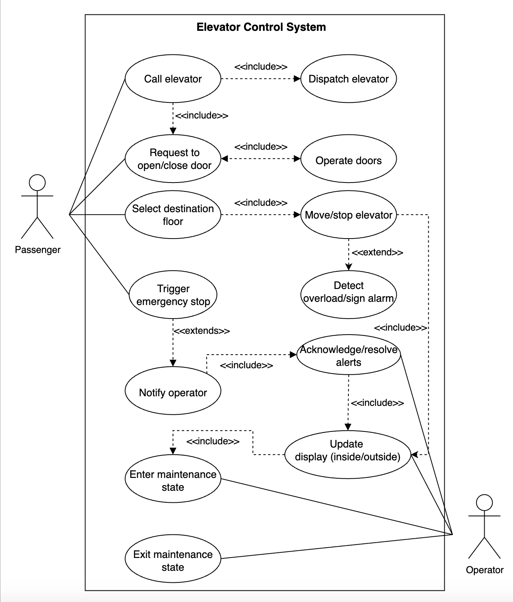

# Use Case Diagram for the Elevator System

Understand how to create a comprehensive use case diagram for an elevator system. Learn to define primary and secondary actors, their interactions, and essential use cases like calling the elevator, selecting floors, and managing emergencies. This lesson equips you to visualize and organize system functions for efficient design.

Let's build the elevator system's use case diagram and understand the relationship between its main actors and functions. First, we'll define the different elements of our system, followed by the complete use case diagram.

## System

The elevator control system includes the physical elevator cars, floor and in-car panels, and the central controller, which manages requests and car dispatch.

## Actors

Next, we will define our elevator system's main actors.

### Primary actors

**Passenger:** A passenger can do the following.

* Call the elevator from any floor by pressing the "Up" or "Down" button on the floor panel.
* Select a destination floor using the buttons on the in-car panel.
* Request to open or close the doors via the "Open" and "Close" buttons on the in-car panel (when the car is stopped).
* Trigger an emergency stop by pressing the emergency button inside the car.

### Secondary actors

**Operator:** The operator can place a car in or remove it from maintenance mode; the control system responds accordingly. It can:

* Enter maintenance mode for a selected car, causing the elevator control system to remove it from normal dispatch and ignore hall or in-car requests.
* Exit maintenance mode, returning the car to the idle state so it can resume service.
* Receives alerts for emergencies.

## Use cases

In this section, we will define the elevator's use cases. We have listed them according to their respective interactions with a particular actor.

### Passenger

**Call elevator:** To press the "Up" or "Down" button on the floor panel to call an elevator (only when the car is idle or passing).

**Select destination floor:** To use the panel inside the elevator car, select the desired floor (only when the doors are open and the car is idle).

**Request to open/close door:** To press the "Open" or "Close" button on the in-car panel to request door operation (only when the car is idle).

**Trigger emergency stop:** To press the "Emergency" button inside the car to immediately halt the motion and alert the support team (allowed at any state except maintenance).

### Elevator control system

**Move/stop elevator:** To move up or down or to stop the elevator on a specific floor. Transitions cars between Up, Down, and Idle states; respects the maintenance state.

**Dispatch elevator:** To run the elevator-assignment algorithm on each CallElevator use case.

**Update display (inside/outside):** To refresh in-car and floor displays with the current floor number and travel direction within 200 ms of any state change.

**Operate doors:** To open or close doors on command (only in idle state).

**Detect overload/sign alarm:** To ensure safety, inhibit motion and sound/flash overload alarm until cleared when the load exceeds capacity.

**Notify operator:** To alert the operator or security in emergency or fault scenarios.

### Operator

**Enter maintenance mode:** To place a car in maintenance so it ignores hall- and in-car requests.

**Exit maintenance mode:** To return the car to idle, it re-enters normal dispatch.

**Acknowledge/resolve alerts:** To address alarms or emergencies (optional but useful).

## Relationships

This section describes the relationships between and among actors and their use cases.

An association links an actor to a use case they participate in or initiate.

In the elevator system:

Example:

* Passenger is associated with "Call elevator," "Select destination floor," "Request door open/close," and "Trigger emergency stop."
* Operator is associated with "Enter maintenance mode" and "Exit the maintenance mode."
* The elevator control system is associated with all automation and monitoring use cases.

The table below shows the association relationship between actors and their use cases.

| Passenger | Elevator Control System | Operator |
|-----------|------------------------|----------|
| Call elevator | Move/stop the elevator | Enter maintenance mode |
| Select the destination floor | Dispatch elevator | Exit maintenance mode |
| Request to open/close the door | Update display (inside/outside) | Acknowledge/resolve alerts |
| Trigger emergency stop | Operate doors | |
| | Detect overload/sign alarm | |
| | Notify operator | |

### Include

The include relationship means that one use case always incorporates the behavior of another. The "included" use case is mandatory, reusable, and typically extracted to avoid repetition.

In the elevator system:

Whenever a passenger selects a destination, the system must move and stop the elevator at that floor and update the displays (internal and external). Thus, "Move/stop elevator" is included in "Select destination floor," and "Move/stop elevator" includes "Update display(inside/outside)."

* **Example 1:** "Select destination floor" includes "Move/stop elevator."

The system must perform the door operation when a passenger requests a door to open or close.

* **Example 2:** "Request door open/close" includes "Operate doors."

Calling an elevator from a floor always results in the dispatch algorithm running to assign an appropriate car.

* **Example 3:** "Call elevator" includes "Dispatch elevator."

### Exclude

The extend relationship is used when a use case may (optionally, conditionally) add extra steps or behavior to another use case. The "extending" use case is not always invoked—only under certain conditions.

In the elevator system:

A car normally operates as usual. If a passenger presses the emergency stop button, the flow is extended, causing the car to halt, ignore further input, and send alerts.

* **Example:** "Trigger emergency stop" extends normal operation.

Normally, the elevator moves as requested. If an overload is detected, this extension interrupts the movement to handle the alarm.

* **Example:** "Detect overload/sign alarm" extends "Move/stop elevator."

## Use case diagram

Here's the use case diagram of the elevator system:

in depth(Use Case Diagram for the Elevator System), <a href="./deapth/use-case-diagram-details.md">click here</a>
