# Class Diagram for Facebook

Learn to create a class diagram for Facebook using the bottom-up approach.

In this lesson, we’ll identify and design the classes, abstract classes, and interfaces based on the requirements we previously gathered from the interviewer in our Facebook social network system.

## Components of Facebook

As mentioned, we will design the Facebook social network using a bottom-up approach.

### Person
The Person class contains details derived from the User class, such as name, address, phone number, and email.

### User
The User class is Facebook’s main class responsible for various operations, such as sending messages or friend requests to other users, creating or joining groups or pages, and numerous others.

The class diagram of these two classes is provided below:

> **Note**: The User class contains various methods representing user interactions and functionalities within the system. For brevity, only a subset of these methods is shown here.

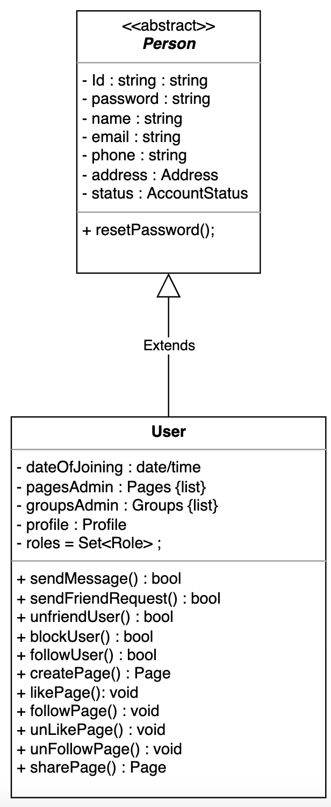

<strong>Click to view related requirements</strong>

**R4:** Users should be able to send and respond to friend requests, unfriend, and block other users.  
**R8:** A user should be able to send and receive messages from other users.  
**R9:** Users should be able to follow existing pages and join existing groups. They should also be able to unfollow or leave joined groups or followed pages. 

### Profile
The `Profile` class contains a Facebook user’s personal information, such as their `profile` and cover pictures, work and education details, and a list of places they’ve visited.

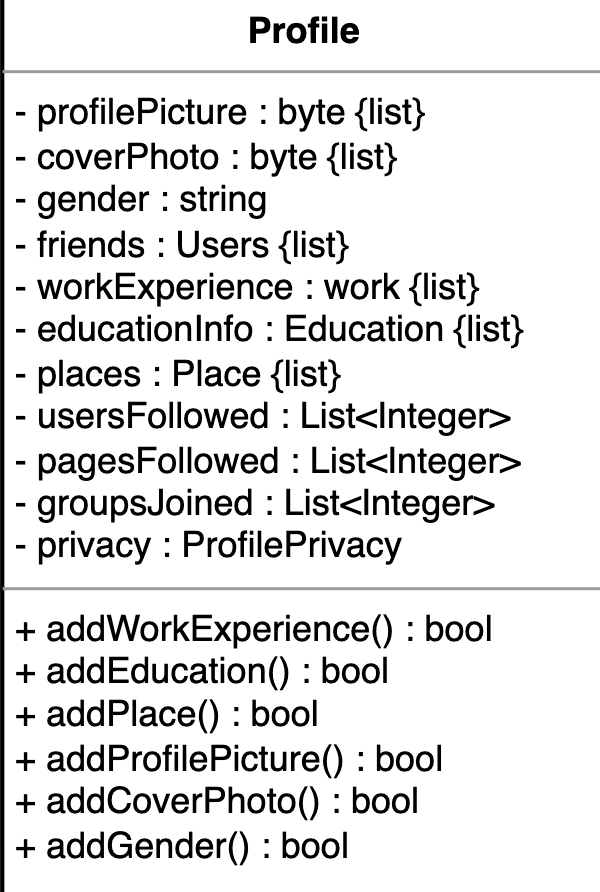

<strong>Click to view related requirements</strong>

**R1:** Users should be able to set the privacy of their profile page. They should also be able to create their profile page and add information such as work experience, education, and living place.  

### Work, education, and places
The `Work`, `Education`, and `Places` classes are used to provide relevant information and are involved in the `Profile` class.

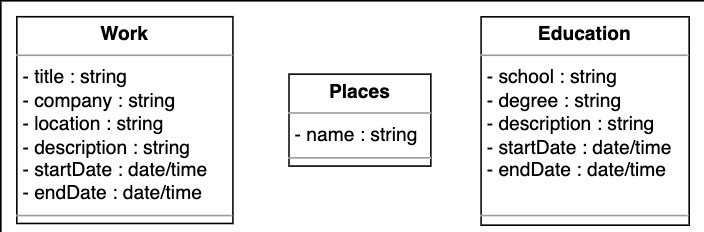

<strong>Click to view related requirements</strong>

**R1:** Users should be able to set the privacy of their profile page. They should also be able to create their profile page and add information such as work experience, education, and living place.  

### Page
The `Page` class represents a page on the Facebook platform. It contains the name, description, likes count, and a particular ID to uniquely identify the page.

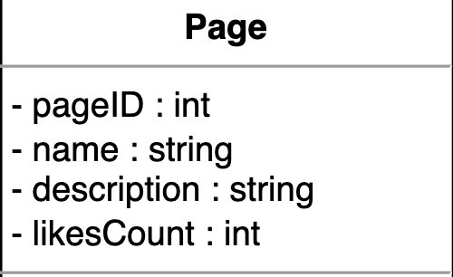

<strong>Click to view related requirements</strong>

**R9:** Users should be able to follow existing pages and join existing groups. They should also be able to unfollow or leave joined groups or followed pages. 

### Group
The `Group` class represents a particular group on the Facebook platform. It will contain the name, description, total users, and a unique ID to uniquely identify the group. In addition, it will have methods for adding new users and updating the group’s description.

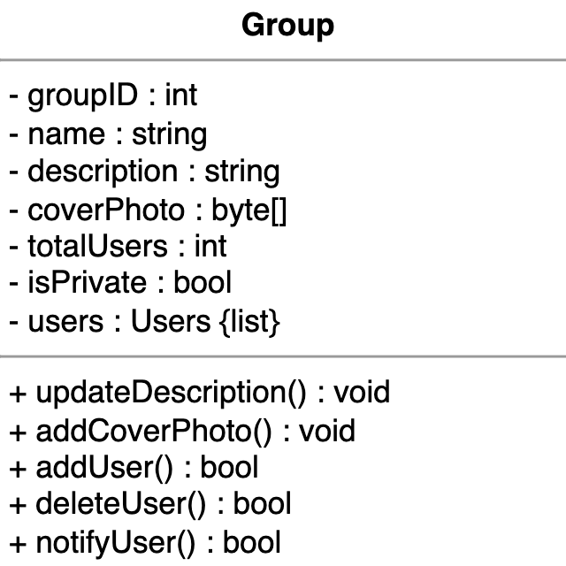

<strong>Click to view related requirements</strong>

**R9:** Users should be able to follow existing pages and join existing groups. They should also be able to unfollow or leave joined groups or followed pages. 

  

In the Facebook design problem, the Group class implements the GroupFunctions interface. 
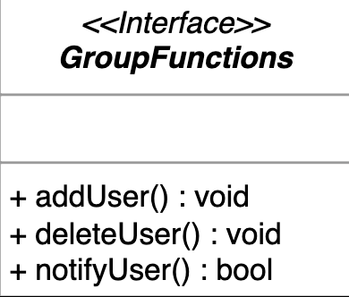

### Post
The `Post` class indicates a post by any user that contains its content, the number of likes and shares it has, and its owner. Each post has a specific setting as to who can view it.  

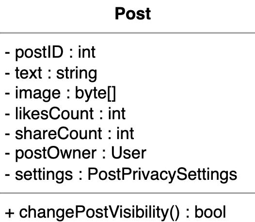

<strong>Click to view related requirements</strong>

**R3:** Users should be able to write a new post and set its privacy.  

 

### Comment
The `Comment` class indicates a comment by any user on a post that will contain its content, the number of likes, and the owner of the comment.  

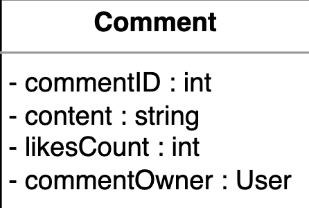

<strong>Click to view related requirements</strong>

**R6:** Users should be able to like, share, and/or comment on a post and like or comment on an existing comment.  

 

### Friend request
The `FriendRequest` class describes the details of a friend invitation. It will contain the status of the friend invite and the methods that indicate whether the request was accepted or rejected.  

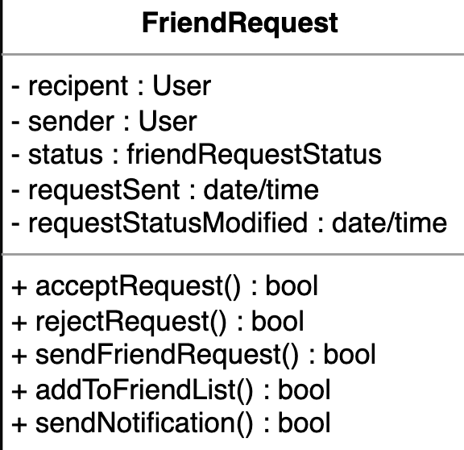

<strong>Click to view related requirements</strong>

**R4:** Users should be able to send and respond to other users’ friend requests. Users should also be able to unfriend or block other users.  

 

### Message
The `Message` class represents the message sent by a user to other users.

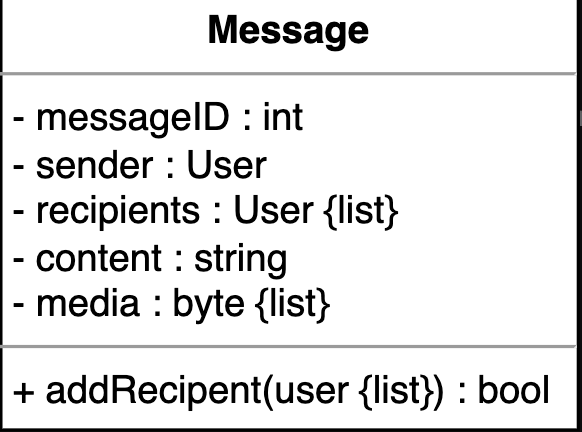

<strong>Click to view related requirements</strong>

**R8:** A user should be able to send and receive messages from other users.  

 

## Profile privacy 
There will be a `profilePrivacy` class for the profile on Facebook. The following represents the class diagram:

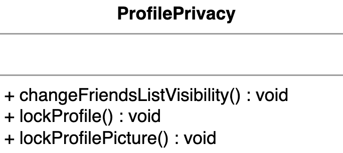

<strong>Click to view related requirements</strong>

**R1:** Users should be able to set the privacy of their profile page. They should also be able to create their profile page and add information such as work experience, education, and living place.  

**R3:** Users should be able to write a new post and set its privacy.  

### Notification
The `Notification` class will be a class, since it can send a notification using the built-in notification option. It is mainly responsible for sending notifications whenever any of the following conditions are met:

- A friend request is received.  
- A new message is received.  
- A new comment is added to a post a user has created or is following.  
- A user has created a new post or a page that another user follows.  

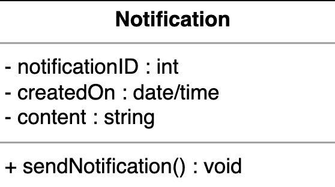

<strong>Click to view related requirements</strong>

**R7:** The system should notify the user whenever there has been an interaction with them, such as receiving a message, a friend request, or a comment on their post.    

### Interfaces Implemented by the User

Several interfaces will exist in the Facebook class, and each will play a separate role in implementing different functionality. The following provides an overview of these:

- **PageFunctionsByUser**: This interface will contain the functions that a user will perform while interacting with pages.  
- **GroupFunctionsByUser**: This interface will contain the user’s functions while interacting with groups.  
- **PostFunctionsByUser**: This interface will contain the functions that a user will perform while interacting with posts.  
- **CommentFunctionsByUser**: This interface will contain the user’s functions while interacting with comments.  
- **Search**: This interface allows users to search for any particular user, group, page, or post and returns a list of the respective components.

The UML representation of the interfaces is shown below:

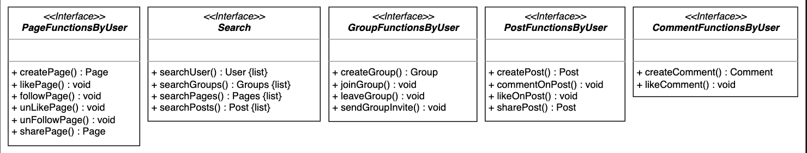  

### Search catalog
`SearchCatalog` is the class where the search functionality is implemented. Each catalog contains a list of users, groups, pages, and posts, and users can search for users, groups, pages, and posts.

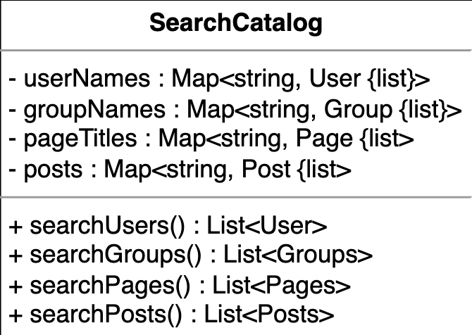

<strong>Click to view related requirements</strong>

**R2:** Our system’s users should be able to search for groups, pages, and other users.

### Enumerations

The enumerations required in the Facebook design are listed below:

- **AccountStatus**: The account status tells about a member’s account status, whether it is active, disabled, or blocked.
- **FriendInviteStatus**: The friend invite status describes the status of a friend request, whether it is pending, accepted, rejected, or canceled.
- **PostPrivacySettings**: The post-privacy settings enumeration outlines the audience that can view the posts.
- **Role**: The role status describes whether the user is a regular user or has administrative permissions.  

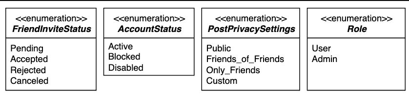

### Custom data type
We need to create a custom data type, `Address`, to store a Facebook user’s location.

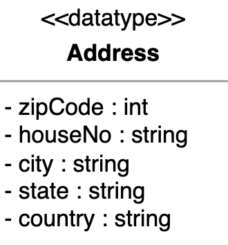

## Relationship between the classes
Now, we’ll discuss the relationships between the classes we have defined above in our Facebook social network system.

### Association
The class diagram has the following association relationships:

- The `User` class has a one-way association with:  
   - Itself  
   - The ``Page``, `Group`, `FriendRequest`, `Message`, `Comment`, `Post`, `ProfilePrivacy`, and `PostPrivacy` classes.  
   - The `PageFunctionsByUser`, `GroupFunctionsByUser`, `CommentFunctionsByUser`, `PostFunctionsByUser`, and `Search` interfaces.  

- The Profile class has a one-way association with ProfilePrivacy.  
- The Post class has a one-way association with PostPrivacy and Notification.  
- The Notification class has a one-way association with FriendRequest, Message, and Comment.  
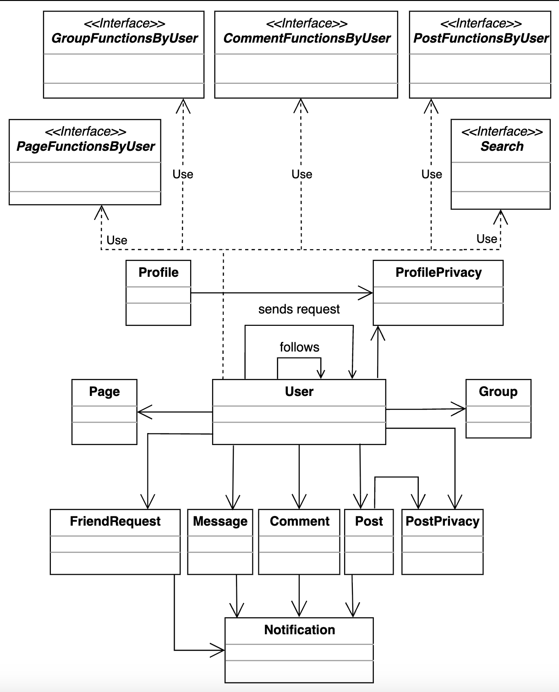

### Composition
The class diagram has the following composition relationships:

- The `User` class is composed of the `Profile` class.
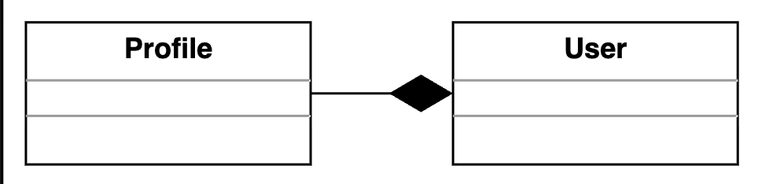

### Aggregation
The following classes show an aggregation relationship:

- The `Profile` class contains the `Work`, `Education`, and `Places` classes.  

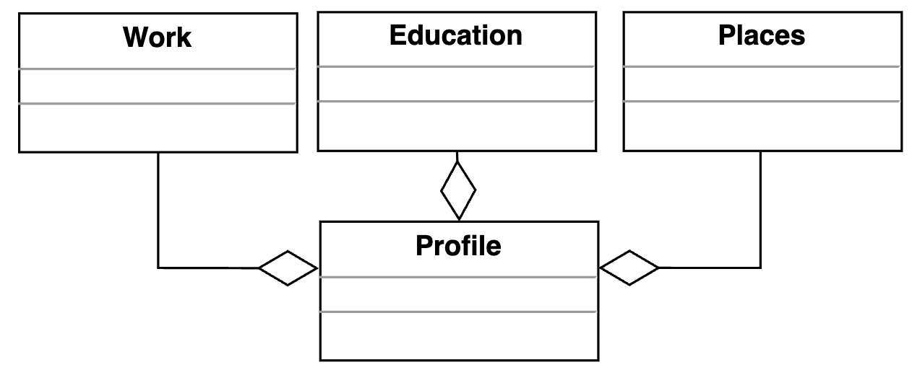

## Generalization
The following classes show a generalization relationship:

- The `SearchCatalog` class implements the `Search` interface.  
- The `Group` class implements the `GroupFunctions` interface.  

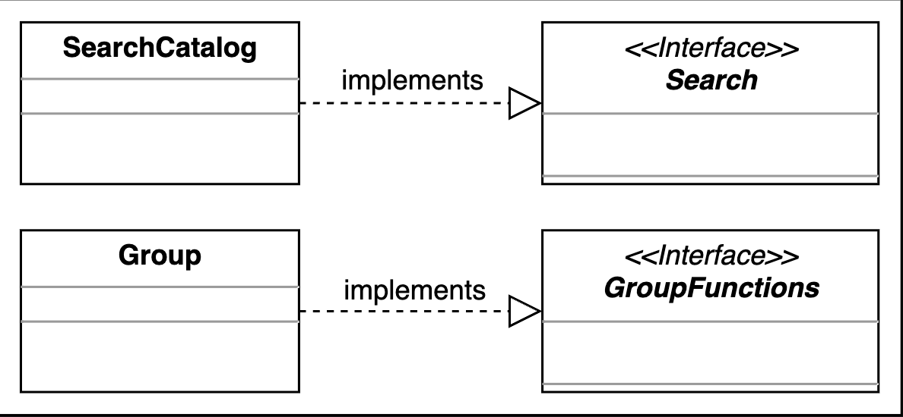

## Inheritance

The following classes show an inheritance relationship:
- The `User` class extends the `Person` class.

## Class Diagram Relationships

This section outlines the multiplicity (cardinality) relationships between the main classes in our Facebook design system. Understanding these relationships is key to modeling how different entities interact and collaborate.

| Source                  | Target                  | Multiplicity | Reason                                                                 |
|-------------------------|-------------------------|--------------|------------------------------------------------------------------------|
| User                    | Post                    | 1 – 0..*     | A user can create, like, share, and comment on multiple posts          |
| Post                    | User                    | 1 – 1        | Each post is associated with exactly one user                          |
| User                    | Comment                 | 1 – 0..*     | A user can create and interact with multiple comments                  |
| User                    | Message                 | 1 – 0..*     | A user can create and interact with multiple messages                  |
| User                    | FriendRequest           | 1 – 0..*     | A user can create and interact with multiple friend requests           |
| User                    | Notification            | 1 – 0..*     | A user can receive multiple notifications                              |
| FriendRequest           | User                    | 1 – 2        | Friend requests involve two users (sender and recipient)               |
| User                    | Page                    | 1 – 0..*     | A user can follow, like, or share multiple pages                       |
| User                    | Group                   | 1 – 0..*     | A user can join or manage several groups                               |
| User                    | Profile                 | 1 – 1        | Each user is associated with exactly one profile                       |
| Profile                 | Work                    | 1 – 0..*     | A profile may include multiple work entries                            |
| Profile                 | Education               | 1 – 0..*     | A profile may include multiple education entries                       |
| Profile                 | Places                  | 1 – 0..*     | A profile may include multiple place entries                           |
| Profile                 | ProfilePrivacy          | 0..1 – 1     | Profile may optionally be linked to a privacy setting                  |
| Group                   | User                    | 1 – 1..*     | A group consists of one or more users as members                       |
| Page                    | User                    | 1 – 1..*     | At least one user manages a page                                       |
| User                    | Group, Page             | 1 – 0..*     | Users can participate in multiple groups and pages                     |
| SearchCatalog           | User, Group, Page, Post | 1 – 0..*     | Maps searchable terms to multiple corresponding objects                |

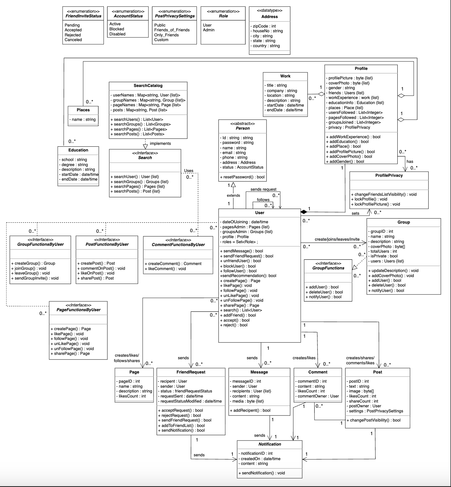

# Design Patterns

We apply object-oriented design patterns based on system behavior to implement Facebook’s core features flexibly and scalably.

- **Observer Pattern**  
  Facebook notifies users of new posts, comments, or messages. The Observer pattern is used to model this notification behavior.  
- **Strategy Pattern**  
  Facebook allows users to choose different privacy settings for posts and profiles. The Strategy pattern is used to handle interchangeable privacy algorithms.  
- **Factory Method Pattern**  
  Facebook sends different types of notifications. The Factory Method pattern allows flexible creation of various notification types.  
- **Singleton Pattern**  
  Facebook uses a global search feature. The Singleton pattern ensures a single shared search service across the application.  
- **Interface Segregation Principle**  
  Facebook users interact with many features such as posts, groups, and pages. This principle keeps interfaces focused and separates responsibilities.  
- **State Pattern**  
  Facebook handles status changes in friend requests and user accounts. The State pattern manages state-specific behavior cleanly.  

## Additional requirements
The interviewer can introduce some additional requirements in the Facebook social network system, or they can ask some follow-up questions. Let’s see some examples of additional requirements:

`Recommendations`: Users can send `recommendations` of pages and groups to other users. The class diagram provided below shows the relationship of Recommendation with the other classes:

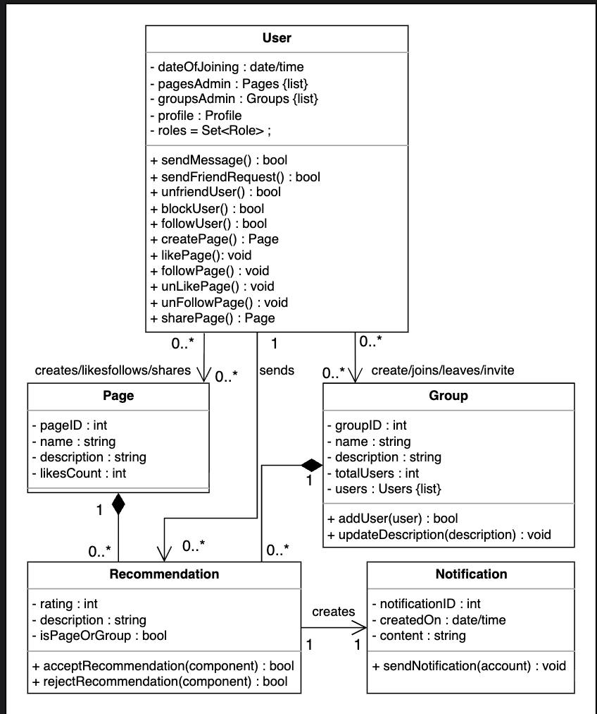