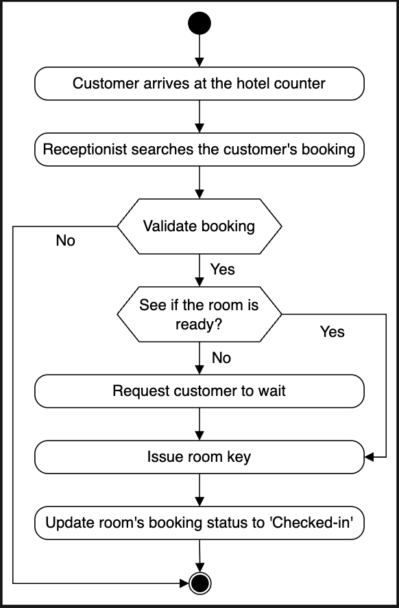
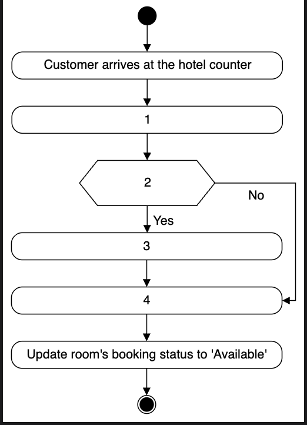
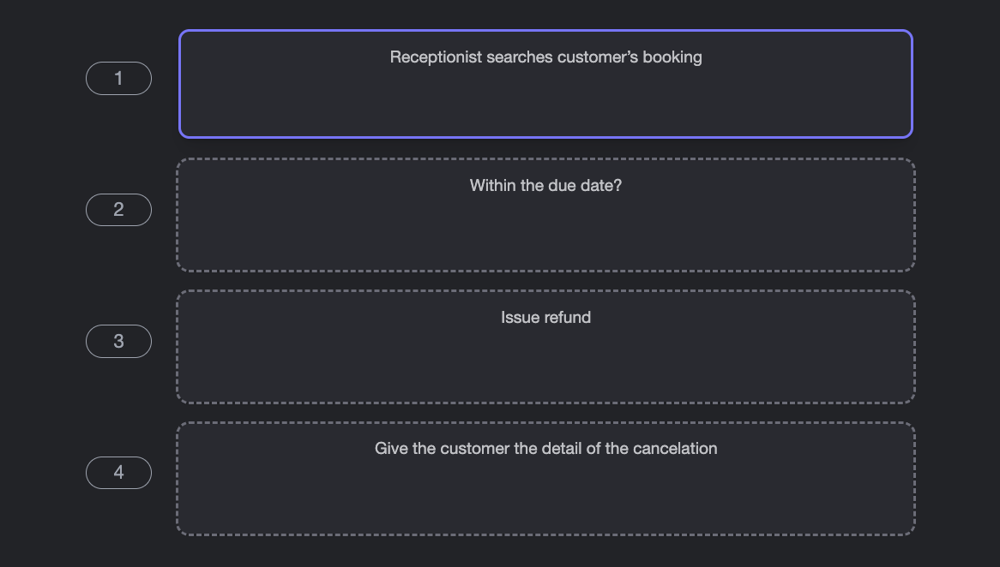

# Activity Diagram for the Hotel Management System

Create some activity diagrams for the hotel management system problem.

Activity diagrams are a great way to visualize the flow of messages from one activity to another in the system. There can be different activity diagrams that we can create for our hotel management system. In this lesson, we'll create activity diagrams for the following two activities:

* Hotel check-in.
* Activity challenge: Cancel a room booking.

## Hotel check-in  
The following are the states and actions that will be involved in this activity diagram.

### States  
**Initial state:** A guest with a room booking comes to the hotel reception for check-in.  
**Final state:** The guest successfully checked in at the hotel.

### Actions  
The guest has a room booked and arrives at the hotel reception. The receptionist validates the booking and checks if the room is ready. The receptionist then issues room keys and updates the room status.

Based on the order above, the activity diagram of the hotel check-in is shown below.

## Activity challenge: Cancel a room booking
You’ll help us create an activity diagram of a customer who wants to cancel their room booking.

A skeleton of the activity diagram is given below, provided that a guest will cancel the room booking from the hotel.

Notice that the actions in the diagram above are numbered from 1 to 4. The slots below represent the activities, and the arrows represent the flow from one activity to another. Can you rearrange the slots below in the correct order they should appear in the activity diagram above?

