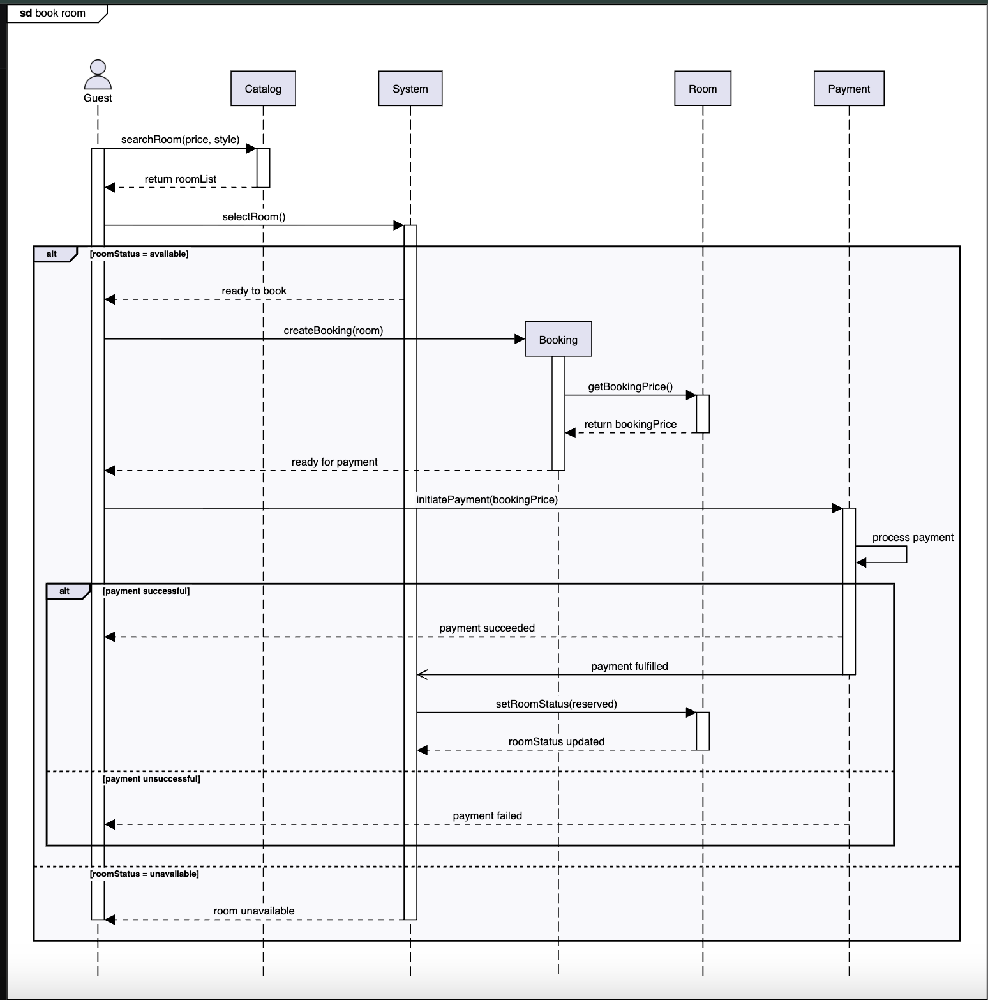
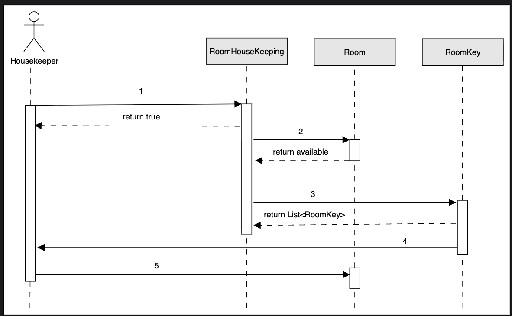
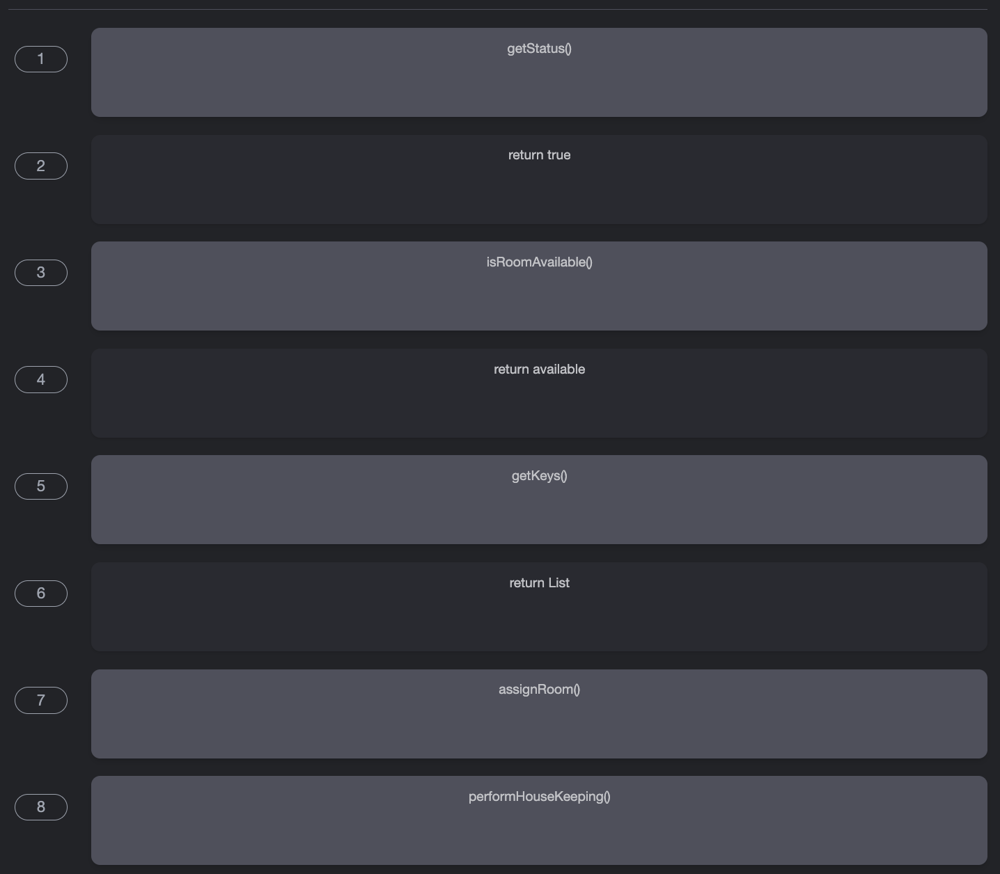

# Sequence Diagram for the Hotel Management System  
Create a sequence diagram for online room booking in the hotel management system and solve a challenge.

Sequence diagrams are a great way to understand the interactions between different entities and objects in the system. There can be different sequence diagrams that we can create for our hotel management system. In this lesson, we will create sequence diagrams for the following two interactions:

* Book a room: The guest books a hotel room online.
* Sequence challenge: The guest checks out of their room at the reception.

## Book a room  
The sequence diagram for the room booking should have the following actors and objects that will interact with each other:

* Actor: `Guest`
* Objects: `Catalog`, `Booking`, `Room`, and `Payment`
* System

Here are the steps in the book room interaction:

1. The guest searches for a room based on price and style.
2. The catalog returns a list of rooms.
3. The guest selects a room they wish to book.
4. If the room is available:
   1. The guest creates a booking for the room.
   2. The booking fetches the booking price for the room.
   3. The guest is informed that the booking is ready for payment.
   4. The guest initiates a payment against the booking price.
   5. The payment is processed, and the guest is informed of the status.
   6. If the payment is successful:
      1. The guest is informed that the payment has succeeded.
      2. The system is informed that payment is complete.
      3. The system updates the room status to reserved.
   7. Else if the payment is unsuccessful:
      1. The guest is informed that the payment has failed.
5. Else if the room is unavailable:
   1. The system informs the guest that the room is unavailable.

Based on the order above, the sequence diagram of booking a room in a hotel management system is given below:

## Sequence challenge: The housekeeper performs maintenance in a room  
You will help us complete a sequence diagram for the housekeeper who performs maintenance in a room.

A skeleton of the sequence diagram is provided below.  

Notice that the arrows in the diagram above are numbered from 1 to 5. Below are the messages between the actor(s) and object(s). Can you rearrange the messages below in the correct order sequence they should appear in the skeleton of the sequence diagram above?

