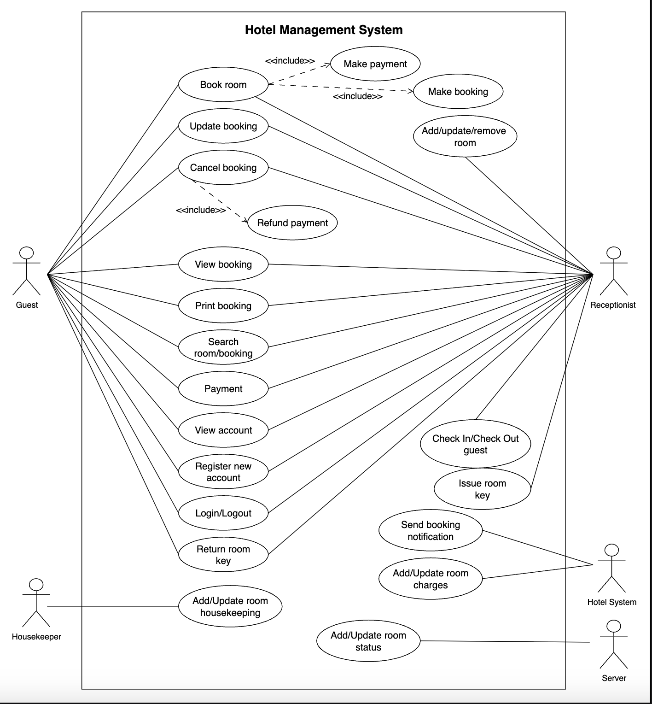

# Use Case Diagram for the Hotel Management System

Learn how to define use cases and create the corresponding use case diagram for the hotel management system.  
Let's build the use case diagram for the hotel management system and understand the relationship between its different components.  
First, we'll define the different elements of our hotel, followed by the complete use case diagram of the system.

## System  
Our system is a hotel management system.

## Actors  
Now, we will define the main actors of our hotel management system.

### Primary actors

**Guest:** This is the hotel's primary actor who can book a room, make a payment, and change or cancel the reservations.  
**Receptionist:** This actor acts as the system's admin and can perform any task a "Guest" can perform. It can also add, remove, or update the room, check in/check out guests, and issue room keys for guests.  
**Housekeeper:** This can add or update the room's maintenance status.

### Secondary actors  
**System:** This can send booking notifications to guests.  
**Server:** This can add or update the room status according to the room change request.

## Use cases

In this section, we will define the hotel's use cases. We have listed the use cases according to their interactions with a particular actor.  
Note: Some use cases will occur multiple times because they are shared among different actors in the system.

### Guest

**Book room:** To book a room in the hotel.  
**Update booking:** To update a room booking in the hotel.  
**Login/Logout:** To log in and out of the hotel management system.  
**Cancel booking:** To cancel a room booking in the hotel.  
**View booking:** To view and verify a room booking.  
**Print booking:** To print booking details from the hotel management system.  
**Search room/booking:** To search for a room or a booking in the hotel management system.  
**Payment:** To pay the room rent to the hotel.  
**View account:** To view account details and booking status.  
**Register new account:** To register a new account for new guests.  
**Return room key:** To return the room key before checkout.

### Receptionist  
**Add room:** To add rooms to the hotel management system so guests can book them.  
**Update room:** To update the room status from available to booked or vice versa.  
**Remove room:** To remove a room from the hotel management system so guests can't book it.  
**Book room:** To book a room in the hotel.  
**Update booking:** To update a room booking in the hotel.  
**Login/Logout:** To log in and out of the hotel management system.  
**Cancel booking:** To cancel a room booking in the hotel.  
**View booking:** To view and verify a room booking.  
**Print booking:** To print booking details from the hotel management system.  
**Search room/booking:** To search for a room or a booking in the hotel management system.  
**View account:** To view account details and booking status.  
**Register new account:** To register a new account for new guests.  
**Check in guest:** To check in guests at the hotel.  
**Check out guest:** To check out guests from the hotel.  
**Issue room key:** To issue room keys to guests who have checked in.  

### Hotel system  
**Add/update room charge:** To update the status of the room charge.  
**Send booking notification:** To send a booking notification to guests.

### Housekeeper  
**Add/update room maintenance:** To update the maintenance status of rooms.

## Relationships  
This section describes the relationships between and among actors and their use cases.

### Associations

The table below shows the association relationship between actors and their use cases.

| Guest | Receptionist | System | Housekeeper |
|-------|--------------|--------|-------------|
| Book room | Book room | Send booking notification | Add/update room maintenance |
| Payment | View account | Add/update room charge | |
| View account | Register new account | | |
| Register new account | Print booking | | |
| Print booking | Cancel booking | | |
| Cancel booking | Login/Logout | | |
| Login/Logout | Check in guest | | |
| Search room/booking | Issue room key | | |
| Update booking | Search room/booking | | |
| Return room key | Update booking | | |
| View booking | Check out guest | | |
| | View booking | | |
| | Add room | | |
| | Remove room | | |
| | Update room | | |

### Include

When a guest books a room, the payment will be processed.  
* The "Book room" use case includes the "Payment" use case.  
When a receptionist checks in a guest, a key is issued to the guest.  
* The "Check in guest" use case includes the "Issue room key" use case.  
When a guest checks out, the key is returned to the receptionist.  
* The "Check out guest" use case includes the "Return room key" use case.  
If a booking is canceled, the payment will be refunded.  
* The "Cancel booking" use case includes the "Refund payment" use case.

## Use case diagram

Here's the use case diagram of the hotel management system:
