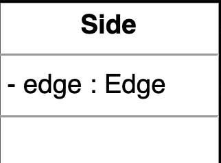
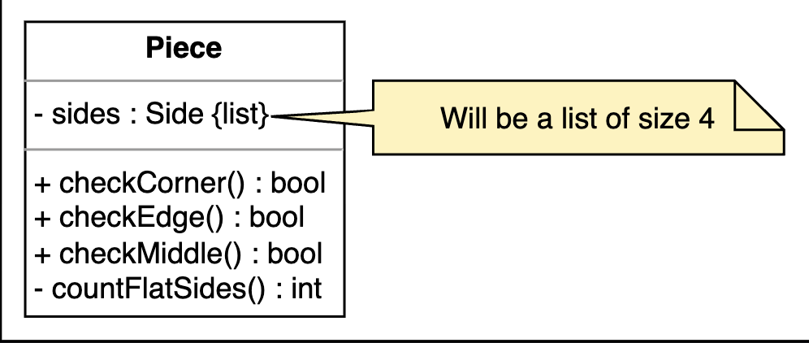
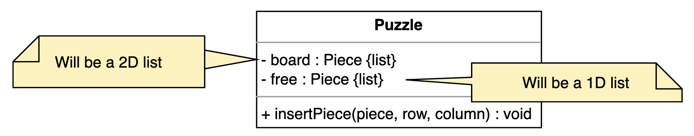
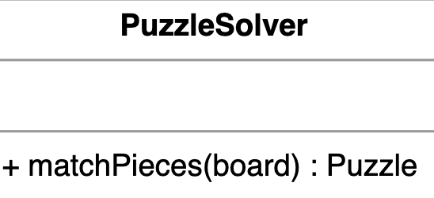
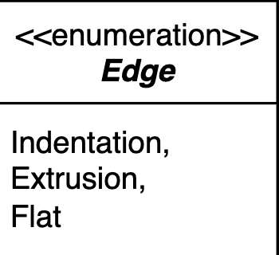
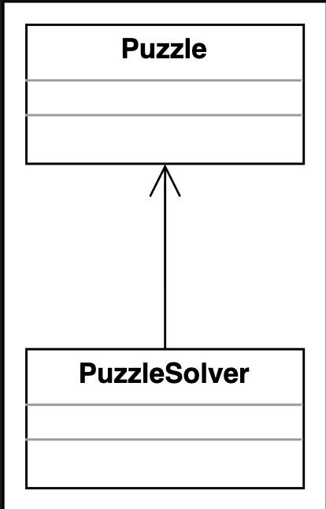
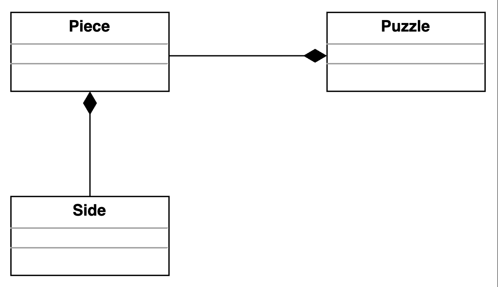
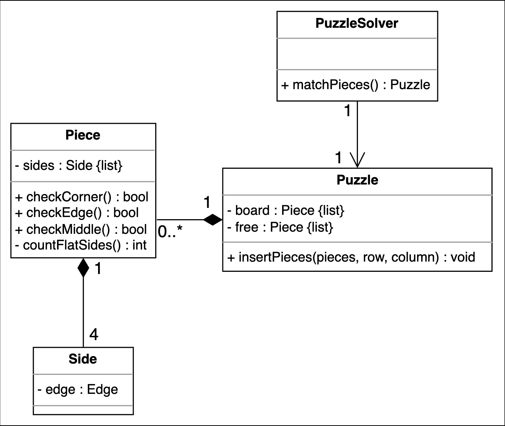
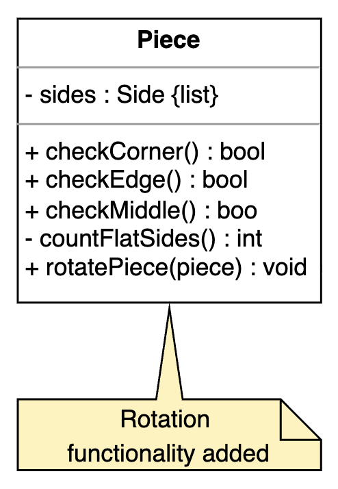

# Class Diagram for the Jigsaw Puzzle
Learn to create a class diagram for the jigsaw puzzle using the bottom-up approach.

In this lesson, we’ll identify and design the classes, abstract classes, and interfaces based on the requirements we previously gathered from the interviewer in our jigsaw puzzle.

## Components of a jigsaw puzzle
As mentioned, we should design the jigsaw puzzle using a bottom-up approach.

### Side
The `Side` class represents the shape of our jigsaw piece and whether it contains an indentation, extrusion, or flat edge. The UML representation of the class is shown below:

<strong>Click to view related requirements</strong>

**R2:** All pieces will have four sides with an indentation, an extrusion, or a flat edge.

### Piece
The `Piece` class contains an array of sides of size four. It will also identify middle, corner, and edge pieces. The class representation of the `Piece` class is provided below:

<strong>Click to view related requirements</strong>

**R2:** All pieces will have four sides with an indentation, an extrusion, or a flat edge.  
**R2:** There are four corner pieces, some edge pieces, and the remaining ones are middle pieces. A corner piece has two flat sides, an edge piece only has one flat side, and a middle piece has no flat edges.

### Puzzle
The `Puzzle` class represents the board of our jigsaw game. As our board is a rectangle, it will be represented by a 2D array. There will also be a 1D array to represent the unused free pieces yet to be inserted into the puzzle board. It will also have the `insertPiece()` function to insert the piece into the board, ensuring that it is unique from its counterparts and only in the specified row and column.

> **Note**: The puzzle board does not yet have the functionality of rotating pieces, so all pieces must be unique to fit into the board and solve the puzzle.

<strong>Click to view related requirements</strong>

**R1:** Our board will be shaped like a rectangle.  
**R4:** All pieces will be unique, so only one piece will fit with only one other piece.

### Puzzle solver
The `PuzzleSolver` class is responsible for solving an unsolved jigsaw puzzle board using its `matchPieces()` function. The visual representation of this class is given below:

<strong>Click to view related requirements</strong>

**R5:** Two pieces fit together by the curvature of the indentation on one piece matching up to the curvature of the extrusion on another.  

### dge enumeration
The `Edge` enum describes the various edges present in a jigsaw puzzle piece. 

## Relationship between the classes
Now, we’ll discuss the relationships between the classes we have defined above in our jigsaw puzzle.

### Association
The class diagram has the following association relationships:

- The `Puzzle` has a one-way association with `PuzzleSolver`.

### Composition
The class diagram has the following composition relationships:

The `Puzzle` class is composed of the `Piece` class, which is composed of the `Side` class.

## Class diagram for the jigsaw puzzle
Here’s the complete class diagram for our jigsaw puzzle:

## Design pattern
The jigsaw puzzle has only one instance of the puzzle board. Therefore, we use the Singleton design pattern to ensure that only one instance of the board is created using a special creation method, and this instance has a global point of access.

## Additional requirements
The interviewer can introduce some additional requirements in the jigsaw puzzle, or they can ask some follow-up questions.  Let’s see some examples of additional requirements:  

**Rotate piece**: Pieces can be rotated to fit on the puzzle. The class diagram provided below shows the added functionality of rotation in the `Piece` class:  

 