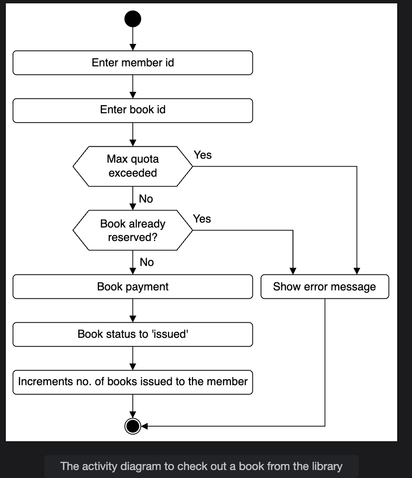
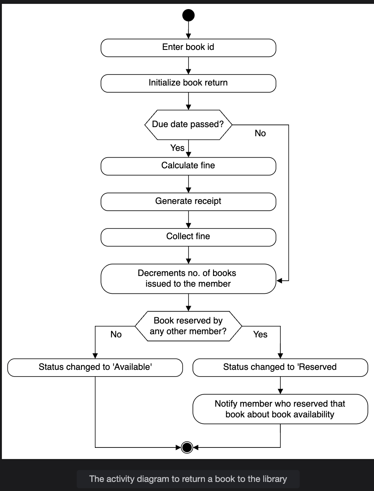
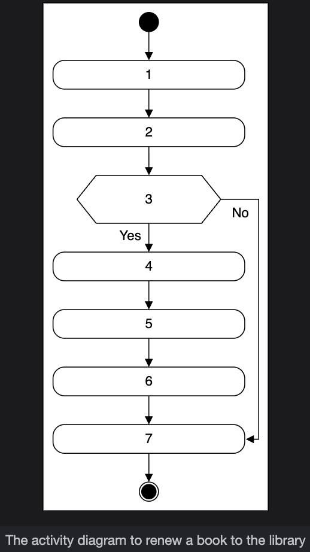
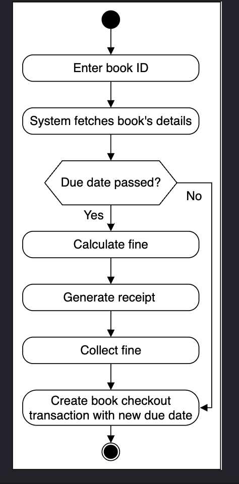

# Activity Diagram for the Library Management System

Create some activity diagrams for the library management system problem.

Activity diagrams are a great way to visualize the flow of messages from one activity to another in the system. There can be different activity diagrams that we can create for our LMS. In this lesson, we will create activity diagrams for the following three activities:

* Check out a book from the library.
* Return a book to the library.
* Activity challenge: Renew a book from the library.

---

## Check out a book from the library

The following are the states and actions involved in this activity diagram.

### States

**Initial state:** The member selects a book and initiates checkout.

**Final state:** There are two final states present in this activity diagram, shown below:

* The member completes the checkout process successfully, and the book will be allocated to the member.
* An error occurred during the checkout process due to book unavailability, or the book limit was exceeded.

### Actions

The member selects a book and enters the ID. The system performs a few checks, such as book availability, the member's maximum limit, and book reservations. If all checks are clear, the book will be issued. Otherwise, the system will show an error message.

The activity diagram of a library book checkout is given below based on the order shown above.

## Return a book to the library
The following are the states and actions involved in this activity diagram.

## States
**Initial state:** The member returns a book back to the library.

**Final state:** There are two final states present in this activity diagram, shown below:

* The member completes the return process and pays a fine, if any.  
* The system allocates a book to someone who reserved that book.  

## Actions
The member enters the book ID. The system will check if the book is returned within the due date, and the member will pay a fine, if any. Then, the book will be allocated to someone who has reserved the book.

Based on the order above, the activity diagram below demonstrates returning a book to the library.  

## Activity challenge: Renew a book from the library
You will create an activity diagram of a member renewing a book from the library.

The skeleton of the activity diagram given below demonstrates a customer looking for book renewal from the library.

Notice that the actions in the above diagram are numbered from 1 to 7. The slots shown below represent the activities, and the arrows represent the flow from one activity to the other. Can you rearrange the slots provided below in the correct order they should appear in the activity diagram given above?

Based on the description above, can you fill in the missing slots with the correct sequence of actions in the activity diagram?

in depth(Activity Diagram), <a href="./deapth/Activitydia.md">click here</a>