# Class Diagram for the Library Management System

Understand how to create a class diagram for a library management system by using the bottom-up approach.

Here, we'll create the class diagram for our system based on the requirements that we gathered previously. In the class diagram, we will first design/create the classes, abstract classes, and interfaces for the system, and then we'll identify the relationship between classes in accordance with all requirements of the library management system.

---

## Components of a library management system

In this section, we will define the classes for LMS. As we are following the bottom-up approach for designing a class diagram, we'll first create the classes of small components. After that, we will integrate those components and create the class diagram for the whole library management system.

---

## Book and book item

The `Book` class represents the conceptual essence of a book. This includes metadata or descriptive information about a book that isn't specific to any single physical copy. It serves as a blueprint that captures the shared attributes of all instances or copies of the book, whether they exist in the world or within the library's collection.

The `BookItem` class, in contrast, represents a specific physical or digital instance of a `Book` in the library's collection. Rather than extending the `Book`, it has a composition relationship with it, meaning each `BookItem` is tightly associated with a `Book`. If a `Book` is deleted, all corresponding `BookItem` instances must also be deleted. The `BookItem` class handles the properties and behaviors associated with individual copies that patrons can borrow, reserve, or reference within the library. Each `BookItem` has unique attributes to manage and track its status within the library system. The UML representation of `Book` and `BookItem` is shown in the class diagram below:

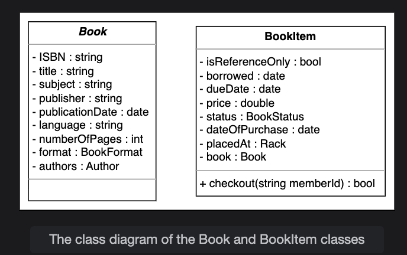

<strong>Click to view related requirements</strong>

**R3:** Every book should have an associated ISBN, title, author name, subject, and publication date.  
**R4:** There can be multiple copies of the book. Each copy will be recognized as a book item.

## Rack 
We have seen a complex object `Rack` that was defined in the `BookItem` class. Now, we are going to create a `Rack` class. This class is used to identify the physical location of any book item in the library. Every rack has a specific rack number assigned to it and a location identifier to represent the exact location of the book item in the library. The visual representation of the class is as follows:

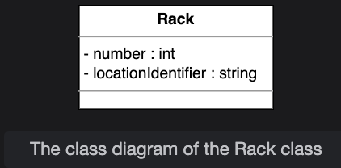

<strong>Click to view related requirements</strong>

**R2:** Every book is supposed to have a unique identification number and other details including a rack number to help locate the book physically.

## Person and author 
The `Person` class is used to store information related to a person like a name, email, phone number, etc. In the person class, there is an object of the `Address` class to specify the person’s address.

There is also a class named `Author` that stores the author’s data like the author name and description. The author’s information is also used in the `Book` class.

The representation of both classes is as follows:

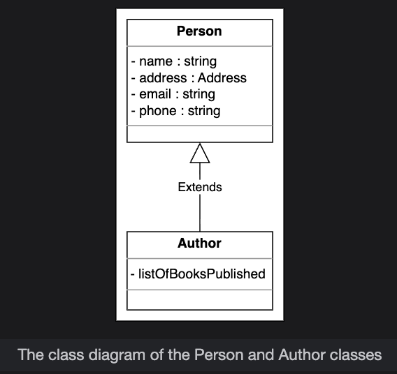 

## User, librarian, and library member 
`User` is an abstract class that represents the system users of LMS. There can be two types of users: librarians and library members.

The `Librarian` class is a derived class of the `User` class. This class is responsible for adding a new book item and blocking or unblocking any library member.

Similar to the `Librarian` class, the `Member` class also extends the `User` class. The variable `totalBooksCheckedout` is used to store the number of books a certain member has already checked out. A member can reserve a book, return a book, or renew an already reserved book.

Since the `Librarian` and `Member` classes extend the `User` class, their class diagram representation would be as follows:

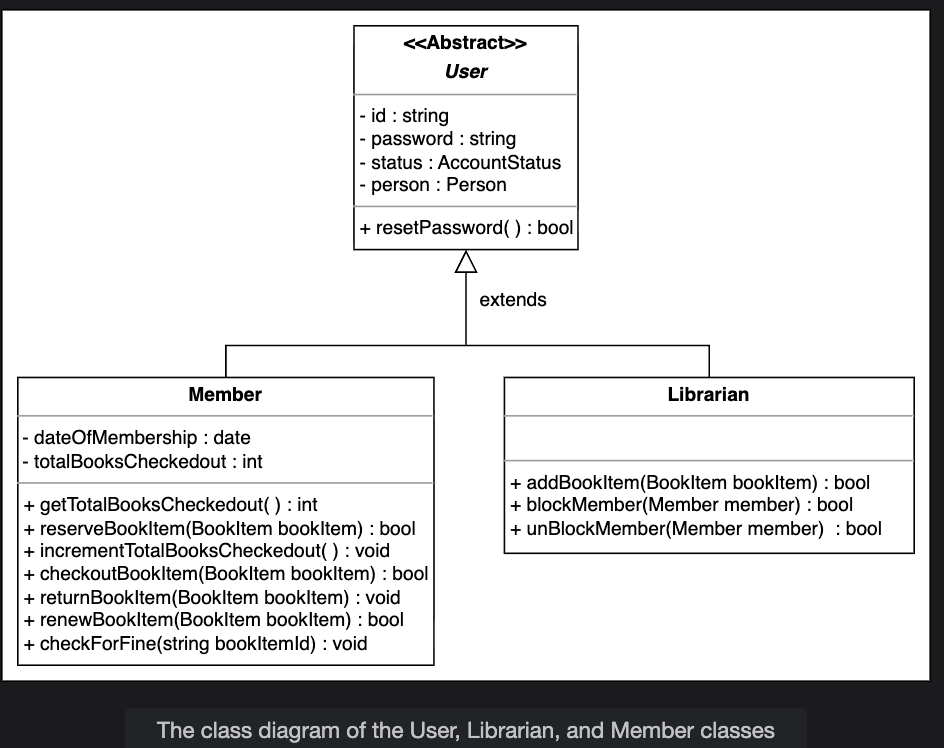

<strong>Click to view related requirements</strong>

**R5:** There can be two types of users: the librarian and the members.  
**R11:** The system should allow the user to renew the reserved book.

## Library card
To manage each user’s library card information, we have a `LibraryCard` class. Each library card has an identification number, issue date, and information on whether or not it is active. The class representation of the `LibraryCard` class is as follows:  

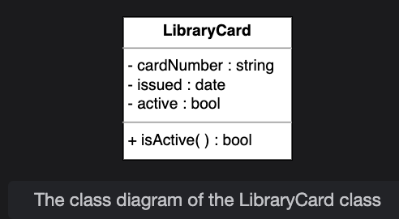

<strong>Click to view related requirements</strong>

**R6:** Every user must have a library card with a unique card number.

## Book reservation
Book reservation is one of the most important requirements of the library management system. To fulfill this functionality, we have a class named `BookReservation`. This class is responsible for managing the book reservation status of the book items.

The UML representation of the class is shown below:
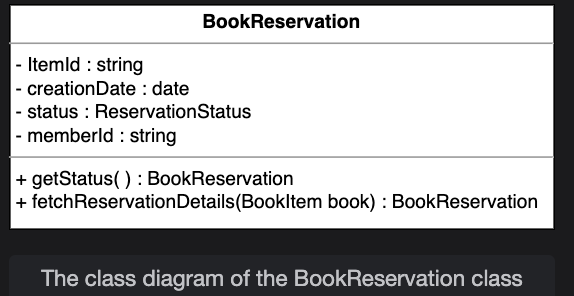

<strong>Click to view related requirements</strong>

**R10:** The system should be able to keep a record of who issued or reserved a particular book and on which date. 

## Book lending
Similar to book reservations, book lending is also a part of the system since the `BookLending` class manages the process of checking out the book items. The information like the book lending date, due date, return date, etc. is being handled or processed in this class.

Here is what the class definition looks like:

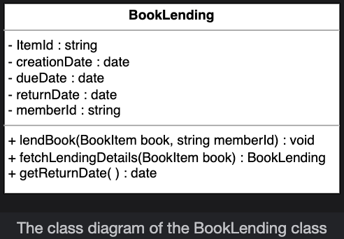

## Notification
`Notification` is an abstract class. If the book is not returned within the due date, then the class notification is responsible for informing library members by sending a notification. Every notification has an ID, creation date, and content in it. The notification can be either a postal notification or an email notification.

The `PostalNotification` class requires the address of the library member to send a notification while `EmailNotification` needs the email address of the library member to send a notification.

The relationship diagram of these classes is shown below:

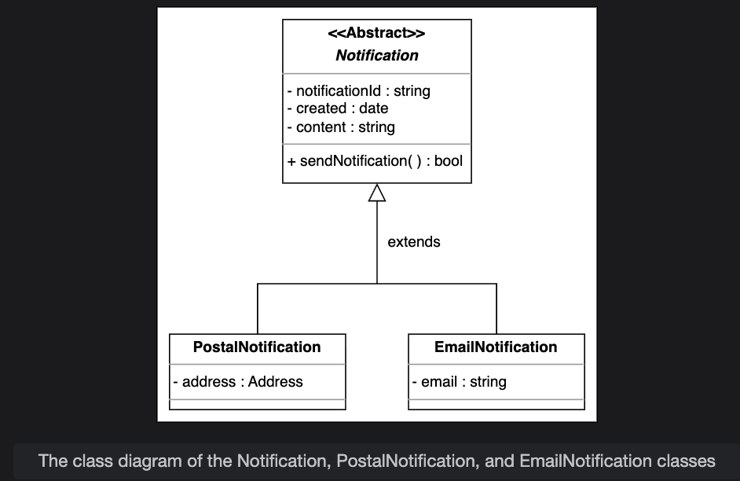

<strong>Click to view related requirements</strong>

**R12:** The system should send a notification if the book is not returned within the due date.

## Search and Catalog

Search is one of the most important functionalities of the system. `Search` is the interface that allows the user to search for any book and return the list of books upon searching by any of the following methods:

* Search a book by its title.
* Search a book by its author name.
* Search a book by its subject.
* Search a book by its publication date.

`Catalog` is a class where the search functionality is implemented. In each catalog, the books are sorted according to one of the given search techniques, i.e., on the basis of the book's title, author, subject, or publication date.

The following UML diagram shows this relationship:

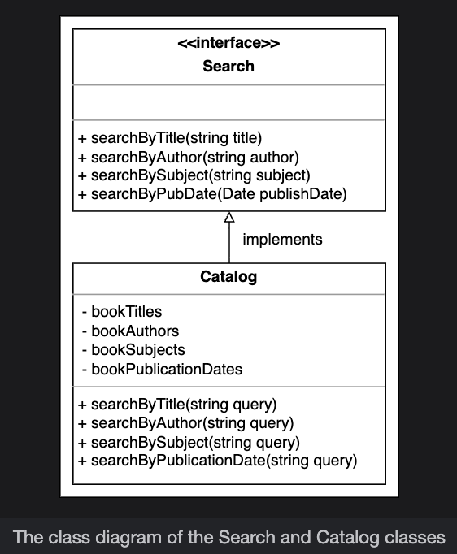

<strong>Click to view related requirements</strong>

**R14:** The system should allow the user to search a book by its title, author name, subject, or publication date.

## Library
The `Library` class is the base class of the system which is used to represent the library. It is a central part of the organization. This class consists of two members: `name` and `Address`. The string type name is used to store the name of the library, while the complex object Address is to store the complete `address` location of the library. The UML representation of the `Library` class is as follows:

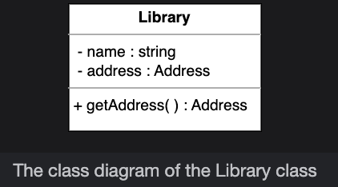

## Enumerations
Enumeration is generally a data type in which only a specific set of constants can be stored. The following is a list of enumerations required in LMS:

`BookFormat`: This describes that a book can only be of one of the specified formats. It can be a hardcover, paperback, audiobook, e-book, newspaper, magazine, or journal.

`BookStatus`: The book status describes the status of the particular book item for the user, whether it is available, reserved, loaned, or lost.

`ReservationStatus`: This tells about the reservation state of any book item, whether it is in a waiting state, pending state, canceled state, or none of them.

`AccountStatus`: The account status tells about the user account status, whether it is active, closed, canceled, blacklisted, or none.

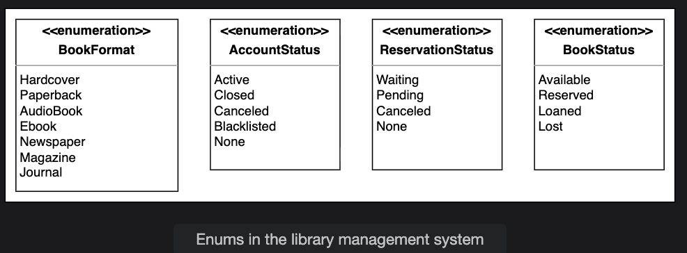

## Custom data type
The `Address` is a custom data type, that will store the address of a library and the library users.

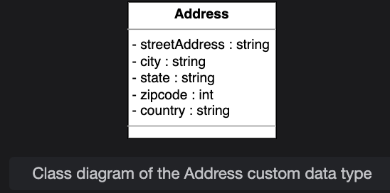 

## Relationship between the classes
Now, we are going to discuss the relationships between the classes we have defined above in our library management system.

## Association
The class diagram has the following association relationships:

## One-way association
* The `User` has a one-way association with `BookItem` and `BookReservation`.  
* Both `BookReservation` and `BookLending` have a one-way association with the `BookItem`.

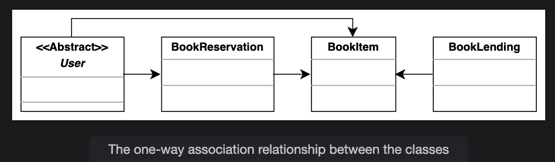 

## Two-way association
* `Author` has a two-way association with `Book`.    
* Both `Rack` and `Librarian` have a two-way association with `BookItem`.    
* The `Notification` has a two-way association with `BookLending` and `BookReservation`.    
* The `BookLending` has a two-way association with `BookReservation` and `User`.  

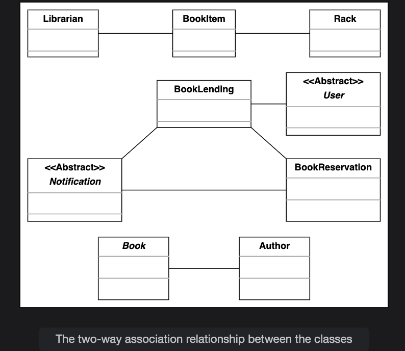

## Composition
* `Library` is composed of `BookItem`.  
* `User` is composed of `LibraryCard`.  
* `Book` is composed of `BookItem`.    

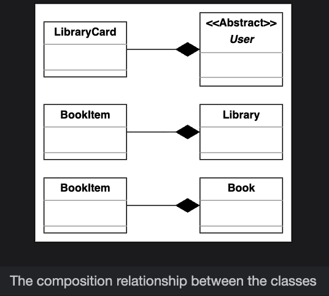

## Aggregation
* The Catalog class contains the Book class.  

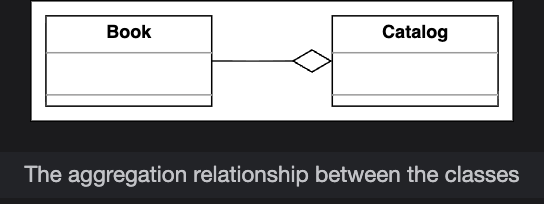

## Inheritance
The following classes show an inheritance relationship:   

* Both `Librarian` and `Member` classes extend the `User` class.  
* Both `EmailNotification` and `PostalNotification` classes extend the `Notification` class.  
* The `Catalog` class implements the `Search` interface.   

> **Note:** We have already discussed the inheritance relationship between classes in the component section above one by one  

## Class Diagram of the Library Management System

In this section, we outline the multiplicity (cardinality) relationships between the main classes in our Library Management system. For each relationship, we explain the allowed number of instances on each side and the real-world or design rationale behind the connection. Understanding these relationships is key to modeling how different entities interact and collaborate to support key workflows in the system.

| Source | Target | Multiplicity | Reason |
| :-- | :-- | :-- | :-- |
| Library | BookItem | 1 -- 1..* | A library must have at least one book item, and can have many. |
| Rack | BookItem | 1 -- 0..* | Each rack may have zero or many book items. |
| Book | BookItem | 1 -- 1..* | Each book item is a copy of exactly one book. |
| Book | Author | 1..* -- 1..* | Every book has at least one author (possibly more). Similarly, every author can write many books. |
| User | LibraryCard | 1 -- 1 | Each user has one library card. |
| User | BookLending | 1 -- 0..* | A user can have zero or more lending records. |
| BookReservation | BookItem | 1 -- 0..1 | Each reservation is for one specific book item. |
| Catalog | Book | 1 -- 1..* | A catalog contains one or more books for searching. |
| Person | Author | 1 -- 1..* | Every author is a person (inheritance: one person can be multiple author roles if modeled). |

Here is the complete class diagram for our library management system.

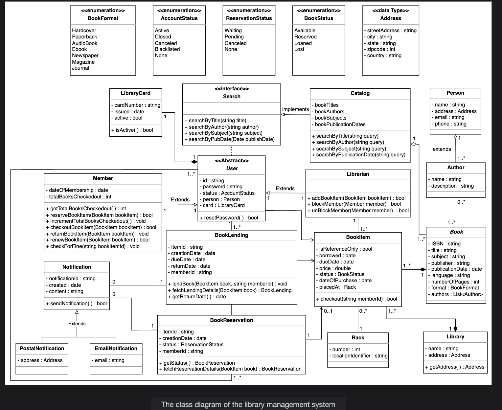

## Design pattern
In our Library Management System, several well-known object-oriented design patterns are used to ensure the system remains extensible, maintainable, and robust:

* **Factory pattern:** We use the Factory pattern to create key domain objects such as Book, BookItem, Member, and Librarian in a consistent and controlled manner. For example, a BookFactory class can encapsulate the logic for creating books with all required metadata and validations. This approach centralizes creation logic, prevents inconsistent state, and supports future extensions such as special editions or new formats.

* **Delegation pattern:** The Delegation pattern helps distribute responsibilities across collaborating classes. For instance, while the Librarian class initiates actions like adding or removing book items, the actual details (such as updating inventory or status) are delegated to the BookItem class. This means Librarian orchestrates, but each BookItem manages its own data and behavior, promoting separation of concerns.

* **Observer pattern:** The Observer pattern is applied for notification workflows. Members who reserve or are interested in a specific book can be registered as observers. When the status of a BookItem changes (for example, a reserved or unavailable book becomes available), the system automatically notifies all relevant observers (e.g., via email or postal notification). This ensures real-time, event-driven communication and a responsive user experience.

These patterns work together to address system complexity, encourage reuse, and make it easier to maintain and extend the system in the future. Later sections and code examples will highlight where these patterns are implemented within the class structure. 

## Additional requirements
The interviewer can introduce some additional requirements in LMS, or they can ask some follow-up questions. Let’s see an example of additional requirements:

**Barcode reader:** Each member should have a unique barcode on their library card, and each book should also have a distinct barcode associated with it, and the system should be able to scan the barcode of every book and member. To fulfill this requirement, we have the class diagram shown below:  

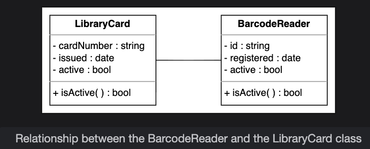

**FineTransaction:** As there is a fine for not returning the book within the time limit, there should exist some mechanism to pay the fine. There are three ways to pay the fine: check, cash, or credit card.  

The fine payment functionality follows the **Decorator pattern** as the fine keeps on adding upon the increased number of days. The class diagram provided below shows the relationship of `FineTransaction` with the `Fine` class:  

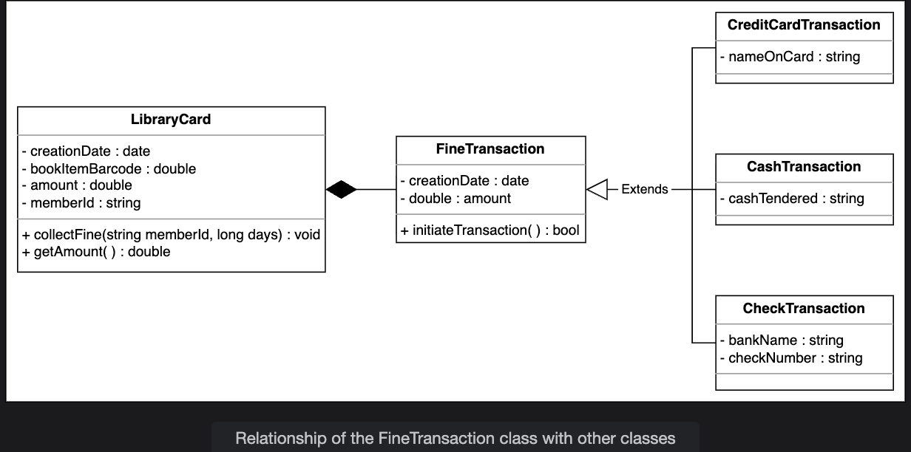 

### Question 1

**Let's say that the interviewer asks you what would happen if two or more members try to reserve the same book item. Which member will get the book?**

<strong>Click to view answer</strong>

If two or more members try to reserve the book item at the same time, the process will be executed on a **first come, first serve (FCFS)** basis. For example, the member who comes first gets the book reserved. If two members come at the same time, the system will check which member has the fewest number of checked-out books through `totalBooksCheckedOut` and reserve the book item for that particular member.

If both members have already reached the maximum number of checkouts, no one can reserve a book.

**Note:** The member would be able to reserve a book that is currently not available so that they get this book first whenever it becomes available.

  

in depth(Multiplicity), <a href="./deapth/Multiplicity.md">click here</a>

If you want to understand more in depth, <a href="./deapth/classdiagram.md">click here</a>
