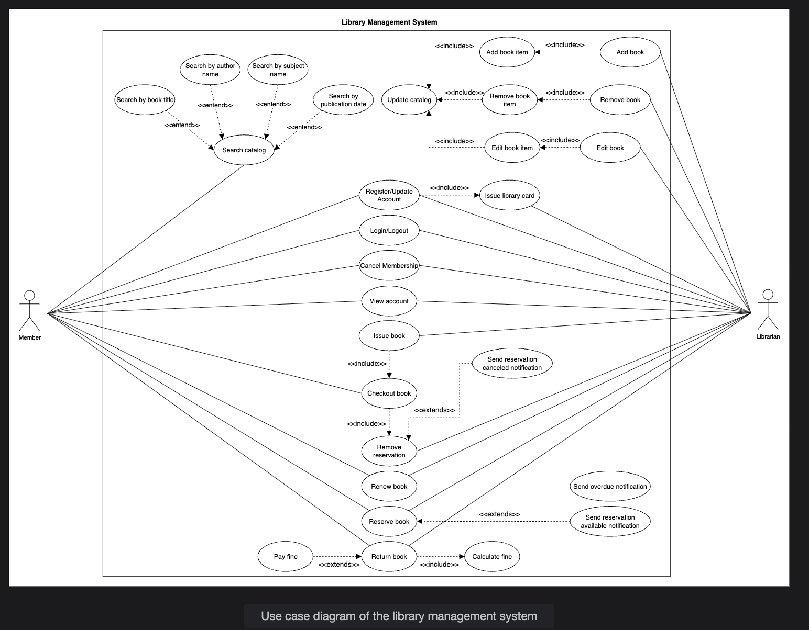

# Use Case Diagram for the Library Management System

Learn how to define use cases and create the corresponding use case diagram for the library management system.

Let's build the use case diagram for the library management system and understand the relationships between its main actors, system functions, and user interactions. First, we will define the different elements of our library, followed by the complete use case diagram of the system.

---

## System

Our system is the **Library Management system**. It manages the library's catalog, member accounts, book transactions, and notifications.

---

## Actors

Next, we will define the main actors of our library management system.

### Primary actors

**Member:** A library member who can search, reserve, borrow, renew, or return books, pay fines, and request membership cancellation.

**Librarian:** The administrator responsible for managing books and book items, issuing and returning books, handling reservations, managing member accounts, and overseeing fines.

### Secondary actors

**System:** It can send alerts related to reservations and late returns of books.

---

## Use cases

In this section, we will define the library's use cases. We have listed the use cases according to their respective interactions with a particular actor.

**Note:** Some use cases will occur multiple times because they are shared among different actors in the system.

### Member

- **Login/Logout:** To securely access or exit their member account and access library services.
- **Register/Update account:** To create a new membership account or update personal and contact information.
- **Cancel membership:** To voluntarily request termination of their library membership.
- **View account:** To review their own account details, borrowing history, current checkouts, reservations, and fines.
- **Search catalog:** Search the library catalog for books or resources by title, author, subject, or publication date.
- **Reserve book:** To place a hold on a book that is currently checked out, ensuring it can be borrowed when it becomes available.
- **Checkout book:** To complete the process of borrowing a book, either directly or following a successful reservation.
- **Renew book:** To request an extension for the borrowing period of a currently issued book.
- **Return book:** To return a borrowed book to the library, update the system, and potentially make it available for other members.
- **Remove reservation:** To cancel a previously placed hold on a book.
- **Pay fine:** To settle any outstanding fines incurred due to overdue book returns or other violations, allowing the member to maintain good standing.

### Librarian

- **Login/Logout:** To securely access or exit the librarian account and manage system resources.
- **Register/Update account:** This allows you to register a new library member by collecting and saving their details in the system, or modify a member's personal details or membership status.
- **Cancel membership:** To terminate the library membership of a member and deactivate their account.
- **View account:** To access and review the account details and history of a library member.
- **Issue library card:** During registration, create and assign a unique library card to a new member, enabling them to borrow books and access other library services.
- **Add book:** To add a new book entry to the library's catalog, including essential metadata such as author and ISBN etc.
- **Edit book:** To update the information of an existing book in the library catalog.
- **Remove book:** To delete a book record from the library catalog, typically if it is no longer part of the library's collection.
- **Add book item:** This is to add a physical copy of a book to the library's inventory (e.g., when purchasing additional copies).
- **Edit book item:** This allows you to update the details (such as rack location) of a specific physical copy of a book.
- **Remove book item:** To delete a specific copy of a book from the inventory.
- **Issue book:** To lend a book item to a library member, recording the issuance in the system.
- **Renew book:** To extend the borrowing period for a book that has already been issued to a member, as per library policy.
- **Update catalog:** To comprehensively manage the library catalog by adding, editing, or removing books or book items.
- **Remove reservation:** To cancel a member's reservation for a book, making the book available to others.

### Library management system

- **Calculate fine:** This function automatically determines the fine amount for overdue books based on the return date and the library's fine policy.
- **Send overdue notification:** To send alerts to members when the return due date for a borrowed book has passed, prompting action.
- **Send reservation available notification:** To inform members when a previously reserved book becomes available for borrowing or checkout.
- **Send reservation canceled notification:** To notify members when their reservation for a book has been canceled.

---

## Relationships

This section describes the relationships between and among actors and their use cases.

### Generalization

**Search catalog** is a generalized use case. Members can search by different attributes. Specialized use cases include:

- Search by title
- Search by author
- Search by subject
- Search by publication date

This means that "Search catalog" generalizes the more specific search methods.

### Associations

The table below shows the association relationship between actors and their use cases.

| Librarian | Member | Library Management System |
|-----------|--------|---------------------------|
| Login/Logout | Login/Logout | Calculate fine |
| Register/Update account | Register/Update account | Send overdue notification |
| Cancel membership | Cancel membership | Send reservation available notification |
| View account | View account | Send reservation canceled notification |
| Issue library card | Search catalog | |
| Add book | Reserve book | |
| Edit book | Checkout book | |
| Remove book | Renew book | |
| Add book item | Return book | |
| Edit book item | Remove reservation | |
| Remove book item | Pay fine | |
| Issue book | | |
| Renew book | | |
| Update catalog | | |
| Remove reservation | | |

### Include

When a librarian adds, edits, or removes a book from the catalog, they must also manage the associated book items (physical copies). These steps are best represented using "include" relationships in a use case diagram:

- **Add book**, **Edit book**, and **Remove book** use cases all include the **Add book item**, **Edit book item**, and **Remove book item** use cases, respectively.
- **Add book item**, **Edit book item**, and **Remove book item** each include **Update catalog**, ensuring the catalog stays consistent after each change.

When registering a new member, the librarian must issue a library card to enable borrowing privileges:

- The **Register new account** use case includes the **Issue library card** use case.

When issuing a book to a member, the librarian or system completes the checkout process:

- The **Issue book** use case includes the **Checkout book** use case.

During checkout, if the member had reserved the book, the system removes the reservation:

- The **Checkout book** use case includes the **Remove reservation** use case.

For overdue books, when a member returns a book late, the system automatically calculates the fine:

- The **Return book** use case includes the **Calculate fine** use case.

### Extend

When a member returns a book, there may be additional steps required if certain conditions are met. These conditional actions are best represented using «extend» relationships in a use case diagram:

- The **Pay fine** use case extends the **Return book** use case if the book is returned after the due date.

For the reservation process, if a reserved book becomes available, the system will notify the member:

- The **Send reservation available notification** use case extends the **Reserve book** use case when the reserved book becomes available.

When a member cancels a reservation, the system sends a notification:

- The **Send reservation canceled notification** use case extends the **Remove reservation** use case.

---

## Use case diagram

Here is the use case diagram of the library management system:

If asked in an interview:

> “Can you explain the use case diagram for LMS?”

You can say:

> “In our system, we have three main actors — Member, Librarian, and System.
    Members can search, borrow, renew, return, and pay fines.
    Librarians manage members and books.
    The system sends notifications and calculates fines automatically.
    I’ve also used include and extend relationships — for example, Return Book includes Calculate Fine, and Pay Fine extends Return Book when overdue.”

If you want to understand more in depth, <a href="./deapth/useCaseDiag.md">click here</a>