## How to Create These Images:
Free Tools You Can Use:
* Lucidchart (web-based)
* Draw.io (free, web-based)
* PlantUML (text-to-diagram)(https://plantuml.com/)
* Miro (whiteboard tool)

# PlantUML Sequence Diagrams - Complete Guide
## From Beginner to Advanced

---

## 📚 Table of Contents

1. [Basics - Getting Started](#1-basics---getting-started)
2. [Participants and Actors](#2-participants-and-actors)
3. [Messages and Arrows](#3-messages-and-arrows)
4. [Control Flow - Alt/Else](#4-control-flow---altelse)
5. [Loops](#5-loops)
6. [Retry Patterns](#6-retry-patterns)
7. [Advanced Features](#7-advanced-features)
8. [Real-World Examples](#8-real-world-examples)

---

## 1. Basics - Getting Started

### 1.1 Simplest Diagram

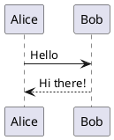

**Explanation:**
- `@startuml` and `@enduml` - Start and end tags
- `->` - Solid arrow (synchronous message)
- `-->` - Dashed arrow (return message)

---

### 1.2 Adding More Messages

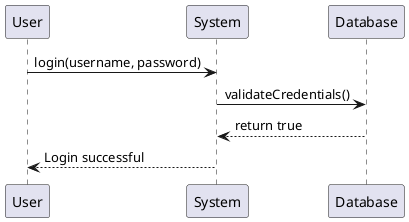

---

## 2. Participants and Actors

### 2.1 Types of Participants

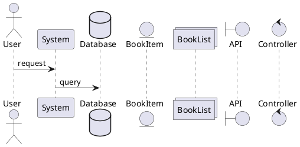

**Types:**
- `actor` - Human user (stick figure)
- `participant` - Generic object (box)
- `database` - Database (cylinder)
- `entity` - Entity object
- `collections` - Collection/List
- `boundary` - System boundary
- `control` - Controller/Service

---

### 2.2 Custom Participant Names

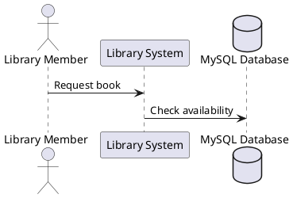

---

### 2.3 Participant Ordering

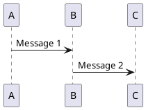

---

## 3. Messages and Arrows

### 3.1 Arrow Types

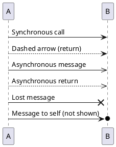

---

### 3.2 Self-Messages

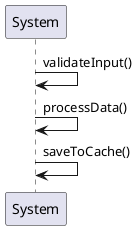

---

### 3.3 Activation Bars

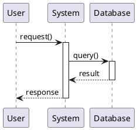

**Shorthand:**


---

## 4. Control Flow - Alt/Else

### 4.1 Simple If/Else (Alt)

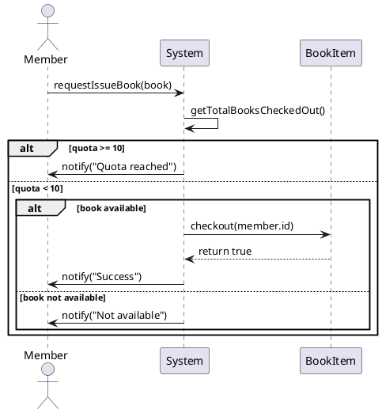

---

### 4.2 Multiple Conditions (Alt with Multiple Else)

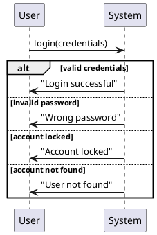

---

### 4.3 Optional Flow (Opt)

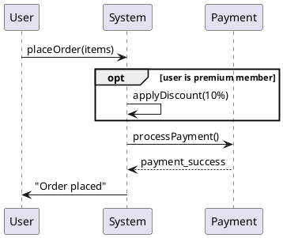

---

## 5. Loops

### 5.1 Basic Loop (Fixed Number)

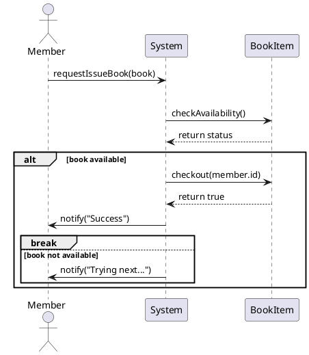

**Key Points:**
- `loop 3 times` - Fixed iterations
- `break` - Exit loop early

---

### 5.2 Loop with Condition (While-style)

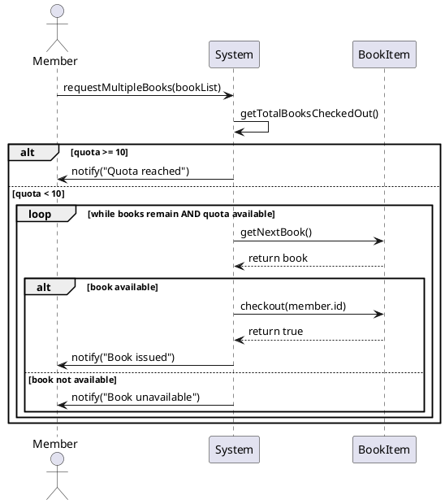

---

### 5.3 Loop for Each (Collection Iteration)

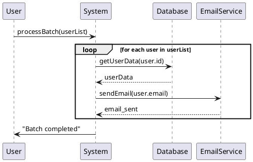

---

### 5.4 Nested Loops

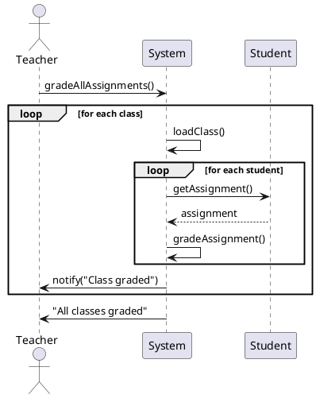

---

## 6. Retry Patterns

### 6.1 Max Retry Pattern (Most Common)

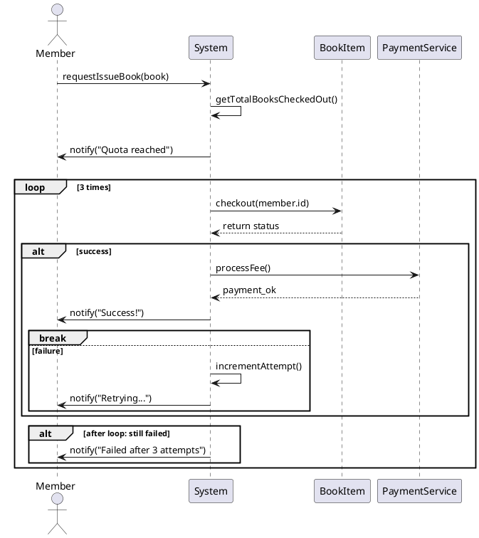

---

### 6.2 Retry with Delay

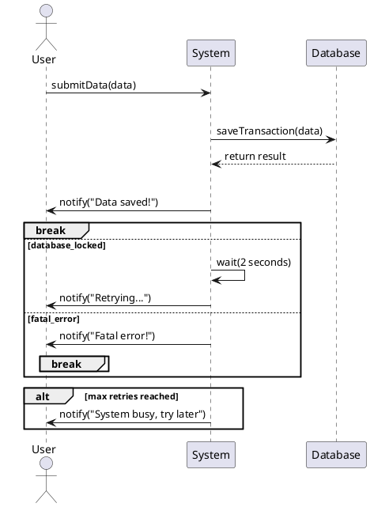

---

### 6.3 Exponential Backoff

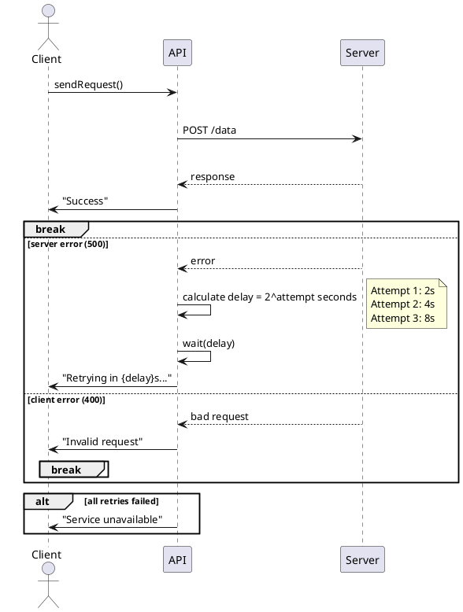

---

### 6.4 Retry with Fallback

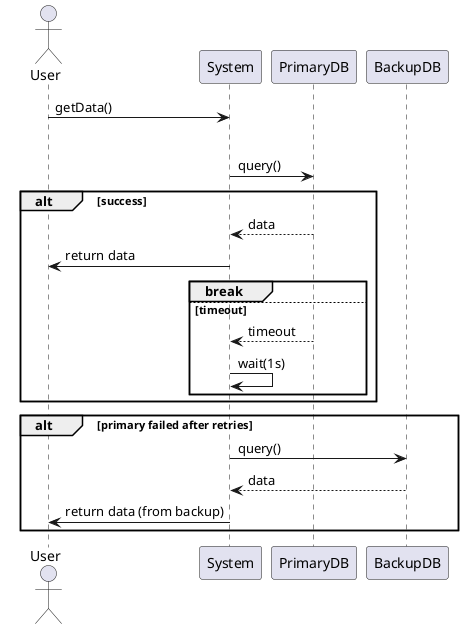

---

## 7. Advanced Features

### 7.1 Parallel Processing (Par)

```plantuml
@startuml
User -> System: processOrder()

par Process Payment
    System -> PaymentGateway: charge()
    PaymentGateway --> System: success
and Update Inventory
    System -> Inventory: decreaseStock()
    Inventory --> System: updated
and Send Email
    System -> EmailService: sendConfirmation()
    EmailService --> System: sent
end

System -> User: "Order complete"
@enduml
```

---

### 7.2 Critical Section

```plantuml
@startuml
User1 -> System: bookSeat(A1)
User2 -> System: bookSeat(A1)

critical Lock seat A1
    System -> Database: checkAvailability(A1)
    
    alt seat available
        System -> Database: reserveSeat(A1)
        Database --> System: reserved
    else seat taken
        System -> Database: return error
    end
end

System -> User1: "Seat booked"
System -> User2: "Seat not available"
@enduml
```

---

### 7.3 Reference (Ref) - Reusable Fragments

```plantuml
@startuml
User -> System: checkout()

ref over System, Payment
    Process Payment
    (see payment_flow.puml)
end

System -> User: "Order complete"
@enduml
```

---

### 7.4 Notes and Comments

```plantuml
@startuml
actor User
participant System

note left of User
    User must be
    authenticated
end note

User -> System: request()

note right of System
    System validates
    the request here
end note

System --> User: response

note over User, System
    This is a note spanning
    multiple participants
end note
@enduml
```

---

### 7.5 Groups and Divisions

```plantuml
@startuml
User -> System: process()

group Authentication Layer
    System -> Auth: validateToken()
    Auth --> System: valid
end

group Business Logic
    System -> Service: processRequest()
    Service --> System: result
end

group Data Layer
    System -> Database: saveData()
    Database --> System: saved
end

System --> User: complete
@enduml
```

---

### 7.6 Delay

```plantuml
@startuml
User -> System: request()
System -> Database: query()
Database --> System: result

...5 seconds later...

System -> User: response
@enduml
```

---

### 7.7 Divider

```plantuml
@startuml
User -> System: Step 1

== Initialization Phase ==

System -> Database: init()

== Processing Phase ==

System -> Service: process()

== Completion Phase ==

System -> User: done
@enduml
```

---

## 8. Real-World Examples

### 8.1 Library Book Checkout (Complete Flow)

```plantuml
@startuml
actor Member
participant Librarian
participant System
participant BookItem
participant Database
database LendingDB

Member -> Librarian: "I want to checkout 'Clean Code'"

Librarian -> System: searchBook("Clean Code")
System -> Database: findByTitle("Clean Code")
Database --> System: bookList

alt book found
    System --> Librarian: display book details
    
    Librarian -> System: checkMemberQuota(member.id)
    System -> LendingDB: getTotalBooksCheckedOut(member.id)
    LendingDB --> System: count = 7
    
    alt quota < 10
        System --> Librarian: "Quota available"
        
        Librarian -> System: checkBookAvailability(book.id)
        
        loop for each copy
            System -> BookItem: getStatus()
            BookItem --> System: status
            
            alt status == AVAILABLE
                System -> BookItem: checkout(member.id)
                activate BookItem
                
                BookItem -> BookItem: setStatus(LOANED)
                BookItem -> LendingDB: createLendingRecord()
                LendingDB --> BookItem: record created
                
                BookItem --> System: checkout successful
                deactivate BookItem
                
                System --> Librarian: "Book checked out"
                Librarian -> Member: "Here's your book"
                break
            else status == LOANED
                System -> System: check next copy
            end
        end
        
    else quota >= 10
        System --> Librarian: "Member quota reached"
        Librarian -> Member: "Sorry, you've reached your limit"
    end
    
else book not found
    System --> Librarian: "Book not found"
    Librarian -> Member: "Book not available in library"
end

@enduml
```

---

### 8.2 Online Payment with Retries

```plantuml
@startuml
actor Customer
participant WebApp
participant PaymentGateway
participant Bank
database TransactionDB

Customer -> WebApp: checkout(cart)

WebApp -> WebApp: calculateTotal()

loop max 3 attempts
    WebApp -> PaymentGateway: processPayment(amount, card)
    activate PaymentGateway
    
    PaymentGateway -> Bank: authorizeTransaction()
    activate Bank
    
    alt sufficient funds
        Bank -> Bank: deductAmount()
        Bank --> PaymentGateway: authorization_code
        deactivate Bank
        
        PaymentGateway -> TransactionDB: saveTransaction()
        TransactionDB --> PaymentGateway: saved
        
        PaymentGateway --> WebApp: payment_successful
        deactivate PaymentGateway
        
        WebApp -> Customer: "Payment successful!"
        break
        
    else insufficient funds
        Bank --> PaymentGateway: declined
        deactivate Bank
        PaymentGateway --> WebApp: insufficient_funds
        deactivate PaymentGateway
        
        WebApp -> Customer: "Insufficient funds"
        break
        
    else network timeout
        Bank -->x PaymentGateway: timeout
        deactivate Bank
        PaymentGateway --> WebApp: timeout_error
        deactivate PaymentGateway
        
        WebApp -> WebApp: wait(2 seconds)
        WebApp -> Customer: "Retrying..."
    end
end

alt all attempts failed
    WebApp -> Customer: "Payment failed. Please try again later."
end

@enduml
```

---

### 8.3 Microservices with Fallback

```plantuml
@startuml
actor User
participant API_Gateway
participant UserService
participant OrderService
participant PaymentService
participant Cache

User -> API_Gateway: GET /user/123/orders

API_Gateway -> UserService: getUser(123)

alt user service available
    UserService --> API_Gateway: user_data
else user service down
    API_Gateway -> Cache: getCachedUser(123)
    Cache --> API_Gateway: cached_user_data
end

par Fetch Orders
    loop 2 times
        API_Gateway -> OrderService: getUserOrders(123)
        
        alt success
            OrderService --> API_Gateway: orders[]
            break
        else timeout
            API_Gateway -> API_Gateway: wait(500ms)
        end
    end
    
and Fetch Payment Info
    loop 2 times
        API_Gateway -> PaymentService: getPaymentMethods(123)
        
        alt success
            PaymentService --> API_Gateway: payment_methods[]
            break
        else timeout
            API_Gateway -> API_Gateway: wait(500ms)
        end
    end
end

API_Gateway -> API_Gateway: aggregateData()
API_Gateway --> User: complete_user_profile

@enduml
```

---

## 📋 Quick Reference

### Loop Syntax
```
loop 3 times                    ' Fixed iterations
loop while [condition]          ' Condition-based
loop for each [item]            ' Collection iteration
loop [min] to [max]             ' Range iteration
```

### Control Flow
```
alt [condition]                 ' If-else
else [condition]                ' Else-if
else                            ' Else
end                             ' End block

opt [condition]                 ' Optional execution

break                           ' Exit loop/alt early
```

### Parallel & Critical
```
par                             ' Parallel execution
and                             ' Another parallel branch
end

critical                        ' Critical section (lock)
end
```

### Common Patterns

**Retry Pattern:**
```
loop N times
    ' attempt operation
    alt success
        break
    else failure
        ' handle error
    end
end
```

**Timeout Pattern:**
```
alt response received
    ' handle response
else timeout after 5s
    ' handle timeout
end
```

**Fallback Pattern:**
```
alt primary available
    ' use primary
else primary unavailable
    ' use fallback
end
```

---

## 🎯 Best Practices

1. **Keep it Simple**: Don't overcomplicate diagrams
2. **Use Meaningful Names**: Clear participant and message names
3. **Group Related Operations**: Use `group` for logical sections
4. **Show Error Paths**: Include `alt` for error scenarios
5. **Limit Nesting**: Max 2-3 levels of nested `alt`/`loop`
6. **Add Notes**: Explain complex logic
7. **Use Activation Bars**: Show when objects are active
8. **Break Complex Diagrams**: Use `ref` to reference other diagrams

---

## 🔗 Resources

- Official PlantUML: https://plantuml.com/sequence-diagram
- Live Editor: http://www.plantuml.com/plantuml/
- VS Code Extension: PlantUML (by jebbs)

---

*Complete Guide - From Basics to Advanced Patterns*


<hr>

# Sequence Diagrams - Complete Tutorial
## From Basic to Advanced

---

## 🧩 What is a Sequence Diagram?

A sequence diagram is a UML diagram that shows how different objects or actors interact with each other in a specific scenario over time. It helps us visualize the order of messages exchanged between:

* Actors (like Member or Librarian)
* Objects (like Book or BookItem)
* System components

It uses vertical lifelines and horizontal arrows to represent messages and their timing.

---

## 🧩 1️⃣ What is a Sequence Diagram?

A sequence diagram models the interaction between objects or components in a specific time sequence.

It shows:
* What messages are exchanged
* In what order
* Between which entities (actors, objects, systems, etc.)

It's like watching a movie scene where you see who speaks to whom, when, and what the response is.

---

## 🏗 2️⃣ Basic Building Blocks

Let's break it down visually (conceptually):

```
Actor/Object       Actor/Object       Actor/Object
    |                   |                   |
    |---- Message 1 --->|                   |
    |<--- Response 1 ---|                   |
    |---- Message 2 ----------------------->|
```

Now let's understand each element:

### 🔹 a. Lifeline

A vertical dashed line representing the existence of an actor or object during the interaction.

Example:

```
Member |
        |
        |
        |
```

Each actor/object will have a lifeline.

---

### 🔹 b. Actor / Object

* **Actor** = external entity (like a user, system, or device).
* **Object** = internal entity (class instance or component).

They appear as rectangles on top of the lifeline:

```
+----------+
| Member   |
+----------+
     |
     |
```

---

### 🔹 c. Message (Arrow)

Messages show communication between actors/objects.

**Types of arrows:**

| Message Type | Arrow Symbol | Meaning |
|-------------|--------------|---------|
| Synchronous message | Solid arrow with filled head | Caller waits for response |
| Asynchronous message | Solid arrow with open head | Caller doesn't wait (e.g., event, signal) |
| Return message | Dashed arrow | Response after a call |

Example:

```
Member → Librarian : requestBook()
Librarian → BookDB : findBook()
BookDB → Librarian : bookFound()
```

---

### 🔹 d. Activation Bar

A narrow rectangle on the lifeline that shows when an object is active (executing something).

```
| Member |
    |
   [=======]  ← Activation (doing work)
    |
```

---

## ⚙️ 3️⃣ How Time Flows in a Sequence Diagram

* Time moves from **top to bottom**.
* The **top** = start of interaction.
* The **bottom** = end of interaction.

Each horizontal arrow occurs in chronological order from top → bottom.

---

## 📘 4️⃣ Simple Example — "Login Process"

Let's model a user login scenario.

**Participants:**
* User
* Login Page
* Authentication Service
* Database

**Steps:**
1. User enters credentials and clicks "Login".
2. Login Page sends credentials to Authentication Service.
3. Authentication Service checks Database.
4. Database returns result.
5. Authentication Service responds with "Success" or "Failure".

**Diagram (conceptually):**

```
User      LoginPage      AuthService      Database
 |            |               |               |
 |--LoginReq->|               |               |
 |            |--AuthReq----->|               |
 |            |               |--CheckUser--->|
 |            |               |<--UserFound---|
 |            |<--AuthSuccess-|               |
 |<--Welcome--|               |               |
```

That's the basic structure — sequential communication among actors.

---

## 🏛 Scenario 1: Issuing (Lending) a Book

**Participants:**
* **Actor:** Member, Librarian
* **Objects:** Book, BookItem

**Step-by-Step Process:**

### 1. Member requests book issue
* Member asks the librarian to issue a specific book (say, "Harry Potter").

### 2. Librarian checks member's quota
* Librarian verifies if the member hasn't reached the limit of books allowed to borrow (e.g., max 5 books at a time).
* If the quota is full → librarian informs "No more books can be issued."
* If quota available → continue.

### 3. Librarian checks book status
* Librarian queries the system for the book's current status.

### 4. If the book is available
* The librarian updates the records:
  * Marks the BookItem as "Issued".
  * Assigns it to the Member.
  * Updates the issue date and due date.

### 5. If the book is reserved by someone else
* Librarian informs the member: "Book already reserved."

### 🔁 Visual Representation (Conceptually)

```
Member         Librarian         Book          BookItem
   |                |               |               |
1. Request book --->|               |               |
   |<--Confirm quota|               |               |
   |                |--Check quota-->|               |
   |                |<--Quota okay---|               |
   |                |--Check status->|               |
   |                |<--Available----|               |
   |                |--Issue book--->|--Mark issued->|
   |<---Confirm issued---------------|               |
```

So, the sequence shows the order of interactions leading to the successful issue of a book.

---

## 🏛 Scenario 2: Returning a Book

Now, this is your challenge diagram — the one the interviewer may ask about.

We'll walk through it clearly and logically, step by step.

**Participants:**
* **Actor:** Member
* **Objects:** Librarian, BookItem, LibrarySystem

**Correct Sequence (1–13):**

Here's the likely correct order (since you have message boxes numbered 1–13):

1️⃣ **Member → Librarian:** Request to return a book

2️⃣ **Librarian → System:** Verify return details (member ID, book ID)

3️⃣ **System → Librarian:** Return details confirmed

4️⃣ **Librarian → BookItem:** Mark book as returned

5️⃣ **BookItem → Librarian:** Confirmation of status update

6️⃣ **Librarian → System:** Update member's borrowing record

7️⃣ **System → Librarian:** Member record updated successfully

8️⃣ **Librarian → System:** Check if return is late

9️⃣ **System → Librarian:** Return is late (true/false)

🔟 **[If late] Librarian → System:** Calculate fine amount

1️⃣1️⃣ **System → Librarian:** Fine amount calculated

1️⃣2️⃣ **Librarian → Member:** Notify about fine (if applicable)

1️⃣3️⃣ **Librarian → Member:** Confirm return completion

### 🔁 Conceptual Diagram (Return Book)

```
Member        Librarian        BookItem        LibrarySystem
   |               |               |                  |
1. Return request->|               |                  |
   |               |--Verify------>|                  |
   |               |<--Confirmed---|                  |
   |               |--Update------>|                  |
   |               |<--Done--------|                  |
   |               |--Update record------------------>|
   |               |<--Record updated-----------------|
   |               |--Check overdue------------------->|
   |               |<--Overdue? true/false-------------|
   |               |--If late: calculate fine---------->|
   |               |<--Fine calculated-----------------|
   |<---Notify fine|               |                  |
   |<---Return done|               |                  |
```

---

## ⚙️ Key Takeaways

* Sequence diagrams show how and in what order operations happen.
* Each arrow is a message (method call, event, or signal).
* Vertical lines represent lifelines (actors/objects that exist during the process).
* Return arrows show the response after each request.
* You can include conditions like `[if overdue]` to represent optional flows (extends).

---

## 🚀 5️⃣ Intermediate Concepts

Now let's go deeper — what happens when your logic grows complex.

### 🔸 a. Loops

Represent repeated interactions (e.g., retry attempts, iterations).

```
loop [for each book in list]
    Librarian -> System : checkAvailability()
end
```

---

### 🔸 b. Conditions (Alt / Opt fragments)

Used when different outcomes exist.

* **alt** = if-else
* **opt** = optional (if only condition true)

```
alt [bookAvailable]
    Librarian -> System : issueBook()
else [bookNotAvailable]
    Librarian -> System : reserveBook()
end
```

---

### 🔸 c. Parallel Execution (par)

When two actions occur simultaneously:

```
par
    System -> EmailService : sendEmail()
    System -> SMSService : sendSMS()
end
```

---

## 🧠 6️⃣ Advanced Concepts

### 🔹 a. Create / Destroy Messages

Used when objects are dynamically created or destroyed.

```
User -> SessionManager : createSession()
SessionManager -> Session : «create»
Session -> SessionManager : «destroy»
```

---

### 🔹 b. Self-message

When an object calls its own method:

```
Book -> Book : checkAvailability()
```

---

### 🔹 c. Return with Condition

To show responses based on logic:

```
[if validUser] return success
[else] return error
```

---

### 🔹 d. Asynchronous Communication (used in microservices)

In modern systems (Kafka, WebFlux, etc.) you may use asynchronous arrows:

```
ServiceA ->> MessageQueue : publishEvent()
MessageQueue ->> ServiceB : consumeEvent()
```

(`->>` represents asynchronous call)

---

## 📘 7️⃣ Putting It All Together — Example from Library System

Let's use what you learned and model Book Issue Flow again, but now fully annotated.

```
Member          Librarian          BookItem         LibrarySystem
  |                 |                   |                   |
1.RequestIssue() --->|                   |                   |
  |                 |--checkQuota()----->|                   |
  |                 |<--quotaOK----------|                   |
  |                 |--checkBookStatus()->|                   |
  |                 |<--available--------|                   |
  |                 |--issueBook()-------------------------->|
  |                 |<--recordUpdated------------------------|
  |<--confirmation--|                   |                   |
```

**Add fragments:**

```
alt [quotaExceeded]
   Librarian -> Member : "Cannot issue more books"
else [bookAvailable]
   Librarian -> BookItem : updateStatus("Issued")
end
```

---

## 🧭 8️⃣ Advanced Design Layer – When Using Sequence Diagrams in Real Projects

As a backend developer (Spring Boot / microservices), sequence diagrams are very helpful in:

* **API design** — understanding request/response flows.
* **Microservice communication** — visualize inter-service calls.
* **Event-driven design** — model asynchronous event flows.
* **State transitions** — track workflow from one state to another.

**Example:** For a Payment Processing System, you could show:

```
Client → API Gateway → PaymentService → BankAPI → NotificationService
```

…with retries, async flows, and compensation logic.

---

## 🧩 9️⃣ Best Practices

1. **Keep diagrams simple** – one use case per diagram.
2. **Avoid over-detailing** (don't show every getter/setter).
3. **Always name messages with verbs** (e.g., `validateUser()`, `createOrder()`).
4. **Represent alternate conditions** with alt fragments clearly.
5. **Use asynchronous arrows** in event-driven systems.
6. **Keep time order top → bottom** always consistent.

---

## 🏁 10️⃣ Summary Table

| Concept | Meaning | Example |
|---------|---------|---------|
| Lifeline | Object's existence | Member, Librarian |
| Message | Interaction | issueBook() |
| Activation | Execution time | Narrow rectangle |
| Alt | If-Else condition | bookAvailable / notAvailable |
| Opt | Optional flow | fineApplied |
| Loop | Repetition | for each book |
| Par | Parallel | sendEmail + sendSMS |
| Create/Destroy | Object lifecycle | createSession(), destroy() |

---

*Complete Tutorial - From Basic to Advanced Sequence Diagrams*
