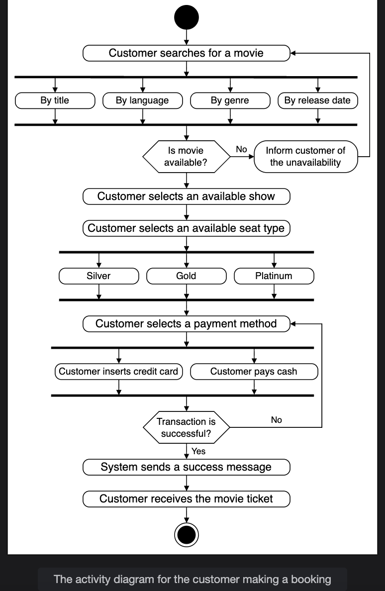
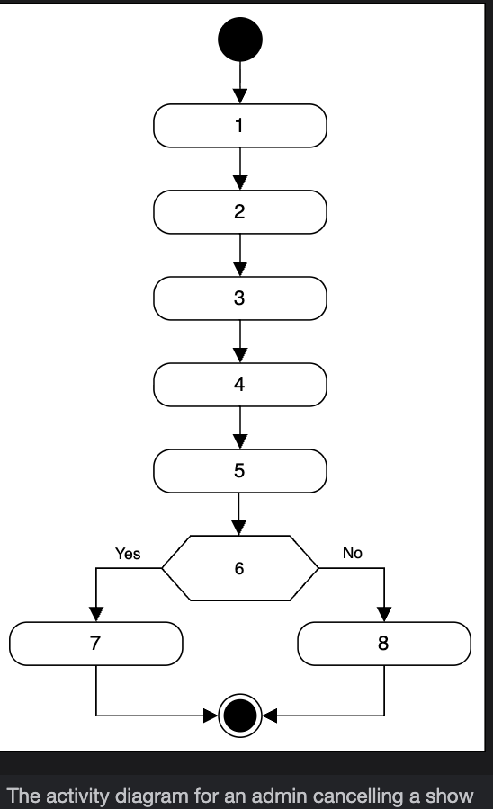
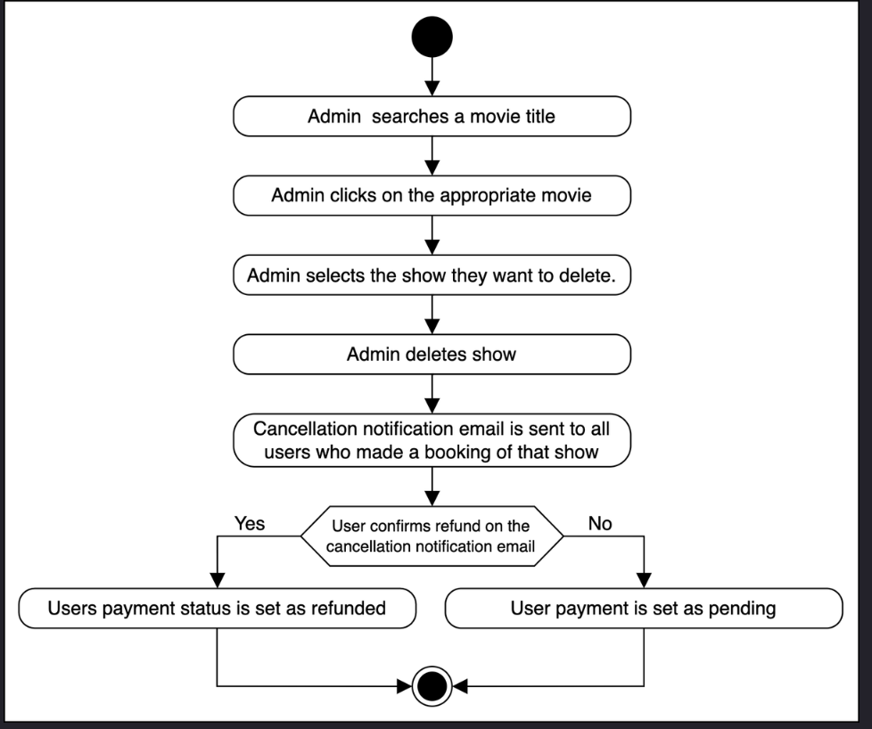

# Activity Diagram for the Movie Ticket Booking System

Create some activity diagrams for the movie ticket booking system problem.

An activity diagram is a great way to visualize the flow of messages from one activity to another in the system. There can be different activity diagrams that we can create for our movie ticket booking system. In this lesson, we will create activity diagrams for the following two activities:
* The customer makes a booking for the movie.
* Activity challenge: The admin cancels a show.

## The customer makes a booking for the movie

The following are the states and actions that will be involved in this activity diagram.

### States
* Initial state: The customer opens a search for a movie.
* Final state: The customer receives a ticket for the movie.

### Actions

The customer searches for a movie using specific criteria and selects it. The customer then selects their required seat and pays according to the seat type. The payment is made either through cash or a credit card. After successful payment, the customer receives the movie ticket.

Based on the order above, the activity diagram of a customer making a booking for the movie is given below.

> Note: Here, we assume the customer is purchasing a single cinema seat.

## Activity challenge: Admin cancels a show
You will create an activity diagram of an admin canceling a show for a movie.
A skeleton of the activity diagram is given below.
Notice that the actions in the diagram above are numbered from 1 to 8. The slots shown below represent the activities, and the arrows represent the flow from one activity to the other.

<strong>Click to view related requirements</strong>

