# Class Diagram for the Movie Ticket Booking System

Learn to create a class diagram for the movie ticket booking system using the bottom-up approach.

## Overview

This lesson will identify and design the movie ticket booking system's key classes, abstract classes, and interfaces. Our approach follows the bottom-up design methodology, beginning with core entities and building up to system-wide relationships, as defined in the requirements lesson.

## Components of a Movie Ticket Booking System

We use a bottom-up approach, starting from core entities and relationships, ensuring the design aligns with functional and operational requirements.

## Seat

The `Seat` class represents a physical seat in a cinema hall. It is an abstract class extended by three concrete seat types: `Silver`, `Gold`, and `Platinum`.

* Each seat type has a fixed cost (rate).
* The base `Seat` class defines the rate attribute and methods, and may be overridden in subclasses if necessary.
* Each seat also has a seat number and a seat status (available, booked, or reserved).

### Visual Representation

The visual representation of these classes is as follows:

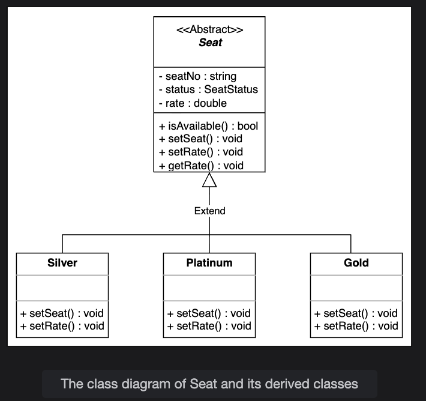

<strong>Click to view related requirements</strong>

**R9:** Each seat type has a fixed cost. There are three types of seats:
   - Silver  
   - Gold    
   - Platinum    
**R13:** The system should be able to differentiate between available and booked seats.  

# ShowTime

The `ShowTime` class represents a particular show of a movie.

* It contains the start time, date, and a reference to the movie being shown.
* ShowTime also maintains a mapping for seat statuses for that particular show.

Here is what the class definition looks like:

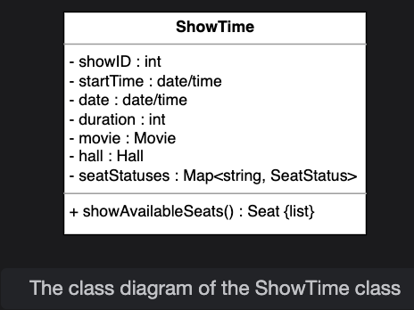

<strong>Click to view related requirements</strong>

**R5:** Users can make a booking at any cinema at the available showtime.

# Hall

The `Hall` class represents a cinema hall.

* Each hall has a unique ID, a list of all seats (physical seats in the hall).
* Hall manages which show is playing and which seats are available for each show.

The UML representation of the class is shown below:

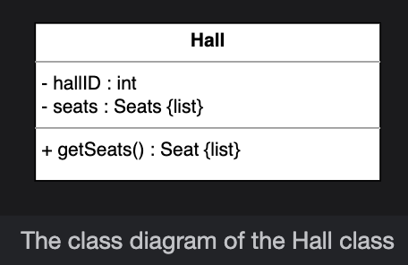

<strong>Click to view related requirements</strong>

**R2:** Each movie in the cinema can have multiple shows, however; one hall will only show one show at a time.

# Cinema

The `Cinema` class consists of the number of halls present in the cinema, along with the city in which it is located in, and an ID attribute to identify the cinema in that particular city.

The class representation of the `Cinema` class is as follows:

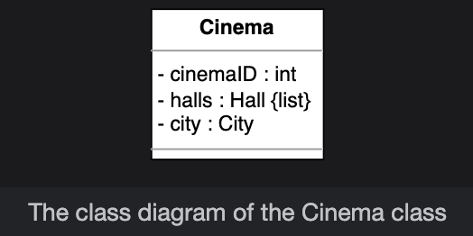

<strong>Click to view related requirements</strong>

**R1:** There are multiple cinemas in the city, each with multiple halls.

# City
The `City` class includes the city's name, state, and zip code, as well as a list of all its cinemas.

The UML representation of the class is shown below:
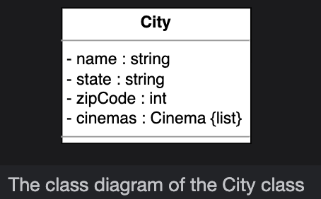

<strong>Click to view related requirements</strong>

**R1:** There are multiple cinemas in the city, each with multiple halls.

# Movie
The `Movie` class contains details about a particular movie, such as its title, genre, language, and release date. It is also composed of a list of running shows.

Here is what the class definition looks like:

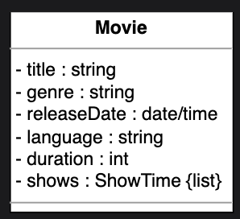

<strong>Click to view related requirements</strong>

**R1:** Users can search movies based on the following four criteria:
   - Title
   - Language
   - Genre
   - Release date

# Movie Ticket
The `MovieTicket` class refers to a customer's ticket for a particular movie, which has a ticketID as its unique identifier. The ticket describes the details of the seat in the hall, the movie for which the ticket was bought, and the show details.

The class representation of the `MovieTicket` class is as follows:

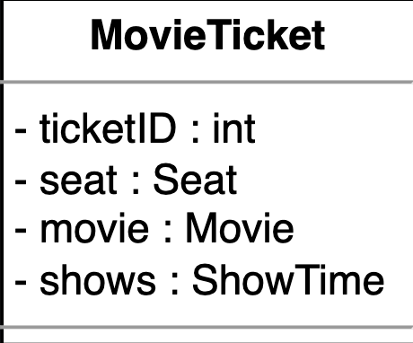

<strong>Click to view related requirements</strong>

**R1:** There can only be one ticket allocated per seat.

# Payment
The `Payment` class will be abstract and have two child classes: CreditCard and Cash, as these are the two payment methods of the movie ticket booking system.

The visual representation of these classes is as follows:

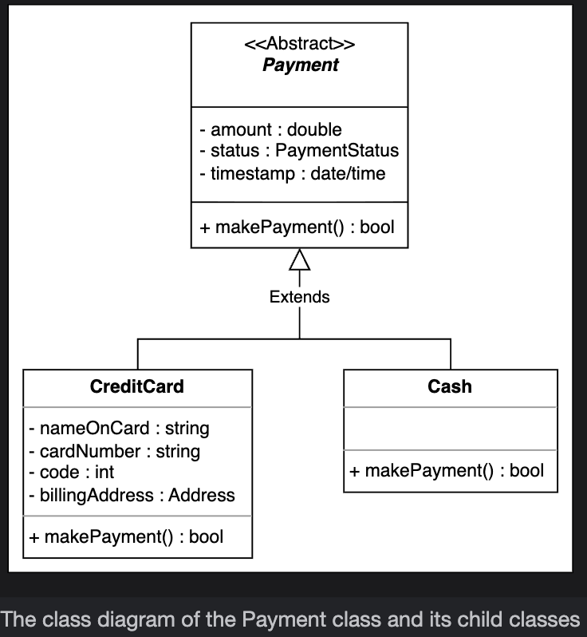

<strong>Click to view related requirements</strong>

**R7:** Online customers can only pay using a credit card, while walk-in customers can pay using cash or a credit card through the ticket agent.

# Person
The `Person` class contains details like name, address, phone number, and email, and is derived into the following three different classes:

* `Customer`
* `Admin`
* `TicketAgent`

## Derived Classes
The following goes into more depth in each of the derived classes mentioned above:

### Customer
The `Customer` class refers to a user trying to create an online booking for any movie. A customer can also update the booking details and cancel the booking.

### Admin
The `Admin` class performs actions like adding, updating, and removing movies and shows.

### Ticket Agent
The `TicketAgent` class is responsible for creating bookings on behalf of walk-in customers. However, unlike the `Customer` class, a ticket agent cannot update or cancel a booking.

The class diagram of all these is provided below:

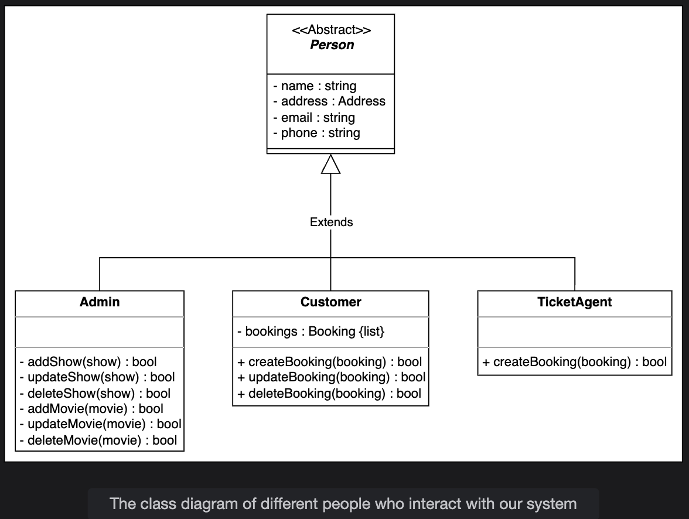

<strong>Click to view related requirements</strong>

**R5:** Users can book at any cinema hall at showtime.  
**R6:** Customers can book online or by walking into the ticket agent.  
**R5:** The admin can perform the following five actions on the showtimes and the movie:
   - Add a Show
   - Delete a Show
   - Update a Show
   - Add a Movie
   - Delete a Move

# Notification
`Notification` will be an abstract class since it can send a notification via email or phone (SMS). It is mainly responsible for sending notifications whenever any of the following conditions are met:

* A customer makes a new booking.
* The admin deletes a particular show, or a customer cancels their booking.
* The admin adds a new movie to the database.

The UML representation of the class is shown below:

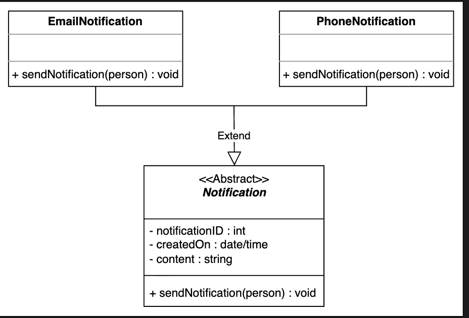

<strong>Click to view related requirements</strong>

**R14:** The system should generate a notification for the following three cases:
   - A new movie has been released.
   - A booking has been made.
   - A booking has been canceled.

# Catalog
The `Catalog` is the class where the search function is implemented. Each catalog contains a list of movies sorted according to one of the given search techniques, e.g., based on the movie's title, language, genre, or release date.

The class representation of the `Catalog` class is as follows:

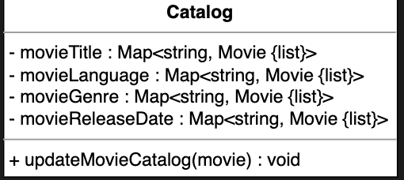

<strong>Click to view related requirements</strong>

**R14:** Users can search movies based on the following four criteria:
   - Title
   - Language
   - Genre  
   - Release date

# Search
The `Search` class will be an interface that allows customers to search for any particular movie and return the list of movies upon searching, by any of the following methods:

* Search movies by their title.
* Search movies by their language.
* Search movies by their genre.
* Search movies by their release date.

The UML representation of the class is shown below:

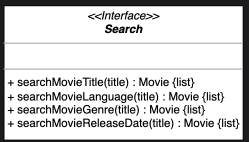

<strong>Click to view related requirements</strong>

**R14:** Users can search movies based on the following four criteria:
   - Title
   - Language
   - Genre  
   - Release date

# Booking
The `Booking` class is the main class of our movie ticket booking system and contains a reference to the number of seats and tickets that a customer booked. In addition, it includes information about the payment status, the booking status, the show time, and the total amount that was charged for the booking.

The UML representation of the `Booking` class is as follows:

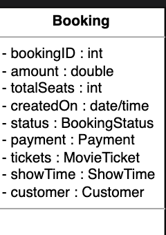

<strong>Click to view related requirements</strong>

**R5:**  Users can make a booking at any cinema at the available showtime.

# Enumerations
The following is the list of enumerations required in the movie ticket booking system:

* **`PaymentStatus`**: The payment status checks if the customer's payment falls in any of the following stages: confirmed, declined, pending, or refunded.

* **`BookingStatus`**: The booking status describes the status of a particular movie booking of a customer, whether it is pending, confirmed, canceled, declined, or refunded.

* **`SeatStatus`**: The seat status indicates whether a particular seat in the hall is currently available, booked, or already reserved.

These enumerations can be represented using the following class diagram:

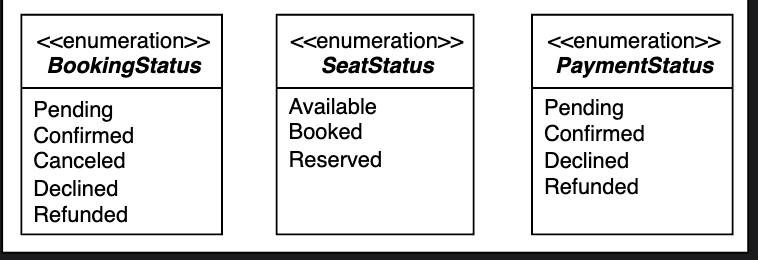

# Relationship Between the Classes
Now, we will discuss the relationships between the classes we defined above in our movie ticket booking system.

## Association
The class diagram has the following association relationships:

### City and Cinema
* The `City` class has a one-way association with `Cinema`.
  * A city maintains a list of cinemas because a real-world city contains multiple movie theaters. This association allows users to search and filter cinemas by city.

### Admin with ShowTime, Movie, and Notification
* The `Admin` class has a one-way association with `ShowTime`, `Movie`, and `Notification`.
  * The admin manages movies and shows in the system—adding, updating, or deleting them—and triggers notifications when such changes affect users (for example, when a show is canceled or a new movie is added).

### Customer and TicketAgent with Notification
* Both `Customer` and `TicketAgent` have a two-way association with `Notification`.
  * Customers and ticket agents receive notifications (such as booking confirmations or cancellations) and may trigger them through actions (e.g., booking or canceling a ticket).

### Booking and MovieTicket
* The `Booking` class has a one-way association with `MovieTicket`.
  * A booking generates one or more movie tickets, each representing a reserved seat for a specific show. This association allows one to retrieve all tickets related to a booking and track the seats and shows for which they were issued.

### Booking and Payment
* The `Booking` class has a two-way association with `Payment`.
  * Each booking is linked to a payment to record the financial transaction for the booking. This association allows the system to track the payment status and method used for each booking.

### ShowTime with Seat and MovieTicket
* The `ShowTime` class has a one-way association with `Seat` and `MovieTicket`.

### Movie with ShowTime and MovieTicket
* The `Movie` class has a one-way association with `ShowTime` and `MovieTicket`.

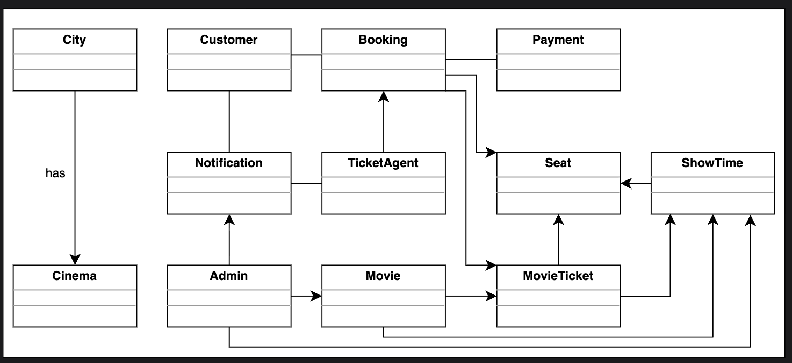

# Composition
The class diagram has the following composition relationships:
* The `Cinema` class is composed of the `Hall` class, which is composed of the `Seat` class.

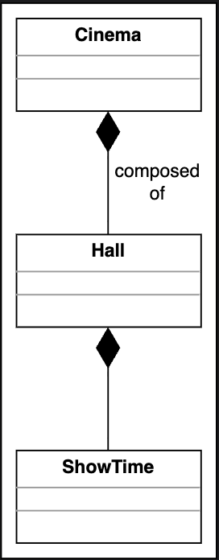

# Aggregation
The following classes show an aggregation relationship:
* The `Catalog` class contains the `Movie` class.

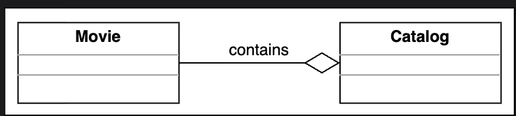

# Generalization
The following classes show a generalization relationship:
* The `Catalog` class implements the `Search` class. 

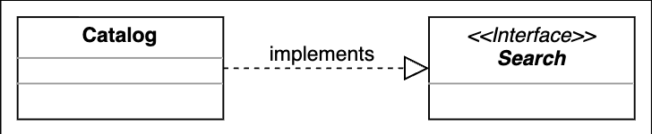

# Inheritance
The following classes show an inheritance relationship:
* The `Gold`, `Platinum`, and `Silver` classes extend the `Seat` class.
* The `Admin`, `Customer`, and `TicketAgent` classes extend the `Person` class.
* Both `Cash` and `CreditCard` extend the `Payment` class.
* Both `EmailNotification` and `PhoneNotification` extend the `Notification` class.

# Class Diagram of the Movie Ticket Booking System
This section outlines the multiplicity (cardinality) relationships between the main classes in our Movie Ticket Booking system. We explain the allowed number of instances on each side for each relationship and the real-world or design rationale behind the connection. Understanding these relationships is key to modeling how different entities interact and collaborate to support key workflows in the system.

## Multiplicity Relationships

| Source | Target | Multiplicity | Reason |
|--------|--------|--------------|--------|
| City | Cinema | 1--0..* | A city can have multiple cinemas; each cinema belongs to one city. |
| Cinema | Hall | 1--1..* | A cinema consists of one or more halls; each hall belongs to one cinema. |
| Hall | Seat | 1--0..* | Each hall contains multiple seats; each seat belongs to one hall. |
| Movie | ShowTime | 1--1 | A movie can have multiple showtimes; each showtime shows one movie. |
| ShowTime | MovieTicket | 1--0..* | Each showtime can generate multiple tickets; each ticket is for one showtime. |
| ShowTime | Seat | 1--1..* | Each showtime manages status for multiple seats (by reference to hall's seats) |
| Booking | MovieTicket | 1--1..* | Each booking includes one or more tickets (for each reserved seat). |
| Booking | Payment | 1--1 | Each booking is associated with exactly one payment. |
| Booking | Customer | 0..*--1 | A booking is made by one customer; each customer can have multiple bookings. |
| Admin | ShowTime | 0..*--0..* | Admin manages (adds/updates/deletes) showtimes. |
| Admin | Movie | 0..*--0..* | Admin manages (adds/updates/deletes) movies. |
| Admin | Notification | 0..*--0..* | Admin can trigger notifications (e.g., for new movie/show, cancellation). |
| Customer | Notification | 0..*--0..* | Customers receive notifications about bookings, cancellations, etc. |
| TicketAgent | Notification | 0..*--0..* | Ticket agents can receive notifications as well. |
| Catalog | Movie | 1--0..* | The catalog contains multiple movies for search and listing. |
| Catalog | Search (interface) | 1--1 | Catalog implements the Search interface to provide movie search features. |
| MovieTicket | Seat | 1--1 | Each ticket is for one specific seat. |
| MovieTicket | Movie | 1--1 | Each ticket is for one specific movie. |

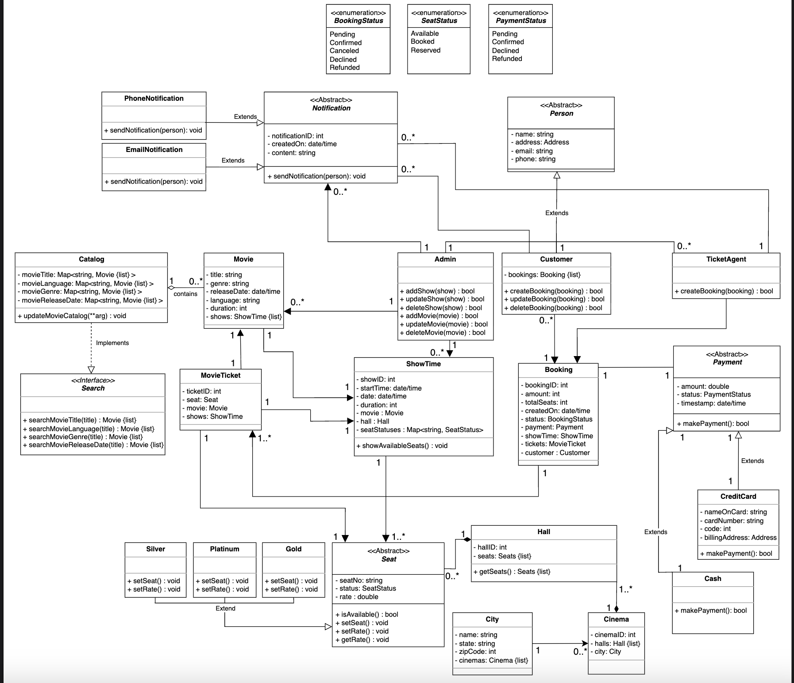

# Handle Concurrency
One of the major requirements of the movie ticket booking system is that no two customers can book the same seat in the same movie show. This prevents double booking, where two people have the same seats allocated to them.

## Concurrency Control Mechanism

To handle concurrent seat allocations, we can use locks, specifically optimistic locks or versioning.

## Process Overview

The entire process has been summarized in the illustration given below:  
* Customer 1 tries to select some seats on the seat selection map and gets assigned a version number V1.  
* Simultaneously, customer 2 also tries to select some seats on the seat selection map and gets assigned a version number V1. However, both customers select the same seat.  
* A lock time is assigned to track the timestamps related to customer entries in the payment section.  
* The mutex lock is acquired, and the expiration period starts. As customer 1 took less time, the payment process started while customer 2 needed to wait.  
* Customer 1 completes the payment. The mutex lock also gets released.  
* Both customer 1 and the system versions get updated. As the lock has been released, customer 2 can now book the tickets again.  
* However, as the system version has been updated, customer 2 would need to perform the entire task from the beginning.  
* The previous seat has become unavailable, so customer 2 selects a new seat.  

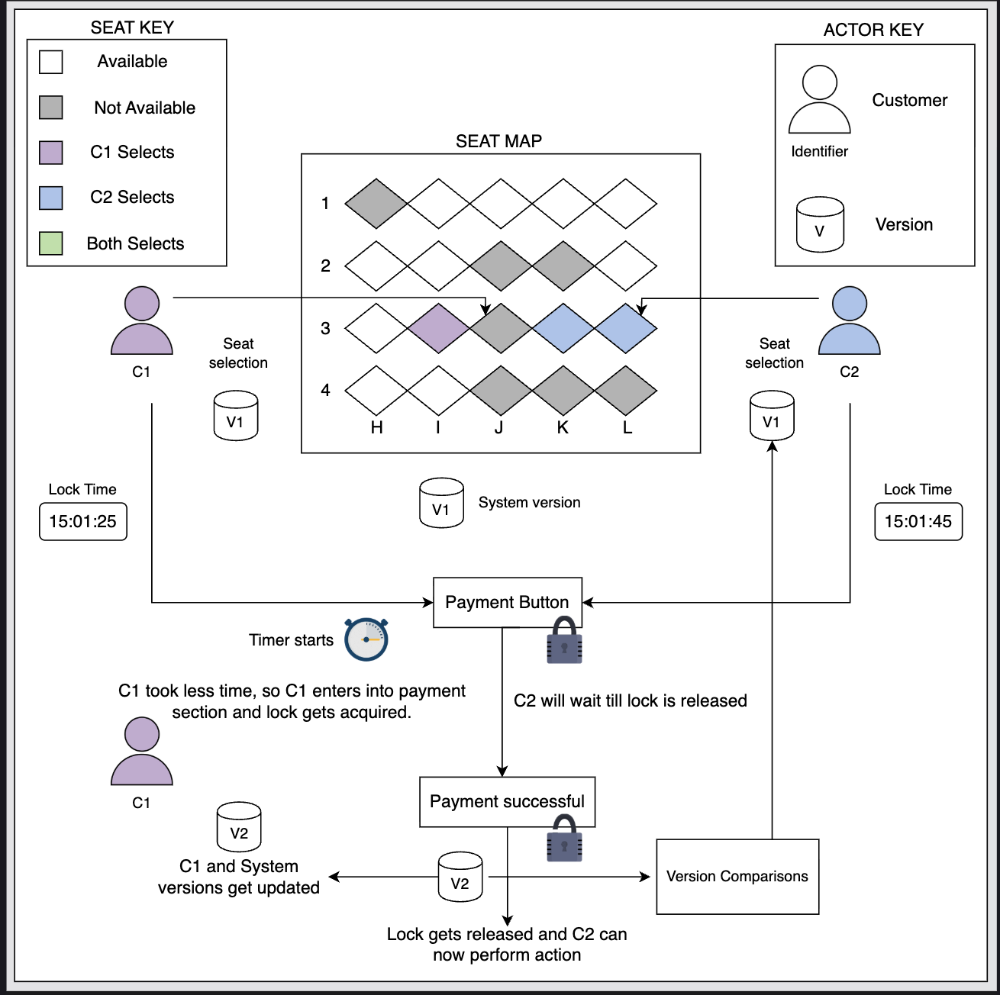  

# Design Patterns
In the movie ticket booking system, there can be multiple seat types for a cinema hall, and each seat type will have its own formula to calculate the ticket fare. To ensure our movie ticket booking system remains flexible, maintainable, and easy to extend, several key object-oriented design patterns are incorporated into the architecture:

## 1. Strategy Pattern
For handling dynamic ticket pricing across various seat types and situations, the Strategy pattern provides the needed flexibility. Each seat type is paired with a pricing strategy, making it simple to introduce new pricing rules or adjust for factors like showtime or movie popularity without altering core seat classes.

## 2. Factory Pattern
The system relies on the Factory pattern to create instances of seats, payments, or notifications. This approach centralizes and abstracts the instantiation logic, making it straightforward to add new seat types or payment methods with minimal code changes elsewhere.

## 3. Observer Pattern
The notification module implements the Observer pattern to decouple business events from user communications. Events such as booking confirmations, cancellations, or new movie releases automatically trigger notifications to all relevant users or channels, keeping the system responsive and loosely coupled.

## 4. Singleton Pattern
The Singleton pattern streamlines managing shared system-wide resources, such as the movie catalog or the notification service. This ensures a single, consistent point of access for these global components throughout the application.

## 5. Builder Pattern
Finally, the Builder pattern makes constructing complex objects like bookings or tickets easier—especially when multiple options or customizations are involved. This pattern results in cleaner, more readable code and flexible object assembly.

# Additional Requirements
The interviewer can introduce some additional requirements in the movie ticket booking system, or they can ask some follow-up questions. Let's see some examples of additional requirements:

## Discount
Customers can use a coupon to add a discount to their payment. The class diagram provided below shows the relationship of `Discount` with the `Payment` class:

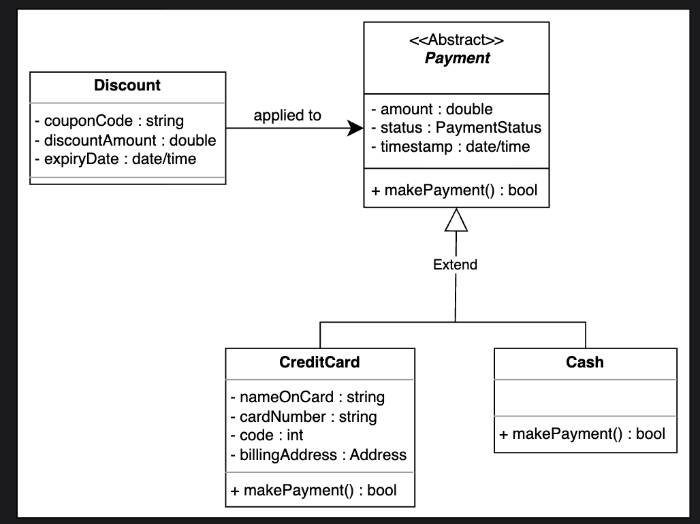

# Customer and Guest Users
There should be two types of users in our system. The guest user can search for movies and choose to register. The customer should be an authenticated user and be able to search movies and book shows. The class diagram below shows how we can implement separate functionality for different users:  

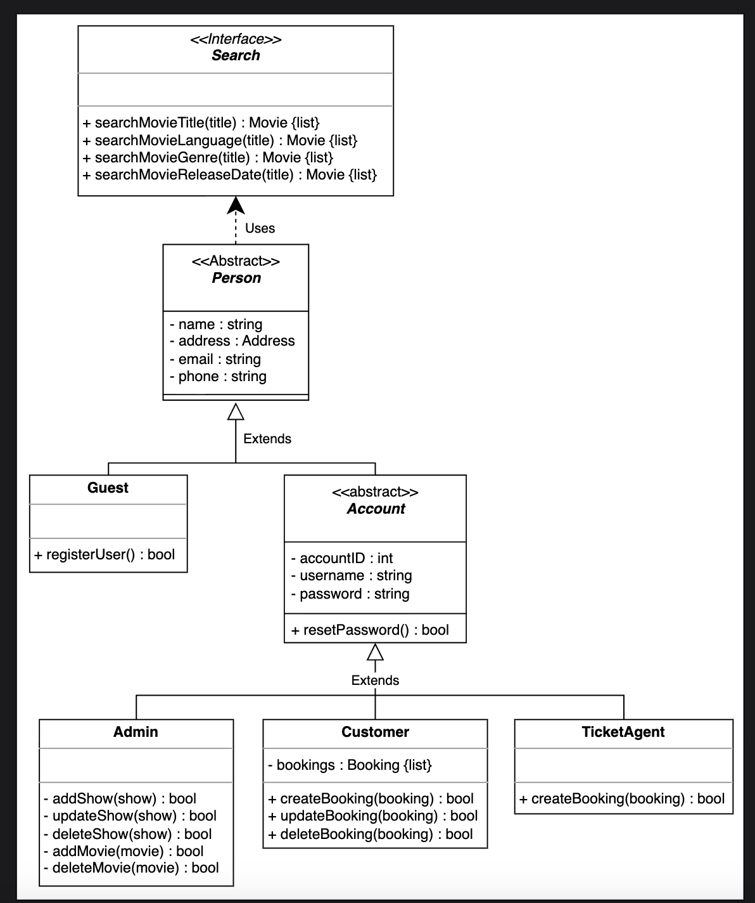 
