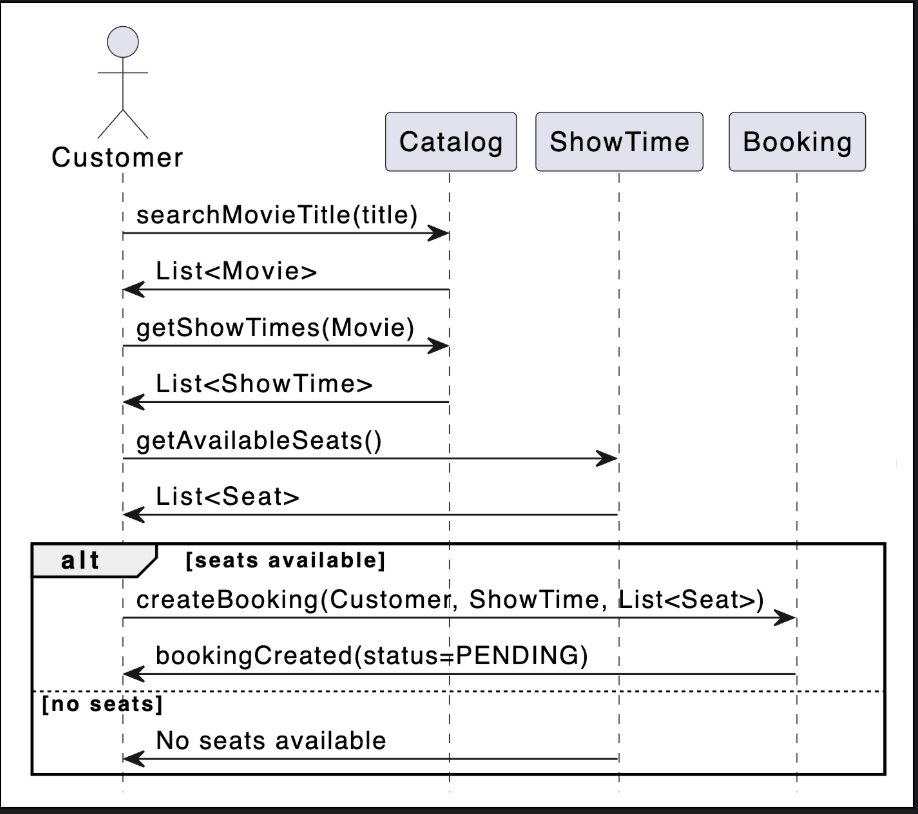
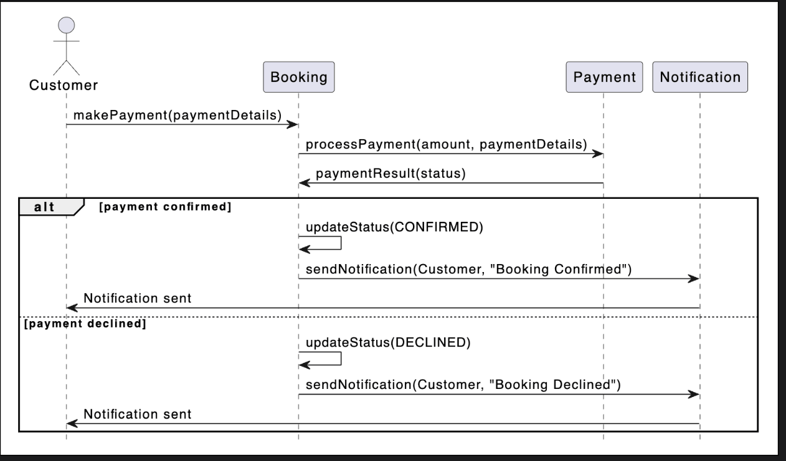
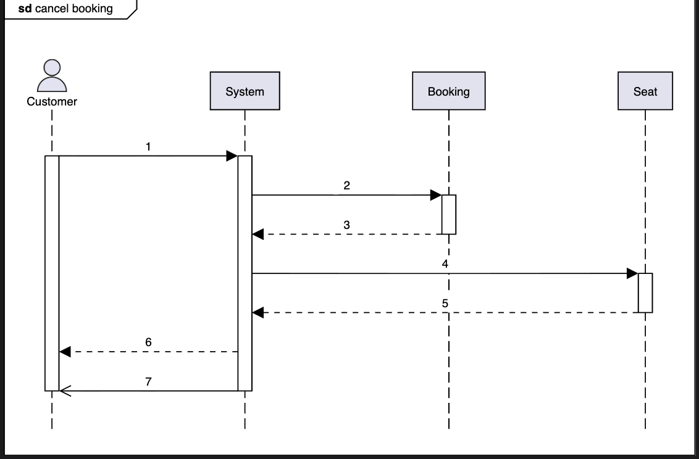
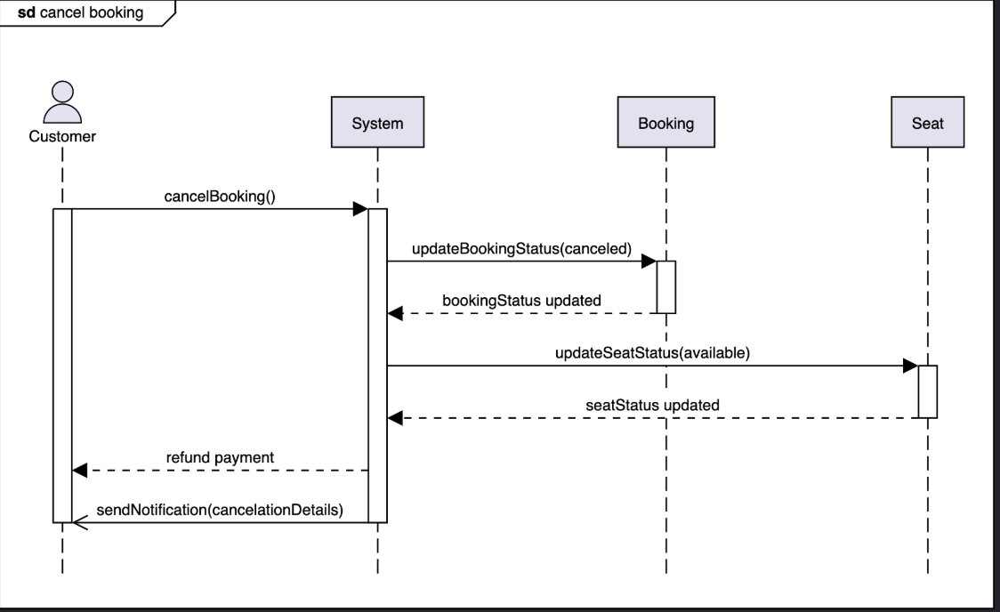

# Sequence Diagram for the Movie Ticket Booking System

Visualize the sequence diagrams for the creation and payment of a booking, and practice the concepts with a challenge.

## Overview

A sequence diagram is a great way to understand the interactions between different entities and objects in the system. There can be different sequence diagrams that we can create for our movie ticket booking system. In this lesson, we will create sequence diagrams for the following three interactions:

* Create a booking: The customer creates a booking for a show.
* Payment for the booking: The customer pays for the booking.
* Sequence challenge: The customer cancels their booking.

## Create a Booking

The sequence diagram for creating a booking should have the following actors and objects that will interact with each other:

* **Actor**: `Customer`
* **Objects**: `Catalog`, `ShowTime`, and `Booking`

### Interaction Steps

Here are the steps of the interaction to create a booking:

1. The customer searches for a movie from the catalog.
2. The catalog returns the required movie(s).
3. The customer requests showtimes for the selected movie from the catalog.
4. The available showtimes for the movie are returned.
5. The customer requests available seats for the selected showtime.
6. **If seats are available**:
   * The customer receives a list of available seats.
   * The customer selects their desired seats and requests to create a booking.
   * The booking is created for the customer, selected seats, and showtime. The booking status is set to "PENDING."
   * The customer is notified that the booking is created and that payment is required.
7. **Else if no seats are available**:
   * The customer is informed that no seats are available.

### Sequence Diagram

Based on the order above, the sequence diagram for creating a booking in the movie ticket booking system is given below:

Payment of a booking
The sequence diagram for payment of a booking should have the following actors and objects that will interact with each other:
* Actor: `Customer`
* Objects: `Booking`, `Payment`, and `Notification`

Here are the steps in the payment of a booking interaction:
1. The customer initiates a payment for the booking fee through the booking system.
2. The booking system creates a payment object and processes the payment.
3. If the payment is confirmed:
   1. The payment informs the system about the successful payment.
   2. The booking status is updated to "CONFIRMED."
   3. The system sends a notification to the customer containing the booking confirmation.
4. Else if the payment is declined:
   1. The payment informs the system about the declined payment.
   2. The booking status is updated to "DECLINED."
   3. The system sends a notification to the customer that the booking has been declined.

Based on the order above, the sequence diagram for payment of a booking in the movie ticket booking system is given below.

## Sequence challenge: Cancel booking
You will complete a sequence diagram for a booking canceled by the customer. A skeleton of the cancel sequence diagram is given below:

Notice that the arrows in the diagram above are numbered from 1 to 7. The message boxes shown below are the messages to be exchanged between the actor(s) and object(s). Can you rearrange the messages below in the correct sequence in order they should appear in the skeleton of the sequence diagram given above? 

<strong>Click to view related requirements</strong>

