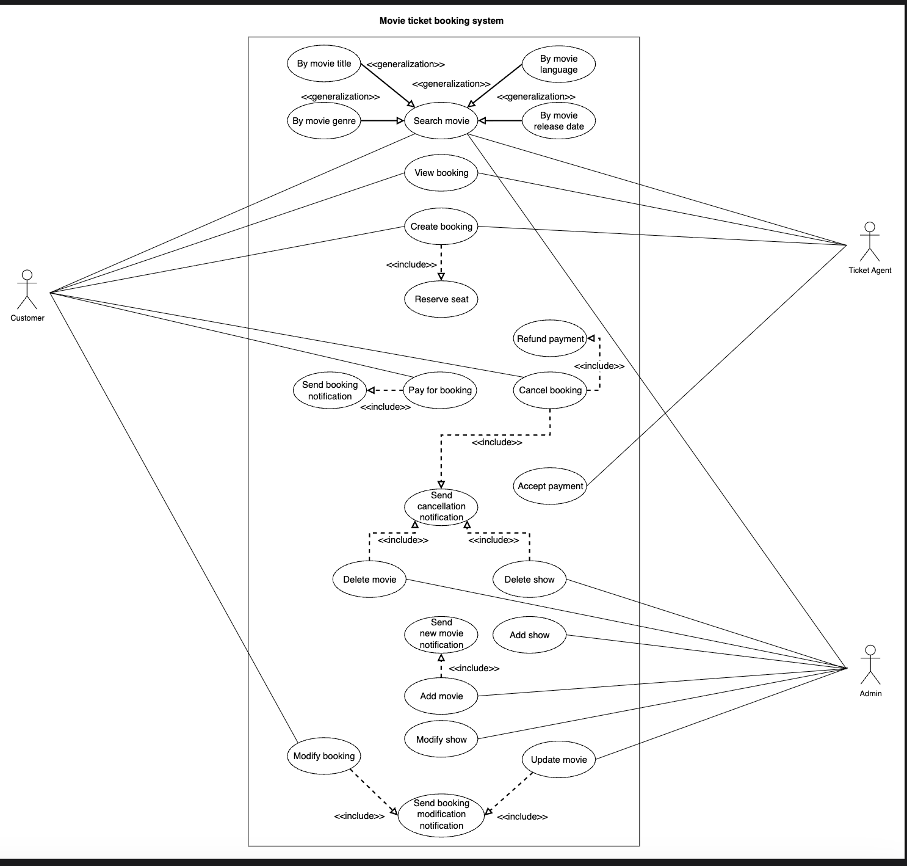

# Use Case Diagram for the Movie Ticket Booking System

Learn how to define use cases and create the corresponding use case diagram for the movie ticket booking system.

Let's build the use case diagram for the movie ticket booking system and understand the relationship between its main actors and functions. First, we'll define the different elements of our system, followed by the complete use case diagram.

## System

Our system is the movie ticket booking system. It manages movie and show listings, ticket bookings, seat reservations, and notification delivery.

## Actors

Now, we will define the main actors of our movie ticket booking system.

### Primary Actors

**Customer**: Searches for movies, creates bookings, reserves seats, pays for tickets, views/modifies/cancels bookings.

**Ticket Agent**: The ticket agent will assist the customer and perform almost all the tasks a customer can do, such as creating a movie ticket booking on behalf of the customer, searching for movies, and reserving seats at the halls, except for modifying and canceling a booking.

### Secondary Actors

**Admin**: Manages movies and showtimes by adding, deleting, or updating them.

## Use Cases

This section will define the use cases for movie ticket booking systems. We have listed the use cases according to their interactions with a particular actor.

**Note:** Some use cases will occur multiple times because they are shared among different actors in the system.

### Admin

* **Add show**: To add a new show for a particular movie in any cinema hall, specifying the movie, time, hall, and seat layout.
* **Modify show**: This function allows you to update the details of an existing show (such as date, time, or hall assignment) for any movie.
* **Delete (cancel) show**: To remove or cancel a scheduled show for a movie. This may also trigger notifications to affected customers.
* **Add movie**: To add a new movie to the system's listing, specify the title, language, genre, release date, and description.
* **Update movie**: To edit the details of an existing movie, such as title, language, genre, or duration.
* **Search movie**: To search for movies in the system using filters like title, language, genre, or release date.
* **Delete movie**: To permanently remove a movie from the system, which may also involve canceling all its scheduled shows and notifying customers.

### Customer

* **Search movie**: You can search for movies by title, language, genre, or release date and view available shows across all cinemas.
* **Create booking**: To select a show, choose seats from the seating map, provide customer details, and create a booking.
* **View booking**: To view booking details, including movie name, showtime, cinema, hall, seat numbers, and booking status.
* **Modify booking**: To change selected seats or update booking details before final confirmation.
* **Cancel booking**: To cancel an existing booking, release reserved seats and, if applicable, request a refund.
* **Reserve seat**: To select one or more available seats from the real-time seating map during booking.
* **Pay for booking**: To complete payment for booked tickets using cash or a credit card (for online bookings).

### Ticket Agent

* **Search movie**: To search for movies by title, language, genre, or release date, on behalf of a customer at the cinema.
* **Create booking**: To select a show, choose seats, and create a booking for the customer in person.
* **View booking**: To retrieve and display the booking details for a customer at the cinema.
* **Reserve seat**: To select and reserve available seats for a show during in-person booking.
* **Accept payment**: To collect payment for bookings via cash or credit card on behalf of the customer.

### Movie Ticket Booking System

* **Send new movie notification**: To automatically notify users (who have opted in) when a new movie is added to the system.
* **Send booking notification**: To send confirmation notifications to customers upon successful booking and payment.
* **Send cancellation notification**: Customers should receive notifications if their booking, movie, or show is canceled.
* **Send booking modification notification**: To automatically notify customers when their booking details (such as seat selection, showtime, or cinema hall) are changed.

## Relationships

This section describes the relationships between actors and use cases in the movie ticket booking system. Understanding these relationships clarifies how different system components interact and helps ensure a robust, consistent design.

### Generalization

Generalization shows inheritance or specialization between actors or use cases. The Search movie use case generalizes more specific search types:

* "Search movie by title"
* "Search movie by language"
* "Search movie by genre"
* "Search movie by release date"

Each specialized search is a specific way to perform the generic Search movie action. By showing generalization, we communicate that users can choose any of these criteria without changing the main workflow, and future new criteria can be added without restructuring the diagram.

### Associations

The table below shows the association relationship between actors and their use cases.

| Admin | Customer | Ticket Agent | Movie Ticket Booking System |
|-------|----------|--------------|---------------------------|
| Add show | Search movie | Search movie | Send new movie notification |
| Modify show | Create booking | Create booking | Send booking notification |
| Delete (cancel) show | View booking | View booking | Send cancellation notification |
| Add movie | Modify booking | Reserve seat | Send notifications for booking |
| Update movie | Cancel booking | Accept payment | |
| Search movie | Reserve seat | | |
| Delete movie | Pay for booking | | |

### Include

The "include" relationship indicates that a use case always incorporates the behavior of another use case into its process.

* **Create booking → Reserve seat**: Reserving seats is essential in the booking process, so "Create booking" always includes "Reserve seat."
* **Pay for booking → Send booking notification**: Sending a booking notification is always included after successful payment.
* **Cancel booking → Refund payment**: If payment was made, initiating a refund is always included as part of the cancellation process.
* **Add movie → Send new movie notification**: Notification is always sent when a new movie is added.
* **Cancel booking, Delete movie, Delete show → Send cancellation notification**: Canceling a booking, movie, or show always results in a cancellation notification.
* **Modify booking and Modify show → Send booking modification notification**: Notification is always sent to customers when their booking details (such as seat selection, showtime, or cinema hall) are changed or the admin changes anything regarding the show.

## Use Case Diagram

Here is the use case diagram of the movie ticket management system.

