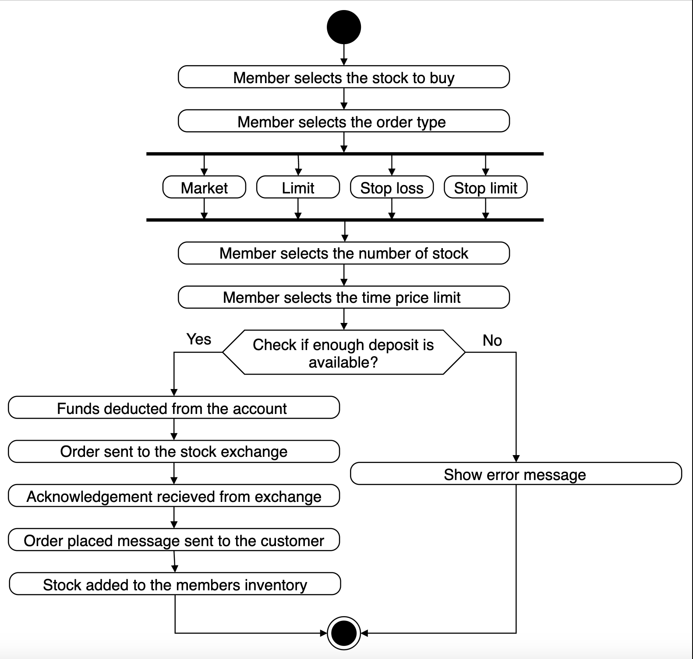

# Activity Diagram for the Online Stock Brokerage System

Create an activity diagram for the online stock brokerage system.

Activity diagrams are a great way to visualize the flow of messages from one activity to another in the system. We can create different activity diagrams for our online stock brokerage system. In this lesson, we will create an activity diagram for the following activity.

## Buying a stock

The states and actions involved in this activity diagram are listed below.

### States

**Initial state:** The member selects a stock to buy.

**Final state:** There are two final states present in this activity diagram, shown below:

* The member successfully buys a stock from the online stock brokerage system.
* Due to the unavailability of a sufficient deposit, members cannot buy the stocks.

### Actions

The member selects the stock to buy, the order type, quantity, time price limit, and time enforcement. The system then checks if the member has a sufficient deposit in their account. If the funds are available, the system deducts the amount, sends the order details to the stock exchange, and, upon receiving acknowledgment, notifies the member of the successful order. The purchased stocks are then added to the member's inventory.

Based on the order above, the activity diagram for buying a stock at the online stock brokerage system is provided below:

Note: This activity is limited to cases where the stock is successfully placed only if the deposit is available.

