# Class Diagram for the Online Stock Brokerage System
Learn to create a class diagram for a stock brokerage system using the bottom-up approach.

In this lesson, we’ll identify and design the classes, abstract classes, and interfaces based on the requirements we have previously gathered from the interviewer in an online stock brokerage system.

## Components of a stock brokerage system
As mentioned, we will design the online stock brokerage system using a bottom-up approach.

### Account
`Account`: This abstract class stores a person’s account information. It has members like account ID, name, password, account status, address, email, and phone number. There can be two types of accounts: `Admin` and `Member`.

`Member`: They can search the stock, place an order to buy or sell stocks, create an account, start a membership, add stocks to the wish list, add buying and selling limits, and perform transactions in many ways.

`Admin`: They can block or unblock members, cancel their membership, and reset passwords.  

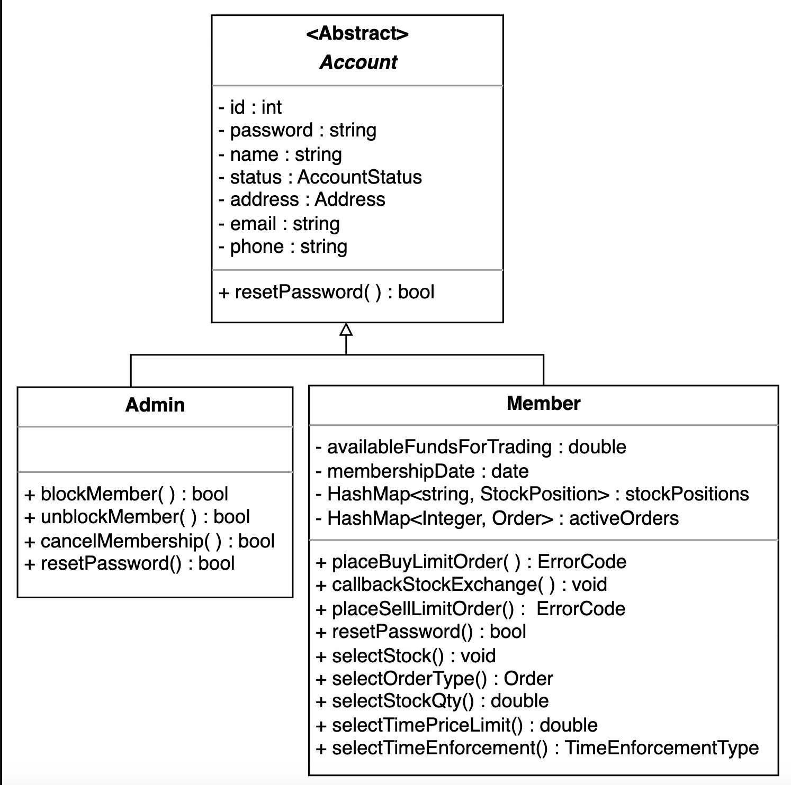

### Watch list
A **watch list** is a list of stocks that an investor monitors to profit from price drops. Below is a visual representation of the Watchlist class.

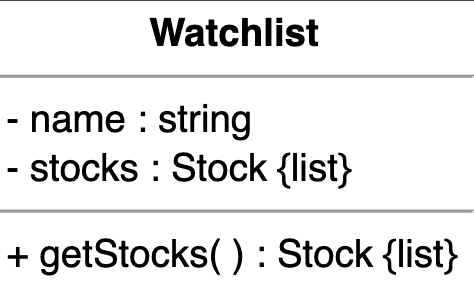

<strong>Click to view related requirements</strong>

**R2:** Users can have numerous watch lists consisting of different stock quotes.

 

### Stock
A **stock**, also known as equity, is a security that represents a portion of the issuing company’s ownership. The `Stock` class will have a symbol, price, etc.

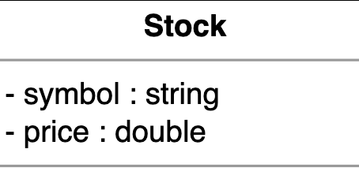

<strong>Click to view related requirements</strong>

**R1:** The system should allow users to easily trade stocks (buy or sell them).

 

### Search and stock inventory
The `StockInventory` class will retrieve and keep up with the most recent stock values from the `StockExchange` class (defined later). The `StockInventory` class implements the Search interface.

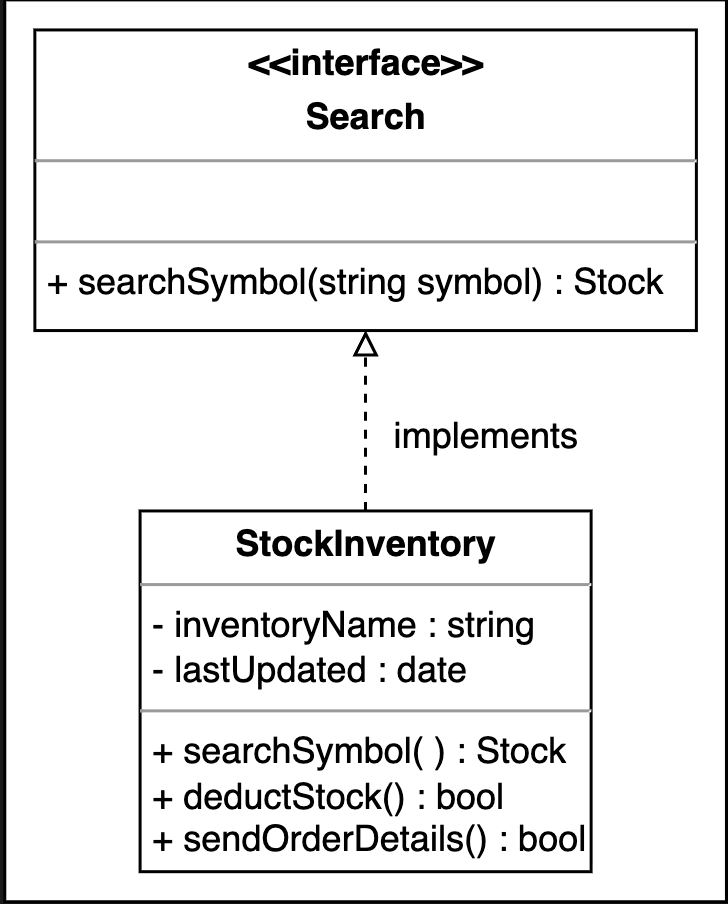

### Stock position
All the stocks the user owns will be included in the `StockPosition` class.

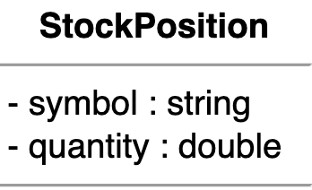

### Stock lot
A member may purchase various lots of the same stock on various dates. The `StockLot` class will represent these particular lots.

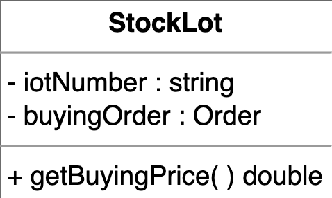

<strong>Click to view related requirements</strong>

**R3:** Users may own different lots of the same stock. If a user has purchased the same stock more than once, the system should be able to distinguish between several lots of it.

 

### Order
Members can place stock trading orders to sell or acquire stock positions. There are four types of orders supported by the system:

`MarketOrder`: This allows customers to purchase or sell equities immediately at the market’s going rate (current market price).

`LimitOrder`: A user may specify a price at which they wish to purchase or sell a stock.

`StopLossOrder`: An order to purchase or sell whenever the stock hits a specific price.

`StopLimitOrder`: The `StopLimitOrder` becomes a limit order to purchase or sell at the limit price, or better, if the stop price is reached.

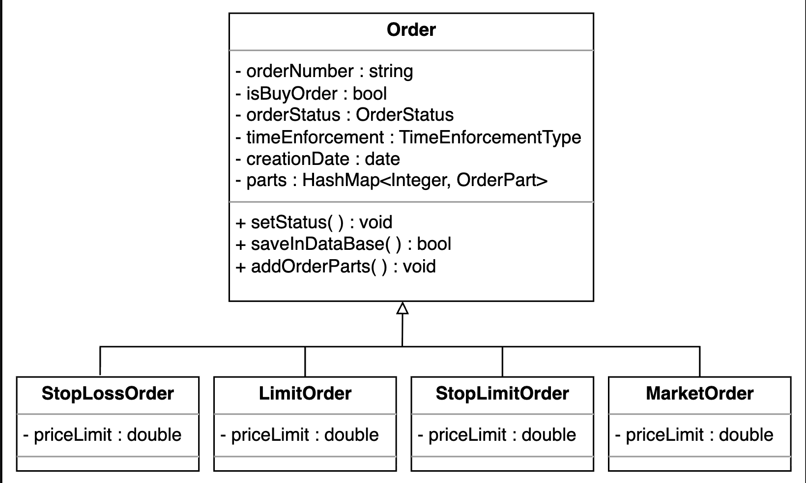

<strong>Click to view related requirements</strong>

**R5:**The system should allow the user to order the stock trade of the types given below:

- **Market order**: Buy or sell stocks at the current market price.  
- **Limit order**: Buy or sell stocks at the price set by the user.  
- **Stop-loss order**: Buy or sell stocks when they reach a certain price.  
- **Stop-limit order**: Buy or sell stocks with a restriction on the limit price (maximum price to be paid, minimum price to be received, etc).  

### Order part
Multiple order parts might be used to complete an order. The `OrderPart` class contains the price, quantity, and execution date.

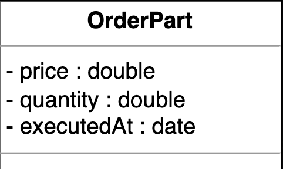

### Deposit and withdraw money
The `DepositMoney` class represents a transfer of money from one party to another.  

The `WithdrawMoney` class represents removing money from an account.

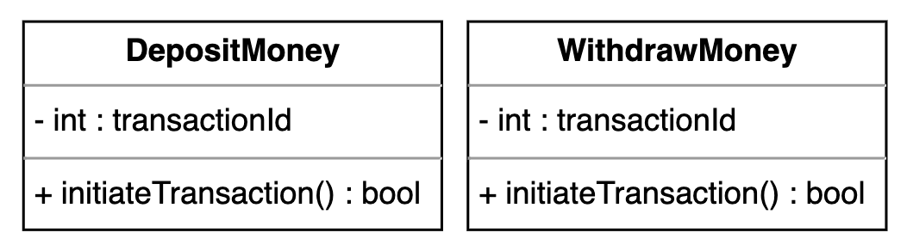

<strong>Click to view related requirements</strong>

**R6:** The system should allow users to make deposits and withdrawals using checks, wire transfers, or electronic bank transfers.

 

### Transfer money
Users should be able to deposit and withdraw money via check, wire, or electronic bank transfer.  

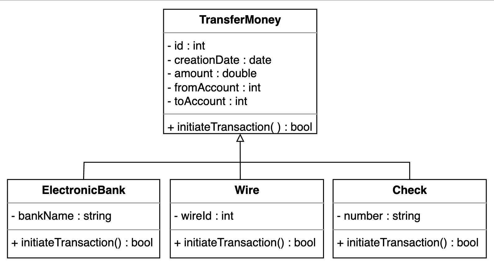

<strong>Click to view related requirements</strong>

**R6:** The system should allow users to make deposits and withdrawals using checks, wire transfers, or electronic bank transfers.

 

### Notification
`Notification` is an abstract class responsible for sending notifications when trade orders are executed. Every notification has an ID, creation date, and content. It can be an SMS or email notification.

The `SmsNotification` class requires the member's phone number to send a notification. The `EmailNotification` class needs the member's email address to send a notification. The relationship diagram of these classes is shown here:  

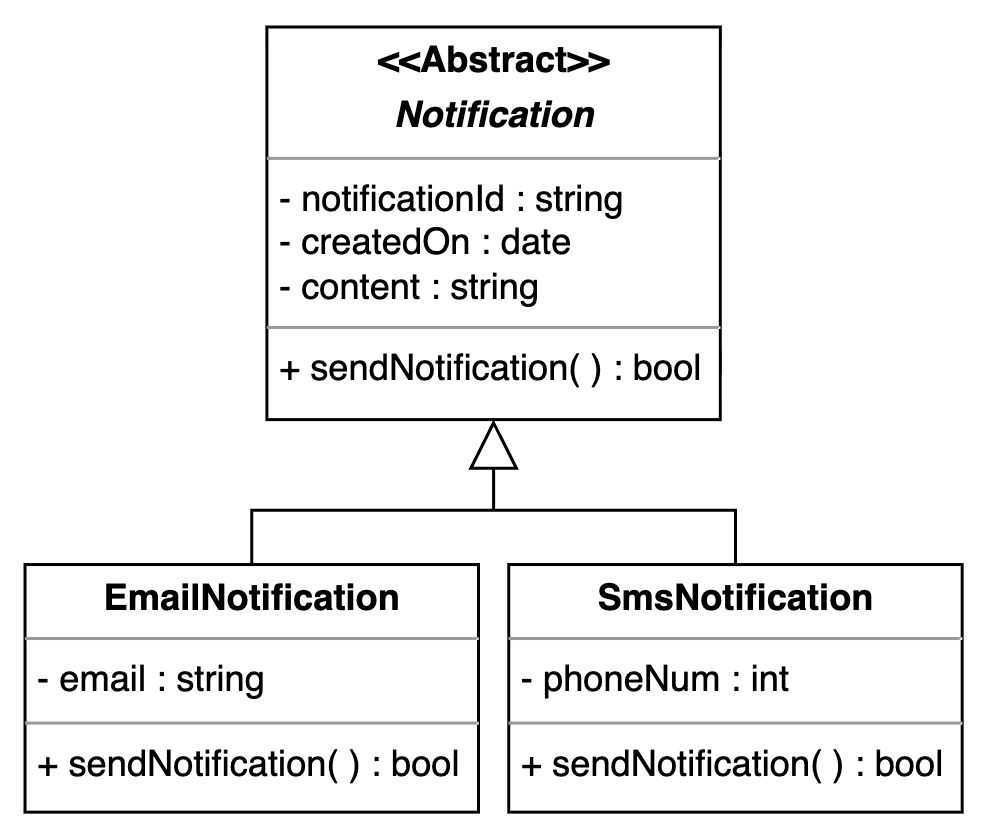

<strong>Click to view related requirements</strong>

**R4:** The system should be able to notify users whenever a trade order is executed.

 

### Stock exchange
The stock brokerage system will get all stocks from the stock exchange and their current pricing. The `StockExchange` class is responsible for creating orders for trading stocks on the stock exchange.

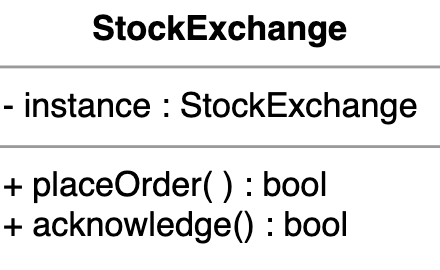

### Enumerations and custom data types
The following provides an overview of the enumerations and custom data types used in this problem:

- `OrderStatus`: We need to create an enumeration to keep track of the status of the order, whether it is open, filled, partially filled, or canceled.

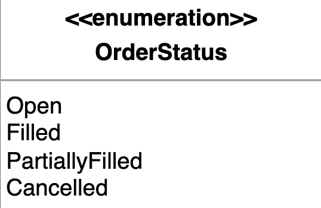

- `TimeEnforcementType`: We need to create an enumeration for the time enforcement type, whether it is good till canceled, fill or terminate, immediate or cancel, on the open, or on the close.  

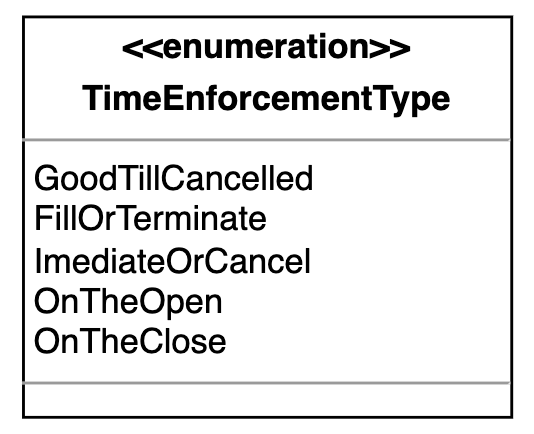

- `AccountStatus`: We need to create an enumeration to keep track of the account's status, whether it is active, canceled, closed, blacklisted, or none.

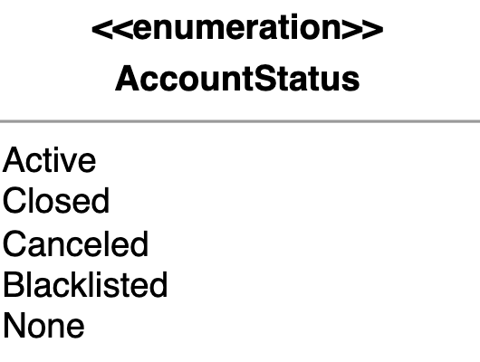

- `ErrorCode`: We need to create an enumeration to represent the outcome of operations, indicating whether they were successful, failed due to insufficient funds, invalid inputs, or were rejected for other reasons. 

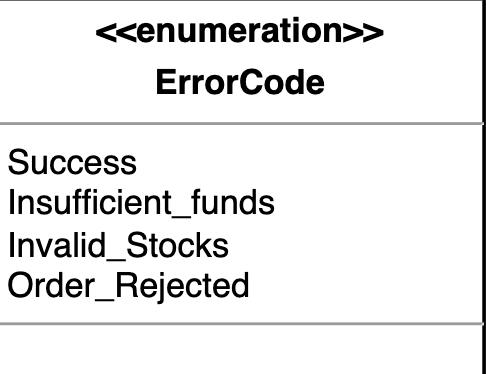

### Address
We also need to create a custom data type, `Address`, to store the user's location.

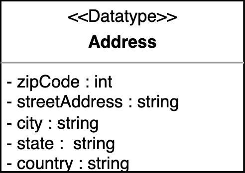

## Relationship between the classes
Now, we’ll discuss the relationships between the classes we have defined above in our online stock brokerage system.

### Association
The class diagram has the following association relationships:

#### One-way association
- The `StockInventory` class has a one-way association with `Watchlist` and `StockExchange`.  
- The `Order` class has a one-way association with `Stock`, `StockExchange`, and `StockLot`.  
- The `Account` class has a one-way association with `Order`, `DepositMoney`, and `WithdrawMoney`.  
- The `StockPosition` class has a one-way association with the `Order` class.  

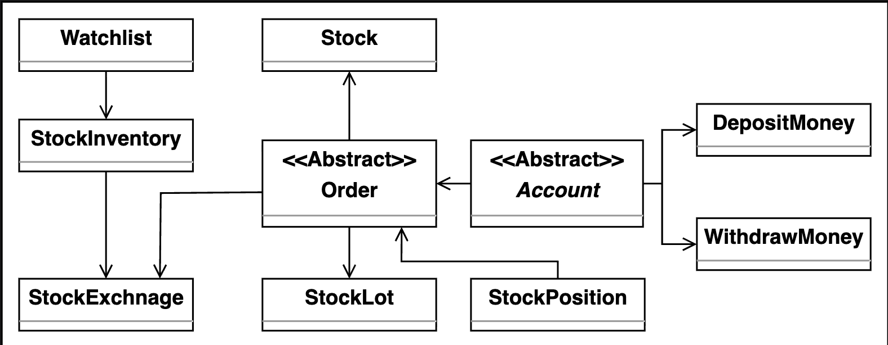 

#### Two-way association
- The `Notification` class has a two-way association with the `Order` class.  
- Both `Watchlist` and `StockPosition` have a two-way association with the `Account` class.  

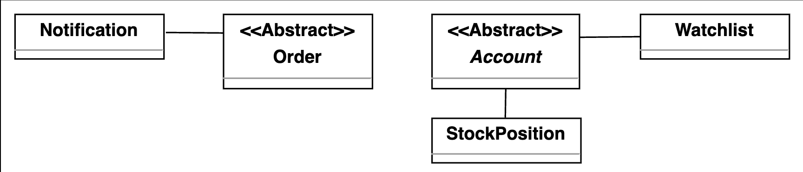  

### Composition
The class diagram has the following composition relationships:

- The `Order` class is composed of `OrderPart`.  
- The `StockInventory` class is composed of `Stock`.  
- The `StockPosition` class is composed of `StockLot`.  

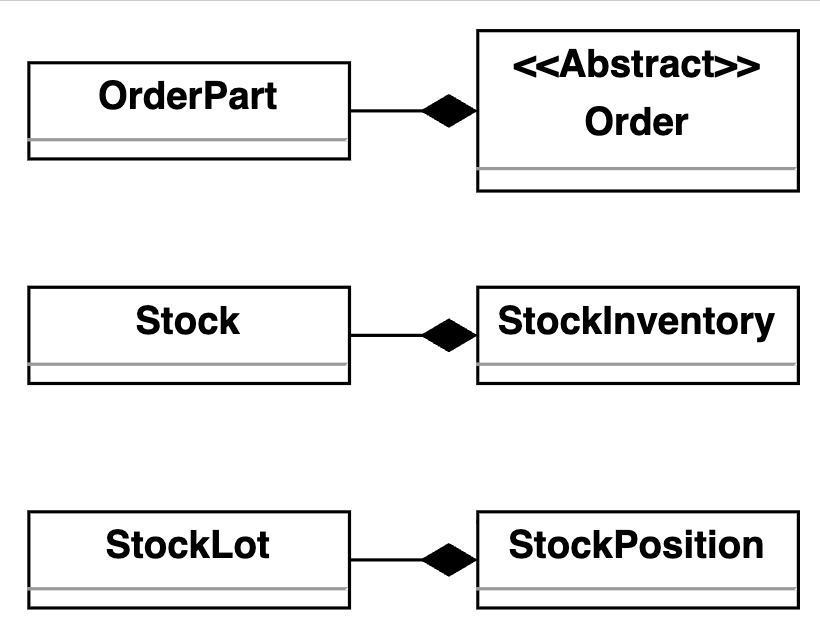

### Inheritance
The following classes show an inheritance relationship:

- Both `Admin` and `Member` extend the `Account` class.  
- The `MarketOrder`, `LimitOrder`, `StopLimitOrder`, and `StopLossOrder` classes extend the `Order` class.  
- The `ElectronicBank`, `Wire`, and `Check` classes extend the `TransferMoney` class.  
- The `SmsNotification` and `EmailNotification` classes extend the `Notification` class.  
- The `StockInventory` class implements the `Search` interface.  

## Class diagram of the online stock brokerage system

This section outlines the multiplicity (cardinality) relationships between the main classes in our online stock brokerage system. We explain the allowed number of instances on each side for each relationship and the real-world or design rationale behind the connection. Understanding these relationships is key to modeling how different entities interact and collaborate to support key workflows in the system.

**Source** | **Target** | **Multiplicity** | **Description**
--- | --- | --- | ---
StockExchange | Order | 1 – 0..* | A stock exchange can receive multiple orders.
StockExchange | OrderPart | 1 – 0..* | A stock exchange manages multiple order parts.
Watchlist | Stock | 0..* | A watchlist can contain multiple stocks.
StockInventory | Stock | 1 – 0..* | Inventory may manage multiple stocks.
Order | OrderPart | 1 – 0..* | An order is composed of multiple order parts.
Notification | EmailNotification | 0..* | Generalization/Inheritance.
Notification | SmsNotification | 0..* | Generalization/Inheritance.
Account | Address | 1 – 1 | Each account has one address.
Account | DepositMoney | 1 – 0..* | An account can have multiple deposit transactions.
Account | WithdrawMoney | 1 – 0..* | An account can have multiple withdrawal transactions.
Admin | Account | 1 – 1 | Admin inherits from Account.
Member | Account | 1 – 1 | Member inherits from Account.
Member | StockPosition | 1 – 0..* | A member may hold multiple stock positions.
Member | Order | 1 – 0..* | A member can place multiple orders.
StockPosition | Stock | 1 – 1 | A stock position is related to one stock.
TransferMoney | ElectronicBank | 1 – 1 | Transfer via electronic bank.
TransferMoney | Wire | 1 – 1 | Transfer via wire.
TransferMoney | Check | 1 – 1 | Transfer via check.
StopLossOrder | Order | 1 – 1 | StopLossOrder inherits from Order.
LimitOrder | Order | 1 – 1 | LimitOrder inherits from Order.
StopLimitOrder | Order | 1 – 1 | StopLimitOrder inherits from Order.
MarketOrder | Order | 1 – 1 | MarketOrder inherits from Order.
StockLot | Order | 1 – 1 | Each stock lot is linked to one buying order.

Here is the complete class diagram for our online stock brokerage system:

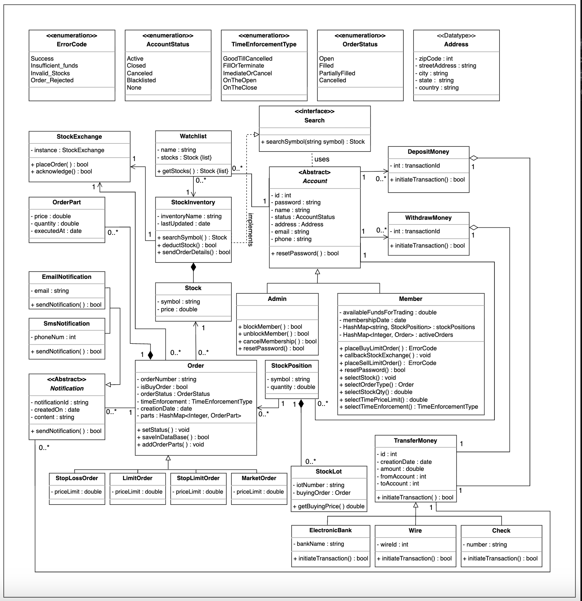

## Design pattern
- To implement online stock brokerage’s core features in a flexible and scalable way, we apply the object-oriented design patterns based on system behavior.

- The trading system handles different types of orders, such as market, limit, stop-loss, and stop-limit. We can use the Factory design pattern to manage the creation of these order types efficiently.

- The system processes payments through multiple channels, such as electronic bank, wire, or check. The Strategy design pattern can encapsulate these varying payment methods.

- Users or watch lists may want to be notified when a stock’s price changes. We can use the Observer design pattern to model this real-time notification behavior.

- Notifications can be sent via different channels, like email or SMS, and we might want to extend this with extra features like logging. To support this extensibility, we can use the Decorator design pattern.

- We know that only one StockExchange instance should be shared across the application. To ensure this, we can use the Singleton design pattern.

- We know that the process of sending a notification may follow a common structure but differ in implementation (email vs. SMS). We can use the Template Method design pattern to enforce this structure while allowing customization.

- We know that placing an order or sending a notification may need to be queued, logged, or executed later. We can use the Command design pattern to encapsulate these requests as objects.

- We know an order may consist of multiple parts, each with its own quantity and price, but we want to treat them as a single entity. To achieve this, we can use the Composite design pattern.

- Creating a complex order with multiple parts, statuses, and configurations can involve many steps. We can use the Builder design pattern to simplify and organize this process.