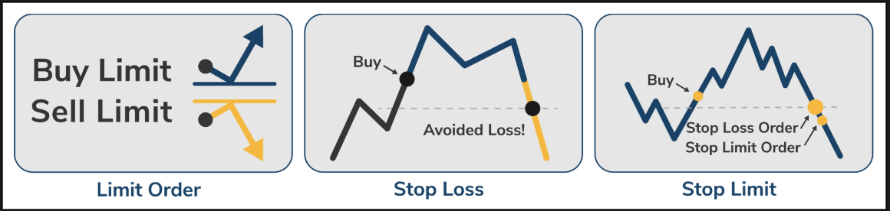

# Requirements for the Online Stock Brokerage System

Learn about all the requirements for an online stock brokerage system.

In this lesson, we'll list the requirements of the online stock brokerage system. This is a crucial step as requirements define the scope of a problem. Getting them right from the interviewer and understanding them well will make the design of the rest of the system smooth and easy.

We'll use the notational convention to identify each requirement with a unique label "Rn," where "R" is short for requirement and "n" is a natural number.

## Requirement collection

The following are the requirements that we have defined for the online stock brokerage system:

* **R1:** The system should allow the user to easily trade in stocks (buy or sell the stocks).
* **R2:** Users can have numerous watch lists consisting of different stock quotes.
* **R3:** Users may own different lots of the same stock. If a user has purchased the same stock more than once, the system should be able to distinguish between several lots of it.
* **R4:** The system should be able to notify users whenever a trade order is executed.
* **R5:** The system should allow the user to order the stock trade of the types given below:
   * Market order: Buy or sell stocks at the current market price.
   * Limit order: Buy or sell stocks at the price set by the user.
   * Stop-loss order: Buy or sell stocks when they reach a certain price.
   * Stop-limit order: Buy or sell stocks with a restriction on the limit price (maximum price to be paid, minimum price to be received, etc).  

* **R6:** The system should allow users to make deposits and withdrawals using checks, wire transfers, or electronic bank transfers.