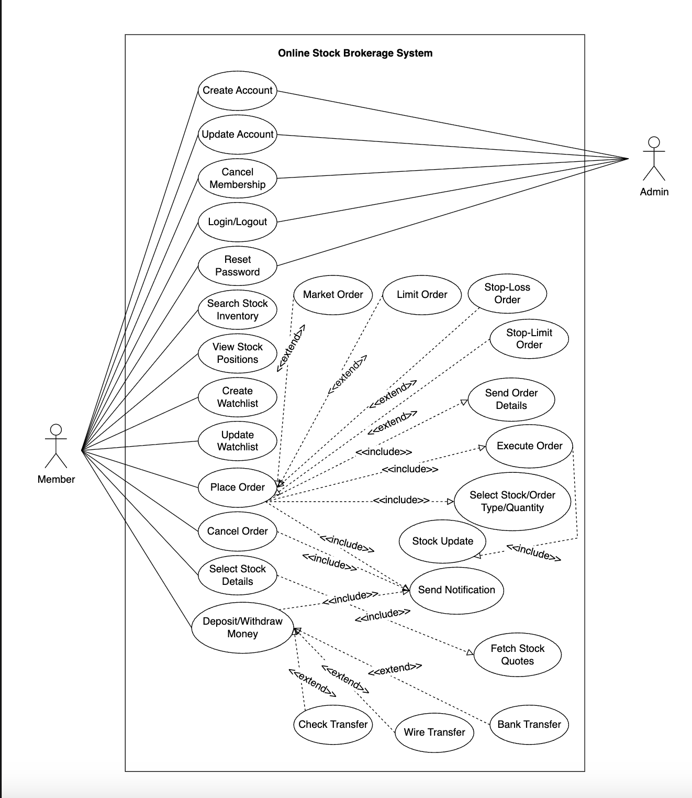

# Use Case Diagram for the Online Stock Brokerage System

Learn how to define use cases and create the corresponding use case diagram for the online stock brokerage system.

Let's build the use case diagram of the online stock brokerage system and understand the relationship between its different components. First, we'll define the different elements of our online stock brokerage, followed by the complete use case diagram of the system.

## System

Our system is a stock brokerage.

## Actors

Now, we'll define the main actors of our online stock brokerage system.

### Primary actor

**Member:** The member is the main user of the system who can create, update, or cancel an account, log in and out, and reset their password. Members can search for stocks, manage watch lists, view stock positions, and place different orders (market, limit, stop-loss, and stop-limit). They can select stock details, cancel orders, and perform transactions via electronic transfer, wire, or check. Members also receive notifications about order and transaction statuses.

### Secondary actors

**Admin:** The admin manages user accounts. They can create, update, or cancel accounts, log in and out, reset passwords, and block or unblock members when necessary.

**System:** The system handles internal processes such as fetching stock quotes, sending order details to the stock exchange, acknowledging and processing orders, and notifying members about order and transaction updates.

## Use cases

This section will define the use cases for the online stock brokerage system. We have listed the use cases according to their interactions with a particular actor.

Note: Some use cases will occur multiple times because they are shared among different actors in the system.

### Member  
**Create account:** To register a new user in the system.  
**Update account:** To modify existing account information.  
**Cancel membership:** To terminate the user's membership and access.  
**Login/Logout:** To authenticate or end a user session.  
**Reset password:** To recover access by setting a new password.  
**Search stock inventory:** To look up stock details using a symbol.  
**View stock positions:** To display current holdings and quantities.  
**Create watch list:** To create a new list to track favorite stocks.  
**Update watch list:** To add or remove stocks from an existing watchlist.  
**Place order:** To submit an order to buy or sell stocks.  
**Select stock details:** To choose stock, order type, quantity, and price.  
**Cancel order:** To stop a pending order before execution.  
**Deposit money:** To fund the account via electronic transfer, wire, or check.  
**Withdraw money:** To transfer funds out of the trading account.  
**Receive order notification:** To get alerts on order execution status.  
**Receive transaction notification:** To be informed about deposit or withdrawal updates.

### Admin  
**Create account:** To add a new member to the system.  
**Update account:** To modify existing member details.  
**Cancel membership:** To terminate a member's access to the system.  
**Login/Logout:** To access or exit the admin interface.  
**Reset password:** To assist a member in password recovery.

### System  
**Fetch stock quotes:** To retrieve live stock prices from the exchange.  
**Send order details:** To forward order information to the stock exchange.  
**Execute order:** To process, match, and fulfill stock orders.  
**Deduct stock:** To adjust inventory after trade execution.  
**Send order notification:** To notify members of order status changes.  
**Send transaction notification:** To inform members of deposit or withdrawal outcomes.

## Relationships

This section describes the relationships between and among actors and their use cases.

### Generalization

The "Electronic bank transfer," "Wire transfer," and "Check transfer" use cases are used for transactions. Hence, they have a generalization relationship with the "Transaction" use case.

The "Place market order," "Place limit order," "Place stop-loss order," and "Place stop-limit order" use cases represent different ways of placing a trade. Hence, they have a generalization relationship with the "Place order" use case.

### Associations

The table below shows the association relationship between actors and their use cases.

| Member | Admin | System |
|--------|-------|--------|
| Create account | Create account | Fetch stocks quotes |
| Update account | Cancel membership | Send order details |
| Cancel membership | Update account | Send deposit/withdrawal status change notification |
| Login/Logout | Login/Logout | Send notification |
| Reset password | Reset password | Execute order |
| Search stock inventory | | Deduct stock |
| View stock positions | | |
| Create watchlist | | |
| Update watchlist | | |
| Place order | | |
| Select stock details | | |
| Cancel order | | |
| Deposit money | | |
| Withdraw money | | |

### Include

When a user places an order, they must provide all relevant details such as stock, order type, quantity, price/limit, and time enforcement.

* The "Place order" use case includes the "Select stock," "Select order type," "Select quantity," and "Select price/limit" use cases.

When a user places an order, the system processes stock deduction, sends notifications, and forwards order details.

* The "Place order" use case includes the "Deduct stock," "Send notification," and "Send order details" use cases.  
The system retrieves the latest stock quotes when a user selects stock details.

* The "Select stock details" use case includes the "Fetch stock quotes" use case.  
When a user deposits or withdraws money, the system sends a notification.

* The "Deposit/Withdraw money" use case includes the "Send notification" use case.

## Use case diagram

Here's the use case diagram of the online stock brokerage system:
