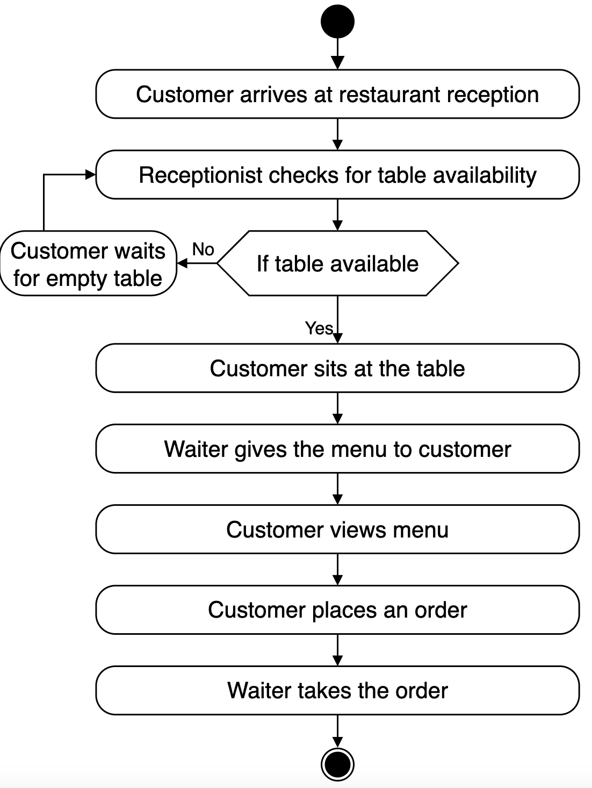
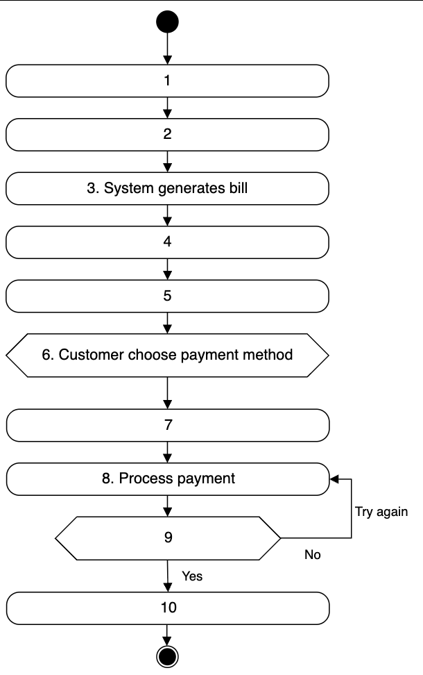
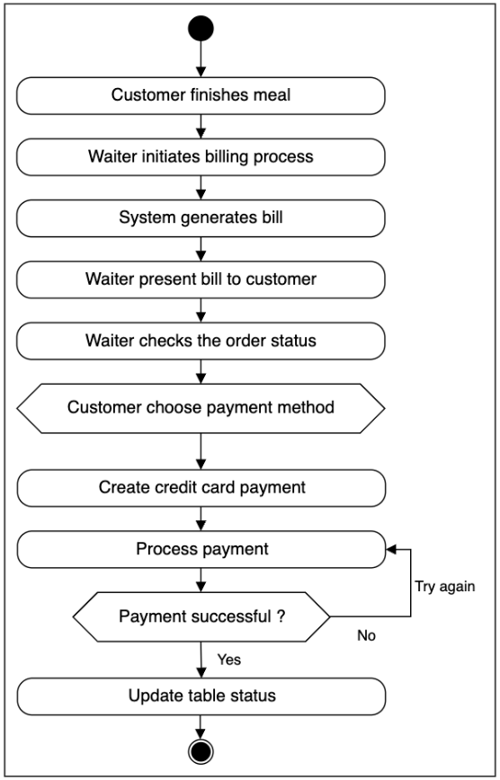

# Activity Diagram for the Restaurant Management System

Create some activity diagrams for the restaurant management system problem.

Activity diagrams are a great way to visualize the flow of messages from one activity to another in the system. There can be different activity diagrams that we can create for our restaurant management system. In this lesson, we'll create activity diagrams for the following two activities:

* Activities for the walk-in customer to place an order
* Activity challenge: Generate a bill and process the payment.

## Place the order  
The following are the states and actions that will be involved in this activity diagram.

### States

**Initial state:** A customer arrives at the restaurant and asks for a table.  
**Final state:** The customer successfully placed a food order.

### Actions  
The customer arrives at the restaurant's reception and requests a table. The receptionist checks for table availability. If a table is available, the customer is seated. If no table is available, the customer waits until one becomes free.

Once the customer is seated, the server approaches with the menu. The customer reviews the menu and decides what to order. The waiter then takes the customer's order.

Based on the order above, the activity diagram of the table booking and the food order is shown below:

### Activity challenge: Billing and payment
Let’s create an activity diagram for a customer to pay the bill.

A skeleton of the activity diagram is given below.

