# Class diagram for the Restaurant Management System
Learn to create a class diagram for the restaurant management system using the bottom-up approach.

We’ll create the class diagram for the restaurant management system. In the class diagram, we will first design the classes and then identify the relationships between classes according to the requirements of the restaurant management system design problem.

## Components of the restaurant management system
As mentioned, we’ll follow the bottom-up approach to design a class diagram for the restaurant management system.

### Person 
The `Person` class is extended by the `Waiter`, `Receptionist`, `Manager`, and `Customer` classes and stores the person’s name, email, and phone number.

- `Waiter`: Takes an order from the customer and generates the bill.  
- `Receptionist`: Creates a reservation.  
- `Manager`: Can update the seating plan and can also update the menu.  
- `Customer`: This derived class can make reservations, place orders, and pay bills.  

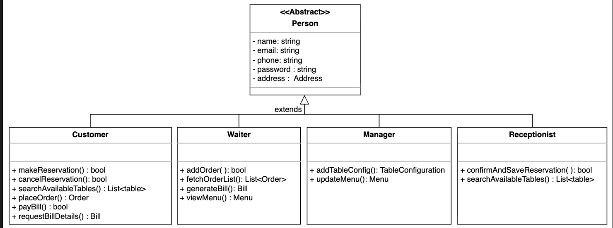

<strong>Click to view related requirements</strong>

**R3:** The server should be able to create an order for a table, add items for each person seated, and update the order as needed.  
**R6:** The system should allow for the reservation of tables.  
**R7:** The receptionist should be able to search for available tables by date and time and make a reservation.

### Table and table seat
The `Table` class is identified by an ID, a limited seating capacity, a specific location, and a status. A table may have multiple seats.

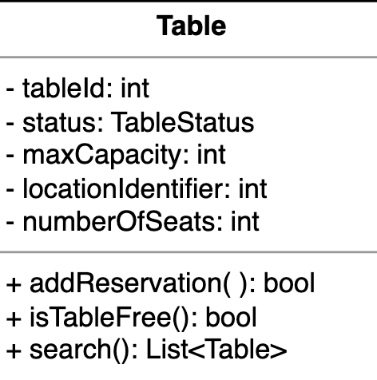

<strong>Click to view related requirements</strong>

**R5:** The system should be able to provide information about tables currently available for walk-in customers. 
**R6:** The system should allow for the reservation of tables.

### Meal and meal item
The `Meal` class represents a customer’s meal at a specific seat and table and contains a list of ordered items.  

`MealItem`: It is identified by a meal item ID and has a specific quantity that can be updated.  

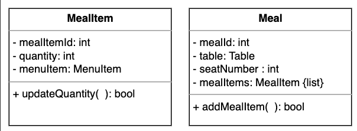

<strong>Click to view related requirements</strong>

**R4:** Each person’s order can consist of multiple items, each corresponding to a menu item.

### Menu, menu section, and menu item
`Menu`: It has a unique ID, title, and description, and may have several sections.  

`MenuSection`: This class represents a menu section with an ID, a title, and a description. It may have multiple menu items.  

`MenuItem`: It is identified by an ID and has a title, description, and price that can be updated.  

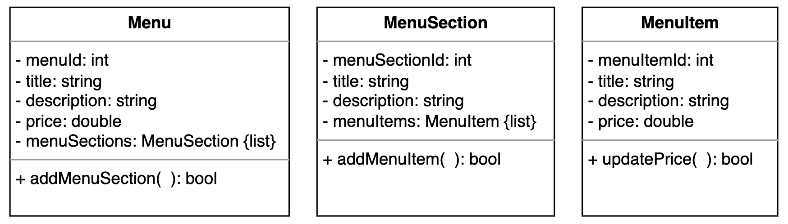

<strong>Click to view related requirements</strong>

**R2:** Each branch will offer a menu with various sections and items.

### Order
The `Order` class is identified by an ID and has a status that can be updated regarding adding or removing meals.

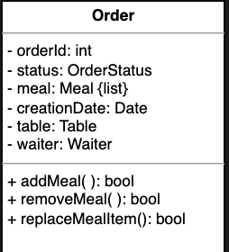

<strong>Click to view related requirements</strong>

**R3:** The server should be able to create an order for a table and add items for each person seated.  
**R4:**  Each person’s order can consist of multiple items, each corresponding to a menu item.

### Reservation
A `Reservation` is made by the receptionist for the customer. This class has a reservation ID, reservation time, count, customer information, status, notes, and check-in time.  

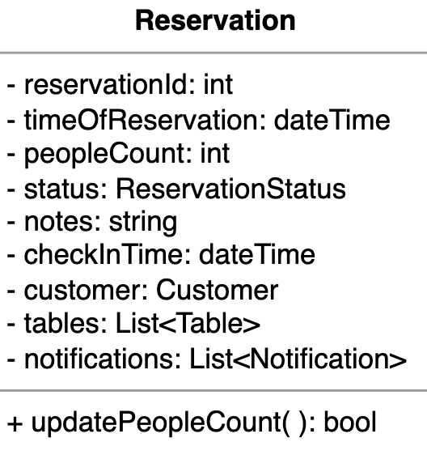

<strong>Click to view related requirements</strong>

**R6:** The system should allow for the reservation of tables.  
**R8:** The system should allow customers to make and cancel reservations.  
**R9:** The system should send notifications as the reservation time approaches.

### Payment 
`Payment` is an abstract class extended by `CreditCardPayment` and `CashTransaction` as its child classes. This class stores a payment ID, the total amount, and the date.

- `CreditCardPayment`: This derived class represents a credit card transaction.  
- `CashTransaction`: This derived class represents a payment made in cash.  

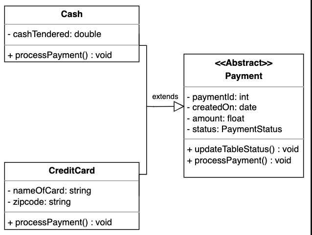

<strong>Click to view related requirements</strong>

**R10:** Customers should be able to pay their bills with credit cards, checks, or cash.  

### Bill
The `Bill` class represents the total amount a customer has to pay based on the items ordered from the menu. This class stores an ID, the total amount to be paid, and the tax. Moreover, it records whether or not the bill was paid.

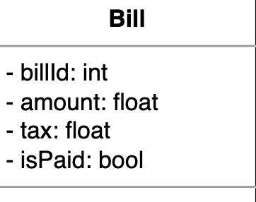

<strong>Click to view related requirements</strong>

**R10:** Customers should be able to pay their bills with credit cards, checks, or cash.  

### Notification
A `Notification` is a message sent to a customer from the restaurant. Every `Notification` has a specific ID, the date it was sent, and the content the customer wrote.

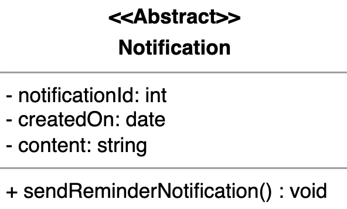

<strong>Click to view related requirements</strong>

**R9:** The system should send notifications as the reservation time approaches.

### Seating chart and branch
`TableConfiguration`: This class represents the seating plan of a restaurant. A unique ID identifies it.  

`Branch`: This class represents the branches of a restaurant. Every Branch has a specific name and location.

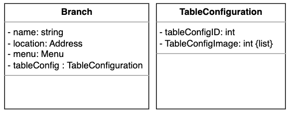

<strong>Click to view related requirements</strong>

**R1:** The restaurant can have multiple branches.
**R2:** Each branch will offer a menu with various sections and items.
**R11:** Each branch may have different configurations of tables.

### Enumerations and custom data types
`TableStatus`: This enumeration checks whether a table is reserved, occupied, or free.

`OrderStatus`: This enumeration keeps track of a customer’s order status.

`PaymentStatus`: This enumeration keeps track of an order’s payment status by the customer.

`ReservationStatus`: This enumeration represents the reservation status of a table for a customer.

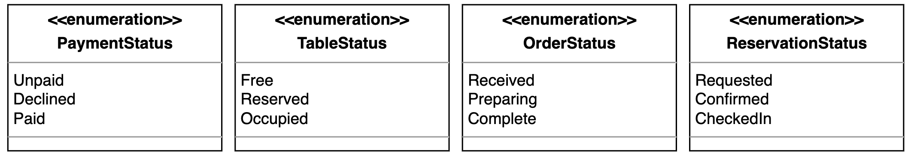

### Address
`Address`: This custom data type represents the address of the restaurant’s branch or a person.

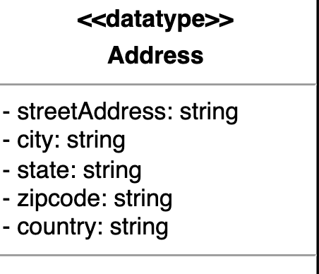

## Relationship between the classes
Now, we’ll discuss the relationships between the classes we have defined above in our restaurant management system.  

### Association
The class diagram has the following association relationships:

#### One-way Association
- The `Waiter`, `Manager`, and `Receptionist` class has a one-way association with the Branch.  
- The `MealItem` class has a one-way association with MenuItem.  
- The `Waiter` class has a one-way association with Order.  
- The `Order` class has a one-way association with Table.  
- The `Receptionist` class has a one-way association with Reservation.  
- The `Reservation` class has a one-way association with Table.  

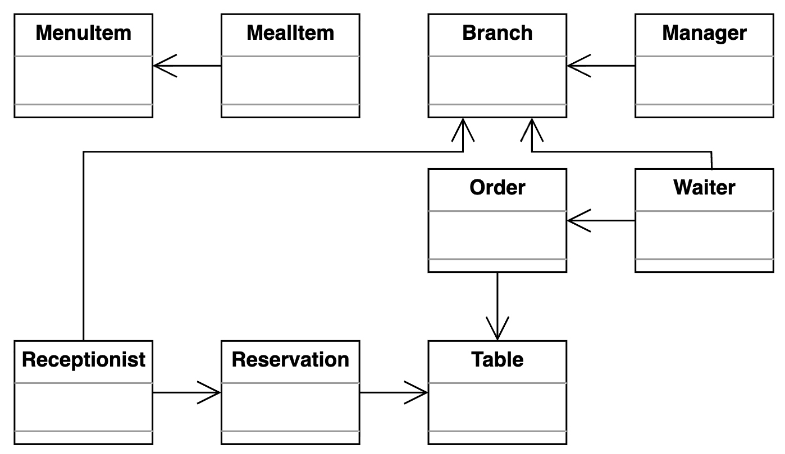

#### Two-way Association  
- The `Branch` and `Menu` classes are associated with each other.  
- The `Customer` and `Reservation` classes are associated with each other.  
- The `Reservation` and `Notification` classes are associated with each other.  
- The `Payment` and `Bill` classes are associated with each other.  
- The `Bill` and `Order` classes are associated with each other.  

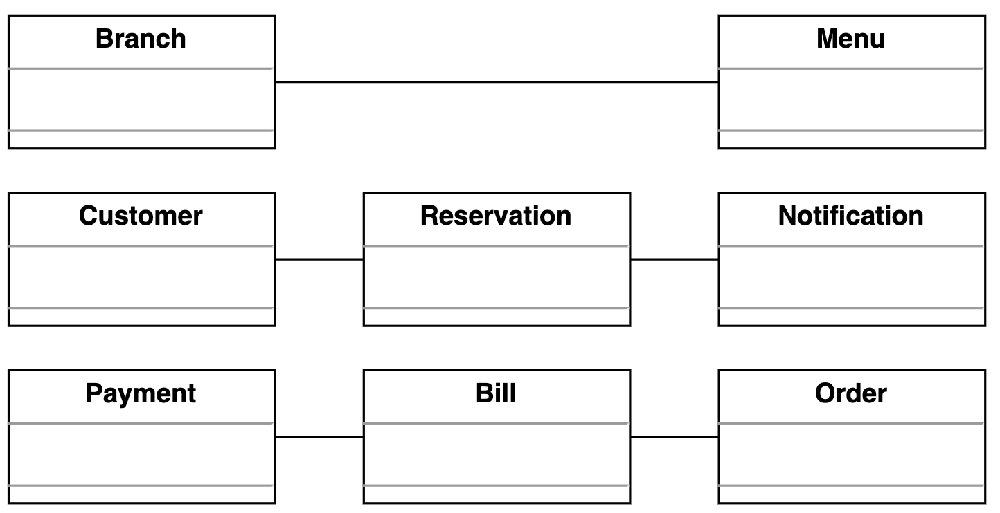

### Composition  
The class diagram has the following composition relationships.

- The `Branch` class is composed of `TableConfiguration`.  
- The `Meal` class is composed of `MealItem` and Table.  
- The `Order` class is composed of `Meal`.  
- The `MenuSection` class is composed of `MenuItem`.  
- The `Menu` class is composed of `MenuSection`.

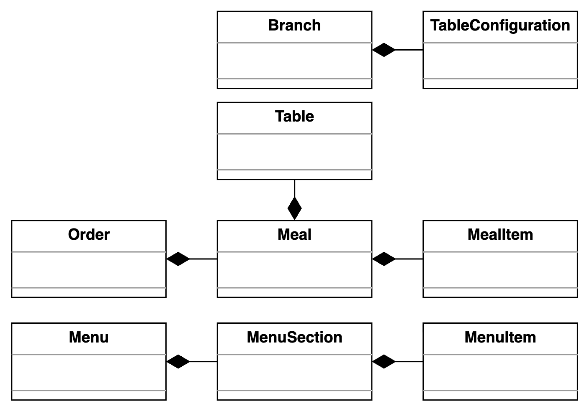

### Inheritance
The following classes show an inheritance relationship:

- All the classes, `Manager`, `Waiter`, `Receptionist`, and `Customer`, extend the `Person` class.  
- `Payment` class is extended by `CreditCardPayment` and `CashTransaction`.  

## Class diagram for the restaurant management system

This section outlines the multiplicity (cardinality) relationships between the main classes in our restaurant management system. We explain the allowed number of instances on each side for each relationship and the real-world or design rationale behind the connection. Understanding these relationships is key to modeling how different entities interact and collaborate to support key workflows in the system.

| Source            | Target            | Multiplicity | Reason                                      |
|-------------------|-------------------|--------------|---------------------------------------------|
| Address           | Customer          | 1 – 1        | A customer has exactly one address.         |
| Customer          | Reservation       | 1 – 0..*     | A customer can make multiple reservations.  |
| Customer          | Order             | 1 – 0..*     | A customer can place multiple orders.       |
| Reservation       | Table             | 0..* – 1    | A reservation can be made for multiple tables. |
| Table             | Branch            | 1 – 1        | A table belongs to exactly one branch.      |
| Branch            | TableConfiguration | 1 – 0..*     | A branch can have multiple table configurations.|
| TableConfiguration | Table             | 1 – 0..*     | A table configuration can relate to multiple tables.|
| Order             | Table             | 1 – 0..*     | An order can be associated with multiple tables.|
| Order             | Bill              | 1 – 0..*     | An order can generate multiple bills.       |
| Bill              | Payment           | 1 – 1        | A bill can have one payment.                 |
| Bill              | Cash              | 1 – 0..1     | A bill can be paid in cash.                   |
| Bill              | CreditCard        | 1 – 0..1     | A bill can be paid via credit card.          |
| Waiter            | Order             | 1 – 0..*     | A waiter can handle multiple orders.         |
| Waiter            | Table             | 1 – 0..*     | A waiter can handle multiple tables.         |
| Order             | Meal              | 1 – 0..*     | An order can contain multiple meals.         |
| Meal              | MenuItem          | 1 – 0..*     | A meal can have multiple menu items.          |
| MenuSection       | MenuItem          | 1 – 0..*     | A menu section can contain multiple menu items.|
| Menu              | MenuSection       | 1 – 0..*     | A menu can have multiple menu sections.       |
| Menu              | TableConfiguration | 1 – 0..*    | A menu can be linked to multiple table configurations.|
| Manager           | Branch            | 1 – 0..*     | A branch may have multiple managers.           |
| Receptionist      | Reservation       | 1 – 0..*     | A receptionist can manage multiple reservations.|
| Reservation       | Notification      | 0..* – 1    | A reservation can have multiple notifications. |
| Waiter            | Branch            | 1 – 0..*     | A branch may have multiple waiters.            |
| Receptionist      | Branch            | 1 – 0..*     | A branch may have multiple receptionists.      |

Here’s the complete class diagram for the restaurant management system:

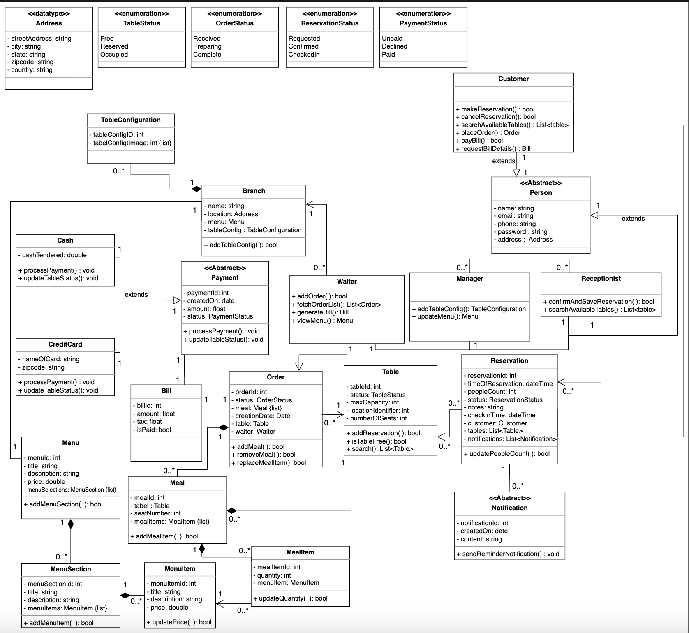

## Design pattern

The following design patterns have been used in the class diagram:

- We know that a restaurant can accept different types of payments, such as cash or credit cards. To model this behavior, we can use the **Strategy** design pattern.
- Every restaurant payment follows a general process: prepare the bill, initiate the transaction, and finalize payment. To model this behavior, we can use the **Template Method** design pattern.
- A restaurant menu is organized into sections (like starters, main courses, and desserts), containing multiple items. The **Composite** design pattern can be used to model this hierarchical structure.
- We know that employees and customers in a restaurant share some common attributes like name, email, and address, but have different roles and responsibilities. We can use **inheritance and polymorphism** to model this shared behavior with specialization.

# Additional requirements
The interviewer can introduce some additional requirements in the given restaurant management system, or they can ask some follow-up questions. Let’s see examples of the additional requirements:

- **Discount:** A discount will be applied to the payment depending on special events such as the New Year, an anniversary, a branch opening, etc. The class diagram provided below shows the relationship of **Discount** with the **Payment** class:

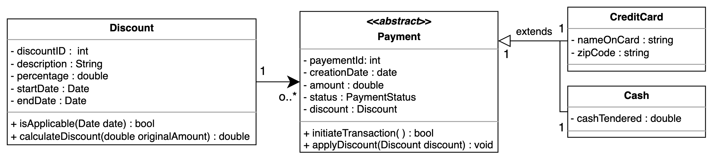

We can update the `Payment` class to include an a`pplyDiscount()` method that can be invoked during the transaction process. This method would check if a discount is applicable based on the payment’s creation date and, if so, apply the discount to the total amount.