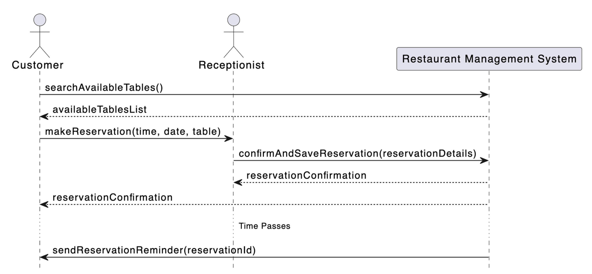
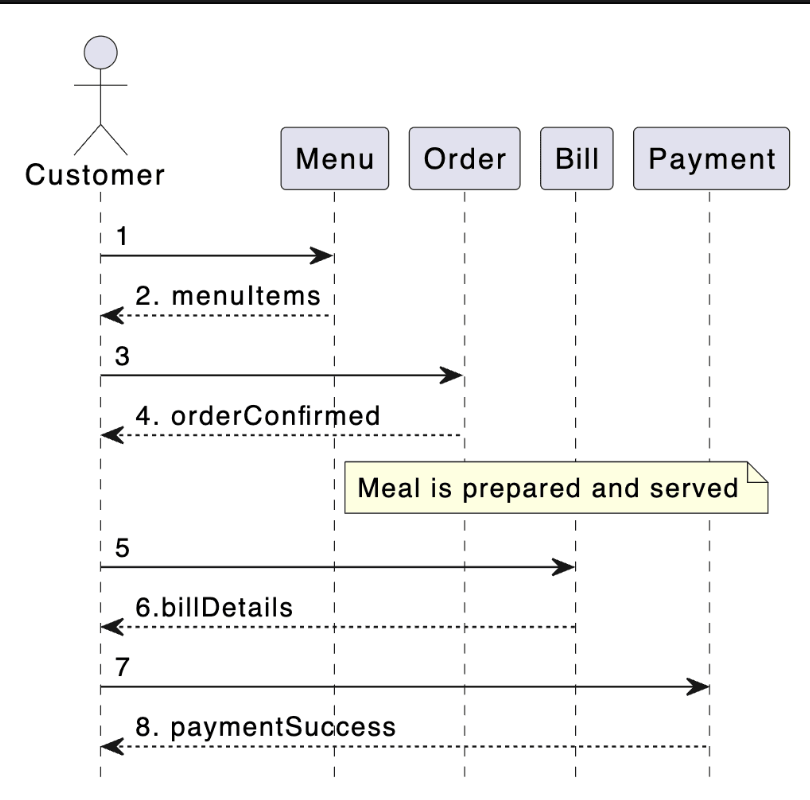
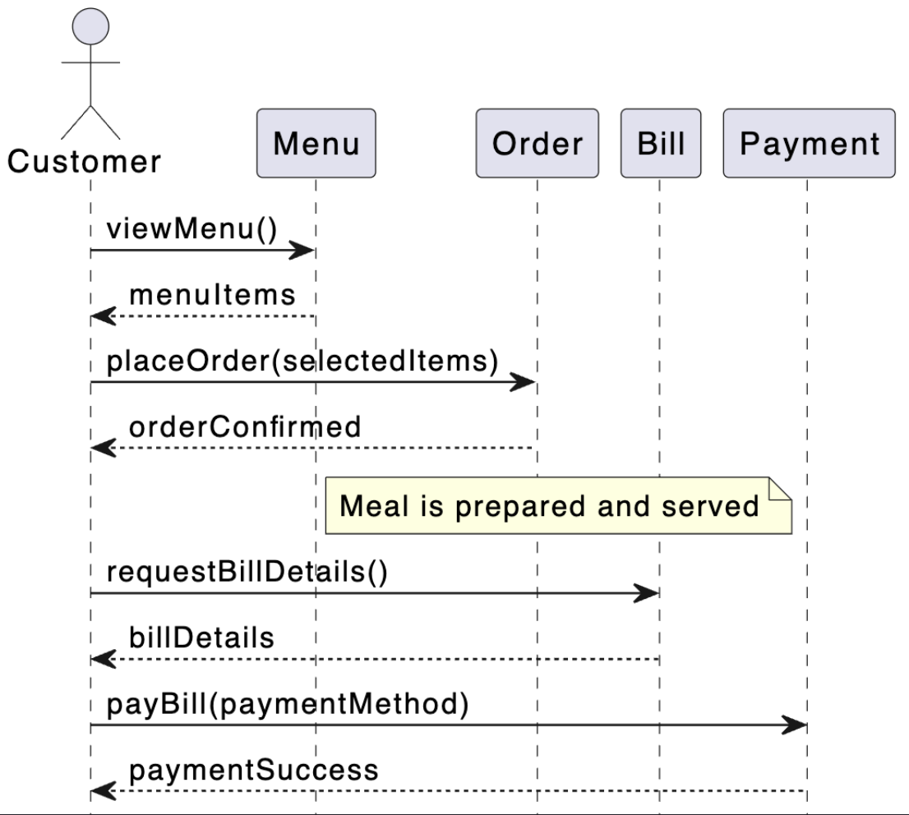

# Sequence Diagram for the Restaurant Management System

Create a sequence diagram for order modification in the restaurant management system and solve a challenge.

Sequence diagrams are a great way to understand the interactions between different entities and objects in the system. There can be different sequence diagrams that we can create for our restaurant management system. In this lesson, we will create sequence diagrams for the following two interactions:

* A customer makes a reservation and receives notification.
* Sequence challenge: Customer places the order and pays the bill.

## Making a reservation  
The sequence diagram for making a reservation should have the following actors and objects that will interact with each other:

* Actors: `Customer` and `Receptionist`
* Objects: `TableReservation` and `Notification`

Here are the steps in the reservation interaction:

1. The customer initiates the process by searching for tables for a specific time and date.
2. The system returns a list of available tables to the customer.
3. The customer requests a reservation by selecting a table, time, and date.
4. The receptionist confirms and saves the reservation in the system.
5. The reservation is recorded and stored under the customer's details.
6. As the reservation time approaches, the system sends an automated notification to the customer.
7. The customer receives the notification about their upcoming reservation.

Based on the flow above, the sequence diagram for making a reservation in a restaurant management system is given below:

## Sequence challenge: Customer places the order and pays
Let’s complete a sequence diagram for the placing order and payment process.

A skeleton of the sequence diagram, given that the payment is successful, is provided below:

Notice that the arrows in the diagram above are numbered from 1 to 8. Below are the messages between the actor(s) and object(s). Can you rearrange the messages below in the correct sequence they should appear in the skeleton of the sequence diagram above?

