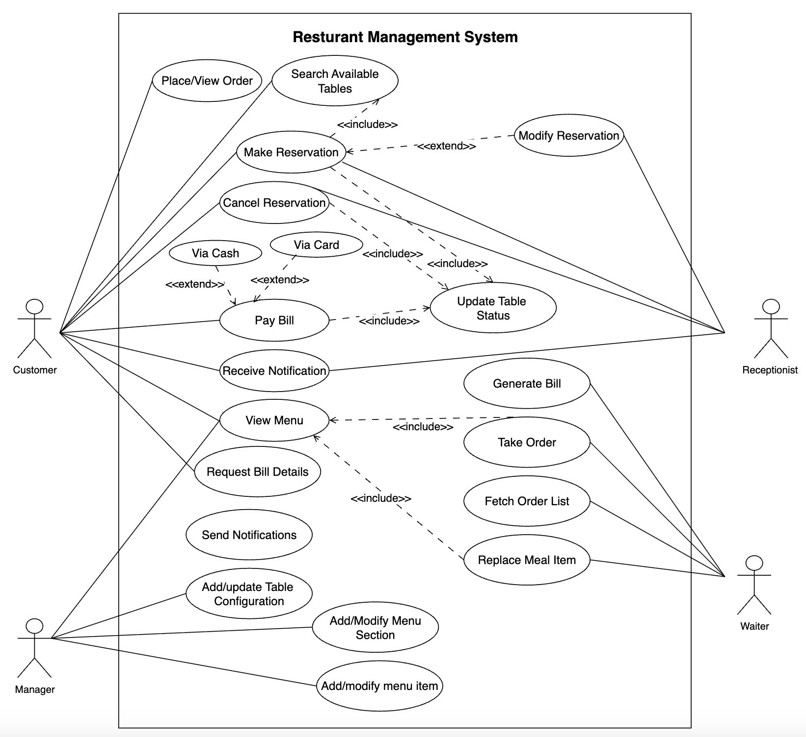

# Use Case Diagram for the Restaurant Management System

Learn how to define use cases and create the corresponding use case diagram for the restaurant management system.

Let's build the use case diagram for the restaurant management system and understand the relationship between its different components. First, we'll define the different elements of our restaurant, followed by the complete use case diagram of the system.

## System

Our system is a restaurant management system.

## Actors

Let's define the main actors of our restaurant management system.

### Primary actors

**Customer:** This is the restaurant's primary actor who can view the menu, place orders, make a reservation, and make payments.

**Receptionist:** This actor is responsible for reserving tables and updating the table reservation status.  
**Server:** This actor takes the order from the customer and processes the payment.

**Manager:** This actor manages each branch's menu and table configuration.

### Secondary actor

**System:** This can automatically notify customers when their reservation time approaches and update table statuses whenever a bill is paid or a reservation is made.

## Use cases  
This section will define the restaurant management system's use cases. We've listed them according to their respective interactions with a particular actor.

### Customer

**View menu:** To browse food items and prices.  
**Make reservation:** To book a table.  
**Cancel reservation:** To cancel an existing reservation.  
**Place order:** To order food.  
**View order:** To check order status or details.  
**Receive notification:** To receive a notification when the reservation time approaches.  
**Pay bill:** To complete payment using cash or a card.  
**Search available tables:** To check table availability in real time.  
**Request Bill Details:** To get the details to pay the bill.

### Manager

**Add/modify menu section:** To manage food categories.  
**Add/modify menu item:** To manage individual food items.  
**Add/update table configuration:** To define branch-specific table layouts.  
**View menu:** To access the menu for decision-making or management.

### Receptionist  
**Search available tables:** To check table availability in real time.  
**Make reservation:** To book a table for a customer.  
**Cancel reservation:** To cancel an existing reservation.  
**Receive notification:** To receive notification when a reservation time approaches.  
**Modify reservation:** To modify an existing reservation.

### Server

**View menu:** To assist with customer ordering.  
**Take order:** To take and enter customer orders.  
**Fetch order list:** To view assigned or active orders.  
**Replace meal item:** To substitute an item in an existing order.  
**Generate bill:** To calculate the total bill against the food order.

### System  
**Send notifications:** To automatically notify customers when their reservation time approaches.  
**Update table statuses:** To handle automatic updates of table availability.

## Relationships

This section describes the relationships between and among actors and their use cases.

### Associations

The table below shows the association relationship between actors and their use cases.

| Customer | Receptionist | Server | Manager |
|----------|--------------|--------|---------|
| View menu | Search available tables | View menu | Add/modify menu section |
| Make reservation | Make reservation | Take order | Add/modify menu item |
| Pay bill via cash/card | Update/cancel reservation | Fetch order list | Add/update table configuration |
| Cancel reservation | Receive notification | Replace meal item | |
| Place order | | Generate bill | |
| View order | | | |
| Receive notification | | | |
| Search available tables | | | |
| Request Bill Details | | | |

### Include

When a customer wants to make a reservation, the system checks for available tables before confirming the booking. Additionally, the system updates the table status once the reservation is made.

* The Make reservation use case includes search available tables and update table status use cases.  
When a customer cancels their reservation, the system updates the table status to reflect the availability.  
* The Cancel reservation use case includes Update table status use case.  
When staff take a customer's order, they must first view the current menu to select items.  
* The Take order use case includes View menu use case.  
When a customer pays the bill, the system marks the table as paid and updates its status accordingly.  
* The Pay bill use case includes Update table status use case.

### Extend

Users can pay using cash or a card when they choose to process a payment.

* The Process payment use case extends to Pay bill via cash and Pay bill via card use case.  
When a user wants to change the details of an existing reservation, they modify the original booking.  
* The Modify reservation use case extends the Make reservation use case.

## Use case diagram

Here's the use case diagram of the restaurant management system:

