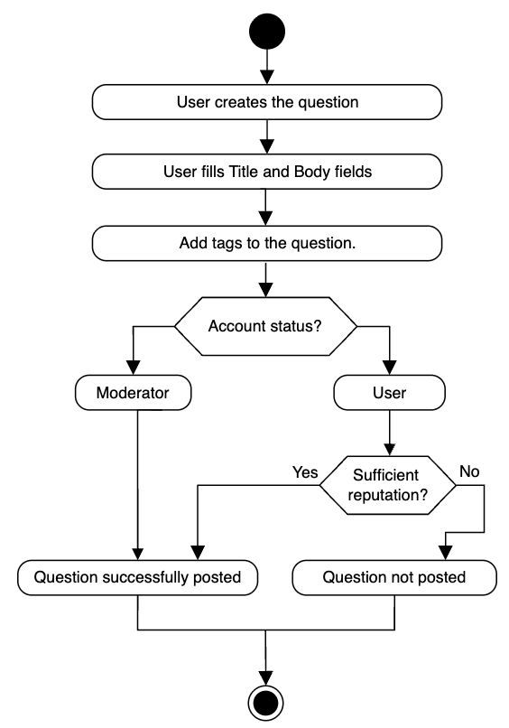
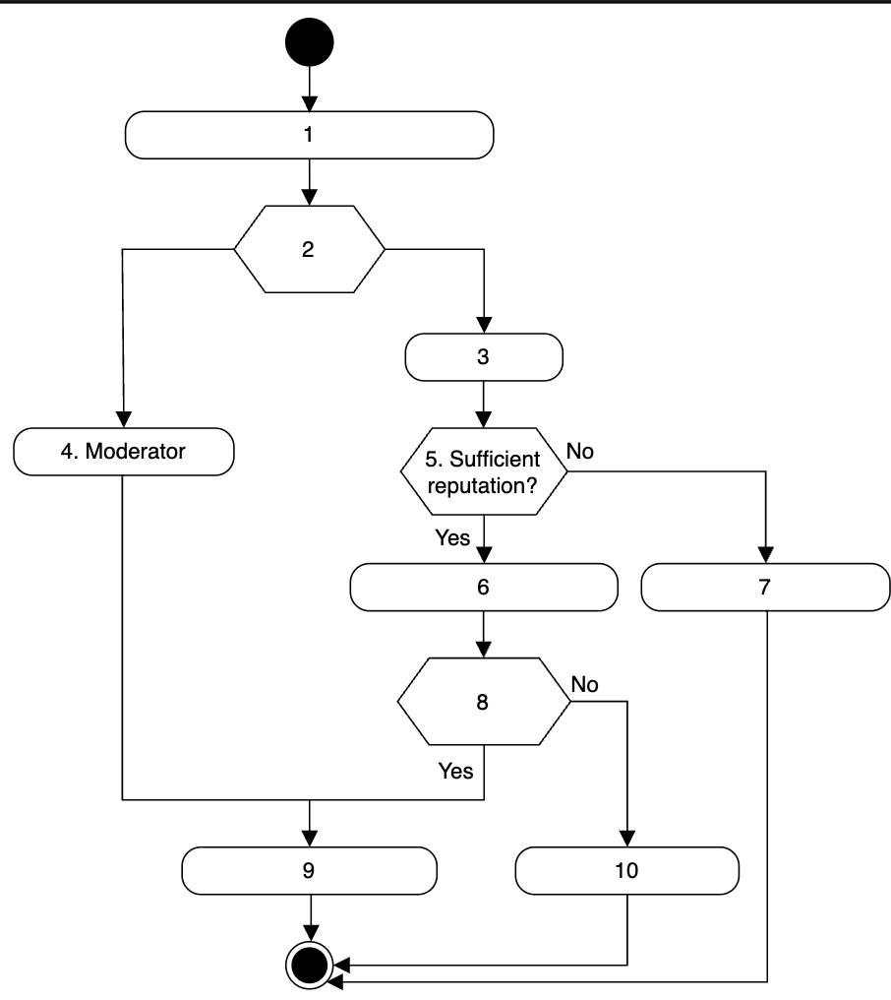
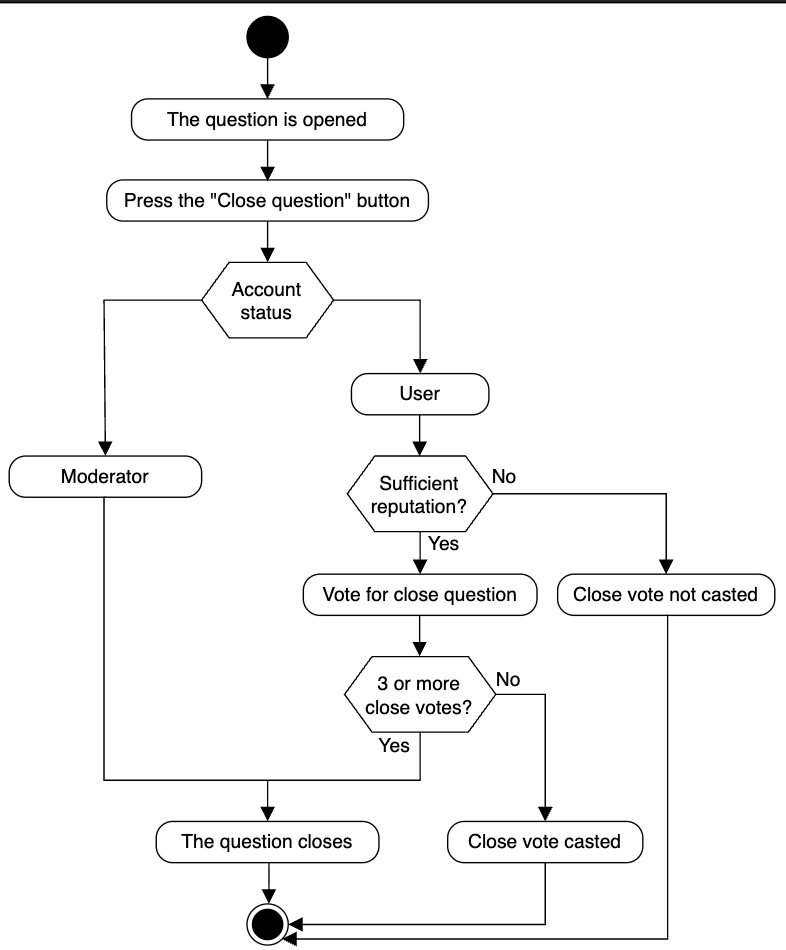

# Activity Diagram for Stack Overflow

Create some activity diagrams for the Stack Overflow problem.

Activity diagrams are a great way to visualize the flow of messages from one activity to another in the system. There can be different activity diagrams that we can create for our Stack Overflow system. In this lesson, we will create activity diagrams for the following two activities:

* A member posting a question.
* Activity challenge: A member closes a question.

## A member posting a question  
The following are the states and actions that will be involved in this activity diagram.

### States

**Initial state:** The member starts by creating the question.

**Final state:** There are two final states present in this activity diagram, shown below:

* The question was successfully posted.
* The question is not posted.

### Actions  
The member creates a question and fills in the required fields. They then add tags to the question. After the post is composed, the system checks the member's status. If the member is a moderator, the question is posted directly. If the member is a regular user, the question will only be posted if they have a good reputation.

## Activity challenge: A member closes a question
You’ll help us create an activity diagram of a member closing a question. When a question is opened and a user presses the “Close the question,” the system checks the account status of the requester. If the requester is a moderator, the question is closed immediately. If the requester is a regular user, the system checks whether they have sufficient reputation. If not, their vote to close is not cast. If the user does have enough reputation, their vote is recorded, and if a total of three or more close votes are gathered, the question is closed. Otherwise, the vote is stored, but the question remains open until the threshold is met.

Notice that the actions in the diagram above are numbered from 1 to 10. The slots below represent the activities, and the arrows represent the flow from one activity to another.  

