# Class Diagram for Stack Overflow  
Learn to create a class diagram for Stack Overflow using the bottom-up approach.

In this lesson, we’ll identify and design the classes, abstract classes, and interfaces based on the requirements we have previously gathered from the interviewer in our Stack Overflow system.

## Components of Stack Overflow  
As mentioned earlier, we will design the Stack Overflow system using a bottom-up approach.

### Guest  
The `Guest` class is a user who can only search and view questions and their answers.

The visual representation of the `Guest` class is provided below:  

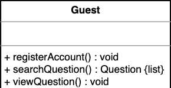

<strong>Click to view related requirements</strong>

**R1:**  Any guest can view questions and search questions by tag, username, or words.

### Question
The `Question` class is used to enter the details of the question being asked by a user, such as its title, content, tags, etc. It can also allow users to add comments and bounties.  

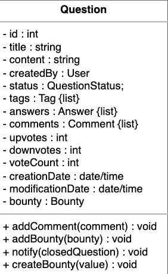

<strong>Click to view related requirements</strong>

**R2:** Users should be able to post new questions and add answers to an open question.  
**R4:** A user can upvote, downvote, and add comments to a question or answer, while they can only upvote a comment.

### Answer
The `Answer` class represents a user’s answer to a question and will contain elements like content, upvotes, and downvotes. 

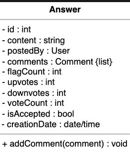

<strong>Click to view related requirements</strong>

**R2:** Users should be able to post new questions and add answers to an open question.  
**R4:** A user can upvote, downvote, and add comments to a question or answer. However, they can only upvote a comment.

### Comment
The `Comment` class refers to an opinion or remark provided by a user on either a question or an answer. It can only be upvoted and flagged, but not downvoted.

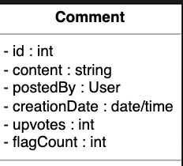

<strong>Click to view related requirements</strong>

**R4:** A user can upvote, downvote, and add comments to a question or answer. However, they can only upvote a comment.

### Bounty
The `Bounty` class refers to an award of granting reputation points on a question to attract more attention from other users. It will have an expiry date of seven days and must stay on for at least one day. 

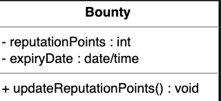

<strong>Click to view related requirements</strong>

**R6:** Users can add a bounty to their question to attract more answers.

### Badge
The `Badge` class refers to badges on a user’s profile that show a reputation-worthy user.

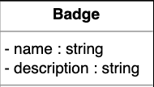

<strong>Click to view related requirements</strong>

**R9:** Users can earn badges for helpful answers or comments.

 

### Tag and tag list
The `Tag` and `TagList` classes represent the keywords or labels that categorize questions. The TagList class contains a key-value pair to keep track of the tag count.

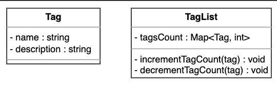

<strong>Click to view related requirements</strong>

**R10:** Users can add tags to their questions. A tag is a word or phrase describing the question’s topic.  
**R11:** The system should also be able to determine the most popular tags used in questions.

 

### User
The `User` class is Stack Overflow’s main class and is responsible for various operations, such as creating, answering, and flagging questions, voting to delete or close questions, and more.

The `User` class is the parent class of the following two classes:

  - Admin

  - Moderator

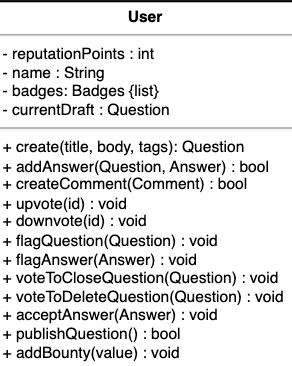

### Admin
The `Admin` is responsible for performing operations such as blocking or unblocking users.

### Moderator
The `Moderator` performs operations such as closing, deleting, restoring, and reopening questions.

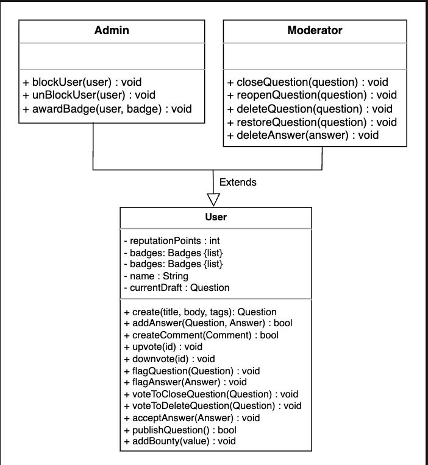

<strong>Click to view related requirements</strong>

**R2:** Users should be able to post new questions and add answers to an open question.  
**R4:** A user can upvote, downvote, and add comments to a question or answer. However, they can only upvote a comment.  
**R7:** Moderators can close questions, restore deleted ones, and delete answers in addition to all the actions available to regular users.

 

### Notification
The `Notification` class will send a notification within the Stack Overflow platform whenever a new answer is added to a question asked by a user.

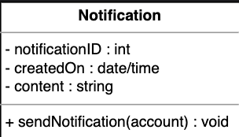

<strong>Click to view related requirements</strong>

**R8:** The system should notify the user whenever there has been an interaction with them, such as the user’s question receiving an answer, earning a badge, or someone upvoting or downvoting their post.  

 

### Search interface
The `Search` interface allows users to search for a particular question using tags, usernames, and a string of words.

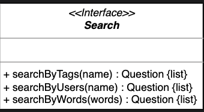

<strong>Click to view related requirements</strong>

**R1:** Any guest can view and search questions by tag, username, or word.  

 

### Search catalog
The `SearchCatalog` is the class where the search functionality is implemented. The catalog will fetch the questions using either tags, usernames, or a string of words.

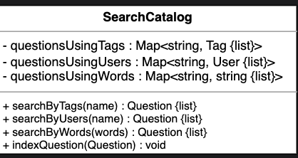

<strong>Click to view related requirements</strong>

**R1:** Any guest can view and search questions by tag, username, or word.  

 

### Enumerations
The enumerations required in the Stack Overflow design are provided below:  

- `UserStatus`: The user status tells us about a user’s status, whether active or disabled.  
- `QuestionStatus`: The question status describes the status of an existing question, whether it is still active, closed, flagged, or bountied.

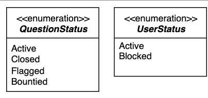

## Relationship between the classes
Now, we will discuss the relationships between the classes we have defined above in our Stack Overflow system.  

### Association
The class diagram has the following association relationships:

- The `User` class has a one-way association with the `Question`, `Comment`, Badge, `Notification`, and `Search` classes.  
- The `Guest` class has a one-way association with the `Search` class.  
- The `Answer`, `Comment`, and `Question` classes have a one-way association with the `Notification` class.  
- The `Question` class has a two-way association with the `Tag` class.  

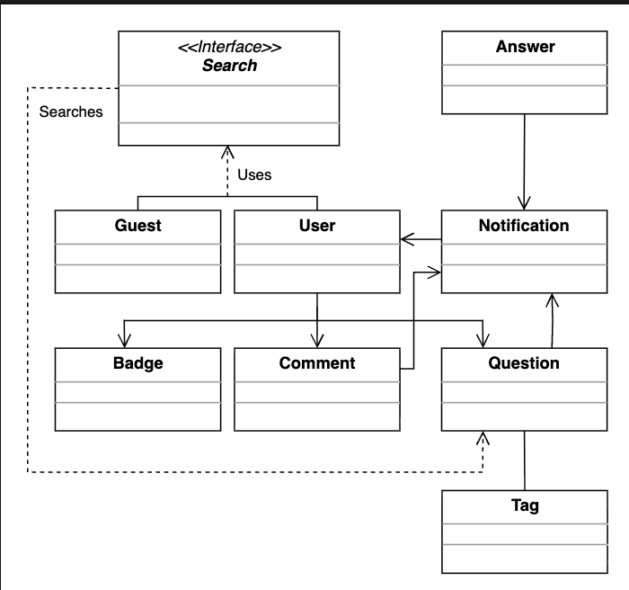

### Composition
The class diagram has the following composition relationships:

- The `Account` class is composed of the `User` class.  
- The `Question` class is composed of the `Bounty`, `Comment`, and `Answer` classes.  
- The `TagList` class is composed of the `Tag` class.

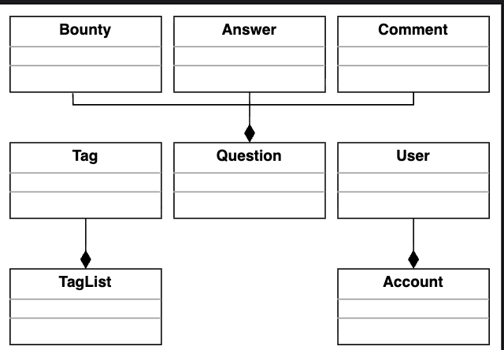 

### Generalization
The `SearchCatalog` class implements the `Search` interface. 

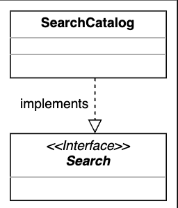

### Inheritance
Both ``Admin`` and `Moderator` extend the `User` class.

- **Note**: We have already discussed the inheritance relationship between classes in the component section above one by one. 

# Class diagram of Stack Overflow

In this section, we outline the multiplicity (cardinality) relationships between the main classes in our Stack Overflow system. For each relationship, we explain the allowed number of instances on each side and the real-world or design rationale behind the connection. Understanding these relationships is key to modeling how different entities interact and collaborate to support key workflows in the system.

| Source      | Target        | Multiplicity | Reason                                  |
|-------------|---------------|--------------|-----------------------------------------|
| User        | Question      | 1 – 0..*     | A user can create multiple questions    |
| Question    | User          | 1 – 1        | Each question is created by exactly one user |
| User        | Answer        | 1 – 0..*     | A user can provide multiple answers     |
| Answer      | User          | 1 – 1        | Each answer is associated with exactly one user |
| User        | Comment      | 1 – 0..*     | A user can write multiple comments      |
| Comment     | User          | 1 – 1        | Each comment is posted by one user      |
| Question    | Answer        | 1 – 0..*     | A question can have multiple answers    |
| Answer      | Question      | 1 – 1        | Each answer belongs to one question     |
| Question    | Comment       | 1 – 0..*     | A question can have multiple comments   |
| Comment     | Question      | 0..1 – 1     | One user posts each comment             |
| Answer      | Comment       | 1 – 0..*     | An answer can have multiple comments    |
| Comment     | Answer        | 0..1 – 1     | A comment may be on one answer          |
| User        | Badge         | 1 – 0..*     | A user can receive multiple badges      |
| Badge       | User          | 0..* – 1     | A badge can be awarded to multiple users |
| Question    | Tag           | 1 – 0..*     | A question can have multiple tags       |
| Tag         | Question      | 0..* – 1     | A tag can be used in multiple questions |
| Question    | Bounty        | 0..1 – 1     | A question may have one bounty           |
| Bounty      | Question      | 1 – 1        | Each bounty is tied to one question      |
| User        | Notification  | 1 – 0..*     | A user can receive multiple notifications |
| Notification| User          | 1 – 1        | Each notification is sent to one user   |

Here’s the complete class diagram for Stack Overflow:

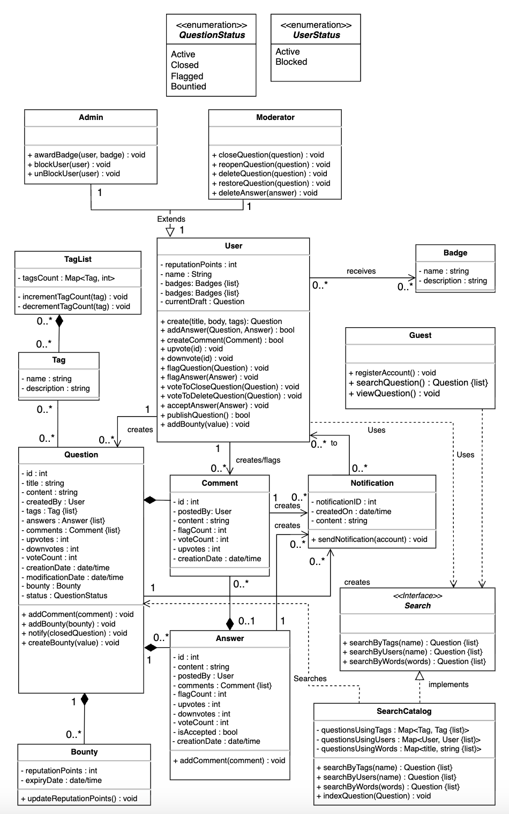

# Design pattern

To implement Stack Overflow’s core features in a flexible and scalable way, we apply object-oriented design patterns based on system behavior:

- **Observer pattern**  
  The system notifies users when actions like adding an answer, comment, vote, or badge occur. This notification behavior is modeled using the Observer design pattern.

- **Strategy pattern**  
  Users can search questions using different criteria such as tags, keywords, or usernames. The Strategy design pattern handles these interchangeable search methods.

- **Factory Method pattern**  
  The system needs to create different objects such as questions, answers, comments, and notifications. The Factory Method design pattern allows these objects to be created flexibly and consistently.

- **Template Method pattern**  
  Users like admins and moderators follow a general workflow but with some variations in control (e.g., deleting questions, restoring answers). The Template Method design pattern manages this customizable workflow.

- **Decorator pattern**  
  The platform allows dynamic extensions of user capabilities, such as awarding badges or blocking users. The Decorator design pattern lets us add such features without modifying existing classes.

- **Composite pattern**  
  Comments can be added to both questions and answers. The Composite design pattern treats these comment structures uniformly.

- **Command pattern**  
  Actions like adding a comment or flagging content could be stored or executed later (e.g., for moderation). The Command design pattern encapsulates such operations as objects.

- **Role-based access control (RBAC) + Inheritance**  
  The system has different user roles (User, Moderator, Admin), each with specific permissions. RBAC combined with inheritance organizes access and shared behaviors.

## Additional requirements

The interviewer can introduce additional requirements in the Stack Overflow system or ask some follow-up questions. Some examples include:

- **Save questions or answers:**  
  Users can save questions or answers and view them later from the “Saved” section in their profile.

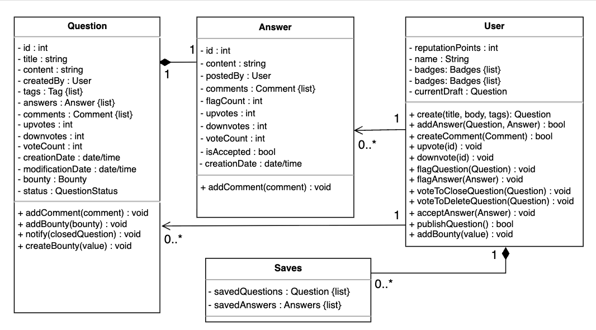

