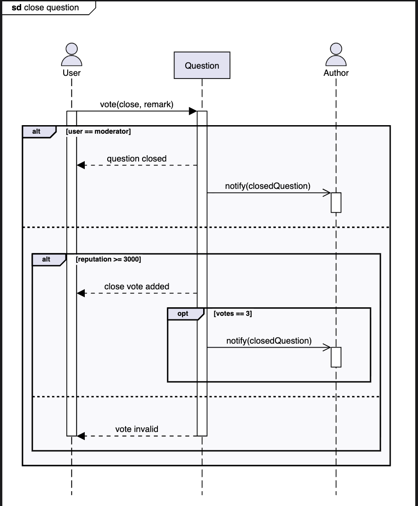
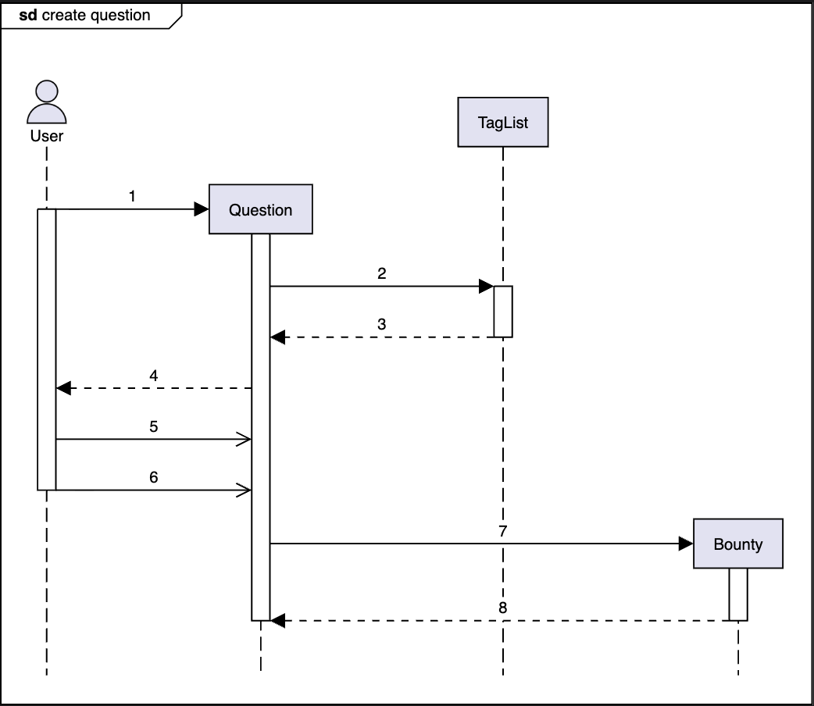
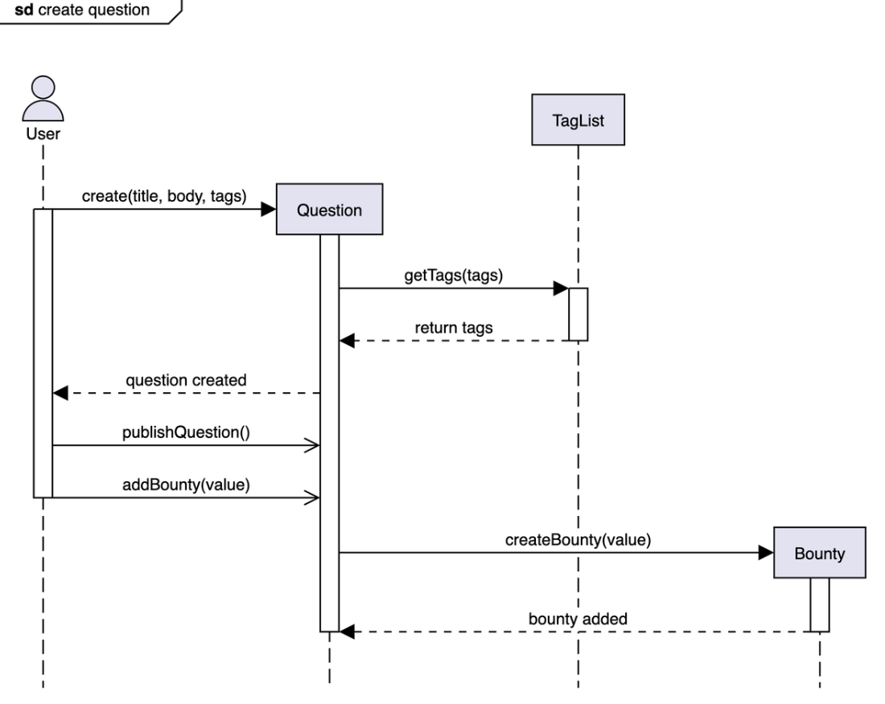

# Sequence Diagram for Stack Overflow

Visualize the sequence diagram for closing a question and practice the concepts with a challenge.

Sequence diagrams are a great way to understand the interactions between different entities and objects in the system. There can be different sequence diagrams that we can create for Stack Overflow. In this lesson, we will create sequence diagrams for the following two interactions:

* Close question: A user votes to close a question authored by a different user.
* Sequence challenge: A user creates a question and adds a bounty.

## Close question  
The sequence diagram for closing a question should have the following actors and objects that will interact with each other:

* Actors: `User` and `Author`
* Object: `Question`

Here are the steps in the closed-question interaction:

1. A user votes to close a question with some remark.
2. If the user is a moderator:
   1. The question is closed.
   2. The author of the question is notified about the question.
3. Else if they are a regular user:
   1. If the user's reputation is greater than or equal to 3000:
      1. A close vote is added.
      2. If there are 3 close votes, the question closes, and the author is notified.
   2. Else if the user's reputation is less than 3000:
      1. The vote is considered invalid.

Based on the order above, the sequence diagram for closing a question in Stack Overflow is provided below:

## Sequence challenge: Create question
You’ll help us complete a sequence diagram for a new question created by a user where the user adds a bounty to the question after publishing it. A skeleton of the create question sequence diagram is given below:

Notice that the arrows in the diagram above are numbered from 1 to 8. Below are the messages between the actor(s) and object(s). Can you rearrange the messages below in the correct order sequence they should appear in the skeleton of the sequence diagram provided above?

