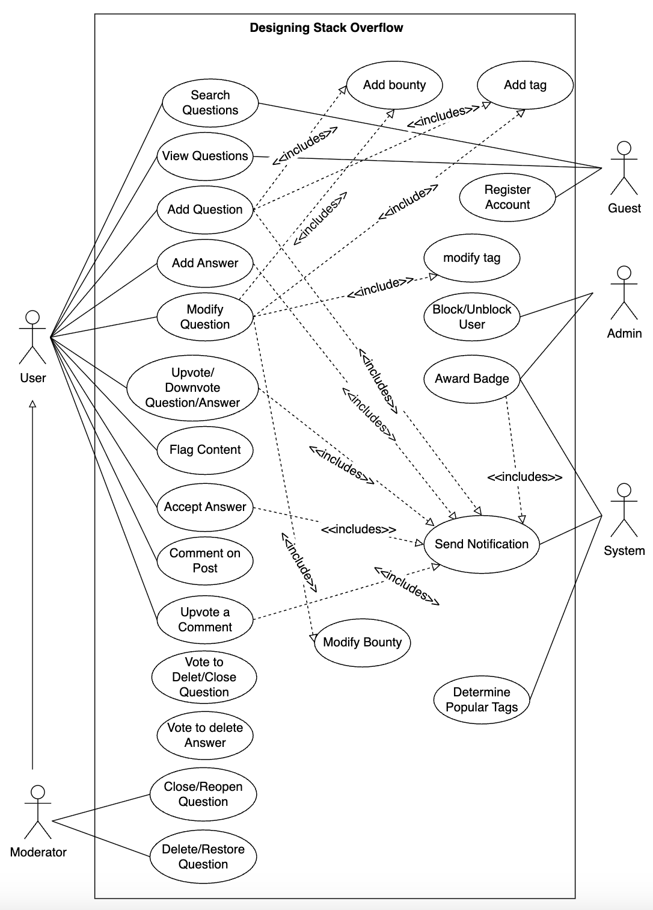

# Use Case Diagram for Stack Overflow

Learn how to define use cases and create the corresponding use case diagram for the Stack Overflow problem.

Let's build the Stack Overflow use case diagram and understand its components' relationship. First, we'll define the different elements of our Stack Overflow system, followed by the complete use case diagram.

## System

Our system is Stack Overflow.

## Actors

Now, we'll define the main actors of Stack Overflow.

### Primary actors

**User:** A registered user who can

* Create, edit, and flag questions and answers.
* Add bounties and tags.
* Upvote/downvote content.
* Accept answers.
* Add comments.
* Vote to close/delete questions and answers.

**Moderator:** A privileged user who can

* Close, delete, reopen, and restore questions.
* Delete answers.

### Secondary actors

**Guest:** An unregistered visitor who can

* Search for and view questions and answers.
* Register an account.

**Admin:** A system administrator who can

* Block or unblock users.
* Award badges manually.

**System:** Responsible for

* Awarding badges based on rules.
* Sending notifications (on answer, comment, or vote).

## Use cases

In this section, we'll define the use cases for Stack Overflow and list them according to their interactions with a particular actor.

> Note: Some use cases will occur multiple times because they are shared among different actors in the system.

### User

**Add/Modify/Flag Question:** To allow users to post new, update, or report inappropriate questions.  
**Add/Modify/Flag Answer:** To enable users to contribute answers, edit content, or flag problematic responses.  
**Add Comment:** To let users add clarifying or supporting comments on questions and answers.  
**Upvote a Comment:** To empower users to upvote a comment.  
**Add Bounty:** To let users offer reputation points to attract answers to their questions.  
**Add Tag:** To let users label questions with relevant topic tags for better discoverability.  
**Vote to Close / Delete Question:** To empower users to initiate closure or deletion of low-quality or off-topic questions.  
**Vote to Delete Answer:** To empower users to initiate the deletion of low-quality answers.  
**Upvote / Downvote to Question / Answer:** To enable users to express approval or disapproval of questions and answers.  
**Accept Answer:** To let the authors mark the most helpful answer as accepted.

### Guest  
**Search / View Question:** To allow non-logged-in users to browse and search for public questions and answers.  
**Register Account:** To enable guests to sign up and become a full-featured user.

### Admin  
**Block / Unblock User:** To enable administrators to restrict or restore user access to the platform.  
**Award Badge:** To allow admins to assign special badges manually to recognize user contributions.

### Moderator  
**Close / Reopen / Delete / Restore Question:** To grant moderators authority to manage question visibility and status.  
**Delete Answer:** To allow moderators to permanently remove inappropriate or low-quality answers.

### System  
**Send Notification:** To automatically inform users of interactions like votes, comments, answers, or badges.  
**Award Badge:** To automatically grant achievement badges based on predefined contribution criteria.  
**Determine Popular Tags:** To automatically determine the most popular tags.

## Relationships  
This section describes the relationships between and among actors and their use cases.

### Generalization  
"Moderator" has a generalization relationship with "User" as the moderator can perform all the tasks a normal user can perform.

"User" has a generalization relationship with "Guest" as the normal user can perform all those tasks that a guest user can perform.

### Associations  
The table below shows the association relationship between actors and their use cases.

| User | Guest | Admin | Moderator | System |
|------|-------|-------|-----------|--------|
| Search/view question | Register account | Block/unblock user | Search/view question | Award badge to user |
| Vote to close/delete question | Search/view question | Award badge | Vote to close/delete question | Send notification |
| Accept answer | | | Accept answer | Determine popular tags |
| Add/modify/flag question | | | Add/modify/flag question | |
| Add/modify/flag answer | | | Add/modify/flag answer | |
| Add comment | | | Add comment | |
| Upvote/downvote question/answer | | | Upvote/downvote question/answer | |
| Upvote a comment | | | Close/reopen/delete/restore question | |
| Vote to delete answer | | | Delete answer | |
| | | | Upvote a comment | |
| | | | Vote to delete answer | |

### Include  
A notification is triggered when a user interacts with content, such as adding an answer or comment, voting, accepting an answer, awarding a badge, or posting a new question.

* The "Send a notification" use case includes the "Add an answer," "Add a comment," "Upvote/Downvote a question/answer," "Accept an answer," "Award a badge," "Upvote a comment," and "Add a question" use cases.

Users can assign a bounty or add tags when posting a new question.

* The "Add a question" use case includes the "Add bounty" and "Add a tag" use cases.

When a user modifies a question, they may also update its bounty or tags.

* The "Modify a question" use case includes the "Add bounty," "Add a tag," "Modify bounty," and "Modify the tag" use cases.

## Use case diagram

Here's the use case diagram of Stack Overflow:

