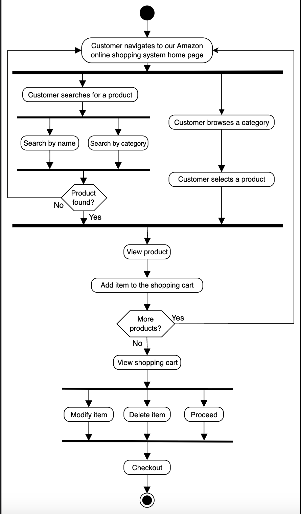
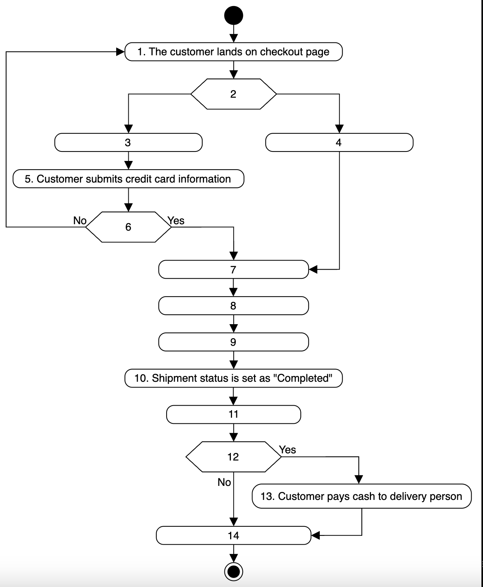
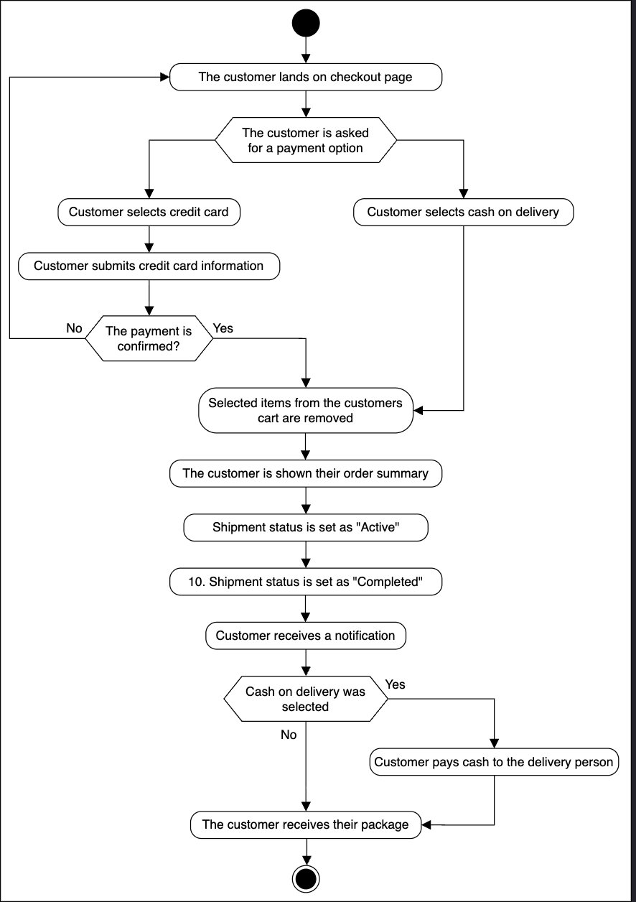

# Activity Diagram for the Amazon Online Shopping System   
Create some activity diagrams for the Amazon online shopping system.

Activity diagrams are a great way to visualize the flow of messages from one activity to another in the system. There can be different activity diagrams that we can create for our Amazon online shopping system. In this lesson, we will create activity diagrams for the following two activities:

* A customer is buying a product.
* Activity challenge: The customer receives their order.

## A customer buying a product  
The following are the states and actions that will be involved in this activity diagram.

### States

**Initial state:** The customer opens Amazon.  
**Final state:** The customer proceeds with checkout.

### Actions  
The customer opens the website. They search or browse the website, select a product, and buy it.  

  

## Activity challenge: Customer order checkout and payment process
You’ll help us create an activity diagram for a customer order checkout and payment process. In this activity, the customer checks out and selects a payment method—cash on delivery or credit card—before checkout.

A skeleton of the activity diagram is provided below.  

 

Notice that the actions in the diagram above are numbered from 1 to 14. The slots below represent the activities, and the arrows represent the flow from one activity to another.  

