# Class Diagram for the Amazon Online Shopping System  
Learn to create a class diagram for Amazon using the bottom-up approach.

In this lesson, we'll identify and design the classes, abstract classes, and interfaces based on the requirements we previously gathered from the interviewer in our Amazon shopping system.

## Components of Amazon  
As mentioned, we should design the Amazon online shopping system using a bottom-up approach.

### Customer  
The `Customer` abstract class refers to a user searching for a product on Amazon.

A customer can be one of the following:

1. Authenticated users
2. Guest users

The details of these are given below:  
* The `AuthenticatedUser` class refers to an individual with a registered Amazon account.
* The `Guest` class refers to an individual without an account who can only search for and view the products on the Amazon website. However, they need to register for an account on Amazon to place an order.

The class diagram of all these is provided below:

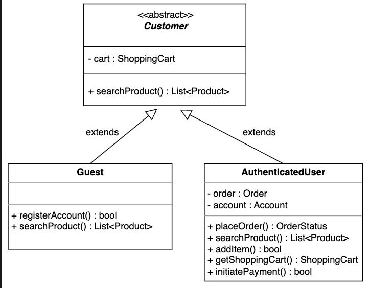

<strong>Click to view related requirements</strong>

**R1:** A customer can be an authenticated user or a guest. The authenticated user has a registered Amazon online shopping system account, whereas a guest does not.

### Admin
The `Admin` class refers to an individual with a registered account on Amazon who can add, modify, or delete product categories and block users.

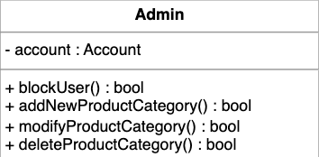

<strong>Click to view related requirements</strong>

**R10:** An admin who can add or modify product categories and block users should exist.

### Account
The `Account` class accesses and showcases the personal details of the authenticated user and the admin, the two types of registere

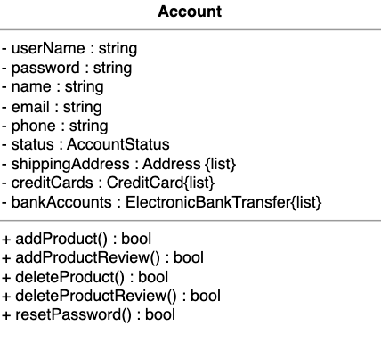

<strong>Click to view related requirements</strong>

**R1:** A customer can be an authenticated user or a guest. The authenticated user has a registered account on the Amazon online shopping system, whereas a guest doesn’t have a registered account.  

**R11:** An account should store personal information such as name, email, password, and other relevant details for admins and authenticated users.

### Product
The `Product` class contains the details of a particular product on the Amazon shopping store. Each product falls under a specific category on Amazon and can have none, one, or more reviews. 

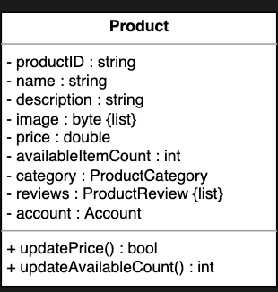

<strong>Click to view related requirements</strong>

**R3:**A product can have multiple reviews and ratings from multiple customers.

### Product category
The `ProductCategory` class contains the names and descriptions of Amazon’s various product categories and a reference to the list of products in each category.  

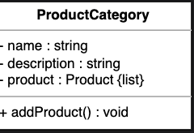

<strong>Click to view related requirements</strong>

**R2:** An authenticated user should be able to buy, sell, and search the products via the product name or category. A guest is only able to search for products.

### Product review
The `ProductReview` class contains the rating and review attributes a registered user can use to add a review about a particular product.

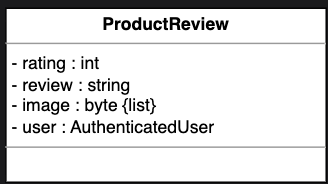

<strong>Click to view related requirements</strong>

**R3:** A product can have multiple reviews and ratings from multiple customers.

### Search
The `Search` class will be an interface that contains the functionalities relating to searching for products.
 
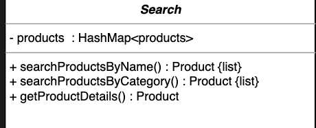

<strong>Click to view related requirements</strong>

**R2:** An authenticated user should be able to buy, sell, and search the products via the product name or category. A guest is only able to search for products.

### Cart item
The `CartItem` class refers to the items in the shopping cart. It will have price and quantity attributes, which can be modified using the `updateQuantity()` function.

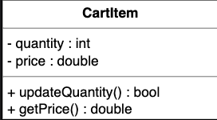

<strong>Click to view related requirements</strong>

**R4:** An authenticated user should be able to add, remove, or modify product items in their shopping cart. Then, the authenticated user can check out and buy the items.

### Shopping cart
The `ShoppingCart` class contains the list of cart items, upon which actions such as adding items to the cart, removing items from the cart, and accessing all cart items can be performed.

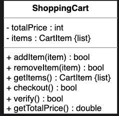

<strong>Click to view related requirements</strong>

**R4:** An authenticated user should be able to add, remove, or modify product items in their shopping cart. Then, the authenticated user can check out and buy the items.

### Order
The `Order` class refers to a particular customer’s order and tracks its status, including the option of sending the order for shipment. It is also used to make the payment.  

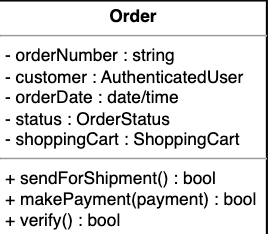

<strong>Click to view related requirements</strong>

**R7:** An order can be canceled only if it hasn’t been shipped.

### Shipment
The `Shipment` class tracks the order’s date, estimated arrival time, and shipment method. It will also be used to track the shipment status. 

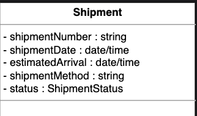

<strong>Click to view related requirements</strong>

**R9:** Shipment can be tracked to see the current status and the estimated arrival time for the order.

### Payment
The `Payment` class will have three child classes: `CreditCard`, `ElectronicBankTransfer`, and `Cash`, as these are the three payment methods available to a customer on Amazon.  

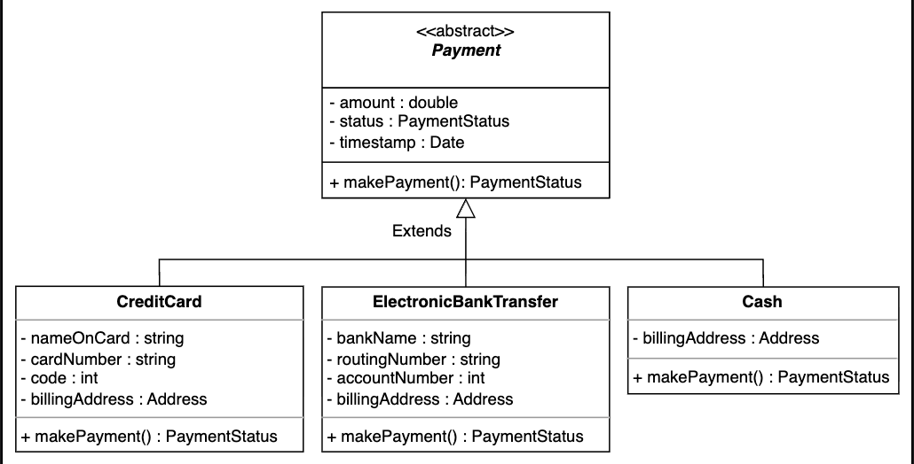

<strong>Click to view related requirements</strong>

**R6:** Payment can be made through credit cards, electronic bank transfers, or cash on delivery.

### Notification
The `Notification` class is responsible for sending order and shipment notifications to customers shown below in the class diagram:  

> **Note**: Since the Notification class can be extended by adding various other options, we will implement it as an abstract class.

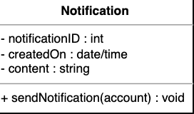

<strong>Click to view related requirements</strong>

**R8:** Notifications are sent whenever there is a change in the order or shipping status.

## Enumerations

The following is the list of enumerations required in Amazon:

* **`AccountStatus`:** The account status tells about the user account status, whether it is active, inactive, or blocked.
* **`PaymentStatus`:** The payment status tells about the user account status, whether it is confirmed, declined, pending, or refunded.
* **`OrderStatus`:** The order status describes the status of a particular order of a customer, whether it is unshipped, pending, shipped, confirmed, or canceled.
* **`ShipmentStatus`:** The shipment status tells us about the status of an order's shipment, whether it is in a pending state, shipped state, delivered state, or on hold.

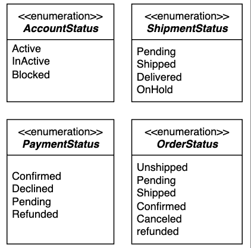

## Custom data type  
To store a customer's location, we must create a custom data type, `Address`.

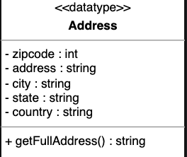

## Relationship between the classes  
We'll discuss the relationships between the classes defined in our Amazon shopping system above.

### Association  
The class diagram has the following association relationships:

* The `Notification` class has a one-way association with `Shipment` and `Order`.
* The `Product` class has a two-way association with `Account` and `CartItem` and a one-way association with `ProductCategory` and `ProductReview`.
* The `ShoppingCart` class has a two-way association with `CartItem`.
* The `Order` class has a two-way association with `Payment` and a one-way association with `Shipment` and `ShoppingCart`.

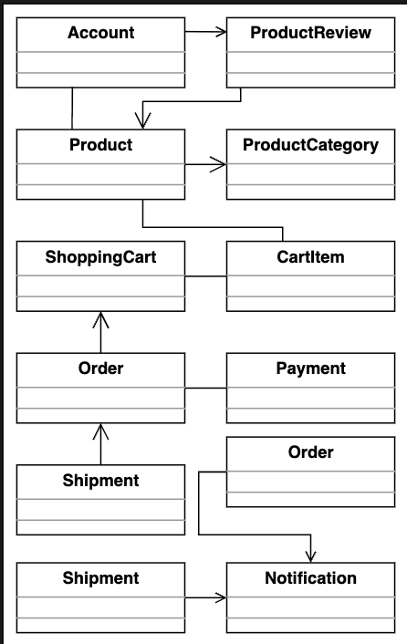

### Composition  
The class diagram has the following composition relationships:

* The `Account` class is composed of the `CreditCard` and `ElectronicBankTransfer`.
* The `Admin` and `AuthenticatedUser` classes are composed of `Account`.
* The `AuthenticatedUser` class is composed of the `Order` class.
* The `Customer` class is composed of the `ShoppingCart` class.  

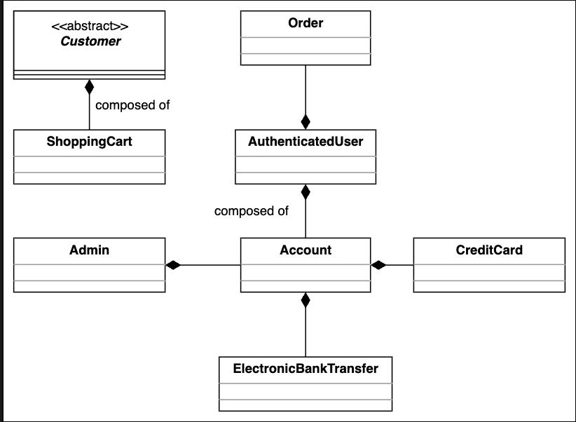

### Aggregation  
The following class show an aggregation relationship:

* The `Product` class has an aggregation relation with the Search class.  

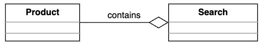

### Inheritance

The following classes show an inheritance relationship:

* Both `Guest` and `AuthenticatedUser` extend the `Customer` class.
* Subclasses `Cash`, `ElectronicBankTransfer`, and `CreditCard` extend the `Payment` class.

Note: The component section above has already discussed the inheritance relationship between classes.

## Class diagram of Amazon

This section outlines the multiplicity (cardinality) relationships between the main classes in our Amazon online shopping system. We explain the allowed number of instances on each side for each relationship and the real-world or design rationale behind the connection. Understanding these relationships is key to modeling how different entities interact and collaborate to support key workflows in the system.

| Source | Target | Multiplicity | Reason |
|--------|--------|--------------|--------|
| Address | ProductCategory | 1 – 0..* | One `Address` can be associated with many `ProductCategory` objects. |
| ProductCategory | Product | 1 – 0..* | One ProductCategory can have many Products, but a Product belongs to exactly one ProductCategory. |
| Product | ProductReview | 1 – 0..* | One `Product` can have many `ProductReview` objects. |
| ProductReview | AuthenticatedUser | 1 – 1 | One `ProductReview` is written by one `AuthenticatedUser`. |
| Admin | Account | 1 – 0..* | One `Admin` can manage multiple `Account` objects. |
| Account | Order | 1 – 0..* | One `Account` can place many `Order` objects. |
| Order | Shipment | 1 – 0..* | One `Order` can be associated with many `Shipment` objects. |
| Order | PaymentStatus | 1 – 1 | One `Order` can have one `PaymentStatus` object. |
| ProductCategory | Admin | 1 – 1 | One `ProductCategory` can be managed by one `Admin`. |
| ShoppingCart | Product | 1 – 0..* | One `ShoppingCart` can contain multiple `Product` objects. |
| Guest | Product | 1 – 0..* | One `Guest` can search many `Product` objects. |
| Search | Product | 1 – 0..* | One `Search` can return multiple `Product` objects. |
| AuthenticatedUser | ShoppingCart | 1 – 1 | One `AuthenticatedUser` can have one `ShoppingCart`. |
| ShoppingCart | Order | 1 – 1 | One `ShoppingCart` is associated with one `Order`. |
| ShoppingCart | Product | 1 – 0..* | One `ShoppingCart` can contain multiple `Product` objects. | 

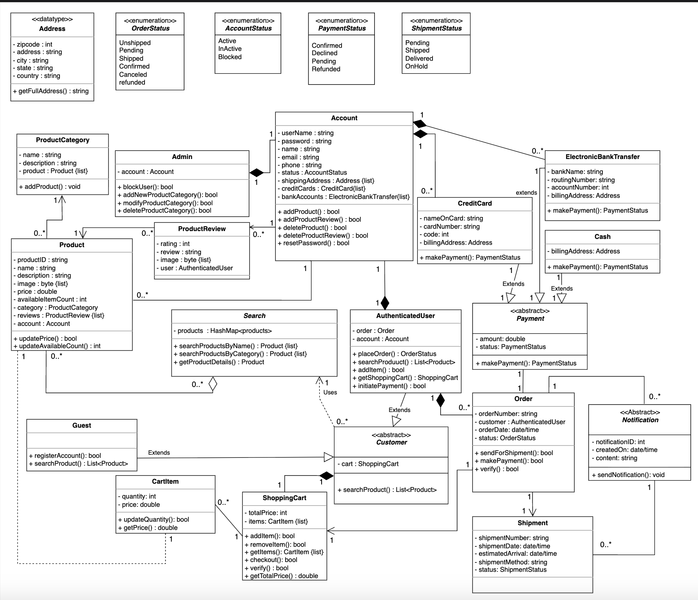

## Design pattern

The following design patterns have been used in the class diagram:

* We know that the system needs to create different types of accounts, such as `AuthenticatedUser` and `Guest` accounts. To model this behavior, we can use the Factory Method pattern.
* We know that a restaurant can accept different types of payments, such as `Cash`, `CreditCards`, and `ElectronicBankTransfers`. To model this behavior, we can use the Strategy pattern.
* We know that a `ShoppingCart` can contain multiple `Product` objects, and a `ProductCategory` can also contain multiple `Product` objects. To model this behavior, we can use the Composite pattern.
* When an order's status changes, we know that customers need to be notified. To model this behavior, we can use the Observer pattern.
* We know that various actions need to be performed on the `Order` and `ShoppingCart`, such as `placeOrder(),` `makePayment(),` and `addProduct().` To model this behavior, we can use the Command pattern.

## Additional requirements

The interviewer can introduce some additional requirements in the Amazon shopping system, or they can ask some follow-up questions. Let's see some examples of additional requirements:

**Wish list:** Only authenticated users can have a wish list, and they can add products to their wish list. Wish list items can be moved to the user's shopping cart. The `Wishlist` class has a two-way association with the `Product` class, as a wish list can contain multiple products, and products can belong to multiple wish lists, while it has an aggregation relationship with the `User` class, as a user can have a wish list, and a wish list cannot exist without a user.

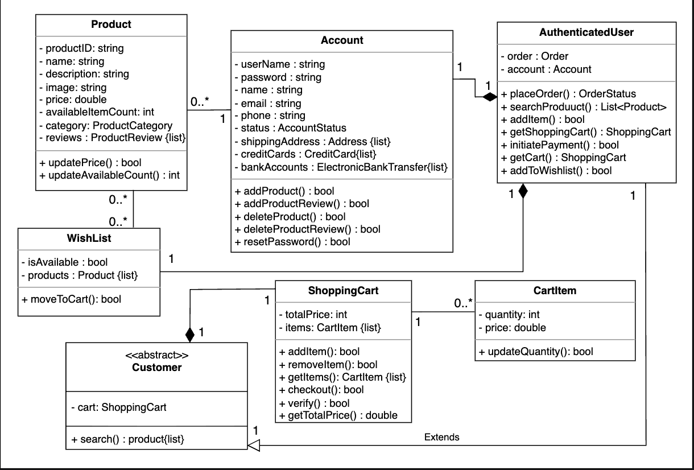

**Discount**: A discount will be applied to the payment depending on special events such as Christmas, Black Friday, etc. The Payment class has a one-way association with the Discount class, as a payment can receive a discount, but the discount is linked to the payment and does not exist independently.  

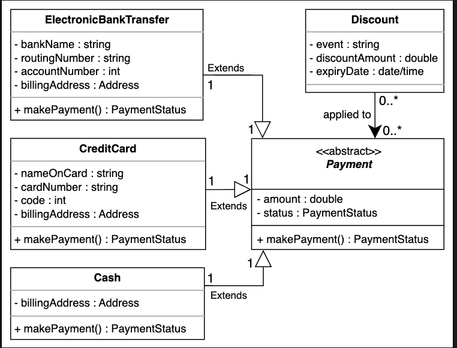