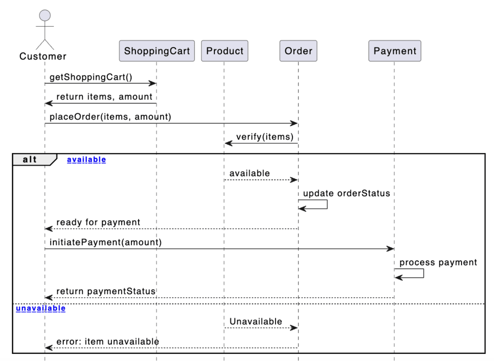
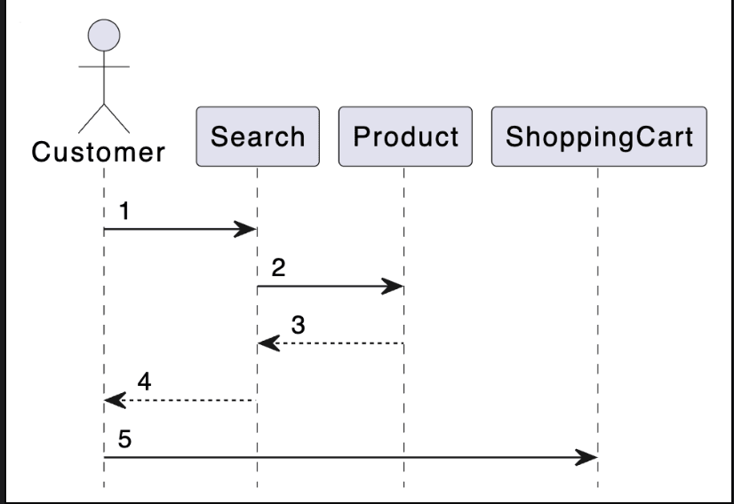
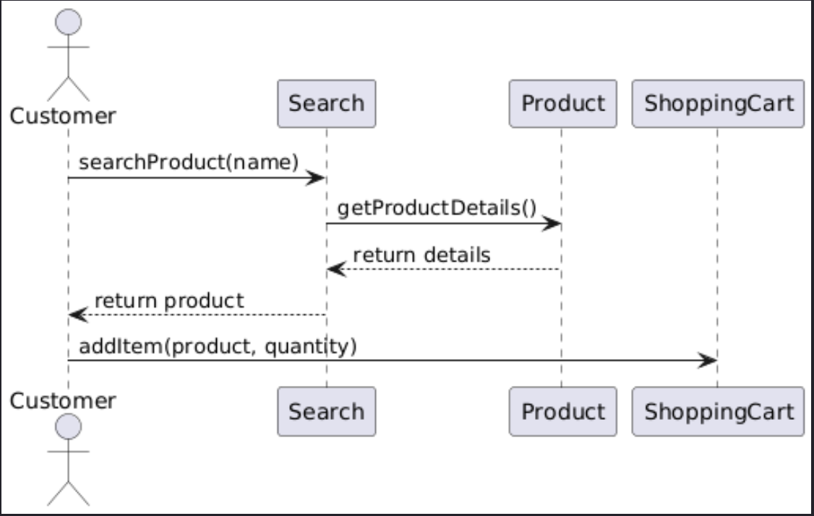

# Sequence Diagram for the Amazon Online Shopping System

Create a sequence diagram for checkout and payment of an order, and solve a challenge.

Sequence diagrams are a great way to understand the interactions between different entities and objects in the system. There can be different sequence diagrams that we can create for the Amazon online shopping system. For this lesson, we'll create sequence diagrams for the following two interactions:

* Checkout and payment: The user checks out and pays for their order using a credit card.
* Sequence challenge: The user searches and adds an item to the shopping cart.

## Checkout and payment

The sequence diagram for the order checkout and payment should have the following actors and objects that will interact with each other:

* Actor: `Customer`
* Objects: `ShoppingCart`, `Order`, `Item`, and `Payment`

Here are the steps in the order checkout and payment interaction:

1. The customer gets the shopping cart.
2. The customer then places the order for the requested items.
3. The items are verified for availability.
4. If the item quantity is less than the available count:
   1. The order status is updated.
   2. The customer is informed that the order is ready for payment.
   3. The customer initiates a payment against the order amount using their card.
   4. The payment is processed.
   5. The customer is informed of the updated payment status.
5. Else if the item quantity is greater than the available count:
   1. The item in the order is unavailable.
   2. The customer receives an error for the unavailable item.

Based on the order above, the sequence diagram below represents the checkout and payment process in an online shopping system.  

 

## Sequence challenge: Search and add items to the cart
You will help us complete a sequence diagram for searching and adding items to the cart. A skeleton of the search and add item sequence diagram is given below: 

  

Notice that the arrows in the diagram above are numbered from 1 to 5. Below are the messages between the actor(s) and object(s). Can you rearrange the messages below in the correct order sequence they should appear in the skeleton of the sequence diagram provided above?  

 

