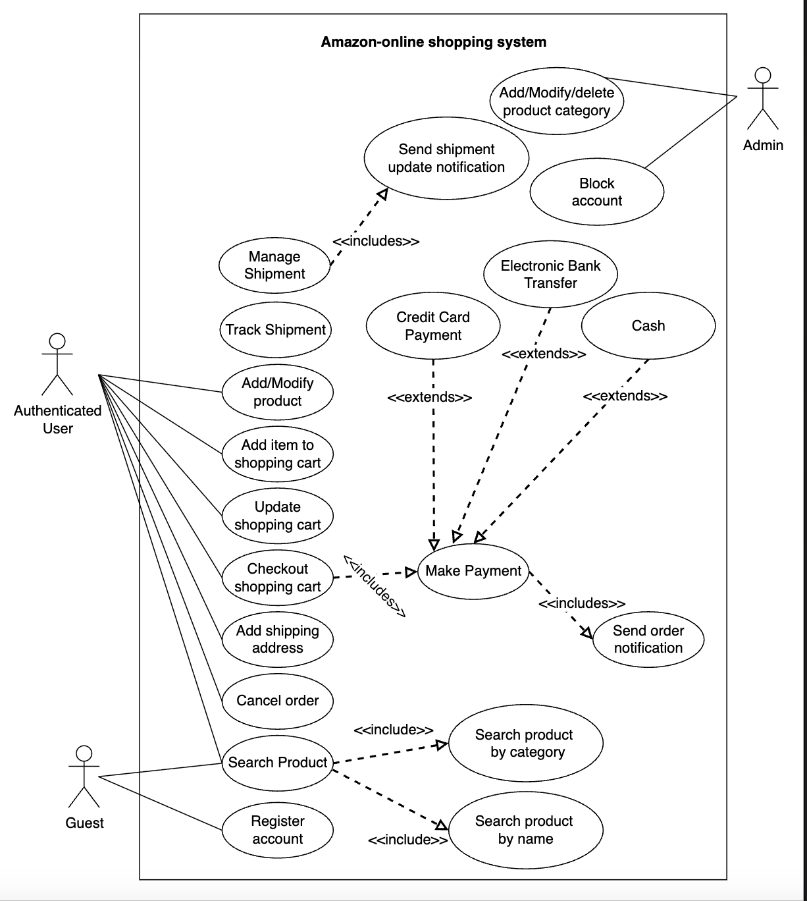

# Use Case Diagram for the Amazon Online Shopping System  
Learn how to define use cases and create the corresponding use case diagram for the Amazon problem.

Let's build the use case diagram of the Amazon problem and understand the relationship between its different components. First, we'll define the different elements of Amazon, followed by the complete use case diagram of the system.

## System  
Our system is the Amazon shopping system.

## Actors  
Now, we'll define the main actors of Amazon.

### Primary actors  
* **Authenticated user:** This actor can search for products, place or cancel orders, and add new products to sell.
* **Guest:** The guest actor can search for products, add items to a shopping cart, and update it. However, it must become a registered/authenticated member to place an order.

### Secondary actors  
* **Admin:** This can add, modify, or delete existing product categories.
* **System:** This is responsible for sending out notifications for orders and shipping updates.

## Use cases  
In this section, we will define Amazon's use cases. We have listed them according to their interactions with a particular actor.

Note: Some use cases will occur multiple times because they are shared among different actors in the system.

### Admin  
* **Block account:** To block an account
* **Add/Modify/Delete product category:** To add, modify, or delete product categories

### Authenticated user  
* **Add/Modify/Delete product:** To add a new product or modify the details of any existing product that a customer themselves added for selling. A user can also delete a product that they added for selling
* **Search product:** To search for any particular product based on the given criteria (name or category)
* **Add item to shopping cart:** To add an item to a shopping cart
* **Update shopping cart:** To update the item quantities present in the shopping cart
* **Checkout shopping cart:** To check out from the shopping cart into the payment section
* **Add shipping address:** To add a shipping address
* **Add credit card:** To pay the order amount via credit card
* **Make payment:** To pay the order amount via credit card, electronic bank transfer, or cash on delivery
* **Manage shipment:** Manage shipment-related cases, such as sending an order for shipment, update shipment status, and sending notifications whenever shipment status changes.
* **Track shipment:** To track the shipment status.

### Guest  
* **Register account:** To register for an account on Amazon
* **Search product:** To search for any particular product based on the given criteria (name or category)

### System  
* **Send order notification:** To send a notification of an order after payment
* **Send shipment update notification:** To send a notification of any updates in the shipment

## Relationships  
This section describes the relationships between and among actors and their use cases.

### Associations  
The table below shows the association relationship between actors and their use cases.

| Admin | Authenticated User | Guest | System |
|-------|-------------------|-------|--------|
| Block/Unblock account | Make payment | Register account | Send order notification |
| Add/modify product category | Add shipping address | Search product | Send shipment update notification |
| | Add/modify product | | |
| | Search product | | |
| | Add item to shopping cart | | |
| | Update shopping cart | | |
| | Checkout shopping cart | | |
| | Mange shipment | | |
| | Track shipment | | |

### Include  
When a user wants to make a payment, the system must verify the payment and then send a notification confirming the order.

* The "Make Payment" use case includes the "Send Order Notification" use case.  
When a user searches for a product, the system allows them to search by category or name.  
* The "Search Product" use case includes searching for products by category or searching for products by name.  
### Extend 
When a user chooses to make a payment, they can do so using a credit card, electronic bank transfer, or cash.

* The "Make Payment" use case encompasses payment options such as credit card, electronic bank transfer, and cash.

## Use case diagram  
Here's the use case diagram of Amazon:

in depth(Use Case Diagram for the Amazon Online Shopping System.), <a href="./deapth/Use-Case-Diagram-for-the-Amazon.md">click here</a>