# Class Diagram for the Parking Lot

Explore how to design a parking lot system using class diagrams, focusing on key components like vehicles, parking spots, tickets, and payments. Understand relationships such as inheritance, association, and composition while applying SOLID principles and design patterns such as Singleton and Factory for extensibility and maintainability.

In this lesson, we will identify, design, and explain the classes and abstract classes and their relationships that form the backbone of our parking lot system. We'll use SOLID principles, extensibility, and object-oriented design best practices.

## Components of a parking lot system

As our requirements outline, the system involves various entities and their interactions. We will use a bottom-up approach:

* First, design the smallest, most fundamental entities.
* Next, combine these to form more complex system components.
* Finally, bring everything together in the main `ParkingLot` class, responsible for coordination.

### Vehicle

Our parking lot system should have a vehicle object according to the requirements. The vehicle can be a car, a truck, a van, or a motorcycle. There are two ways to represent a vehicle in our system:

* Enumeration
* Abstract class

#### Enumeration vs. abstract class

The enumeration class creates a user-defined data type with the four vehicle types as values.

This approach is not proficient for object-oriented design because if we want to add one more vehicle type later in our system, we need to update the code in multiple places, violating the Open/Closed principle of the SOLID design principles. The Open/Closed principle states that classes can be extended but not modified. Therefore, it is recommended not to use the enumeration data type as it is not a scalable approach.

Note: Using enums isn't prohibited, but it is not recommended. Later, we will use the `PaymentStatus` enum in our parking lot design, as it won't require further modifications.

An abstract class cannot instantiate an object and can only be used as a base class. The abstract class for `Vehicle` is the best approach. It allows us to create derived child classes for the `Vehicle` class. It can also be extended easily in case the vehicle type changes.

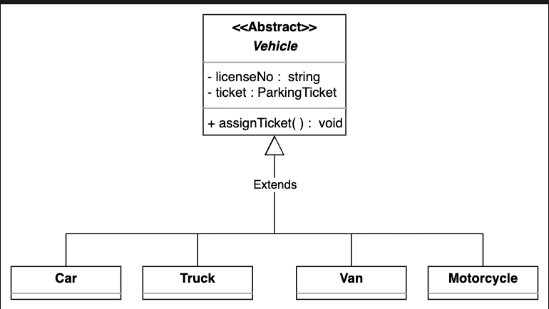

#### Parking spot
Similar to the `Vehicle` class, the `ParkingSpot` should also be an abstract class. There are four parking spots: accessible, compact, large, and motorcycle. These classes can be derived from the parking spot abstract class.

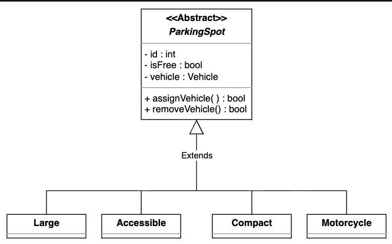

#### Account
Like to the `Vehicle` and `ParkingSpot` classes, `Account` should also be an abstract class. The `Admin` class is derived from this abstract class.

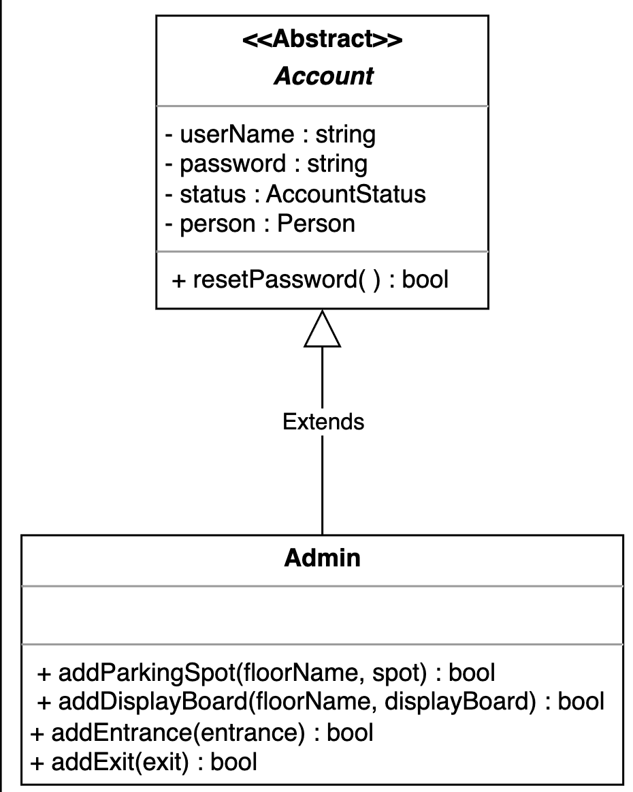

#### Display board
This class represents the free parking spot types and the number of empty slots.

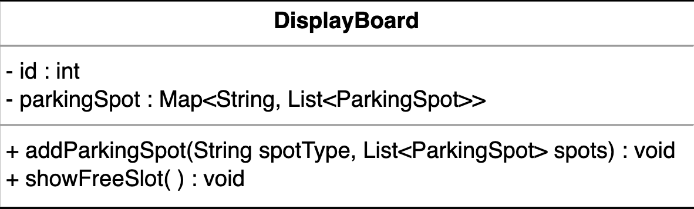

#### Entrance and exit 
The `Entrance` class generates the parking ticket whenever a vehicle arrives. There are multiple entrances to the parking lot, so it contains the ID attribute and has the `getTicket()` method.

The `Exit` class is responsible for validating the parking ticket’s payment status before allowing the vehicle to exit the parking lot. As there are multiple exits to the parking lot, it contains the ID attribute and has the `validateTicket()` method.

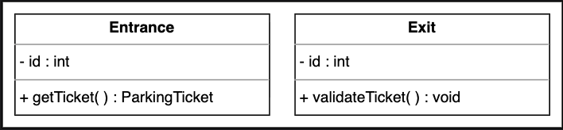

#### Parking ticket
The `ParkingTicket` class is one of the system’s central classes. It tracks the vehicles’ entrance and exit times, the amount, and the payment status.

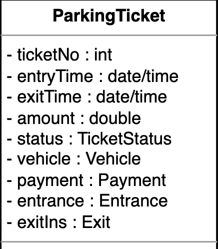

#### Payment
The `Payment` class will be abstract and have two child classes, `CreditCard` and `Cash`, as these are the two payment methods in the parking lot system.

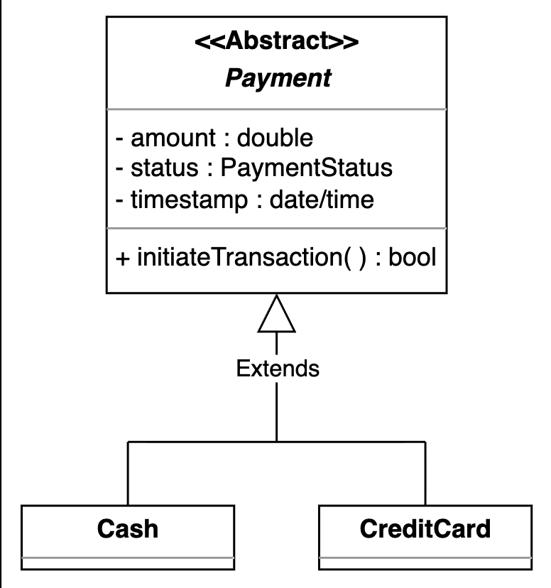

#### Parking rate
The `ParkingRate` class is responsible for calculating the final payment based on the time spent in the parking lot.

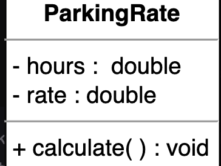

#### Parking lot
Now, we will discuss the design of the whole `ParkingLot` system class. This parking lot system comprises smaller objects we have already designed, like entrance/exit, parking spots, parking rates, etc.

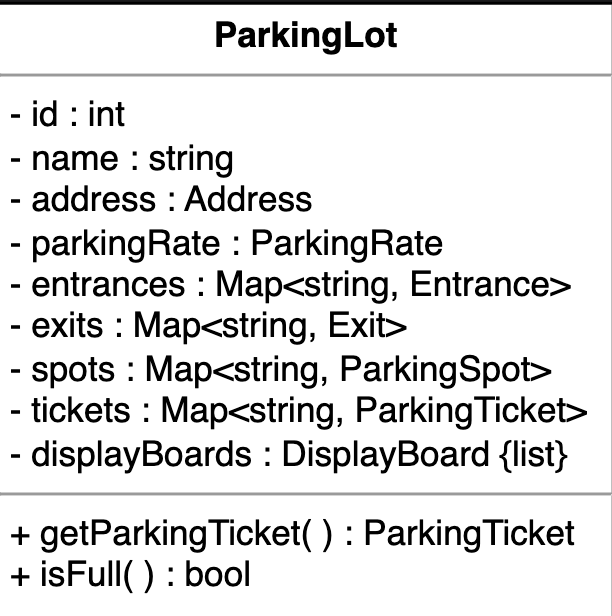

### The enumerations and custom data types
The following provides an overview of the enumerations and custom data types used in this problem:

* `PaymentStatus`: We need to create an enumeration to keep track of the parking ticket’s payment status, such as whether it is paid, unpaid, canceled, refunded, and so on.  
* `AccountStatus`: We need to create an enumeration to keep track of the status of the account, whether it is active, canceled, closed, and so on.  
* `TicketStatus`: We need to create an enumeration to track the current status of a parking ticket, such as whether it is issued, in use, paid, validated, canceled, refunded, and so on.

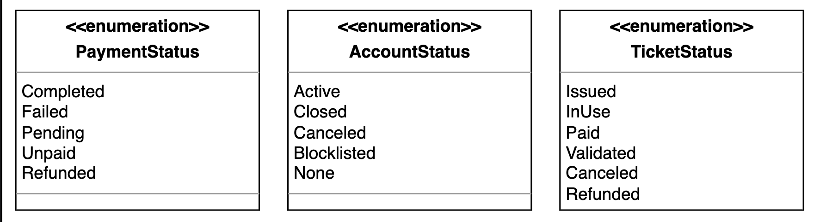

#### Address
We also need to create a custom data type, `Address`, to store the parking lot's location.

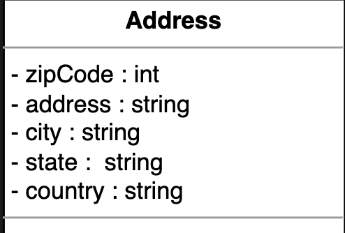

#### Person
The `Person` class stores information related to a person, such as their name, street address, country, etc.

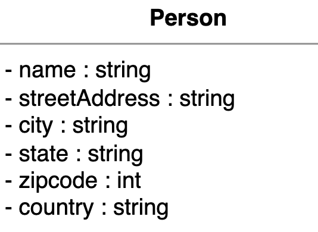

## Relationship between the classes

Now, we'll discuss the relationships between the classes we have defined above in our parking lot system.

### Association

An association represents a loose relationship between two classes, where one class refers to another to use its functionality or store a reference. Associations typically do not imply ownership, and the associated object may exist independently of the referring object.

In the parking lot system, association relationships include:

* Each `ParkingSpot` is associated with a `Vehicle` object. When a vehicle is parked, the spot keeps a reference to the vehicle. This allows the parking spot to track which vehicle is currently occupying it. However, the vehicle does not directly reference its spot.
* A `Vehicle` is associated with its current `ParkingTicket`. When a vehicle enters the lot, it receives a ticket, which allows for tracking and processing of parking sessions.
* The `ParkingTicket` class maintains references to the `Entrance`, `Exit`, and `Vehicle` involved in the parking session, allowing the system to trace the entry and exit points and the vehicle details for any given ticket.
* The `DisplayBoard` and `ParkingSpot` should have an association relationship. The `DisplayBoard` is responsible for showing the availability/status of multiple `ParkingSpot` objects; it maintains a reference (typically a list or map) to all spots it displays.

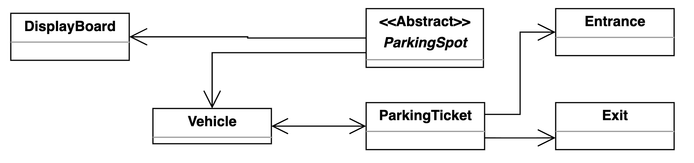

### Composition

Composition is a strong form of association that implies ownership and a whole-part relationship. When a composite object is destroyed, its components are destroyed as well. In other words, the composed objects do not exist independently of their parent.

In our parking lot system, composition relationships are seen in:

* The `ParkingLot` class comprises its key components, including all instances of `Entrance`, `Exit`, `ParkingSpot`, `DisplayBoard`, `ParkingRate`, and all current `ParkingTicket` objects. The parking lot is responsible for creating, managing, and destroying these components, which do not exist outside the context of the parking lot.
* Each `ParkingTicket` is composed of a `Payment` object. The payment represents the financial transaction for that specific parking session and is created and managed by the ticket; it does not exist independently outside the ticket.

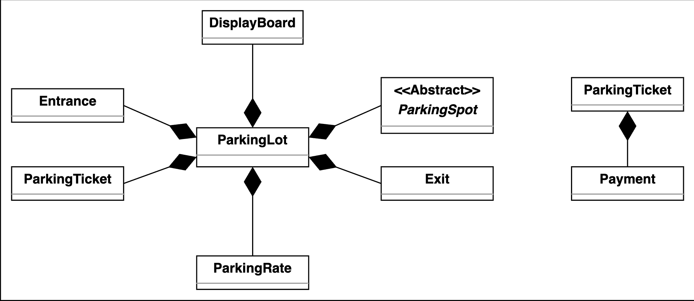

### Inheritance

Inheritance, or generalization, is a relationship in which one class (the child or subclass) inherits behavior and attributes from another class (the parent or superclass). This allows for code reuse and logical grouping of shared functionality while enabling polymorphic behavior.

In the parking lot system, inheritance relationships are structured as follows:

* The abstract `Vehicle` class serves as the general blueprint for different types of vehicles, with `Car`, `Truck`, `Van`, and `Motorcycle` as its concrete subclasses. Each subclass can extend or override the behavior defined in `Vehicle`.
* Similarly, the abstract `ParkingSpot` class defines a parking spot's core properties and behaviors. The specific spot types—`AccessibleSpot`, `CompactSpot`, `LargeSpot`, and `MotorcycleSpot`—are implemented as subclasses, each potentially providing specialized logic for assigning vehicles.
* The `Payment` abstract class provides the basic structure for payment operations, while `Cash` and `CreditCard` classes implement the details for each payment method.

Note: The component section above has already discussed the inheritance relationship between classes.

## Class diagram of the parking lot system

This section outlines the multiplicity (cardinality) relationships between the main classes in our parking lot system. We explain the allowed number of instances on each side for each relationship and the real-world or design rationale behind the connection. Understanding these relationships is key to modeling how different entities interact and collaborate to support key workflows in the system.

| Source | Target | Multiplicity | Reason |
|--------|--------|--------------|--------|
| ParkingLot | Entrance | 1 -- 1..* | A parking lot must have at least one entrance, and can have multiple for efficient flow. |
| ParkingLot | Exit | 1 -- 1..* | A parking lot must have at least one exit, and can have multiple for smooth operation. |
| ParkingLot | ParkingSpot | 1 -- 1..* | Every parking lot manages multiple parking spots. |
| ParkingLot | ParkingTicket | 1 -- 0..* | The lot manages zero or more tickets at any given time. |
| ParkingLot | DisplayBoard | 1 -- 0..* | There may be zero or more display boards (e.g., per floor or entrance). |
| ParkingLot | ParkingRate | 1 -- 1 | One parking rate policy per parking lot (single rate object for the whole lot). |
| ParkingSpot | Vehicle | 0..1 -- 1 | Each parking spot can have zero or one vehicle at a time (may be empty or occupied). |
| Vehicle | ParkingTicket | 1 -- 1 | A vehicle can have at most one ticket (only when parked). |
| ParkingTicket | Payment | 1 -- 1 | Each ticket is paid for with one payment transaction. |
| DisplayBoard | ParkingSpot | 1 -- 0..* | Each display board shows the status of zero or more parking spots. |

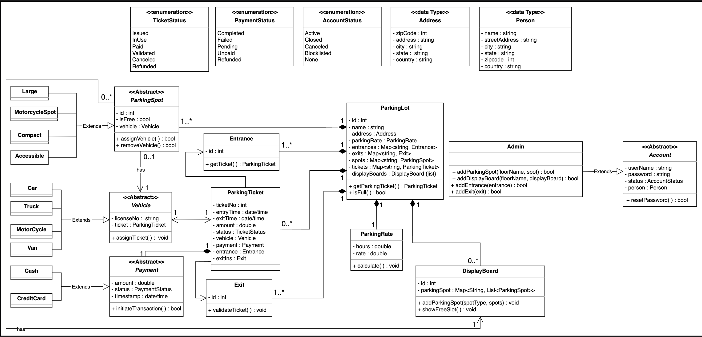
## Design pattern

Our parking lot system employs several standard object-oriented design patterns to enhance its flexibility and maintainability:

* Singleton pattern: The `ParkingLot` class is implemented as a Singleton. This ensures that only one instance of the parking lot system exists throughout the application's life cycle, centralizing the management of all lot resources.
* Factory and Abstract Factory patterns: Creating different types of parking spots, vehicles, or payments can leverage the Factory and Abstract Factory patterns. These patterns make it easy to introduce new types of spots, vehicles, or payment methods in the future, simply by extending the factory logic, without changing the core business logic or system structure.

## Additional requirements

The interviewer can introduce some additional requirements in the parking lot system, or they can ask some follow-up questions. Let's see some examples of additional requirements:

**Parking floor:** The parking lot should have multiple floors where customers can park their cars. The class diagram provided below shows the relationship of `ParkingFloor` with other classes:

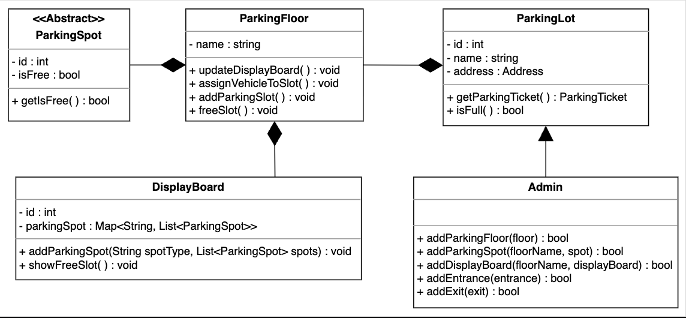

**Electric:** The parking lot should have some parking spots specified for electric cars. These spots should have an electric panel through which customers can pay and charge their vehicles. The class diagram provided below shows the relationship of `Electric` and `ElectricPanel` with other classes:

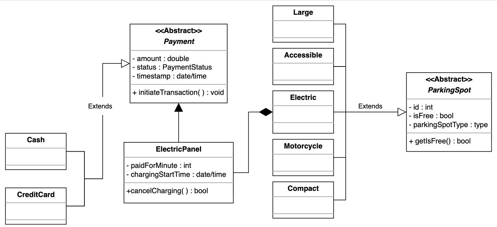

##### Question 
**Let’s say that the interviewer asks you that the parking lot should assign a parking spot closest to the entrance. How do you go about solving this requirement?**

his requirement is more about implementing this parking assignment strategy than designing it. The interviewer looks at your data structures and algorithm skills in this requirement.

In this scenario, let’s say we have four entrances and would like the customer to return to the parking spot nearest to the entrance from which the customer entered the parking lot. The best approach is to implement it using a “min heap.”

We will declare four min heaps and add all parking spots so that each entrance will have a min heap. These min heaps will store the parking spots in order of the shortest distance from the entrance.

* We will also declare the following two sets of parking spots:

   * A set of available parking spots
   * A set of reserved parking spots
* We have a map of min heaps where the key is the entrance ID, and the value is a min heap. When the user calls the getParkingSpot method, we get the entrance ID, which gives us the min heap for that entrance and allows us to pop the top element to get the parking spot.

* We mark the parking spot as reserved and remove it from the available set. We also remove it from the min heaps of other entrances.