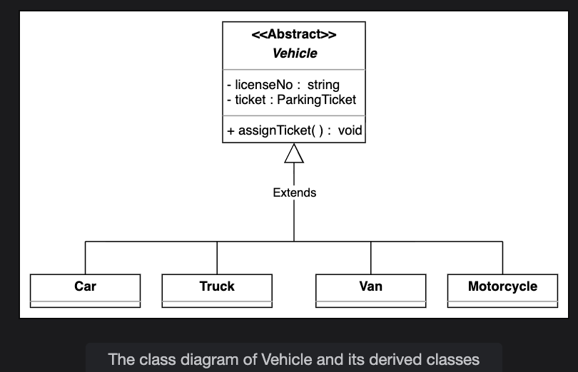
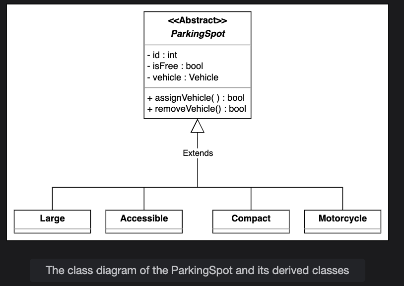
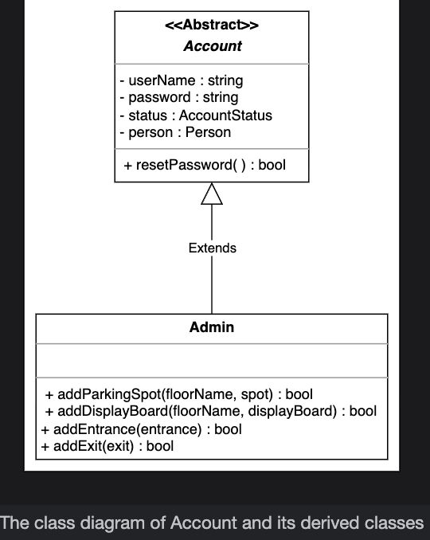
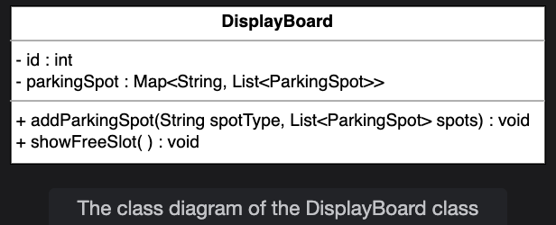
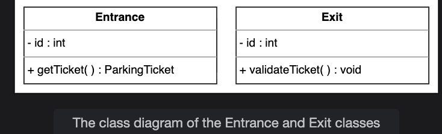

## Class Diagram for the Parking Lot

Learn to create a class diagram for the parking lot system using the bottom-up approach.

In this lesson, we will identify, design, and explain the classes and abstract classes and their relationships that form the backbone of our parking lot system. We'll use SOLID principles, extensibility, and object-oriented design best practices.

## Components of a parking lot system

As our requirements outline, the system involves various entities and their interactions. We will use a bottom-up approach:

* First, design the smallest, most fundamental entities.
* Next, combine these to form more complex system components.
* Finally, bring everything together in the main `ParkingLot` class, responsible for coordination.

## Vehicle

Our parking lot system should have a vehicle object according to the requirements. The vehicle can be a car, a truck, a van, or a motorcycle. There are two ways to represent a vehicle in our system:

* Enumeration
* Abstract class

### Enumeration vs. abstract class

The enumeration class creates a user-defined data type with the four vehicle types as values.

This approach is not proficient for object-oriented design because if we want to add one more vehicle type later in our system, we would need to update the code in multiple places, violating the Open/Closed principle of the SOLID design principle. The Open/Closed principle states that classes can be extended but not modified. Therefore, it is recommended not to use the enumeration data type as it is not a scalable approach.

> Note: Using enums isn't prohibited, but it is not recommended. Later, we will use the `PaymentStatus` enum in our parking lot design, as it won't require further modifications.

An abstract class cannot instantiate an object and can only be used as a base class. The abstract class for `Vehicle` is the best approach. It allows us to create derived child classes for the `Vehicle` class. It can also be extended easily in case the vehicle type changes.

**R1:** The parking lot must support a total capacity of up to 40,000 vehicles.  
**R4:** The system must support parking for four types of vehicles: cars, trucks, vans, and motorcycles.  
**R6:** The system must not allow more vehicles to enter once the parking lot reaches its maximum capacity.  
**R10:** The parking lot system must support configurable pricing rates based on vehicle type and/or parking spot type and different rates for different parking durations (e.g., first hour, subsequent hours).

## Parking spot  

Similar to the `Vehicle` class, the `ParkingSpot` should also be an abstract class. There are four types of parking spots: handicapped, compact, large, and motorcycle. These classes can be derived from the parking spot abstract class.  

   

**R1:** The parking lot must support a total capacity of up to 40,000 vehicles.  
**R2:** The parking lot must support multiple types of parking spots:  
   - Accessible
   - Compact
   - Large
   - Motorcycle

**R5:** A display board at each entrance and on every floor should show the current available parking spots for each parking spot type.  
**R6:** The system must not allow more vehicles to enter once the parking lot reaches its maximum capacity.  
**R7:** A clear message should be displayed at each entrance and on all parking lot display boards when the lot is fully occupied.

## Account
Similar to the `Vehicle` and `ParkingSpot` classes, `Account` should also be an abstract class. The `Admin` class is derived from this abstract class.  

  

**R2:** The parking lot must support multiple types of parking spots:  
   - Accessible
   - Compact
   - Large
   - Motorcycle

**R3:** The parking lot should provide multiple entrance and exit points to support efficient traffic flow.  
**R5:** A display board at each entrance and on every floor should show the current available parking spots for each parking spot type.  
**R10:** The parking lot system must support configurable pricing rates based on vehicle type and/or parking spot type and different rates for different parking durations (e.g., first hour, subsequent hours).   

## Display board
This class represents the free parking spot types and the number of empty slots.  

  

**R5:** A display board at each entrance and on every floor should show the current available parking spots for each parking spot type.  
**R7:** A clear message should be displayed at each entrance and on all parking lot display boards when the lot is fully occupied.   

## Entrance and exit 
The `Entrance` class is responsible for generating the parking ticket whenever a vehicle arrives. It contains the ID attribute, since there are multiple entrances to the parking lot. It also has the `getTicket()` method.  

The `Exit` class is responsible for validating the parking ticket’s payment status before allowing the vehicle to exit the parking lot. It contains the ID attribute, since there are multiple exits to the parking lot. It also has the `validateTicket()` method.   

  

**R3:** The parking lot should provide multiple entrance and exit points to support efficient traffic flow.  
**R8:** Customers must be issued a parking ticket at entry, which will be used to track parking time and calculate payment at exit.   
**R9:** Customers should be able to pay for parking at the automated exit panel.   

