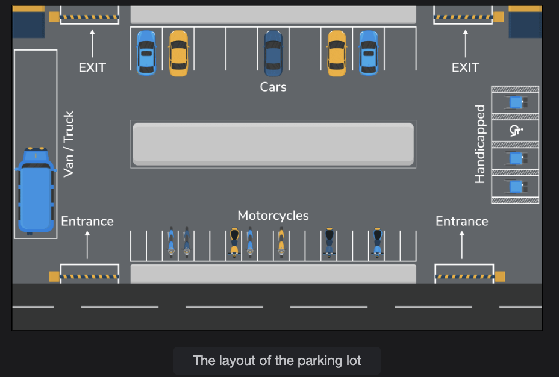

# Getting Ready: Parking Lot

Make an object-oriented design for a multi-entrance and exit parking lot system.

## Problem definition

A parking lot is a designated area for parking vehicles, commonly found in venues like shopping malls, sports stadiums, and office buildings. It consists of a fixed number of parking spots allocated for different types of vehicles. Each spot is charged based on the duration a vehicle remains parked. Parking time is tracked using a parking ticket issued at the entrance. Upon exit, the customer can pay using either an automated exit panel or through a parking agent, with a credit/debit card or cash as accepted payment methods.

In this LLD interview case study, your focus will be on:

* Managing parking for various vehicle types (car, van, truck, motorcycle, etc.) across potentially multiple floors and zones.
* Allocating and tracking parking spot availability by type (e.g., compact, large, handicapped, motorcycle).
* Issuing and managing parking tickets for tracking entry, parking duration, and exit.
* Handling flexible payments at automated exit panels or via human agents, supporting multiple payment methods (cash, card, coupon).
* Implementing and enforcing pricing models that may vary by hour, spot type, or vehicle type.
* Ensuring real-time tracking of spot occupancy and enabling efficient entry/exit flows, especially during busy periods.
* Accommodating special considerations like handicapped spots and overflow situations.

> Note : This parking lot system model can be adapted for various venues (malls, stadiums, offices, airports) and is extensible to different business rules (such as prebooking, dynamic pricing, or loyalty programs).




## Expectations from the interviewee

In a typical parking lot system, there are several components each with specific constraints and requirements. The following section provides an overview of some major expectations the interviewer will want an interviewee to discuss in more detail during the interview.

### Payment flexibility

One of the most significant attributes of the parking lot system is the payment structure that it provides to its customers. An interviewer would expect you to ask questions like these:

* How are customers able to pay at different exit points (i.e., either at the automated exit panel or to the parking agent) and by different methods (cash, credit, coupon)?
* If there are multiple floors in the parking lot, how will the system keep track of the customer having already paid on a particular floor rather than at the exit?

## 🧩 Context

In a Parking Lot System, customers enter, park their vehicles, and then pay before exiting.
Now, in real life, different parking systems allow different payment options and locations. So, when designing the system, you must consider:

* Where the customer can make the payment
* How the payment is made
* How the system tracks that the payment is done

## 💡 Let's decode the two interview questions one by one:

### 1️⃣ "How are customers able to pay at different exit points (i.e., either at the automated exit panel or to the parking agent) and by different methods (cash, credit, coupon)?"

This question is asking:
Can your design handle multiple payment locations and methods?

### 💭 Why this matters:

In a real parking system:

* Some customers may pay at an automated kiosk using card or cash.
* Some may pay at the exit gate directly to a parking agent.
* Some may have discount coupons or monthly passes.

So your design must allow:

* Multiple payment interfaces (`PaymentKiosk`, `ExitPanel`, `MobileApp`)
* Multiple payment methods (`CashPayment`, `CreditCardPayment`, `CouponPayment`)

### 🧠 In OOD terms:

You could design a `Payment` abstract class and then create specific implementations:

```java
abstract class Payment {
    double amount;
    abstract boolean processPayment();
}

class CashPayment extends Payment { ... }
class CreditCardPayment extends Payment { ... }
class CouponPayment extends Payment { ... }

```

And have different terminals or payment points that interact with these.
This shows flexibility — the system isn't tied to one payment option.

### 2️⃣ "If there are multiple floors in the parking lot, how will the system keep track of the customer having already paid on a particular floor rather than at the exit?"

This is a question about system synchronization and data integrity.

### 💭 What they're testing:

They want to see if your system can track payment status globally — across multiple entry/exit points.

Imagine:

* A customer parks on Floor 3.
* Pays at a kiosk on Floor 3 (not at the exit).
* Later drives to Exit Gate A to leave.

The exit gate system must already know that this customer has paid, otherwise it might wrongly ask for payment again.

### 🧠 What this means in design:

* You need a centralized payment tracking system.
* Each vehicle or ticket should have a unique ID.
* Once payment is made, the system updates the record as "PAID."
* Any exit panel, regardless of floor, can check that record.

Example:

```java
class ParkingTicket {
    String ticketId;
    boolean isPaid;
    LocalDateTime paidAt;
}

```

When the car reaches the exit, the gate system checks:
"Has this ticket ID been marked as paid?"
If yes → open the gate. If no → block exit or ask for payment.

### 🧠 Summary — What "Payment Flexibility" really means

| Concept | Meaning |
|---------|---------|
| Payment Locations | Customer can pay at multiple points — exit gate, kiosk, or with a parking agent. |
| Payment Methods | System must support multiple methods like cash, card, coupon, or online. |
| Centralized Tracking | Regardless of where payment happens (which floor or gate), the system must track it globally so no double payment happens. |
| OOD Implication | Design flexible, extensible payment classes and ensure proper synchronization between modules. |

---
## Parking spot type #

Another topic of discussion that an interviewer would expect you to be aware of is the different parking spot types—handicapped, compact, large, and motorcycle—regarding which you can ask the following questions:

* How will the parking capacity of each lot be considered?
* What happens when a lot becomes full?
* How can one keep track of the free parking spots on each floor if there are multiple floors in the parking lot?
* How will the division of the parking spots be carried out among the four different parking spot types in the lot?

## 🧩 Context

In a real parking lot, not all spots are the same.
Different vehicles or people require different types of parking spaces.
For example:

A motorcycle doesn't need as much space as a truck.
Handicapped spots are reserved near the entrance.
Compact spots are for small cars, large for SUVs or vans.
So, your design must account for these spot variations, capacity tracking, and real-time availability.

## 💡 Interviewer's Intent
The interviewer is checking:

> Can you design a flexible, scalable parking management system that handles multiple parking spot types and dynamic space availability?

Now let's break down each of the four questions they expect you to explore.

## 1️⃣ "How will the parking capacity of each lot be considered?"

This is asking:

How does your system know how many total spots exist — and how many of each type?

### 💭 Real-world meaning:

Each parking lot (or each floor) has a defined capacity:

10 handicapped spots
20 compact spots
15 large vehicle spots
5 motorcycle spots
Your system must store this configuration somewhere.

### 🧠 In design terms:

You could have a ParkingLot or ParkingFloor class that maintains the count of each spot type.

Example:

```java
class ParkingFloor {
    List<ParkingSpot> handicappedSpots;
    List<ParkingSpot> compactSpots;
    List<ParkingSpot> largeSpots;
    List<ParkingSpot> motorcycleSpots;
}
```

Or even maintain this in a map:

```java
Map<ParkingSpotType, Integer> totalCapacity;
Map<ParkingSpotType, Integer> availableSpots;
```

This ensures the system knows total vs available for every spot type.

## 2️⃣ "What happens when a lot becomes full?"

This is about system behavior under capacity constraints.

### 💭 Real-world meaning:

If all compact car spots are full:
Do you redirect the driver to another floor?
Do you show a "Lot Full" message at the entry gate?
Can the system predict or reserve space in another lot?
### 🧠 In design terms:

Your system must:
Continuously check spot availability before assigning.
Reject or redirect the vehicle if no suitable spot is available.
Trigger notifications or update signage at the entrance.
So, your ParkingLot service might have a method like:

```java
boolean hasAvailableSpot(VehicleType vehicleType);
ParkingSpot assignSpot(Vehicle vehicle);
```

If no spot is available → return null or throw a ParkingFullException.

## 3️⃣ "How can one keep track of the free parking spots on each floor if there are multiple floors in the parking lot?"

This question is about real-time tracking and data synchronization.

### 💭 Real-world meaning:

If there are 5 floors, the system should know:
How many spots are free on each floor
How many are occupied
Which spot IDs are taken
This helps in:
Displaying availability signs ("Floor 2: 3 spots free")
Assigning spots efficiently to vehicles at entry

### 🧠 In design terms:

You'll have a structure like:

```java
class ParkingFloor {
    Map<ParkingSpotType, List<ParkingSpot>> availableSpots;
}
```

When a vehicle parks:
Mark the spot as occupied
Update the floor's available count
When it leaves:
Mark the spot as free again.
This ensures the system always reflects real-time availability.

## 4️⃣ "How will the division of the parking spots be carried out among the four different parking spot types in the lot?"

This is about initial layout design — how you plan your space allocation.

### 💭 Real-world meaning:

You can't just randomly mix spots; you must predefine ratios:
10% for handicapped
50% for compact
30% for large
10% for motorcycles
Or, you can make it configurable per floor or per lot.

### 🧠 In design terms:

You might have a configuration setup like:

```java
class ParkingLotConfiguration {
    Map<ParkingSpotType, Double> spotDistribution; // percentage of total
}
```

Or directly during setup:

```java
parkingLot.addFloor(new ParkingFloor(2, 50, 30, 15, 5));
```

→ meaning 50 compact, 30 large, 15 motorcycle, 5 handicapped.

This makes your design scalable — you can easily change proportions when adding new floors or vehicle types.

## 🧠 Summary — What "Parking Spot Type" really means

| Concept | Meaning |
|---------|---------|
| Spot Types | Different categories of spots for different vehicles (compact, large, handicapped, motorcycle). |
| Capacity Tracking | Each lot/floor must track total and available spots per type. |
| Full Condition Handling | System should gracefully handle when a particular type or entire lot is full. |
| Real-Time Spot Management | Must update spot availability instantly when vehicles enter or exit. |
| Flexible Allocation | Ability to configure how many spots each type gets on setup. |

---

## Vehicle types

Similar to the parking spot, an interviewer would also expect you to discuss the different vehicle types—car, truck, van, motorcycle—which can have the following set of questions:

* How will capacity be allocated for different vehicle types?
* If the parking spot of any vehicle type is booked, can a vehicle of another type park in the designated parking spot?

## 🧩 Context

In a parking lot, vehicles come in different sizes and categories — for example:

* Motorcycles
* Cars
* Vans
* Trucks

These vehicles cannot all park in the same type of spot because they require different space and layout.

So, during an Object-Oriented Design interview, the interviewer wants to see:

Can you design a flexible system that handles multiple vehicle types and correctly maps them to the right parking spot types?

## 💡 Interviewer's Intent

They're testing:

* Your ability to model real-world constraints in software
* Your understanding of relationships and compatibility (vehicle ↔ spot)
* How you'll enforce business rules like "a truck can't park in a compact car spot"
* And whether your system can handle dynamic capacity allocation

Let's go through the two main interview questions one by one.

## 1️⃣ "How will capacity be allocated for different vehicle types?"

This question asks:

How do you ensure that the parking lot reserves enough space for each type of vehicle?

### 💭 Real-world meaning:

Just like spot types, the parking lot has a limited number of spaces per vehicle category. You might decide:

* 50 spots for cars
* 20 for motorcycles
* 10 for trucks
* 5 for vans

That's your capacity planning.

But it's not static — maybe one floor is for motorcycles and compact cars only; another is for vans and trucks.

### 🧠 In design terms:

You'll need to maintain vehicle-to-spot-type mapping and capacity tracking.

Example:

```java
enum VehicleType {
    CAR, TRUCK, VAN, MOTORCYCLE
}
```

Then define which ParkingSpotType each vehicle can use:

```java
Map<VehicleType, List<ParkingSpotType>> allowedSpotTypes;
```

For example:

* `CAR` → can park in `COMPACT`, `LARGE`
* `MOTORCYCLE` → can park in `MOTORCYCLE`, maybe `COMPACT`
* `TRUCK` → only `LARGE`

And in your `ParkingLot` or `ParkingManager` class:

```java
boolean hasAvailableSpot(VehicleType type);
ParkingSpot assignSpot(Vehicle vehicle);
```

This ensures you only assign a valid and available spot to the right vehicle.

## 2️⃣ "If the parking spot of any vehicle type is booked, can a vehicle of another type park in the designated parking spot?"

This is about rule flexibility and exception handling.

### 💭 Real-world meaning:

Imagine all compact car spots are full, but there are still a few large spots open.

Questions arise:

* Can a car park in a large spot? (probably yes)
* Can a motorcycle park in a compact or large spot? (maybe, if allowed)
* Can a truck park in a compact spot? (definitely no)

So your system needs to handle such fallback logic intelligently — based on allowed rules and available space.

### 🧠 In design terms:

You can model this using compatibility rules between vehicle and spot types.

Example:

```java
class ParkingRuleEngine {
    boolean canPark(VehicleType vehicleType, ParkingSpotType spotType) {
        // Define allowed mappings
        if (vehicleType == VehicleType.TRUCK && spotType != ParkingSpotType.LARGE)
            return false;
        if (vehicleType == VehicleType.MOTORCYCLE && spotType == ParkingSpotType.HANDICAPPED)
            return false;
        return true;
    }
}
```

This gives your system flexibility — for example:

* If compact spots are full, try a large one.
* If not allowed, show "No spot available."

This also prepares your design for future scalability, like adding new types (`ElectricCar`, `Bicycle`, etc.) without breaking existing logic.

## 🧠 Summary — What "Vehicle Types" Really Means

| Concept | Meaning |
|---------|---------|
| Different Vehicle Categories | Cars, trucks, vans, motorcycles — each with different size/space needs. |
| Capacity Planning | You must define how many total spots are reserved for each type of vehicle. |
| Compatibility Rules | A vehicle should only park in suitable spot types based on predefined mappings. |
| Fallback Logic | If preferred spot type is full, system should decide whether to allow an alternate. |
| Extensibility | Future vehicle types (e.g., EVs) can easily be supported by adding new mapping rules. |

---
## Pricing

We touched upon the payment structure offered by the parking lot system. Now, the pricing model needs to be clarified from the interviewer, and therefore you may ask questions like these:

How will pricing be handled? Should we accommodate having different rates for each hour? For example, customers will have to pay $4 for the first hour, $3.5 for the second and third hours, and $2.5 for all the subsequent hours.

Will the pricing be the same for the different vehicle types?

## 🧩 Context

Every parking lot charges customers based on how long they stay — but not all systems have the same pricing logic.

Pricing can vary by:

* Duration (per hour, per day, per month)
* Vehicle type (motorcycle vs truck)
* Location (basement vs rooftop)
* Time of day (peak vs off-peak hours)

So, in an interview, when the topic of "Pricing" comes up, they're checking whether you can design a flexible, extensible, and configurable pricing system — one that can easily adapt to business rule changes.

## 💡 Interviewer's Intent

They want to see if you can handle:

* Dynamic pricing logic (hour-based, flat rate, tiered)
* Different rates for different vehicle types
* Separation of pricing calculation from payment processing
* Easy future modifications (e.g., add new pricing policies)

Let's now break down the two specific interview questions.

## 1️⃣ "How will pricing be handled? Should we accommodate having different rates for each hour?"

This question asks:

How do you design a system that calculates the parking fee correctly, especially if rates vary by time spent?

### 💭 Real-world meaning:

Many parking systems use tiered pricing models — meaning the rate per hour changes after a certain duration.

Example:

* First hour → $4
* Next two hours → $3.5/hour
* Beyond 3 hours → $2.5/hour

This means your system must:

* Track how long each vehicle stays (entryTime, exitTime)
* Apply the correct rate tier based on total duration
* Calculate total fee dynamically

### 🧠 In design terms:

You can design a PricingStrategy or PricingPolicy component.

Example:

```java
interface PricingStrategy {
    double calculateFee(Duration parkingDuration);
}
```

Then you can have different implementations:

```java
class HourlyPricingStrategy implements PricingStrategy {
    public double calculateFee(Duration duration) {
        long hours = duration.toHours();
        double total = 0;
        if (hours >= 1) total += 4;
        if (hours >= 2) total += (Math.min(hours, 3) - 1) * 3.5;
        if (hours > 3) total += (hours - 3) * 2.5;
        return total;
    }
}
```

✅ This approach makes it easy to change pricing rules later — just switch or extend the strategy class.

## 2️⃣ "Will the pricing be the same for the different vehicle types?"

This question checks:

Can your design differentiate between different vehicle categories when calculating prices?

### 💭 Real-world meaning:

A truck takes up more space than a motorcycle, so it might cost more per hour.

Some lots may offer discounts for small or eco-friendly vehicles.

Handicapped spots might have special (or free) pricing rules.

So, pricing likely depends on vehicle type.

### 🧠 In design terms:

You can model this using composition — combine vehicle type with the pricing logic.

Example:

```java
class VehiclePricingStrategy implements PricingStrategy {
    private VehicleType vehicleType;
    
    public double calculateFee(Duration duration) {
        double baseRate = switch (vehicleType) {
            case CAR -> 4.0;
            case TRUCK -> 6.0;
            case MOTORCYCLE -> 2.0;
            case VAN -> 5.0;
        };
        return baseRate * duration.toHours();
    }
}
```

Or better yet, use a configurable rate card stored in a database or configuration file:

```java
Map<VehicleType, PricingStrategy> pricingRules;
```

That way, each vehicle type can have its own pricing structure — no hardcoding.

## 🧠 Summary — What "Pricing" Really Means

| Concept | Meaning |
|---------|---------|
| Tiered Pricing | Different hourly rates depending on how long a vehicle stays (e.g., $4 → $3.5 → $2.5). |
| Vehicle-Based Pricing | Rates differ for cars, trucks, vans, and motorcycles. |
| Time Tracking | The system must capture entry and exit timestamps to calculate total duration. |
| Configurable Structure | Pricing rules should be changeable without code modification (ideal for scaling). |
| Separation of Concerns | Keep Pricing logic independent from Payment — pricing calculates cost, payment processes it. |

## 🎯 Design Takeaway

To impress the interviewer, you can say:

"I'd implement a flexible PricingStrategy interface that can have multiple implementations like HourlyPricing, FlatRatePricing, or VehicleBasedPricing.
This allows adding new pricing models easily without affecting other parts of the system."

This demonstrates:

* Good understanding of the Strategy Design Pattern
* Awareness of real-world flexibility
* Solid grasp of scalable system design

## 🔧 Bonus (if asked)

You can even mention discounts or validations:

* Early bird offers
* Subscription or membership passes
* Free first hour promotions

Those can easily fit into your design as decorators or additional strategy layers:

```java
class DiscountedPricingStrategy implements PricingStrategy {
    private PricingStrategy baseStrategy;
    private double discountRate;
}
```

---
## Design approach

We will design this parking lot system using a bottom-up design approach. For this purpose, we will follow the steps below:

* First, we'll identify the core entities such as `Vehicle`, `ParkingSpot`, `ParkingTicket`, and `Payment`, and define their primary responsibilities.
* Next, we'll model how vehicles are assigned to appropriate parking spots based on type and availability, how entry/exit is managed, and how parking duration is tracked.
* We'll design the payment system to support different payment methods and flexible pricing rules, ensuring secure and accurate fee calculation.
* We'll ensure the system supports scalability (multiple floors, high traffic), real-time updates on availability, and follows SOLID principles for maintainability.

---
## Design pattern

During an interview, it is always a good practice to discuss the design patterns that a parking lot system falls under. Stating the design patterns gives the interviewer a positive impression and shows that the interviewee is well-versed in the advanced concepts of object-oriented design.

## Question

Which design pattern(s) should be used for solving the problem of managing a parking lot efficiently? Explain your choice(s).

## Ans

### CorrectAnswer:

* Singleton: Useful for managing the payment processor and central ticket tracking to ensure only one instance controls critical operations across floors and exits.
* Strategy: Allows for applying different pricing models based on time parked and vehicle type.
* Factory Method: Helps create various parking spot and vehicle type objects dynamically without changing client code.
* Observer (Optional): Can notify parking agents or automated panels when spots become available or full.
* Proxy (Optional): Can manage access to payment gateways or ticket validation, adding security and caching if needed.

### Reasoning:

* The Singleton pattern ensures that core components like the payment processor or ticket registry are globally accessible and consistent across the system, which is crucial for multi-floor or multi-exit parking lots.
* The Strategy pattern enables flexible pricing logic, so you can easily switch or extend how parking fees are calculated based on vehicle type, duration, or special events.
* The Factory Method pattern allows the system to instantiate different types of parking spots and vehicles without tightly coupling the creation logic, supporting scalability and easy maintenance.
* The Observer pattern can be used to notify relevant subsystems (like display panels or attendants) when parking spot availability changes, improving real-time responsiveness.
* The Proxy pattern can add a security or caching layer to sensitive operations, such as payment processing or ticket validation, without changing the core business logic.

These patterns together help create a modular, scalable, and maintainable Parking Lot System that addresses the requirements of spot allocation, flexible payments, multi-floor management, and dynamic pricing.
