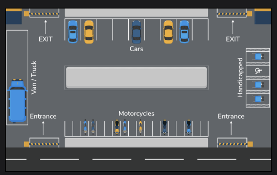
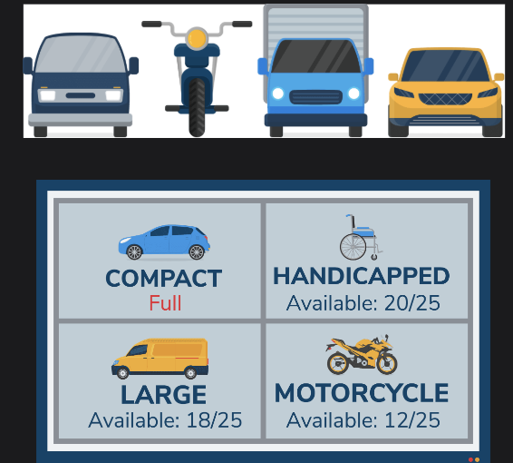
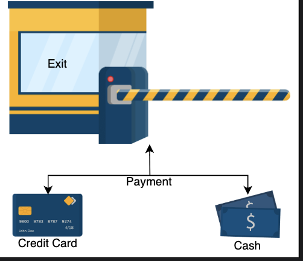

## Requirements for the Parking Lot Design

Learn about all the requirements of the parking lot problem.

In this lesson, we outline the functional and operational requirements for the parking lot system. Clearly identifying and understanding requirements is essential to defining the system's scope and ensuring a robust, user-friendly design.

We'll use the notational convention to identify each requirement with a unique label "Rn," where "R" is short for Requirement and "n" is a natural number.

## Requirements collection

Let's define the requirements for the parking lot problem:

* R1: The parking lot must support a total capacity of up to 40,000 vehicles.
* R2: The parking lot must support multiple types of parking spots:
   * Accessible (for individuals with disabilities)
   * Compact
   * Large
   * Motorcycle
* R3: The parking lot should provide multiple entrance and exit points to support efficient traffic flow.
* R4: The system must support parking for four types of vehicles: cars, trucks, vans, and motorcycles.
* R5: A display board at each entrance and on every floor should show the current number of available parking spots for each parking spot type.
* R6: The system must not allow more vehicles to enter once the parking lot reaches its maximum capacity.
* R7: When the parking lot is fully occupied, a clear message should be shown at each entrance and on all parking lot display boards.
* R8: Customers must be issued a parking ticket at entry, which will be used to track parking time and calculate payment at exit.
* R9: Customers should be able to pay for parking at the automated exit panel.
* R10: The parking lot system must support configurable pricing rates based on vehicle type and/or parking spot type and different rates for different parking durations (e.g., first hour, subsequent hours).
* R11: Payments must be accepted via credit/debit card and cash at all payment points.

