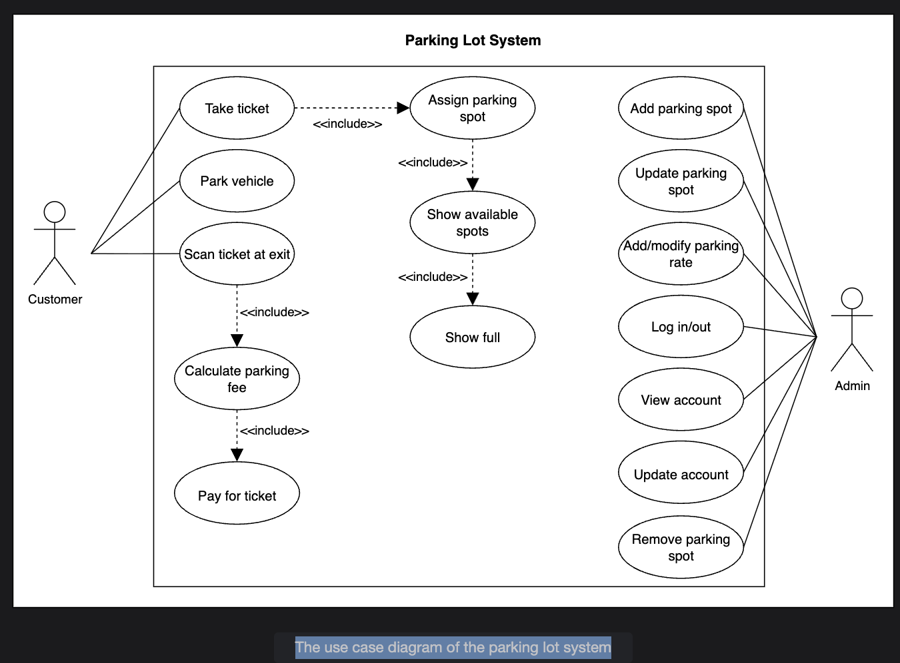

## Use Case Diagram for the Parking Lot

Learn how to define use cases and create the corresponding use case diagram for the parking lot system.

Let's build the parking lot system's use case diagram and understand the relationships between its main actors and functions. First, we'll define the different elements of our system, followed by the complete use case diagram and a table mapping actors to their main use cases.

## System

Our system is the parking lot system. It manages the entire parking process, including vehicle entry and exit, parking spot allocation, payment processing, and administration of parking lot resources.

## Actors

Here are the main actors of our parking lot system:

### Primary actors

Customer: Parks their vehicle, obtains a parking ticket, pays the parking fee, and exits the parking lot.

### Secondary actors

Admin: Manages system resources, such as parking spots, entry/exit panels, and pricing. Also handles account and system configuration.

## Use cases

In this section, we will define the parking lot's use cases. We have listed them according to their respective interactions with a particular actor.

### Admin

* Add a parking spot: To add a new parking spot, specify spot type (accessible, compact, large, motorcycle) and location (e.g., floor, section).
* Remove the parking spot: Remove it from the system if it is no longer available (due to maintenance or repurposing).
* Update the parking spot: This is to update the details of an existing parking spot, such as changing its type or status (e.g., available/unavailable).
* Add/modify rate: To configure or change the pricing rates for durations, vehicles, or parking spot types.
* Update the account: To update the admin or agent account details and manage payment information or permissions.
* Login/Logout: To securely log in or out of the admin or agent account to access system features.
* View the account: To view account details such as payment status, outstanding balances, or account activity history.

### Customer

* Take ticket: To receive a parking ticket at the entrance, which records the vehicle information and entry time.
* Scan ticket at exit: To present the ticket at the exit, enabling the system to calculate the total parking fee based on duration, vehicle, and spot type.
* Pay for ticket: Pay the parking fee using cash or a card at an automated exit panel.
* Park vehicle: To park the vehicle in the spot assigned by the system.

### Parking lot system

* Assign parking spot: To automatically select and allocate an available spot based on vehicle type, spot type, and real-time availability.
* Remove parking spot: To update the spot's status to unavailable if the spot is out of service or being removed from inventory.
* Show full: To display a "full" status at entrances and on display boards when the parking lot or a specific type is at capacity.
* Show available spots: This will provide real-time updates of the number of available spots by type at each entrance, exit, and floor.
* Calculate parking fee: According to the current pricing rules, the total amount owed by the customer is determined based on the duration of parking (from entry to exit), vehicle type, and parking spot type. This calculation is automatically triggered when the customer scans their ticket at the exit.

## Relationships

This section describes the relationships between and among actors and their use cases.

### Generalization

Generalization describes an "is-a" relationship between a more general parent class and a more specialized child class.

Examples in the parking lot system:

* Vehicle is a parent class, with specialized subclasses: Car, Truck, Van, and Motorcycle.
* Each vehicle type inherits general behaviors and attributes (e.g., license plate, color) from Vehicle.
* ParkingSpot is a parent class, with specialized subclasses: HandicappedSpot, CompactSpot, LargeSpot, and MotorcycleSpot.
* Each spot type inherits core properties (e.g., spot number, occupancy status).

### Associations

The table below shows the interactions between actors and their corresponding use cases.

| Admin | Customer | Parking Lot System |
|-------|----------|-------------------|
| Add a parking spot | Take ticket | Assign a parking spot |
| Remove the parking spot | Scan ticket at exit | Remove the parking spot |
| Update the parking spot | Pay for the ticket | Show full |
| Add/modify rate | Park vehicle | Show available spots |
| Update account | | Calculate the parking fee |
| Login/Logout | | |
| View account | | |

### Include

These relationships are part of UML use case diagrams, we use include when one use case always uses the functionality of another (required step).

Examples in a parking lot system:

* Scan ticket at exit includes Calculate the parking fee:
  * When a customer scans their ticket at the exit, the system must calculate the total parking fee based on the entry time, exit time, vehicle type, and parking spot type. This calculation is always performed as part of the ticket scanning process before payment.
  * Once the parking lot system has calculated the parking fee, the Customer will be asked to pay for the ticket; hence, the Calculate parking fee includes the "Pay for ticket" use case.

* Take ticket includes Assign parking spot:
  * When a customer takes a ticket at the entrance, the system must assign them an available parking spot appropriate for their vehicle type. This assignment is a mandatory step every time a ticket is issued.

* Assign parking spot includes Show available spots:
  * When a vehicle is assigned a parking spot, the system immediately updates the availability status on all display boards, showing the current number of free spots by type.

* Show available spots includes Show full:
  * Whenever the system displays available parking spots, it also checks if any type of spot or the entire parking lot is full. If so, a "Full" message is prominently shown at the entrance and on display boards.

### Use case diagram
Here is the use case diagram of the parking lot system:

