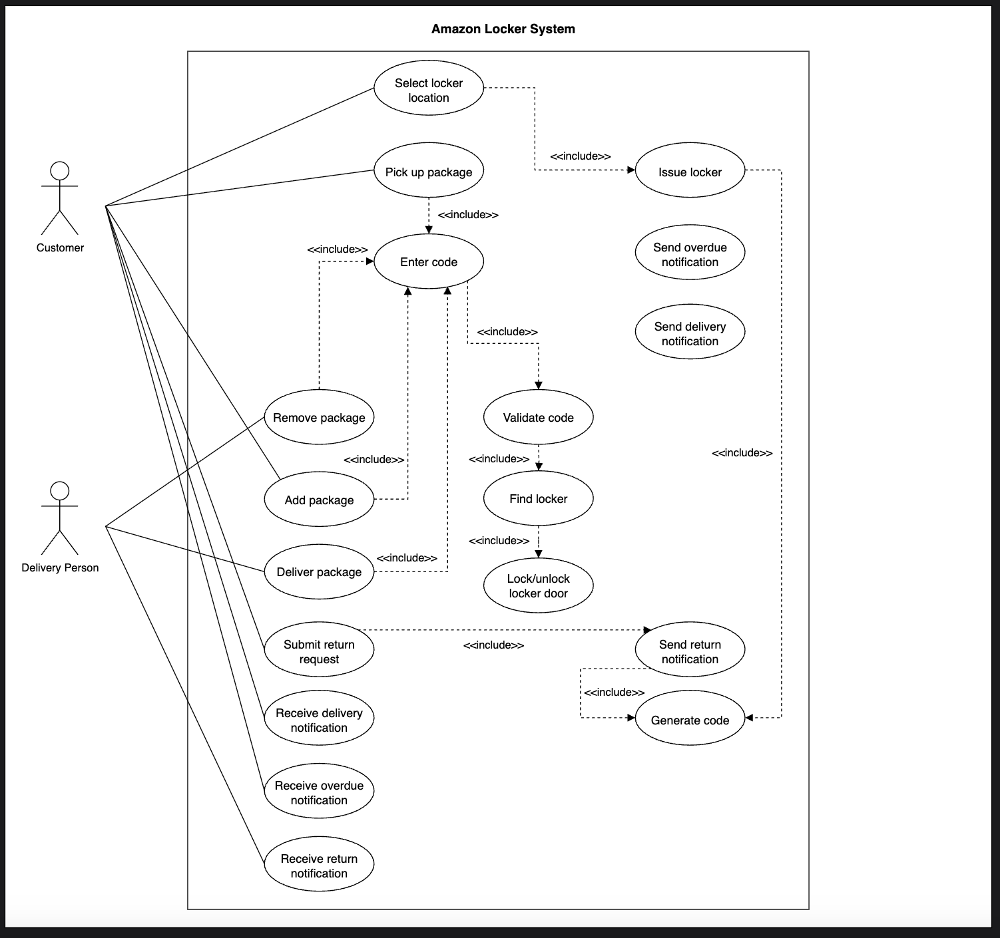

# Use Case Diagram for the Amazon Locker Service

Learn how to define use cases and create the corresponding use case diagram for the Amazon Locker service.

Let's build the use case diagram of the Amazon Locker System and understand the relationship between its main actors and functions. First, we'll define the different elements of our system, followed by the complete use case diagram.

## System

Our system is the Amazon Locker system. It manages automated package deliveries and returns via secure locker locations.

## Actors

Now, we'll define the main actors of our Amazon Locker system.

### Primary Actors

**Customer:** This Amazon customer ordered a package delivered to the Amazon Locker. The customer is responsible for selecting and booking a locker location for their order delivery. This actor can enter the code at the locker to retrieve their product, request a return, and drop off the package.

**Delivery Person:** This actor can also enter the code and add the product to the locker so the "Customer" can pick it up. This actor can also pick up a returned package from the locker. The delivery person uses unique, one-time codes for each delivery or return.

## Use Cases

This section defines locker use cases. We have listed them according to their respective interactions with a particular actor.

*Note: Some use cases will occur multiple times because they are shared among different actors in the system.*

### Customer

* **Select locker location:** To choose a preferred location for package delivery or product return.
* **Pick up package:** To retrieve the delivered package from the locker after unlocking it.
* **Remove package:** To collect a package from the locker after delivery or for return.
* **Add package:** To use the provided access code to place a return package inside the locker.
* **Submit return request:** To start the process to return a purchased product through a locker.
* **Receive delivery notification:** To get notified when a package has been delivered to the assigned locker, including locker details and access code.
* **Receive return notification:** To get notified with instructions and code for returning a product via a locker.
* **Receive overdue notification:** To get notified if the package was not picked up before the deadline.

### Delivery Person

* **Deliver package:** To place a customer's package inside the assigned locker for pickup.
* **Remove package:** To retrieve returned items from the locker for processing or transport.
* **Receive return notification:** To get alerted about packages that have been returned and are ready for pickup.

### System

* **Issue locker:** To assign a suitable locker to a package based on size and availability.
* **Generate code:** To create a unique access code for locker entry.
* **Validate code:** To check if the entered code is correct and valid for locker access.
* **Find locker:** To locate the correct locker corresponding to the access code.
* **Lock/unlock locker door:** To control the mechanism to secure or open the locker door.
* **Send delivery notification:** To inform the customer that their package has been delivered and provide locker details and code.
* **Send return notification:** To notify the delivery person about returned products that require pickup.
* **Send overdue notification:** To alert the customer when a package hasn't been collected within the specified time frame.

## Relationships

This section describes the relationships between and among actors and their use cases.

### Associations

The table below shows the association relationship between actors and their use cases.

| Customer | Delivery Person | Amazon Locker System |
|----------|-----------------|----------------------|
| Select locker location | Deliver package | Issue locker |
| Pick up package | Remove package | Generate code |
| Remove package | Receive return notification | Validate code |
| Add package | | Find locker |
| Submit return request | | Lock/unlock locker door |
| Receive delivery notification | | Send delivery notification |
| Receive return notification | | Send return notification |
| Receive overdue notification | | Send overdue notification |

### Include

When a customer picks up, adds, or removes a product from a locker, or when a delivery person delivers a package, they must first enter a code. The system checks the code's validity, locates the appropriate locker, and unlocks the door. These are best represented using "include" relationships in a use case diagram:

* "Pick up package," "Add package," "Deliver package," and "Remove package" use cases all include the "Enter code" use case.

* "Enter code" includes "Validate code" use case.

* "Validate code" includes "Find locker."

* "Find locker" includes "Lock/unlock locker door."

For product returns, the customer initiates the process on the Amazon Locker system by submitting a return request. After the request is approved, the Amazon Locker system sends a return notification and generates a unique code for locker access.

* The "Submit return request" use case includes the "Send return notification" use case.

* The "Send return notification" use case includes the "Generate code" use case.

The system generates the required access code when a locker is assigned for an order.

* The "Issue locker" use case includes the "Generate code" use case 

