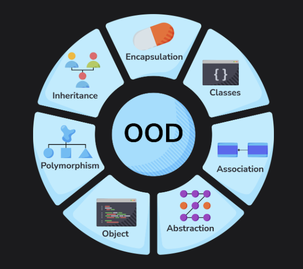
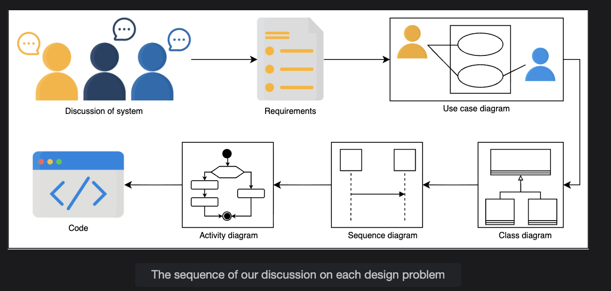

# What is Object-Oriented Design?

Object-oriented design (OOD) uses the object-oriented methodology to design a computational problem and its solution. It allows the application of a solution, based on the concepts of objects and models. OOD works as a component of the object-oriented programming (OOP) lifecycle. While designing a software solution, it is necessary to have less software development time and high code accuracy. OOD helps achieve this, since the design process involves objects communicating with each other and displaying the behavior of a program.

## About This Course

A typical object-oriented design (OOD) interview is hard. You never know what design problem you'll be asked, and there are so many of them. Moreover, the interviewer expects you to design a near-perfect solution to the given problem that covers all the edge cases.

This course is about getting familiar with the fundamentals of object-oriented design with an extensive set of real-world problems usually asked in an object-oriented design (OOD) interview.

We'll start with the introduction of the cornerstones of object-oriented programming and object-oriented design with an overview of different types of UML diagrams. We will also review a well-known object-oriented design principle, SOLID, followed by the definition and explanation of some of the most widely used design patterns. We'll also illustrate 21 real-world design problems mostly asked in FAANG interviews.

The purpose of providing foundational knowledge about object-oriented programming, object-oriented design, design principles, and design patterns before diving deep into the actual design problems is to equip our learners with the essential conceptual foundation. This is so that they don't get lost while designing a problem during the interview.

In each design problem, we have presented a detailed discussion of the problem requirements. We've modeled the findings with the help of use cases, as well as class, sequence, and activity diagrams for each problem. For the benefit and ease of our learners, we have also provided the code implementation of these design problems in five different programming languages (Java, C#, Python, C++, and JavaScript). We have included multiple interactive elements, including challenges and illustrations to develop your understanding of the problem.

## Intended Audience

If you aim to ace the object-oriented design (OOD) interview for your dream job, this course is for you. Here's how object-oriented design can help you advance in the tech industry:

### Software Developers

Object-oriented design benefits software developers to design their systems efficiently. The object-oriented design allows code to be reusable in a way that reduces redundancy leading to shorter, more readable code. Therefore, employing object-oriented design allows for easier collaborations, which increases productivity and leads to faster development of software.

### Project/Product Managers

A big challenge in project or product management is to build systems that scale well and perform effectively over time. Managers that are aware of object-oriented design can design systems much more efficiently.

### Object-Oriented Design Learners

Individuals in tech domains can greatly benefit from learning object-oriented design. This course helps a learner understand how different real-world problems can be developed through the object-oriented model.

### Interview Preparation

Object-oriented design is becoming an important part of software development interviews. This course helps software engineers prepare for interviews in big tech companies including FAANG.
