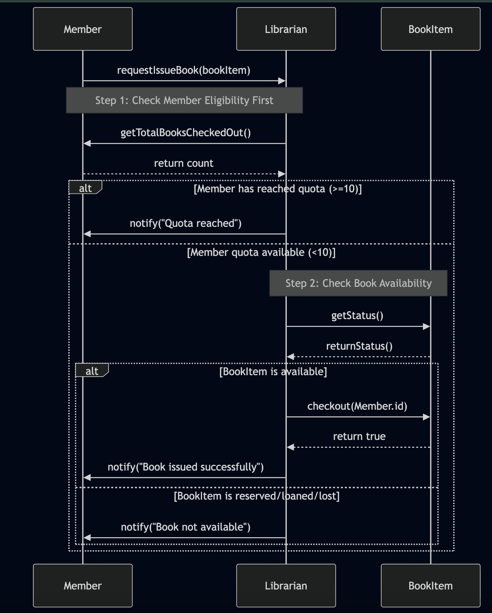
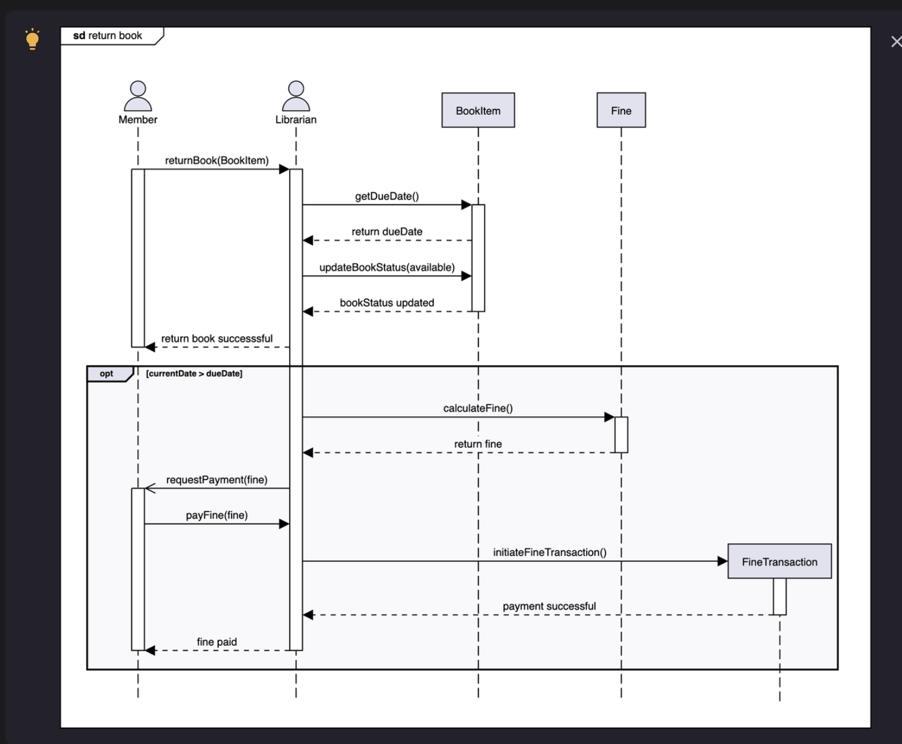

# Sequence Diagram for the Library Management System

Create a sequence diagram for lending a book from the library and solve a challenge.

Sequence diagrams help visualize the flow of interactions between different entities and objects in the system, step by step. This lesson will illustrate the main interactions involved in lending and returning a book within the Library Management System. Understanding these workflows is essential for modeling object responsibilities and collaborations.

For this lesson, we will focus on the following two scenarios:

* Issuing (Lending) a Book: The process through which a member requests to borrow a book from the library.
* Returning a Book: The process for when a member returns a borrowed book to the library.

## Issuing (Lending) a book

The sequence diagram for issuing a book involves the following participants:

* Actors: `Member`, `Librarian`
* Objects: `Book`, `BookItem`

The typical workflow is as follows:

1. Member requests to issue a book
   1. The member initiates the process by asking the librarian to issue a specific book.
2. Librarian checks the member's quota
   1. The librarian verifies whether the member has reached their maximum allowed number of borrowed books.
      1. If the quota is reached:
         1. The librarian informs the member that no more books can be issued now.
      2. If quota is available:
         1. The librarian proceeds to check the status of the requested book.
3. Librarian checks book status
   1. If the book is available:
      1. The librarian issues the book to the member, updating lending records accordingly.
   2. If the book is reserved (by another member):
      1. The librarian informs the requesting member that the book cannot be issued.

The sequence diagram below visualizes these interactions, clearly showing the flow of requests, validations, and responses between the member, librarian, and book entities.

``mermaid
sequenceDiagram
    participant M as Member
    participant L as Librarian
    participant BI as BookItem

    M->>L: requestIssueBook(bookItem)
    
    Note over L, M: Step 1: Check Member Eligibility First
    L->>M: getTotalBooksCheckedOut()
    M-->>L: return count

    alt Member has reached quota (>=10)
        L->>M: notify("Quota reached")
    else Member quota available (<10)
        Note over L, BI: Step 2: Check Book Availability
        L->>BI: getStatus()
        BI-->>L: returnStatus()
        
        alt BookItem is available
            L->>BI: checkout(Member.id)
            BI-->>L: return true
            L->>M: notify("Book issued successfully")
        else BookItem is reserved/loaned/lost
            L->>M: notify("Book not available")
        end
    end
``

## Sequence challenge: Return a book
You will complete a sequence diagram for the return of a book to the library. The sequence diagram below

Sequence Diagram(Deapth), <a href="./deapth/sequence.md">click here</a>