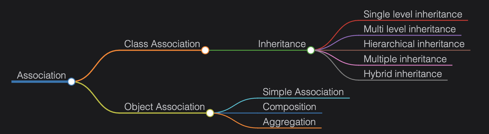

# Class Diagram

> **Study Notes for UML & Object-Oriented Design**

---

## 📖 Definition

A **class diagram** shows the static structure of a system — classes, their attributes, methods, and relationships.

👉 **It is the only UML diagram directly mapped to OOP languages.**

---

## 🎯 Why Use Class Diagrams?

- ✅ Shows static structure of the system
- ✅ Maps directly to OOP code
- ✅ Defines responsibilities of classes
- ✅ Used in forward & reverse engineering

---

## 📦 Basic Notations

### 1. Class

**Shown as a rectangle with 3 sections:**

```
┌─────────────────┐
│   Class Name    │
├─────────────────┤
│  - attribute1   │
│  + attribute2   │
├─────────────────┤
│  + method1()    │
│  - method2()    │
└─────────────────┘
```

**Three sections:**
1. Class name
2. Attributes
3. Methods

---

### 2. Special Class Types

| Type | Notation |
|------|----------|
| **Abstract class** | Class name in *italic* |
| **Interface** | `<<interface>>` above name |
| **Enum** | `<<enumeration>>` above name |
| **Annotation** | `<<annotation>>` above name |

---

### 3. Access Modifiers

| Symbol | Access Level |
|--------|--------------|
| `+` | **Public** |
| `-` | **Private** |
| `#` | **Protected** |

**Example:**
```
+ publicMethod()
- privateAttribute
# protectedMethod()
```

---


## 🔗 Relationships in Class Diagram

### Association

**Definition:** Shows how classes interact

**Notation:** Line between classes

**Types:**
- Class association (Inheritance)
- Object association

---

## 🧬 Inheritance (Class Association)

**Behavior:**
- Child class inherits from parent
- **IS-A** relationship

**Notation:** Solid line with hollow arrow

**Arrow Direction:** Points to parent

```
Child ─────▷ Parent
```

**Example:**
```
Dog ─────▷ Animal
Car ─────▷ Vehicle
```

---

## 🤝 Object Associations

### 1. Simple Association

**Strength:** Weakest relationship

**Behavior:** Objects reference each other

**Notation:** Simple line

```
Teacher ────── Student
```

**Meaning:** Teacher knows about Student, Student knows about Teacher

---

### 2. Aggregation 🔷

**Type:** Weak **"has-a"** relationship

**Behavior:** Child can exist independently

**Notation:** Hollow diamond at parent

```
Department ◇──── Employee
```

**Meaning:**
- Department **has** Employees
- Employee can exist without Department
- If Department is deleted, Employee survives

**Real-world example:** Library ◇──── Book

---

### 3. Composition 🔶

**Type:** Strong **"has-a"** relationship

**Behavior:** Child **cannot** exist without parent

**Notation:** Filled diamond at parent

```
House ◆──── Room
```

**Meaning:**
- House **has** Rooms
- Room cannot exist without House
- If House is destroyed, Room is destroyed

**Real-world example:** Body ◆──── Heart

---

## 🧭 Navigation Types

### One-Way Association

**Behavior:** One class knows the other

**Notation:** Arrow

```
Customer ────▶ Order
```

**Meaning:** Customer knows about Order, but Order doesn't know Customer

---

### Two-Way Association

**Behavior:** Both classes know each other

**Notation:** Simple line (no arrow)

```
Teacher ────── Student
```

**Meaning:** Both have references to each other

---

## 🔢 Association by Number of Classes

| Type | Number of Classes |
|------|-------------------|
| **Binary association** | 2 classes |
| **Ternary association** | 3 classes |
| **N-ary association** | More than 3 classes |

---

## ⚡ Dependency

### Definition
One class depends on another for its implementation.

**Characteristics:**
- Temporary usage (method parameter, local variable)
- Weakest relationship

**Notation:** Dashed arrow

**Arrow Direction:** Points to the class being used

```
RegistrationManager ─ ─ ─▶ Student
```

**Example Scenarios:**
- Method parameter: `void register(Student student)`
- Local variable: `Student s = new Student()`
- Return type: `Student getStudent()`

---

## 📊 Quick Comparison Table

| Relationship | Symbol | Strength | Example |
|--------------|--------|----------|---------|
| **Simple Association** | `────` | Weak | Teacher ──── Student |
| **Aggregation** | `◇────` | Medium | Department ◇──── Employee |
| **Composition** | `◆────` | Strong | House ◆──── Room |
| **Inheritance** | `────▷` | Very strong | Dog ────▷ Animal |
| **Dependency** | `─ ─ ─▶` | Very weak | Manager ─ ─ ─▶ Student |

---

## 🔍 Aggregation vs Composition

| Aspect | Aggregation (◇) | Composition (◆) |
|--------|-----------------|-----------------|
| **Relationship** | Weak "has-a" | Strong "has-a" |
| **Child lifetime** | Independent | Dependent on parent |
| **Parent deleted** | Child survives | Child destroyed |
| **Example** | Library ◇ Book | House ◆ Room |
| **Real code** | Reference | Owned object |

---

## 💡 Real-World Examples

### Inheritance
```
Vehicle ────▷ Car
Vehicle ────▷ Bike
```

### Aggregation
```
University ◇──── Professor
Team ◇──── Player
```

### Composition
```
Computer ◆──── CPU
Book ◆──── Chapter
```

### Dependency
```
PaymentProcessor ─ ─ ─▶ CreditCard
OrderService ─ ─ ─▶ EmailService
```

---

## 🎯 One-Line Summary

> **A class diagram shows classes, their structure, and how they are related in an object-oriented system.**

---

## 📚 Complete Example: E-Commerce System

```
        Person
           △
           │ (Inheritance)
    ┌──────┴──────┐
    │             │
Customer      Employee
    │
    │ (Aggregation)
    ◇────── Order
               │
               │ (Composition)
               ◆────── OrderItem
                          │
                          │ (Dependency)
                          ─ ─ ─▶ Product
```

---

## 💡 Interview Tips

### Common Questions:

**1. What's the difference between aggregation and composition?**
- **Aggregation:** Child survives independently (Library ◇ Book)
- **Composition:** Child destroyed with parent (House ◆ Room)

**2. When to use dependency vs association?**
- **Dependency:** Temporary usage (method parameter)
- **Association:** Permanent relationship (member variable)

**3. How to show multiplicity?**
```
Customer ────── 1..* Order
(One customer can have many orders)
```

### Best Practices:
- ✅ Keep class names as nouns
- ✅ Keep method names as verbs
- ✅ Use proper access modifiers
- ✅ Don't show too many details initially
- ✅ Use composition over aggregation when in doubt
- ✅ Show only relevant attributes/methods

---

## 🎓 Multiplicity Notation

| Notation | Meaning |
|----------|---------|
| `1` | Exactly one |
| `0..1` | Zero or one |
| `*` or `0..*` | Zero or more |
| `1..*` | One or more |
| `n` | Exactly n |
| `n..m` | Between n and m |

**Example:**
```
Library ────── 1..* Book
(Library has one or more Books)
```

---

