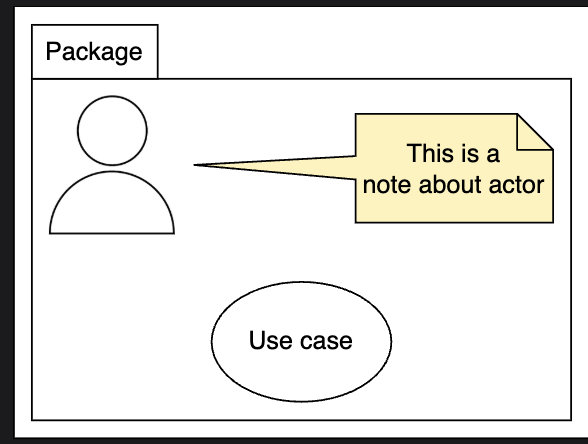
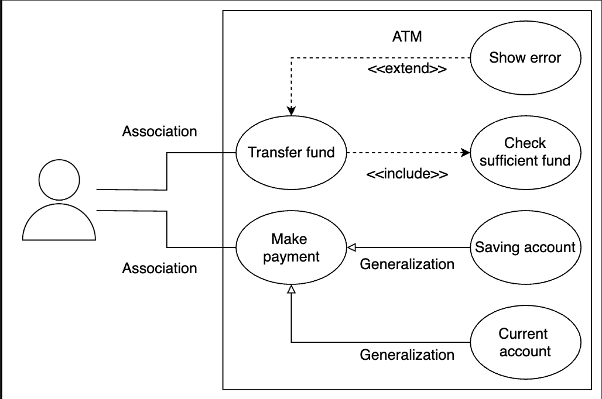

# Use Case Diagram

> **Study Notes for System Design & UML**

---

## 📖 Definition

A **use case diagram** shows users (actors) and what they can do with a system (use cases).

👉 **It explains how users interact with the system.**

---

## 🧩 Components of Use Case Diagram

### 1. Actor 👤

**Definition:** An actor is a user or external system

- Can be a **human**, **machine**, or **another system**

#### Types of Actors:

| Type | Description | Position | Also Called |
|------|-------------|----------|-------------|
| **Primary Actor** | Initiates the use case | Left side | Active actor |
| **Secondary Actor** | Supports the system<br>Cannot start the use case | Right side | Passive actor |

---

### 2. Use Case 🎯

- A **single function** performed by the system
- Shown using an **oval shape**
- **Examples:** Login, Withdraw Cash, Transfer Funds

---

### 3. Package 📁

- Used to **group related use cases**
- Shown as a **folder**

---

### 4. Note 📝

- Used to add **extra information or explanation**


---


## 🔗 Relationships in Use Case Diagram

### 1. Association

**Purpose:** Connects actor and use case

**Notation:** Simple solid line (`——`)

**Shows:** What action an actor can perform

```
Actor ———— Use Case
```

---

### 2. Generalization 🧬

**Purpose:** Shows inheritance

**Behavior:** Child use case inherits parent behavior

**Notation:** Solid line with arrow to parent

```
Child ————▶ Parent
```

---

### 3. Include ✅

**Purpose:** One use case **must** use another use case

**Behavior:** Included use case **always** executes

**Notation:** Dashed line + `<<include>>`

**Arrow Direction:** Points **to** included use case

```
Base Use Case - - - -▶ <<include>> Included Use Case
```

**Example:**
- Transfer Funds **includes** Check Balance
- Check Balance always runs when transferring funds

---

### 4. Extend 🔀

**Purpose:** Adds **optional** behavior

**Behavior:** Executes **only when a condition is met**

**Notation:** Dashed line + `<<extend>>`

**Arrow Direction:** Points **to** base use case

```
Extension - - - -▶ <<extend>> Base Use Case
```


**Example:**
- Show Error **extends** Transfer Funds
- Error only shows if balance is insufficient

---

## 💡 Include vs Extend

| Aspect | Include | Extend |
|--------|---------|--------|
| **Mandatory?** | Yes, always executes | No, conditional |
| **Arrow Direction** | To included use case | To base use case |
| **Purpose** | Required functionality | Optional behavior |
| **Example** | Login includes Verify Credentials | Payment extends with Receipt |

---

## 🏧 Example: ATM System

### Actors
- **Customer** (Primary Actor)

### Use Cases

**Customer can:**
- Transfer funds
- Make payments

**System behavior:**
- ✅ Checks sufficient balance (`<<include>>`)
- ⚠️ Shows error if balance is low (`<<extend>>`)

**Payment options (Generalization):**
- Savings account
- Current account

### Diagram Structure
```
Customer ——— Transfer Funds
               |
               |<<include>>
               ↓
            Check Balance
               |
               |<<extend>>
               ↓
            Show Error

Customer ——— Make Payment
               |
               ├── Savings Account
               └── Current Account
```

---

## ✅ Benefits of Use Case Diagram

- ✅ Shows system functionality clearly
- ✅ Helps understand user requirements
- ✅ Defines system scope
- ✅ Explains system from user's perspective
- ✅ Useful for high-level design

---

## 🎯 One-Line Summary

> **A use case diagram shows who uses the system and what actions they can perform.**

---

## 📚 Quick Reference

### Key Symbols

| Symbol | Meaning |
|--------|---------|
| 👤 Stick figure | Actor |
| ⭕ Oval | Use Case |
| `——` Solid line | Association |
| `————▶` Solid arrow | Generalization |
| `- - -▶ <<include>>` | Include relationship |
| `- - -▶ <<extend>>` | Extend relationship |
| 📁 Folder | Package |
| 📝 Note icon | Note/Comment |

---

## 💡 Interview Tips

### Common Questions:
1. **What's the difference between include and extend?**
   - Include is mandatory, extend is optional
   - Include arrow points to included use case
   - Extend arrow points to base use case

2. **What's the difference between primary and secondary actors?**
   - Primary initiates use cases (left side)
   - Secondary supports but doesn't initiate (right side)

3. **When to use generalization in use cases?**
   - When multiple use cases share common behavior
   - To show inheritance relationships

### Best Practices:
- ✅ Keep use cases simple and focused
- ✅ Use active verbs for use case names
- ✅ Place primary actors on the left
- ✅ Group related use cases with packages
- ✅ Don't overcomplicate with too many relationships

